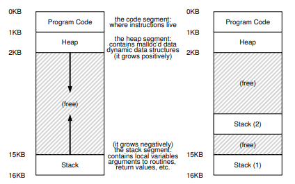
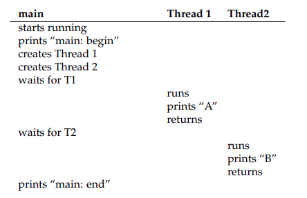
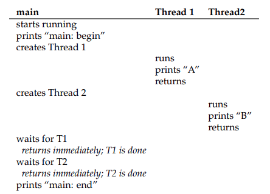
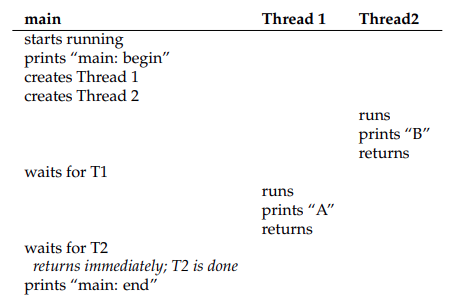

# Concurrencia: Introducción

Introducimos una nueva abstracción para un solo programa en ejecución: la de **hilo** (**thread**). En vez de nuestra clásica visión de un solo punto de ejecución en un programa, un programa **multi-hilo** tiene más de un punto de ejecución. Quizás otra forma de pensar esto es que cada hilo es más como otro proceso separado, excepto por una diferencia: comparten el mismo espacio de direcciones y por lo tanto pueden acceder a los mismos datos.

El estado de un solo hilo es muy similar al de un proceso. Tiene un PC que rastrea de dónde está obtiendo instrucciones el programa. Cada hilo tiene su propio set de registros privado que utiliza para cálculos; por lo tanto, si hay dos hilos que se estan ejecutando en un solo procesador, cuando cambia de ejecutar T1 a ejecutar T2, se produce un cambio de contexto. El cambio de contexto entre hilos es muy similar al cambio de contexto entre procesos, como el estado de registros de T1 debe ser guardado y el estado de los registros de T2 deben ser restaurados antes de ejecutarlo.. Con los procesos, guardabamos el estado en un **bloque de control de procesos** (**PCB**); ahora, necesitaremos uno o más **bloque de control de hilo** (**TCBs**) para guardas el estado de cada hilo de un proceso. Aca hay una diferencia mayor, aunque, en el cambio de contexto que hacemos entre hilos en comparación a los procesos: el espacio de direcciones permanece igual (es decir, no es necesario cambiar la page table que estamos usando).

Otra gran diferencia entre hilos y procesos concierne al stack. En nuestro modelo simple del espacio de direcciones de un proceso clásico (al que ahora podemos llamar proceso de un hilo), hay un solo stack, usualmente residiendo abajo del espacio de direcciones. Sin embargo, en un proceso multi-hilo, cada hilo se ejecuta independientemente y pueden llamar a varias rutinas para hacer lo que tienen que hacer. En vez de un solo stack en el espacio de direcciones, habrá uno por hilo. Digamos que tenemos un proceso multi-hilo que tiene dos hilos; el espacio de direcciones resultante de verá direfente:



Figure 26.1: **Espacios de direcciones de un solo subproceso y múltiples**

Podemos ver dos stacks esparcidos en el espacio de direcciones del proceso. Por lo tanto, cualquier asignación en el stack de variables, parámetros, valores de retorno, y otras cosas que pongamos en el stack será ubicado en lo que a veces llamamos **thread-local storage** (**almacenamiento del hilo local**), es decir, el stack del hilo relevante.

Tener dos stacks no es un problema dado que por lo general no son muy grandes (excepto en programas que usen mucha recursión).

---

## ¿Porque usar hilos?

Resulta que hay dos grandes razones por las que deberías usar hilos.

1) **Parelelismo**. Imagina que estan escribiendo un programa que hace cálculos en arrays grandes, por ejemplo, uniendo dos arrays grandes en uno solo, o incrementando el valor de cada elemento en el array por alguna cantidad. Si estas ejecutando en solo un procesador, la tarea es fácil: solo hay que hace cada operación y listo. Sin embargo, si estamos ejecutando el programa en un sistema de muchos procesadores, tenemos el potencial de acelerar el proceso considerablemente usando los procesador para que cada uno haga una porción del trabajo. La tarea de tranformar tu programa de un solo hilo en un programa que hace este tipo de trabajo en múltiples CPUs es llamado paralelización, y usar un hilo por CPU para hacer este trabajo es una forma natural y típica para hacer que los programas sean más rápidos en el hardware moderno.

2) Evitar bloquear el progreso del programa dado la lentitud de I/O. Imagina que estas escribiendo un programa que hace diferentes tipos de I/O: ya sea esperar para enviar o recibir un mensaje, que se complete un I/O explícito al disco, o incluso que un page fault finalice. En vez de esperar, tu programa podría hacer algo más, incluyendo usar la CPU para cálculos, o lanzar las peticiones I/O. Usar hilos es una forma natural para evitar quedar estancado; mientras un hilo espera, el planificador de la CPU puede cambiar a otro hilo, el cual este listo para ejecutarse y hacer algo útil. Los hilos permiten superposición de I/O con otras actividades en un solo programa; como resultado, muchas aplicaciones modernas basadas en servidores usan hilos en sus implementaciones.

En cualquier caso, puedes usar múltiples procesos en lugar de hilos. Sin embargo, los hilos comparten el espacio de direcciones y es más facil compartir datos. Los procesos son mas una opción para tareas lógicas separadas donde no se necesitan compartir muchas estructuras de datos.

---

## Ejemplo: Creación de un hilo

Digamos que queremos ejecutar un programa que crea dos hilos, y que cada uno haga un trabajo independiente, en este caso, imprimir "A" o "B":

```c
#include <stdio.h>
#include <assert.h>
#include <pthread.h>
#include "common.h"
#include "common_threads.h"

void *mythread(void *arg) {
  printf("%s\n", (char *) arg);
  return NULL;
}

int
main(int argc, char *argv[]) {
  pthread_t p1, p2;
  int rc;
  printf("main: begin\n");
  Pthread_create(&p1, NULL, mythread, "A");
  Pthread_create(&p2, NULL, mythread, "B");
  // join waits for the threads to finish
  Pthread_join(p1, NULL);
  Pthread_join(p2, NULL);
  printf("main: end\n");
  return 0;
}
```

La función `main` crea dos hilos, los cuales ejecutan la función `mythread()`, aunque con diferentes argumentos. Una vez que un hilo es creado, puede ejecutarse de inmeditao, o ponerlo en la lista de "ready".

Después de crear los dos hilos, `main` llama `pthread_join()`, que espera a que se complete un hilo en particular.

Examinemos el posible orden de ejecución de este programa de la siguiente imagen:



Figure 16.3: **Traza de hilo (1)**

En el diagrama de ejecución el tiempo aumenta hacia abajo, dada una secuencia de instrucciones, dependiendo de que hilo decida ejecutar el planificador. Por ejemplo, una vez que se crea un hilo, se puede ejcutar directamente, lo cual dejaria el siguiente orden de ejcución:



Figure 26.4: **Traza de hilo (2)**

También podríamos ver printeado B antes de A, is, digamos, que el planificador decide ejecutar T2 primero incluso si T1 se creo antes; no hay razón para asumir que el hilo que se crea antes se ejecutrará primero:



Figure 26.5: **Traza de hilo (3)**

Una forma de ver la creació de hilos es más como hacer una llamada a una función, en vez de ejecutar la función y volver al llamador, el sistema crea un nuevo hilo de ejecutción para la rutina que esta siendo llamada, y se ejecuta independientemente del llamador, quizas antes de volver de la creació, o quizas mucho después.

Los hilos nos hacen la vida complicada: ya es dificil decir que se ejecutará y cuando! Las computador ya son suficientemente difíciles de entender sin concurrencia. Desafortunadamente, con la concurrencia, esto se vuelve peor, mucho peor.

---

El ejemplo simple que mostramos arriab es util mostrando como se crean los hilos y como se puede ejecutar en diferente orden dependiendo del planificador. Lo que no muestra es como interactuan los hilos cuando comparten datos.

Imaginemos un ejemplo simple donde dos hilos quieren actualizar una variable global compartida:

```c
#include <stdio.h>
#include <pthread.h>
#include "common.h"
#include "common_threads.h"

static volatile int counter = 0;

// mythread()
//
// Simply adds 1 to counter repeatedly, in a loop
// No, this is not how you would add 10,000,000 to
// a counter, but it shows the problem nicely.
//
void *mythread(void *arg) {
  printf("%s: begin\n", (char *) arg);
  int i;
  for (i = 0; i < 1e7; i++) {
    counter = counter + 1;
  }
  printf("%s: done\n", (char *) arg);
  return NULL;
}

// main()
//
// Just launches two threads (pthread_create)
// and then waits for them (pthread_join)
//
int main(int argc, char *argv[]) {
  pthread_t p1, p2;
  printf("main: begin (counter = %d)\n", counter);
  Pthread_create(&p1, NULL, mythread, "A");
  Pthread_create(&p2, NULL, mythread, "B");

  // join waits for the threads to finish
  Pthread_join(p1, NULL);
  Pthread_join(p2, NULL);
  printf("main: done with both (counter = %d)\n",
  counter);
  return 0;
}
```

Hay varias notas sobre el código. 

1) Agrupamos la creación de los hilos y las rutinas join para simplificar la salida en caso de un fallo; para un programa simple como este, queremos al menos notar cuando ocurre un error, pero no hacer nada demasiado inteligente (solo salir). Por lo tanto, `Pthread_create()` solo llama `pthreade_create()` y se asegura que el código de retorno sea creo, si no lo es, imprime un mensaje y sale.

2) En vez de usar dos funciones separadas para los hilos, usamos una sola pieza de código, y le pasamos al hilo un argumento para que impriman letras diferentes.

Finalmente, y más importante, podemos ver que cada hilo esta tratando de sumar un número a la variable compartida `counter`, y haciendolo 10 millones de veces en un loop. Por lo tanto, el resultado final deseado es 20,000,000.

Ahora compilamos y ejecutamos el programa, para ve como se comporta. A veces, todo se comporta como esperamos:

```shell
prompt> gcc -o main main.c -Wall -pthread; ./main
main: begin (counter = 0)
A: begin
B: begin
A: done
B: done
main: done with both (counter = 20000000)
```

Desafortunadamente cuando ejecutamos este programa, incluso en u solo procesador, no necesariamente obtenemos el resultado deseado. A veces obtenemos:

```shell
prompt> ./main
main: begin (counter = 0)
A: begin
B: begin
A: done
B: done
main: done with both (counter = 19345221)
```

Intentemos una vez más, solo para ver si nos volvimos locos. Despues de todo, ¿no se supone que las computadores producen resultados determinísticos, como te enseñaron? ¿Quizás te estuvieron mintiendo?

```shell
prompt> ./main
main: begin (counter = 0)
A: begin
B: begin
A: done
B: done
main: done with both (counter = 19221041)
```

No solo cada programa se ejecuta mal, sino que también se produce un resultado diferente. ¿Porqué sucede esto?

---