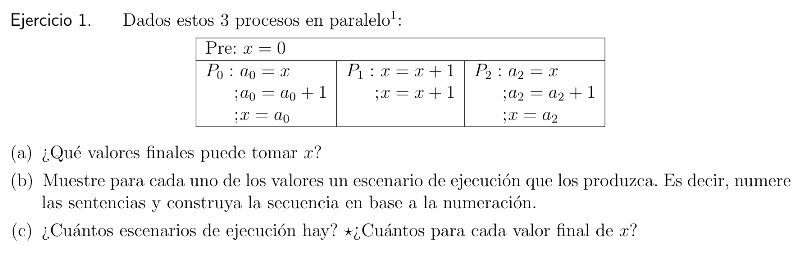
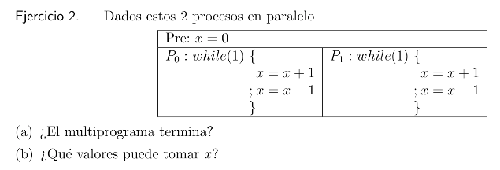
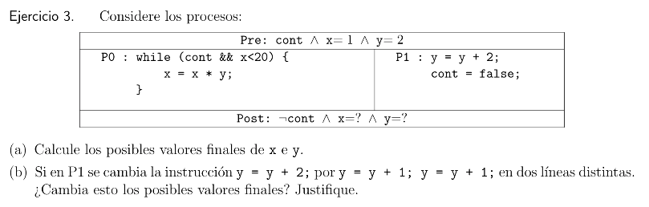
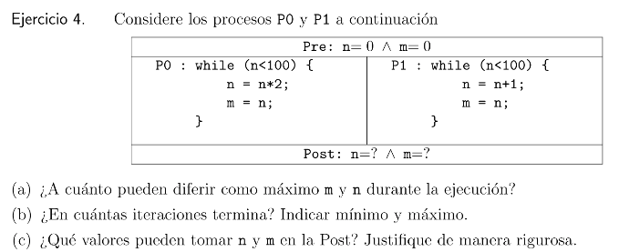
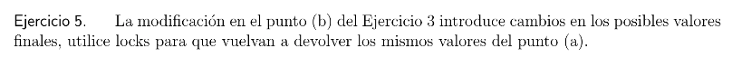
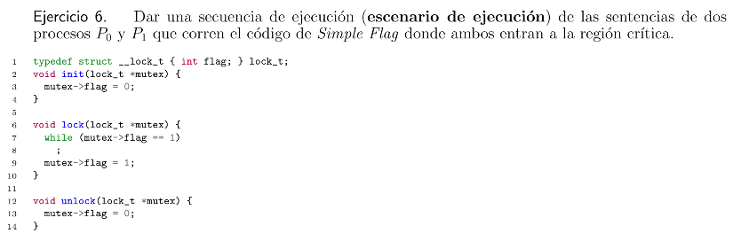
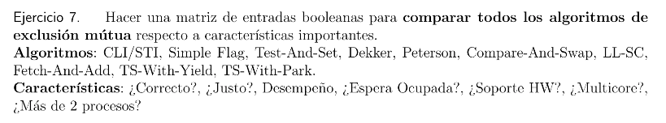
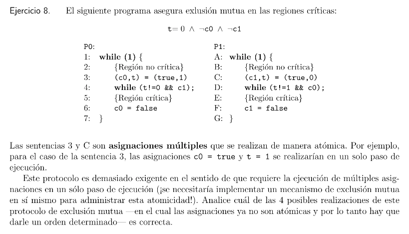

# Concurrencia



* **(a)** Los valores que puede tomar `x` son 1, 2, 3, 4.

* **(b)** Sea P0: ABC, P1: 12 y P2: XYZ las lineas de cada proceso.

    - **4** = ABC 12 XYZ = XYZ 12 ABC y todas las combinaciones que tengan ABC, 12 y XYZ juntos daran 4.

    - **3** = 12 AB XYZ C y combinaciones del estilo daran 3.

    - **2** = 1 AB 2 XYZ C = 1 XY ABC Z y combinaciones similares daran 2.

    - **1** = AB 12 XYZ C y combinaciones que tengan A XXXXX C daran 1.

* **(c)** Hay $\frac{(3 + 2 + 3)!}{(3! + 2! + 3!)}$ = 5600 combinaciones posibles de ejecución.

---



* **(a)** Nunca termina ya que los proceso tienen un loop infinito, de todas formas el scheduler cmabiara la ejecución entre los dos procesos.

* **(b)** Los valores que puede tomar `x` son 0, 1 y 2.

---



* **(a)** Los posibles valores finales de `x` son 1, 2, 4, 8, 16, 32, 64 y de `y` es 4.

* **(b)** Si se cambia la linea, a pesar de que son lo "mismo", tenemos mas resultados finales para `x`, pero `y` sigue teniendo el mismo valor final de 4. Esto ya que los cambio de contexto pueden hacer que `y` tenga valores intermedios de 2, 3 y 4. Cuando antes solo tenia 2, 4.

---



* **(a)** El maximo posible de `n` es 200 y el de `m` es 200.

* **(b)** El minimo de iteraciones es de 7 aproximadamente, donde primero se le suma 1 a `n` seguido de 7 iteraciones de `n * 2` hasta llegar a a128 donde terminan los dos ciclos. El maximo de iteraciones es infinito, ya que se pueden sumar y sumar iteraciones si `n` se queda lo maximo posible en cero, hasta que se le sume uno por primera vez. Que esto podria nunca pasar.

* **(c)** `n` y `m` pueden tomar valores del intervalo [100, 200], porque siempre `m` va a ser igual a `n`, y el ciclo termina cuando `n` alcanza el valor 100. Y su maximo se alcanza en el caso donde se tenga en P1: n = 100, termina su ciclo por ser mayor a 100, pero al ya estar dentro del ciclo de P0, se multiplica por 2, quedando n = 200. Esos son los dos casos borde.

---

## Locks



```
P0: 
while(cont && x < 20) {
    x = x * y;
}

P1:
aquire(&lock);  //(¿podria ser lock(&lock)?)

y = y + 1;

realese(&lock); //(¿y aca unlock(&lock)?)
cont = false;
```

---



```c
1   typedef struct __lock_t { int flag; } lock_t;
2   void init(lock_t *mutex){
3       mutex->flag = 0;
4   }
5
6   void lock(lock_t *mutex){
7       while(mutex->flag == 1)
8       ;
9       mutex->flag = 1;
10  }
11
12  void unlock(lock_t *mutex){
13      mutex->flag = 0;
14  }
```

Supongamos que tenemos:

```
0:  init(mutex);        // {Solo se corre una vez}
A:  ...
B:  lock(&mutex);
C:  (seccion critica)
D:  unlock(&mutex);
F:  ...
```

Y los procesos P0 y P1 que intentan acceder a la sección critica.

```
P0: 0,2,3,4,    // {init()}
        A,
        B,7,        // {context switch a P1, salio del bucle porque mutex->flag != 1}

    P1: A,
        B,7,8,9,10, // {No entra al bucle porque mutex->flag != 1,mutex->flag = 1}
        C,          {Entra a la seccion critica, sucede un context switch a P0}

    P0: 9,10,       // {mutex->flag = 1}
        C,          // {Los dos procesos se encuentran en la seccion critica}
        D,12,13,14, // {mutex->flag = 0}
        F,          // {context switch a P1}

    P1: D,12,13,14, // {mutex->flag = 0, otra vez}
        F,
```

---



* **CLI/STI**:

Utiliza instrucciones de ensablador CLI y STI para habilitar y deshabilitar las interrupciones del procesador.

* **Simple Flag**:

Utiliza una flag/variable (cero ó uno) para indicar si un proceso tomo ó no tomo un lock.

* **Test-and-set**: (**TAS**)

Utiliza una instruccion atomica para estableder un lock.

* **Dekker y Peterson**:

Utiliza loads y stores, simplemente asegurando que dos threads nunca entren a una seccion critica al mismo tiempo.

* **Compare-and-Swap**: (**CAS**)

Utiliza una operacion atomica que compara y actualiza un valor solo si cumple una condicion.

* **Load-Linked/Store-Conditional**: (**LL-SC**)

Implementa exclusion mutua con operaciones atomicas avanzadas que evitan problemas de contencion de sistemas multicore.

* **Fetch-and-Add**:

Incrementa un contador y devuelve su valor previo de manera atomica.

* **Test-and-Set con Yield**:

Incluye yield(), cediendo la CPU cuando el lock esta ocupado, para mejorar el rendimiento al reducir la espera ocupada.

* **Test-and-Set con Park**:

Utiliza park() para suspender al hilo si no puede adquirir el lock, eliminando la espera ocupada y mejorando la eficiencia de sistemas multitarea.

Algoritmo|Correcto|Justo|Desempeño|EsperaOcupada|HW|Multicore|MasDe2Procesos|
---------|--------|-----|---------|-------------|--|---------|--------------|
CLI/STI  |Si      |No   |Bajo     |No           |Si|No       |No|
SimplFlag|No      |No   |Regular  |Si           |No|No       |No|
Test&Set |Si      |No   |Regular  |Si           |Si|Si       |Si|
Dekker   |Si      |Si   |Regular  |Si           |No|No       |No|
Peterson |Si      |Si   |Regular  |Si           |No|No       |No|
Com&Swap |Si      |No   |Bueno    |Si           |Si|Si       |Si|
LL-SC    |Si      |No   |Bueno    |Si           |Si|Si       |Si|
Fetch&Add|Si      |No   |Regular  |Si           |Si|Si       |Si|
TAS,Yield|Si      |No   |Mejor    |No           |Si|Si       |Si|
TAS,Park |Si      |No   |Bueno    |No           |Si|Si       |Si|

---



El orden correcto seria:

```
P0: c0=true; t=1;
P1: c1=true; t=0;
```

Tambien podria ser:

```
P0: t=1; c0=true;
P1: t=0; c1=true;
```

No podrian ser los otros dos casos:

```
P0: c0=true; t=1;
P1: t=0; c1=true;

P0: t=1; c0=true;
P1: c1=true; t=0;
```

---

## Variables de condición

