# Introduccion
---
## Resumen de Santos, miembro de Wolovers

Basado en el [Resumen](https://docs.google.com/document/d/1e5x10V286rX_EuQmJoCVOha-DTRf_hp-CFGZURr5f5Q/edit?tab=t.0) de Navier🧃, en las [Traducciones](https://github.com/GabrielHak/SistemasOperativos) de GabrielHak, y el [OSTEP](https://pages.cs.wisc.edu/~remzi/OSTEP/), mas los [Podcasts](https://open.spotify.com/show/5glisR9k3xqeMLwhDM92KZ?si=8fac02c5c1ea49e2) y notas tomadas en clases del Dios Nicolas Wolovick.

Intente en reestructurar un poco el resumen en el que esta basado, rellenar algunos capitulos que me parecia que le faltaba informacion y contexto.

Por ultimo, este resumen NO te garantiza que apruebes 100%, pero si te ayudara un 90% en entender todos los conceptos, para mas informacion dejo mis [Soluciones de Parciales]().

Dios los bendiga 🚬

## Indice

### [Virtualizacion de la CPU](#virtualizacion-de-la-cpu)
- [Capitulo 4: La Abstraccion de los Procesos](#capitulo-4-la-abstraccion-de-los-procesos)
- [Capitulo 5: La Api de los Procesos](#capitulo-5-la-api-de-los-procesos)
- [Capitulo 6: Ejecucion Directa Limidata (LDE)](#capitulo-6-ejecucion-directa-limidata-lde)
- [Capitulo 7: Planificacion de la CPU](#capitulo-7-planificacion-de-la-cpu)
- [Capitulo 8: Cola MultiNivel con Retroalimentacion (MLFQ)](#capitulo-8-cola-multinivel-con-retroalimentacion-mlfq)

### [Virtualizacion de la Memoria](#virtualizacion-de-la-memoria)
- [Capitulo 13: El Espacio de Direcciones](#capitulo-13-el-espacio-de-direcciones)
- [Capitulo 14: API de la Memoria](#capitulo-14-api-de-la-memoria)
- [Capitulo 15: Traduccion de Direcciones](#capitulo-15-traduccion-de-direcciones)
- [Capitulo 16: Segmentacion](#capitulo-16-segmentacion)
- [Capitulo 17: Gestion de Espacio Libre](#capitulo-17-gestion-de-espacio-libre)
- [Capitulo 18: Introduccion a la Paginacion](#capitulo-18-introduccion-a-la-paginacion)
- [Capitulo 19: Traducciones Mas Rapidas: TLB](#capitulo-19-traducciones-mas-rapidas-tlb)
- [Capitulo 20: Tablas de Paginacion Mas Pequeñas](#capitulo-20-tablas-de-paginacion-mas-pequeñas)

### [Concurrencia](#concurrencia)
- [Capitulo 26: Introduccion a la Concurrencia](#capitulo-26-introduccion-a-la-concurrencia)
- [Capitulo 27: API de los Hilos](#capitulo-27-api-de-los-hilos)
- [Capitulo 28: Locks](#capitulo-28-locks)
- [Capitulo 30: Variable de Condicion](#capitulo-30-variables-de-condicion)
- [Capitulo 31: Semaforos](#capitulo-31-semaforos)
- [Capitulo 32: Problemas Comunes de Concurrencia](#capitulo-32-problemas-comunes-de-concurrencia)

### [Persistencia](#persistencia)
- [Capitulo 36: Dispositivos I/O](#capitulo-36-dispositivos-io)
- [Capitulo 37: Discos Duros](#capitulo-37-discos-duros)
- [Capitulo 38: RAID](#capitulo-38-raid)
- [Capitulo 39: Archivos y Directorios](#capitulo-39-archivos-y-directorios)
- [Capitulo 40: Implementacion del File System](#capitulo-40-implementacion-del-file-system)
- [Capitulo 41: Localidad y Fast File System](#capitulo-41-localidad-y-fast-file-system)
- [Capitulo 42: Consistencia ante Errores: FSCK y Journaling](#capitulo-42-consistencia-ante-errores-fsck-y-journaling)
- [Capitulo 43: File System Estructurados por Logs](#capitulo-43-file-system-estructurados-por-logs)

---

# Virtualizacion de la CPU

## Capitulo 4: La Abstraccion de los Procesos

Un **Proceso** es la abstraccion del SO de un programa en ejecucion; el **programa es un objeto estatico** (*codigo*), mientras que el **proceso es un objeto dinamico** (el programa mientras se esta ejecutando en memoria).
<br>El SO usa la tecnica de ***Time Sharing*** (**Tiempo Compartido**) de la CPU para permitir a los usuarios ejecutar tantos procesos concurrentes como deseen; la tecnica consiste en ejecutar un proceso, luego deteniendolo y ejecutando otro, y asi sucesivamente.

Por otro lado, el **Space Sharing** (**Espacio Compartido**) que consiste en dividir un recurso (en el espacio) entre los proceso que deseen utilizarlo.

### Virtualizacion

Para lograr la ilusion de que hay muchas CPUs, el SO necesitara tanto maquinaria de bajo nivel como inteligencia de alto nivel. La maquinaria de bajo nivel la llamamos **Mecanismos**; metodos o protocolos de bajo nivel que implementan una parte de la funcionalidad necesaria. Por ejemplo: El ***Context Switch*** (**Cambio de Contexto**), que permite cambiar un proceso en ejecucion por otro.
<br>Encima de estos mecanismos esta la parte de la inteligencia del SO, en forma de **Politicas**; algoritmos para tomar algun tipo de decision dentro del SO. Por ejemplo: Dado un numero de programas posibles para ejecutar en una CPU, ¿Que programa deberia ejecutar el SO? La **Politica de Planificacion** es la que tomara esta decision.

### Proceso

Un proceso puede ser descrito por su **Estado**; lo que un programa puede leer o actualizar cuando se esta ejecutando.
* **Memoria**: Instrucciones y la informacion que el proceso lee y escribe estan en memoria. La memoria a la que un proceso puede acceder (***Addres Space***) es parte del proceso.
* **Registros**: El programa puede leer o actualizar registros (como el ***Program Counter*** (PC), que indica que instruccion se ejecutara a continuacion, el ***Stack Pointer***, o el ***Frame Pointer***).
* **Almacenamiento**: Un programa puede acceder al almacenamiento (dispositivos ***Input/Output*** (**I/O**)) para asegurar la persistencia.

### API de los Procesos

Cualquier interfaz de procesos de un SO debe poder:
* **Crear** nuevos procesos.
* **Destruir** procesos (en caso de que no terminen por si mismo).
* **Esperar** la finalizacion de un proceso.
* Tener **Control**: Otros tipos de control, como la suspencion de un proceso.
* Conocer su **Estado**: Poder mostrar informacion de un proceso.

Los programas utilizan estas funciones mediante *System Calls* Proporcionadas por la API.

### Creacion de un Proceso

Lo primero que hace el SO para correr un programa (osea, convertirlo en proceso) el SO debe **Cargar** su codigo y su informacion estatica (con un formato ejecutable) del Disco a la Memoria (Disco -> Memoria), en el *Address Space* del proceso.
<br>Luego se debe proporcionar memoria ***Stack*** (variables locales, parametros de llamada, direcciones de retorno) y ***Heap*** (informacion dinamica y variables en tamaño, estructura de datos como Listas; todo lo relacionado con `malloc` y `free`) para el programa. En el *Stack* el SO establece los parametros `argv` y `argc count`.
<br>Se inicializan los ***File Descriptors*** (`std in`, `std out`, `std error`)(0, 1, 2).
<br>Por ultimo, el SO setea todos los registros a 0 (menos el PC) y pasa el control de la CPU al proceso creado, dejandolo ejecutarse.

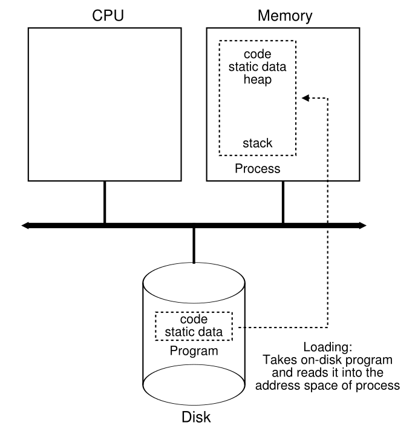
* Memoria asignada a un proceso en el momento de su creacion.

### Estados de los Procesos

Cada proceso puede estar en uno de los siguientes 4 estados:
* ***Running***: En ejecucion.
* ***Ready***: En espera, listo para ejecutarse.
* ***Blocked***: No puede ejecutarse hasta que otro evento ocurra.
* ***Zombie***: El proceso hijo finaliza, pero el padre aun no ha llamado a `wait()`.

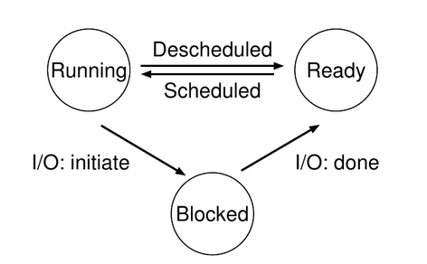
* Transiciones entre estados de un proceso.

El paso entre los distintos estados esta dado por eventos del software o hardware, llamadas **Interrupciones** (por ejemplo: de reloj, del disco duro, etc).
<br>A lo sumo, puede haber `n` procesos en estado de *Running*, siendo `n = cantidad de cores` (nucleos).

* Un proceso puede moverse entre los estados *Ready* y *Running* a discrecion del SO. 
* Pasar de *Ready* a *Running* significa que el proceso ha sido **Planificado** (***Scheduled***);
* Ser movido de Running a *Ready* significa que el proceso ha sido **Desplanificado** (***Descheduled***).
* Si un proceso ha sido bloqueado, el SO lo mantendra asi hasta que ocurra algun evento; el proceso vuelve al estado *Ready*.

### Estructura de Datos del SO

El SO tiene algunas estructuras de datos que guardan informacion. Para guardar el estado de cada proceso, el SO tiene algun tipo de ***Process List*** (**Listas de Procesos**) que sirve como el registro de todos los procesos activos en el sistema. Esta lista contiene informacion de todos los procesos que estan *Ready*, asi como aquellos que estan bloqueados o en ejecucion.
<br>Cada entrada de la lista corresponde un ***Process Control Block*** (**PCB**) (**Bloque de Control de Proceso**); estructura que almacena toda la informacion relevante sobre un proceso especifico. Contiene, entre otros campos:
* ***Context*** (**Contexto**) de los registros: Cuando un proceso es detenido, el contenido de sus registros de CPU se guarda en esta estructura. Para reanudar el proceso, el SO simplemente restaura estos valores en los registros fisicos de la CPU.
* ***State*** (**Estado**) del proceso: Este campo indica el estado actual del proceso.
* ***Process Id*** (**PID**) (**Id del Proceso**): Identificador numerico unico para cada proceso.

### Times

* ***User Time***: Tiempo de **Computo** del proceso en modo usuario.
* ***CPU Time***: Tiempo total que un proceso ha usado la CPU. Si se ejecuta en mas de un hilo, es la suma del tiempo de todos ellos.
* ***Wall Time***: Tiempo total real transcurrido, desde que comienza a ejecutarse un proceso hasta que termina.

* ***WallTime ≥ CPUTime***
  * Cuando el proceso usa un solo núcleo, o varios sin paralelismo real (por ejemplo, hilos que se alternan en un mismo núcleo).
  * => El reloj sigue corriendo mientras la CPU se reparte entre tareas, por lo que el tiempo real suele ser mayor.
* ***CPUTime > WallTime***
  * Ocurre cuando el proceso se ejecuta en varios núcleos en paralelo.
  * => Cada núcleo aporta su propio tiempo de CPU, y al sumarlos el total puede superar al tiempo real transcurrido.
* ***WallTime > UserTime***
  * Normalmente sucede porque el proceso no siempre está ejecutando código en modo usuario; puede estar esperando I/O, bloqueado o en modo kernel durante una syscall.
* ***UserTime = WallTime***
  * Caso idealizado: un proceso de un solo hilo, que no realiza I/O ni llamadas al sistema, y se ejecuta continuamente en modo usuario sin interrupciones ni cambios de contexto.
* ***UserTime > WallTime***
  * Esto puede pasar en procesos multihilo que se ejecutan realmente en paralelo, ya que el User Time total se suma entre los hilos, mientras que el Wall Time mide solo el tiempo real del proceso completo.
---
## Capitulo 5: La Api de los Procesos

La creacion de procesos, en Unix, se da con dos ***System Calls*** (Llamadas al sistema): `fork()` y `exec()`. Puede usarse `wait()` para esperar que un proceso creado termine.
<br>Cada proceso tiene un identificador unico, un numero llamado **PID**.

Cuando un nuevo programa empieza a ejecutarse, el SO puede pasarle argumentos desde la linea de comandos.
<br>Esto se hace a traves de los parametros del `main()`

```c
int main(int argc, char *argv[])
```

* `argc`: Es un entero que representa el numero de argumentos pasados a la linea de comandos. Incluye el nombre del programa como el primer argumento, por lo que `argc` siempre es al menos 1.
* `argv[]`: Es un array de punteros a cadenas de caracteres que contiene el nombre del programa a ejecutar (en `argv[0]`) y los argumentos pasados al programa en el resto de posiciones. El ultimo elemento siempre es un puntero `NULL` (`argv[argc] = NULL`)

### System Call `fork()`

Crea un nuevo proceso. El proceso creado es una copia casi identica del proceso donde fue llamado `fork()` (***Parent***, **Padre**); el proceso creado (***Child***, **Hijo**) tiene una copia del ***Address Space*** (Espacio de Direcciones, se puede pensar que es el "Mapa de Memoria" privado de un proceso, Es el conjunto de todas las direcciones de memoria que el proceso *cree* que tiene disponibles) pero con su propia memoria privada, sus propios **Registros** pero con el mismo contenido, el mismo **PC**, etc.
<br>Sus ejecuciones **NO son Deterministas**, es decir que no se puede predecir en que orden van a ejecutarse el proceso padre y el proceso hijo despues del `fork()`.
<br>No toma argumentos, se dice que tiene aridad 0 (aridad es el numero de argumentos) y devuelve:
* **0** para el proceso hijo.
* El **PID** del hijo para el proceso padre.
* Y un **Numero Negativo** en el caso de que falle.

Cada vez que se llama a `fork()`, el proceso actual se duplica.
<br>Por eso, si dentro de un programa hay varias llamadas a `fork()`, la cantidad total de procesos crece exponencialmente.
<br>En general con `n` llamadas a `fork()`, se crean **$2^{n}$** procesos en total.

### System Call `exec()`

Se utiliza para reemplazar el programa actual por otro nuevo. El proceso que llama a `exec(const char *path, char *const argv[])` no crea un hijo, si no que cambia su propio codigo y datos por los del nuevo programa. Usa el nombre de un programa como argumento (`argv`), carga el **Ejecutable**, y sobreescribe el codigo actual. Luego, el SO corre ese programa.
* `execv(path, argv[])`: Ejecuta el programa ubicado en `path`, pasando los argumentos en un array terminado en `NULL`.
* `execvp(file, argv[])`: Es igual que el `execv`, pero busca el programa en el PATH del sistema.
* `execl(path, arg1, arg2, ..., NULL)`: Los argumentos se pasan uno por uno en la llamada.

### System Call `wait()`

Es usada por un proceso padre para **Esperar** a que el proceso hijo termine de ejecutarse. Recien en ese momento el padre continua su ejecucion.
<br> Si un padre tiene multiples hijos, puede usar la version `waitpid()` para especificar el PID de un hijo especifico al cual esperar.

La separacion de `fork()` y `exec()` (diferenciando la creacion de la ejecucion) da la oportunidad de ejecutar procesos de diversas formas y con varias funcionalidades en el medio.
<br> Entre ambas llamadas, el proceso puede modificar su entorno antes de ejecutar el nuevo programa, por ejemplo:
* Cambiar **Variables de Entorno**.
* Ajustar o redirigir Archivos Abiertos mediante sus *File Descriptors*.

Esto hace posible funcionalidades como el uso de *pipe* ( | ) en la shell, donde la salida de un proceso se redirecciona como entrada del siguiente usando llamadas como `open()`, `close()` y `dup()` (que duplica un *File Descriptor*).

### Control de Procesos y Usuarios

Los procesos pueden **Enviar y Recibir Señales** (***Signals***), que son mensajes asincronos usados para controlar su ejecucion o comunicarse entre si.
* `kill()`: Se usa para mandar ***signals*** a un proceso, incluyendo directivas para pausar, matar y otros imperativos utiles.
* `signal()`: Se usa en un proceso para "agarrar" varias *signals*.

### Ejemplos

```c
#include <stdio.h>
#include <stdlib.h>
#include <unistd.h>
#include <string.h>
#include <fcntl.h>
#include <sys/wait.h>

int main(int argc, char *argv[]) {
  int rc = fork();
  if (rc < 0) {
    // fork failed
    fprintf(stderr, "fork failed\n");
    exit(1);
  } else if (rc == 0) {
    // child: redirect standard output to a file
    close(STDOUT_FILENO);
    open("./p4.output", O_CREAT|O_WRONLY|O_TRUNC, S_IRWXU);

    // now exec "wc"...
    char *myargs[3];
    myargs[0] = strdup("wc");
    // program: wc (word count)
    myargs[1] = strdup("p4.c"); // arg: file to count
    myargs[2] = NULL;
    // mark end of array
    execvp(myargs[0], myargs); // runs word count
  } else {
    // parent goes down this path (main)
    int rc_wait = wait(NULL);
  }
  return 0;
}
```

Este programa muestra el uso de varias *system calls* de la API de procesos: `fork()`, `close()`, `open()`, `execvp()` y `wait()`.

* Primero, el proceso padre llama a `fork()`, creando un proceso hijo.
* En el hijo, se redirige la salida estándar (`STDOUT`) hacia un archivo: 
  * Primero se cierra el file descriptor estándar con `close(STDOUT_FILENO)` y luego se abre el archivo `p4.output` con `open()`. 
  * Como el descriptor 1 está libre, `open()` lo reutiliza, haciendo que cualquier salida del proceso vaya directamente a ese archivo.
* Luego el hijo reemplaza su código usando `execvp()` para ejecutar el comando: `wc p4.c`.
* La salida de este comando terminará en `p4.output` debido a la redirección previa.
* Mientras tanto, el proceso padre continúa y llama a `wait()`, que bloquea su ejecución hasta que el hijo termine, evitando que se convierta en un proceso *zombie*. Una vez completado, el padre finaliza su ejecución.

En conjunto, el programa demuestra cómo crear procesos, redirigir file descriptors, ejecutar un nuevo programa y sincronizar padre-hijo utilizando la API clásica de Unix.

---
## Capitulo 6: Ejecucion Directa Limidata (LDE)

Para virtualizar la CPU el SO necesita compartir la CPU fisica entre varios trabajos simultaneos. La idea principal es ejecutar uno un poco y cambiar a otro rapidamente generando la ilusion de procesamiento simultaneo. Con ***Time Sharing*** (**Tiempo Compartido**) se alcanza la virtualizacion.
<br>Ademas, debe lograrse asegurando la ***Perfomance*** (**Rendimiento**) (virtualizar sin sobrecargar el sistema) y el **Control** (como correr cada proceso mientras mantenemos control del CPU).

### Ejecucion Directa Limitada

La **Ejecucion Directa Limitada** consiste en correr los programas directamente en la CPU; el SO hace los preparativos:
* Crea una nueva entrada para el proceso en la *Tabla de Procesos*, o sea crea un nuevo PCB (Bloque de Control de Proceso),
* Reserva memoria para el programa,
* Carga desde el sistema de arhivos el codigo ejecutable a la memoria,
* Pone el `argv` y `argc` en la Pila (*Stack*),
* Limpia los registros,
* Y llama a `main`.
* Y por ultimo lo ejecuta.

### Operaciones Restringidas

Una de las ventajas del metodo de Ejecucion Directa Limitada es su Ejecucion Rapida, pero debe controlarse que el proceso no haga cosas que no queremos que haga sin el apoyo del SO. La solucion que usamos es introducir un nuevo modo de procesador, conocida como ***User Mode*** (**Modo Usuario**).
<br>En *User Mode* (restringido) el codigo corre con restricciones (como acceso al I/O a memoria no permitida).
<br>En ***Kernel Mode*** (privilegiado), modo en el que funciona el SO, el proceso no tiene restricciones y puede hacer operaciones privilegiadas.

El *User Mode* cuenta con *System Calls* para solicitar operaciones que tiene restringidas. Estas instrucciones ejecutan una ***Trap*** que salta a *kernel mode* elevando el privilegio y realizando la instruccion (si es que el SO lo permite). Al terminar, se realizan un ***Return From Trap*** y baja el nivel de privilegio volviendo a *user mode*.
<br>Antes de ejecutar una *trap*, se guardan los registros (contexto) del proceso que llamo a la *trap*, en un ***Kernel Stack*** (uno por proceso), para poder restaurarlos al volver al *user mode*. El kernel necesita saber que rutina ejecutar ante cada tipo de excepcion o interrupcion. Para eso, durante el arranque del sistema (*booteo*), el SO configura una ***Trap Table***; tabla que asocia cada tipo de evento con su correspondiente ***Trap Handler*** (la funcion del kernel que debe manejarlo). Estos *handlers* son ejecutados por el SO en *kernel mode*.

Esta indireccion mejora la seguridad (el usuaria no ejecuta codigo del kernel directamente) y permite reemplazar o modificar el kernel sin afectar a los programas, siempre que los IDs de las *system calls* se mantengan iguales.

Una *trap* puede ser ocasionada por:
* Un ***Timer Interrupt*** (evento asincrono).
* Un *hardware device interrupt* (evento asincrono).
* Una *Syscall* (evento sincrono).
* Una *exception* (errores, evento sincrono).

El SO reacciona a cualquiera de ellas de la misma forma (trap handle)

Cada *system call* tiene una ***System-call Number***. Cuando un proceso se invoca, este numero se envia al kernel, que en el *trap handler* verifica que llamada es y ejecuta la funcion correspondiente si es valida. Esto ofrece proteccion para no darle control total al usuario, pero no controla los argumentos que el usuario pasa a las *system calls*. Si el kernel no valida ese *input*, puede causar errores o vulnerabilidades.

En LDE, durante el *booteo*, el SO configura una *trap table* que le indica al CPU como responder ante interrupciones o *system calls*. Cuando el kernel lanza un proceso, le asigna memoria y cambia el CPU a *user mode* para ejecutarlo. Si el proceso necesita usar el SO, realiza una *trap* que lo devuelva temporalmente a *kernel mode*, el SO maneja la llamada, y luego retorna al *user mode* para continuar.

Cada proceso tiene un *kernel stack*, donde los registros (incluyendo el PC) se guardan y restauran  (por hardware) cuando se entra o sale del kernel.

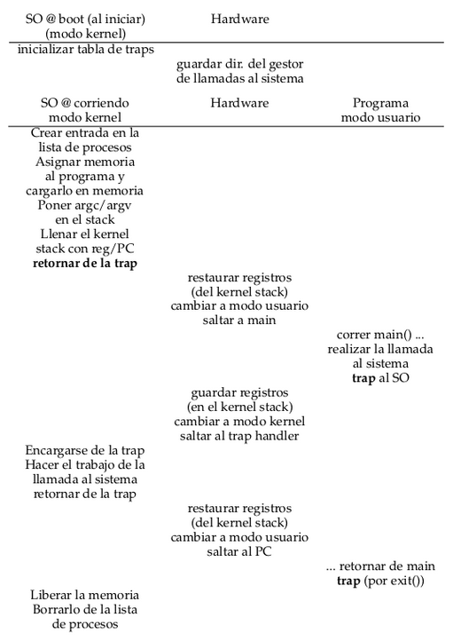
* Linea del tiempo de las dos fases del protocolo de LDE ante una trap por instruccion privilegiada.

### Intercambio Entre Procesos

Si un proceso corre en el CPU, el SO no esta corriendo. Sin embargo, el mismo debe asegurarse de poder recuperar el control para cambiar de proceso y lograr *Time Sharing*.

#### Enfoque Colaborativo: Esperar a Nuevas *System Calls*
El SO confia en el proceso en ejecucion y da por sentado que cada cierto periodo de tiempo liberaria el CPU para que el SO decida correr; al ejecutarse una *trap* o al llamar a una *system call* (incluso de manera explicita, con la llamada `yield`) se cederia y transferiria el control al SO.

#### Enfoque No Colaborativo: El SO Toma el Control
Utilizando mecanismos del hardware, el SO puede retomar el control del CPU mediante el ***Timer Interrupt***; un dispositivo que cada varios milisegundos realiza una interrupcion. Esta cuando ocurre se ejecuta un ***Interrupt Handle*** en el SO, que le permite retomar el control.
<br>En el *booteo* el SO deja explicito que codigo correr en una interrupcion, momento en el que ademas comienza el *timer*.
<br>El hardware se encarga de guardar el estado del proceso actual al momento de la interrupcion para su posterior *return from trap*.

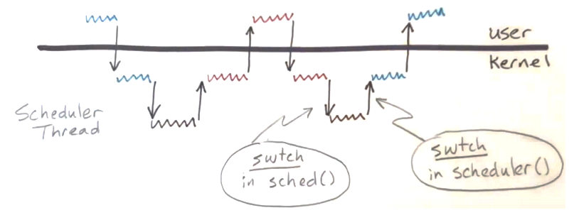
* En cada proceso una porcion se ejecuta en *user mode* y otra en *kernel mode*. Para pasar al *scheduler*, se da un segundo cambio de contexto; de *kernel mode* al *scheduler*. Por lo que tenemos: *user mode* -> *kernel mode* -> *scheduler*
* En el cambio de contexto de *user mode* a *kernel mode*, debemos guardar todo el contexto del proceso para poder retomarlo despues. En cambio, cuando se pasa del *kernel mode* al *scheduler*, ya se esta dentro el SO, por lo que no hace falta guardar tanta informacion: El sistema asumir ciertas partes del entorno son seguras y controladas.

### Guardar y Restaurar el Contexto

Si en el momento que el SO toma el control y decide cambiar a otro proceso (usando la rutina *switch*), ejecuta un codigo de bajo nivel, el ***context switch***, que le permite guardar los valores de los registros del programa en ejecucion (en el *kernel stack* del proceso) y restaurar otro para el proceso que pasara a ejecutarse (desde su *kernel stack*).

Si hay un *timer interrupt* (*trap*), es el hardware quien guarda los registros en el *stack* del kernel. Si hay un *switch* por parte del SO, es el software quien guarda/restaura los registros del kernel en la estructura del proceso.

Cada vez que se da un *context switch* (por ejemplo, ante una *syscall exception*), el proceso pierde *perfomance*, y tarda determinados ciclos en retomar la velocidad que tenia antes de la mismas.

### Concurrencia

Para que no ocurran *interrupts* simulteneas, se suelen deshabilitar las interrupciones mientras se esta lidiando con interrupciones. Tambien se usan ***locks*** para proteger las estructuras internas.

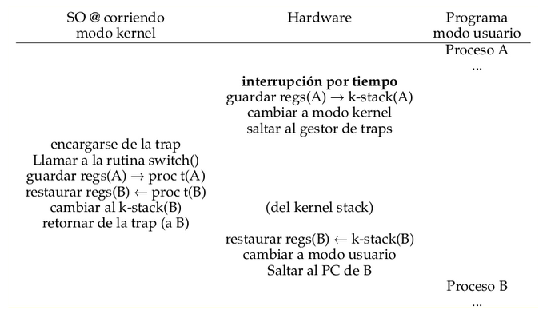
* Linea del tiempo de la segunda fase del protocolo de LDE ante una interrupcion por tiempo.

---
## Capitulo 7: Planificacion de la CPU

Las politicas de alto nivel (***Scheduling Policies***, o ***Diciplines***) son algoritmos utilizados por el *scheduler* del SO para decidir que procesos ejecutar y en que orden.

### Suposiciones Sobre la Carga de Trabajo

Antes de ver como se desarrolla una politica, hacemos alguna suposiciones sobre los procesos que corren en el sistema (la carga de trabajo, o *workload*), las cuales no son realistas:
1. Todos los procesos duran la misma cantidad de tiempo hasta acabar.
2. Todos los procesos llegan al mismo tiempo.
3. Una vez empiezan, se ejecutan hasta acabar.
4. Todos los procesos solo usan la CPU (o sea, no hacen I/O).
5. El tiempo de ejecucion de cada proceso es conocido

### Metricas de la Planificacion

El ***Turnaround Time*** ($T_{turnaround}$) (**Tiempo de Entrega**) es la metrica que mide el tiempo total que tarda un proceso desde que llega al sistema hasta que finaliza:

$$
T_{turnaround} = T_{completion} - T_{arrival}
$$

O sea, Tiempo de entrega = Tiempo de finalizacion - Tiempo de llegada.

Si se cumple la suposicion (2) => $T_{arrival} = 0$, lo que hace que $T_{turnaround} = T_{completion}$.

*Turnaround time* es una metrica de *perfomance*.

### Politica: FIFO (*Firsr In, First Out*) o FCFS (*First Come, Firse Serve*)

Es simple y facil de implementar pero con un mal tiempo de entrega. Como su nombre indica el primer proceso en entrar, es el proceso que se va a ejecutar hasta su finalizacion.
<br>Ejemplo: Supongamos que llegan tres procesos, `A`, `B` y `C` aproximadamente al mismo tiempo (Tiempo de llegada = 0). FIFO ubica algun proceso primero, es por eso que asumimos que `A` llega antes que `B` y `B` llega antes que `C`. Supongamos que cada proceso se ejecuta por 10 segundos.

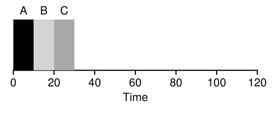

Vemos que `A` termina al segundo 10, `B` al 20 y `C` al 30. Por lo que el Tiempo de Entrega (Turnaround time) para los tres procesos es: $\frac{10+20+30}{3} = 20$.
<br>Pero no todos los procesos duran la misma cantidad de tiempo (suposicion (1)).
<br>Ejemplo: Supongamos que llegan 3 procesos (`A`, `B` y `C`), pero esta vez `A` se ejecuta por 100 segundos, y `B` y `C` se ejecutan 10 segundos cada uno.


Vemos que el proceso `A` se ejecuta primero los 100 segundos completos antes de que `B` y `C`. Por lo que el tiempo de entrega promedio es alto: $\frac{100+110+120}{3} = 110$.
<br>Este problema es conocido como ***Convoy Effect***, o sea, puede llegar antes un proceso mas largo que los demas y relentizar al resto, teniendo procesos mas cortos en espera, aumentando asi el tiempo promedio de entrega del sistema.

### Politica: SJF (*Shortest Job First*)

Este enfoque simple resuelve el problema, ejecuta el proceso mas corto primero, y luego el siguiente mas corto, y asi sucesivamente.
<br> Tomamos el ejemplo anterior pero esta vez con SJF como politica de planificacion.

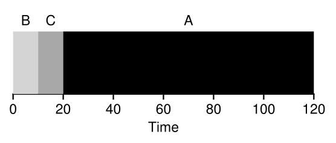

El diagrama muestra como porque SJF se desempeña mejor con respecto al tiempo de entrega promedio. Simplemente ejecutando `B` y `C` antes que `A`, SJF reduce el tiempo promedio de 110 a $\frac{10+20+120}{3} = 50$ segundos, menos de la mitad del tiempo.
<br>Pero, no todos los procesos llegan al mismo tiempo (suposicion 2).
<br>Ejemplo: Supongamos que `A` llega en $t = 0$ y necesita ejecutarse por 100 segundos, mientras que `B` y `C` llegan en $t = 10$ y cada uno necesita ejecutarse por 10 segundos. Con SJF obtendremos:

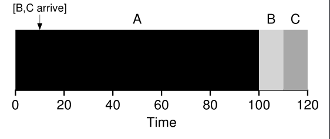

A pesar de que `B` y `C` llegaron poco despues que `A`, ellos son forzados a esperar a que `A` termine su ejecucion, y por lo tanto sufre el mismo *convoy effect*. El tiempo de entrega promedio para estos tres procesos es de $\frac{100+(110-10)+(120-10)}{3} = 103,33$

### Politica: STCF (*Shortest Time-to-Completion First*) o PSJF (*Preemptive Shortest Job First*)

Para esta politica suavizamos/olvidamos la suposicion (3) los Procesos no se ejecutan hasta terminarse. Tambien necesitamos algo de maquinaria en el planificador. Tomando el ejemplo, el planificador puede hacer algo cuando `B` y `C` llegan; puede reemplazar (*preempt*) y decidir ejecutar otro proceso, y quizas continuar ejecutando `A` despues.
<br>Este planificador agrega reemplazo a SJF. Cuando entra un nuevo proceso al sistema, el planificador STCF determina a cual de los procesos que quedan le queda el menor tiempo de ejecucion, y planifica ese. Por lo tanto, en nuestro ejemplo, STCF reemplazara `A` y ejecutara `B` y `C` hasta completarse; solo entonces podra planificarse el tiempo que le queda a `A`.

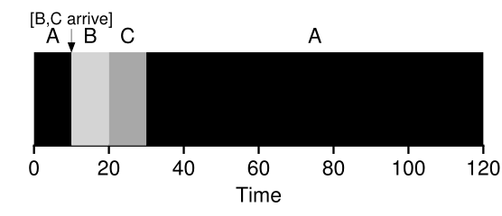

El tiempo de entrega promedio mejoro con respecto al JSF: $\frac{(120-0)+(20-10)+(30-10)}{3} = 50$.

### Metrica: *Response Time*

Las computadoras actuales deben tener un *perfomance* interactiva con el usuario, y esto es lo que se mide en ***Response Time*** (**Tiempo de Respuesta**). Definimos el tiempo de respuesta como el tiempo desde que el proceso llego al sistema hasta el tiempo en que fue planificado por primera vez. Formalmente quedaria:

$$
T_{response} = T_{firstrun} - T_{arrival}
$$

O sea, el Tiempo de Respuesta = Primera Ejecucion - Momento de llegada

Por ejemplo, si tenemos la planificacion del caso anterior (Con `A` llegando al 0, y `B` y `C` al 10), el tiempo de respuesta de cada proceso seria: 0 para `A`, 0 para `B` y 10 para `C` (promedio 3,33).
<br>STCF y las disciplinas relacionadas No son buenas para el tiempo de respuesta.

### Planificacion: *Round Robin* (**RR**)

Corre los procesos durante un periodo de tiempo fijo o hasta que acaben (este segmento, ***Time Slice***, es llamado ***Quantum***). Al ser cortado por un Q, el proceso va al final de una FIFO. Cambia de proceso cada cierto tiempo fijo de entre los trabajos que hay en una cola hasta que finalicen. este *time slice* debe ser multiplo del *timer interrupt* del sistema para que el SO pueda tomar control y hacer el *context switch* en ese momento.
<br>Ejemplo: Supongamos que hay tres procesos `A`, `B` y `C` llegan al mismo tiempo al sistema, y que cada uno quiere ejecutarse 5 segundos. Un planificador SJF ejecutara cada proceso hasta que se complete antes de ejecutar otro, como muestra la siguiente imagen:

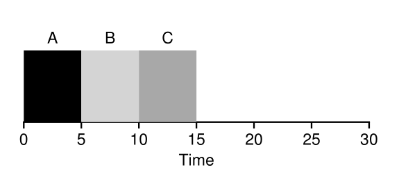

A diferencia de RR con un *time slice* de 1 segundo que ciclara a traves de los procesos rapidamente:

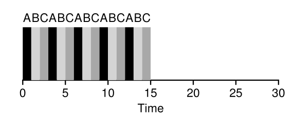

El tiempo de respuesta promedio de RR es:

$$
\frac{0+1+2}{3} = 1
$$

<br>Y el tiempo de respuesta promedio de SJF es:

$$
\frac{0+5+10}{3} = 5
$$

La duracion del *time slice* es importante; si es muy corta es bueno para el Tiempo de respuesta pero puede empeorar la *perfomance* al aumentar la cantidad de *context switchs*. A la vez, debe ser suficientemente larga para amortizar el costo del cambio y no empeorar la *perfomance*, y corta para mantener un tiempo de respuesta aceptable.

RR es ***Fair*** (**Justa**), lo que hace que sea mala en su tiempo de entrega. Es un *trade-off* a considerar dependiendo del objetivo que se tenga con el *scheduler*.

Ante dos procesos que arriban a la vez se debe establecer una politica que determine cual se ejecuta, pero si uno ya estaba *ready* antes que otro, se respeta el orden FIFO, no el de la politica.

### Incorporando I/O

Obviamente todos los programas hacen I/O (suposicion (4)). Un planificador tiene una decision que tomar cuando un proceso inicia una peticion de I/O; porque el proceso que se esta ejecutando actualmente no puede usar la CPU durante la I/O; se bloquea esperando que se complete la I/O. Si la I/O es enviada al disco duro, el proceso sera bloqueado durante algunos milisegundos. Por lo tanto el planificador deberia planificar otro proceso en la CPU en ese tiempo.
<br>El planificador tambien debera tomar una decision cuando una I/O se completa. Cuando esto ocurre, se genera una interrupcion, y el SO cambia el estado *blocked* del proceso que hizo la peticion a *ready*. Por supuesto, todavia debera decidir ejecutar el proceso o no.

Ejemplo: Asumimos que hay dos proceso `A` y `B`, los cuales necesitan 50 milisegundos de tiempo de CPU. Sin embargo, hay una diferencia: `A` se ejecuta por 10 milisegundos y emite una peticion I/O (asumimos que cada I/O tarda 10 milisegundos), cuando `B` se ejecuta por 50 milisegundos y no hace ninguna I/O. El planificador ejecuta primero `A` y luego `B`.

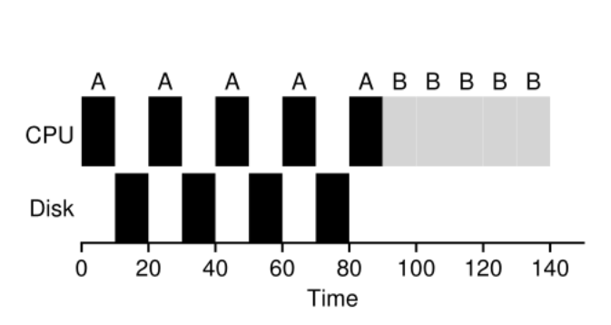

Ahora asumamos que estamos tratando de construir un planificador STCF. ¿Como explicaria un planificador de este tipo el hecho de que `A` se divide en 5 subtrabajos de 10 milisegundos, cuando `B` solo demanda 50 milisegundos de CPU? Ejecutar un proceso y recien despues otro sin tener en cuenta las I/O no tiene sentido. Un enfoque comun es tratar cada sub proceso de 10 milisegundos de `A` como un proceso independiente. Por lo que, cuando el sistema empieza, su opcion seria, ya sea ejecutar 10 milisegundos `A` o ejecutar 50 milisegundos `B`. Con STCF, La opcion es clara: elegir la mas corta, en este caso `A`. Entonces, cuando el primer subproceso de `A` se completa, solo queda `B` y empieza a ejecutarse. Entonces un nuevo subproceso de `A` es mandado y reemplaza a `B` y se ejecuta por 10 milisegundos. Hacer esto permite la **Superposicion** (***Overlap***), con la CPU siendo usada por otro proceso mientras espera a que el I/O de otro proceso se complete; por lo tanto el sistema es mejor utilizado (de forma mas eficiente).

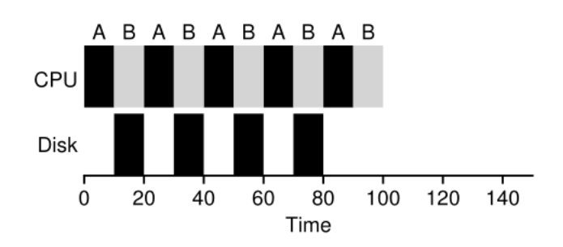

Asi es como un planificador incorpora I/O. Tratando cada uso de CPU como un proceso diferente, el planificador se asegura que los procesos son "interactivos" ejecutandolos frecuentemente. Mientras estos procesos intereactivos estan haciendo I/O, otros procesos que usan la CPU se ejecutan, por lo tanto es una mejor utilizacion del procesador.

### No Mas Oraculos

Nuestra suposicion final: que el planificador conoce el tiempo de ejecucion de cada proceso. Es la peor suposicion que se pudo hacer, ya que en un SO de proposito general, el SO conoce muy poco sobre el tamaño de los procesos. Sin esto SJF y STCF no funcionan bien.

---
## Capitulo 8: Cola MultiNivel con Retroalimentacion (MLFQ)

Politica: **MLFQ** (***Multi-Level Feedback Queue***). Busca optimizar tanto el tiempo de entrega como el tiempo de respuesta, o sea, tener a la vez buena *perfomance* y ser interactivo, brindando una respuesta adaptativa.

### Reglas Basicas

El MLFQ tiene un numero diferentes de **Colas** (***Queue***), cada una asigana a un **Nivel de Prioridad** (***Priority Level***) diferente. En un momento dado, un proceso que esta *ready* esta en una sola cola. MLFQ usa prioridades para decidir que proceso debe ejecutarse en cierto momento: Un proceso con una mayor prioridad (o sea, en una cola mas alta) es elegido para ejecutarse.
<br>Por supuesto, muchos procesos estaran en la misma cola, y por lo tanto, tendran la misma prioridad. En este caso, usaremos **RR** para planificar entre ellos.
* **Regla 1**: Si Prioridad(A) > Prioridad(B) => Se ejecuta A (B no).
* **Regla 2**: Si Prioridad(A) = Prioridad(B) => Se ejecuta A y B en RR.

La clave de MLFQ radica en como el planificador establece las prioridades. En vez de dar una prioridad fija a cada proceso, MLFQ varia la prioridad de cada proceso basado en el **Comportamiento Observado**.
<br>Por ejemplo: Un proceso cede el control de la CPU rapidamente mientras que espera por una accion del teclado, MLFQ mantendra su prioridad alta. Si en cambio, un proceso usa la CPU intensamente por largos periodos de tiempo, MLFQ reducira su prioridad. De esta forma, MLFQ trata de **Aprender** sobre los proceso a medida que se ejecutan.

### Intento 1: Como Cambiar Prioridades

Tenemos que decidir como MLFQ cambiara los niveles de prioridades de un proceso (y por lo tanto en que cola estara) a traves del tiempo de vida del trabajo. Para esto debemos pensar en la carga de trabajo: Una mezcla de procesos de corta ejecucion (pueden ceder la CPU frecuentemente), y algunos procesos de larga duracion que necesitan mucho tiempo de CPU pero que el tiempo de respuesta no es importante.
* **Regla 3**: Cuando un trabajo entra en el sistema, es ubicado en la cola de mas alto nivel de prioridad.
* **Regla 4.a**: Si un proceso usa una porcion de tiempo completa durante su ejecucion, se reduce su prioridad.
* **Regla 4.b**: Si un proceso entrega la CPU antes de que la porcion de tiempo se acabe, se mantiene en el mismo nivel.

### Ejemplo 1: Un Solo Proceso de Larga Duracion

Veamos que sucede cuando se ha estado ejecutando un proceso largo en el sistema.

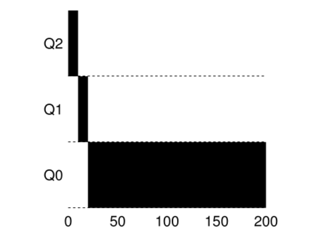

El proceso entra en la cola de maxima prioridad (Q2). Despues de 10 milisegundos, el planificador reduce su prioridad en uno, y por lo tanto el proceso pasa a la cola Q1. Luego de ejecutarse en Q1 por un tiempo, el trabajo es bajado a la cola de mas baja prioridad en el sistema (Q0),

### Ejemplo 2: Llega un Proceso Corto

En este ejemplo hay dos procesos: `A`, el cual es un proceso de larga duracion de uso intencivo de la CPU, y `B`, el cual es un proceso de corta duracion e interactivo. Asumamos que `A` se ha estado ejecutando un tiempo, y entonces llega `B`.

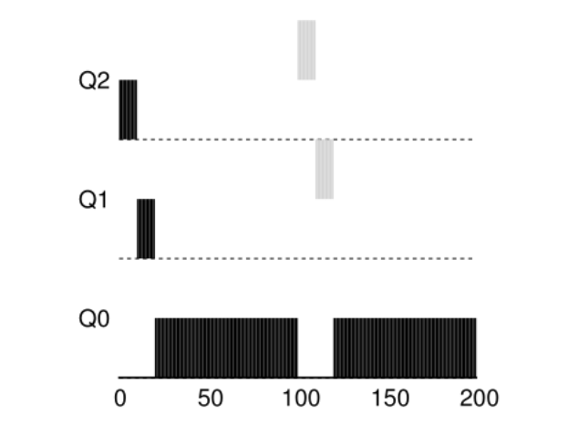

`A` (mostrado en negro) se esta ejecutando en la cola de prioridad mas baja; cuando `B` (mostrado en gris) kkega en el tiempo $t = 100$, y por lo tanto insertado en la cola de prioridad mas alta; como su tiempo de ejecucion es corto (solo de 20 milisegundos), `B` termina su ejecucion antes de llegar a la cola de mas baja prioridad; entonces `A` retoma su ejecucion (en baja prioridad).

En este ejemplo se muestra uno de los principales **Objetivos** del algoritmo: Dado que no se sabe i un proceso sera corto o largo, primero se asume que es uno corto, por eso lo ubica en la cola de prioridad mas alta. Si realmente es un proceso corto, entonces se ejecutara rapidamente y terminara; y si no lo es, lentamente ira bajando de cola y mostrara ser un proceso largo. De esta manera MLFQ se aproxima a SJF.

### Ejemplo 3: ¿Que pasa con los I/O?

Como dice la regla 4.b, si un proceso entrega la CPU antes de usar su porcion de tiempo, entonces se mantendra el mismo nivel de prioridad. La intencion de esta regla es simple: Si un proceso interactivo, esta haciendo, por ejemplo, muchas I/O (digamos que esta esperando una entrada del teclado o mouse), cedera el control de la CPU antes de que se complete su porcion de tiempo; en tal caso, no queremos penalizar al proceso y por lo que simplemente se mantiene al mismo nivel.

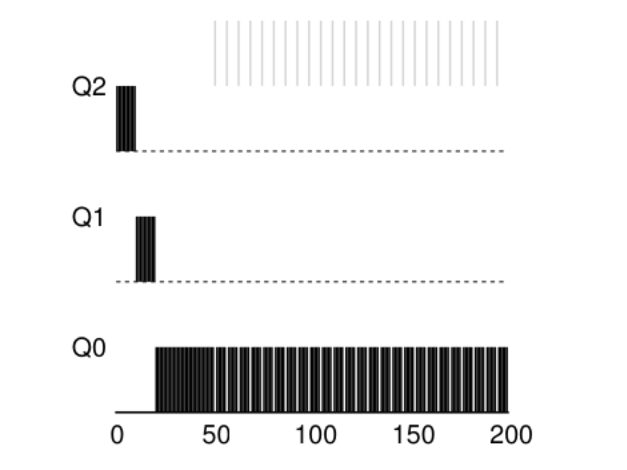

Vemos que un proceso interactivo `B` (mostrado en gris) necesita la CPU solo 1 milisegundo antes de hacer una I/O, compitiendo con un proceso de larga ejecucion `A` (mostrado en negro). El enfoque MLFQ mantiene a `B` en la maxima prioridad. Dado que `B` mantiene liberada la CPU; si `B` es un proceso interactivo, MLFQ logra aun mas su objetivo de ejecutar proceso interactivos rapidamente.

### Problema

Problema de **Inanicion** (***Starvation***): Si hay demasiados procesos interactivos en el sistema, combinados consumirian todo el tiempo de CPU, y por lo tanto los proceso de larga duracion nunca recibirian nada del tiempo de la CPU.

### Intento 2: Impulso de Prioridad

Intentemos cambiar las reglas y veamos si podemos evitar el problema de Inanicion. La idea es elevar la prioridad de todos los procesos periodicamente. Vamos a subirlos a todos a la cola de maxima prioridad, por lo tanto hay una nueva regla:
* **Regla 5**: Despues de un periodi de tiempo `S`, mover todos los proceso del sistema a la cola de maxima prioridad.

Esta regla soluciona dos problemas a la vez:
1. Garantizamos que los procesos tengan algo de tiempo de CPU: Ubicandolo en la cola mas alta, un proceso compartira la CPU con otro proceso de maxima prioridad en forma de RR, por lo tanto, eventualemnte recivira servicio.
2. Si un proceso consumidor de CPU se vuelve interactivo, el planificador lo tratara apropiadamente una vez que se reciba el impulso de prioridad.

Ejemplo cuando un proceso de larga duracion compite por la CPU con un proceso interactivo de corta duracion.

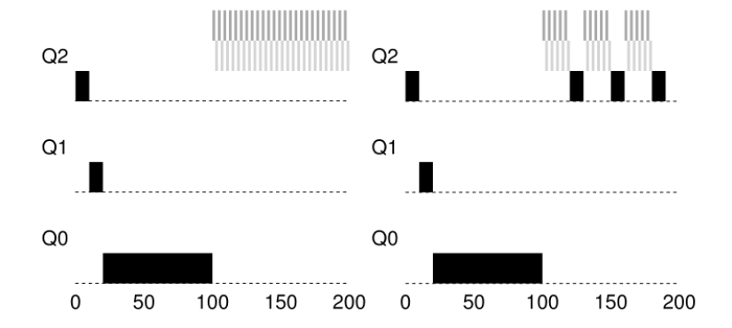

A la izquierda no hay impulso de prioridad, por lo que el proceso largo no consume CPU una vez que llegan los dos procesos cortos.
<br>A la derecha si hay impulso de prioridad cada 50 milisegundos, por lo tanto al menos nos aseguramos que el proceso largo consumira algo de CPU, siendo impulsado a la cola de mas alta prioridad cada 50 milisegundos y por lo tanto siendo ejecutado periodicamente.

### Intento 3: Mejor Conteo

Problema a resolver: ¿Como prevenimos que los procesos jueguen con el planificador? Los culpables son las reglas 4.a y 4.b, el cual le permite a un proceso mantener su prioridad cediendo la CPU antes de que se agote su porcion de tiempo.
<br>Solucion: Hacer un mejor conteo del tiempo de CPU en cada nivel del MLFQ. En vez de olvidar cuanto de una porcion de tiempo uso un proceso en un nivel dado, el planificador le hara un seguimiento, una vez que un proceso haya hecho su parte, sera degradado de cola. Entonces si usa su porcion de tiempo de una sola vez o en varias partes, no importara. Por lo que vamos a reescribir la regla 4.a y 4.b en una sola:
* **Regla 4**: Una vez que un proceso haya usado su tiempo asignado en un nivel (independientemente de cuantas veces haya cedido la CPU), su prioridad sera reducida (o sea, se movera una cola abajo).

Ejemplo:

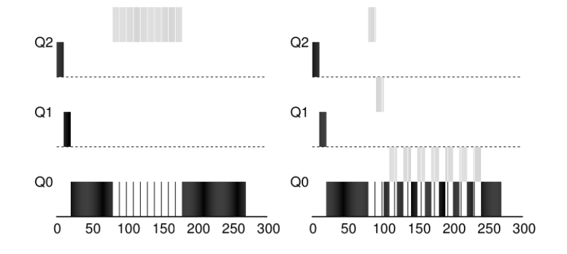

A la izquierda se muestra que sucede cuando una carga de trabajo intenta jugar con el planificador con las reglas 4.a y 4.b.
<br>A la derecha se muestra que sucede con la nueva regla 4. Un proceso puede lanzar una I/O justo antes de que finalice su porcion de tiempo y por lo tanto dominara la CPU. En cambio, con proteccion, sin importar el comportamiento del proceso sobre las I/O, lentamente se movera hascia abajo en las colas, y no puede ganar injustamente tiempo de CPU.

### MFLQ Final

* **Regla 1**: Si Prioridad(A) > Prioridad(B), se ejecuta A (B no).
* **Regla 2**: Si Prioridad(A) = Prioridad(B), se ejecutan A y B en RR.
* **Regla 3**: Cuando un trabajo ingresa al sistema, se coloca en la cola de prioridad más alta.
* **Regla 4**: Una vez que un trabajo utilice su tiempo asignado en un nivel dado (independientemente de cuantas veces haya renunciado a la CPU), su prioridad se reduce.
* **Regla 5**: Despues de un periodo de tiempo determinado (S), todos los trabajos del sistema se mueven a la cola de más alta prioridad.

# Virtualizacion de la Memoria

## Capitulo 13: El Espacio de Direcciones

### Tiempo Compartido (*Time Sharing*) y Multiprogramacion

Antes de la memoria virtual, los sistemas implementaban el tiempo compartido dandole a cada proceso acceso a toda la memoria fisica por un periodo corto de tiempo. Cuando el scheduler cambiaba de proceso, el SO debia guardar completamente el contenido de la memoria del proceso y cargar la del siguiete.
<br>Este enfoque tenia un problema: Era muy lento, particularmente a medida que crece la memoria. Mientras que guardar y recuperar estados de registros (PC, registros de proposito genera, etc) es relativamente rapido, guardar el contenido completo de la memoria al disco es muuy lento. Por lo tanto, lo que hicieron fue dejar el proceso en la memoria mientras cambia entre ellos, permitiendole al SO implementar el tiempo compartido mas eficientemente.

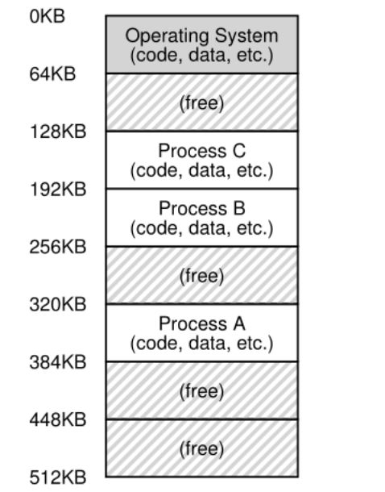

En el diagrama se observan 3 procesos (A, B y C) el cual cada uno de ellos tiene una parte chica, 512 KiloByte, de la memoria fisica reservada para ellos. Suponiendo que tenemos un solo CPU, el SO elige ejecutar uno de esos procesos (digamos que es el A) mientras que los otros (B y C) estan en la cola de procesos listos, esperando a que los ejecuten.

### Espacio de Direcciones (*Address Space*)

El **Espacio de Direcciones** (***Address Space***) es la vista del programa en ejecucion de la memoria en el sistema.
<br>El espacio de direcciones de un proceso contiene todo el estado de la memoria del programa en ejecucion. Por ejemplo, el codigo de un programa (las instrucciones) tienen que vivir en alguna parte de la memoria, y por lo tanto ellos estan en el espacio de direcciones.
<br>El programa, mientras se esta ejecutando, usa el ***Stack*** para mantener seguimiento de en donde se encuentra en la cadena de llamadas a funciones, asi como tambien para asignar variable locales, pasar parametros y devolver valores. El ***Heap*** es usado para asignaciones dinamicas, manejo de memoria del usuario, como las que deberia recibir de una llamada `malloc()` en C. Hay mas cosas, pero por ahora usamos solo tres componentes: *Code*, *Stack* y *Heap*.

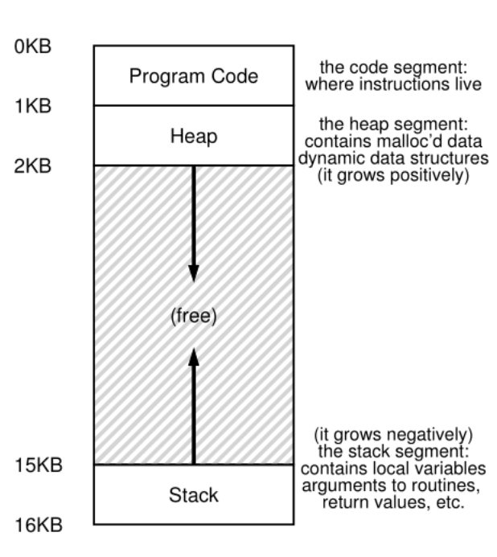

En el ejemplo tenemos un espacio de direcciones de 16 KiloByte. El codigo del programa vive en la parte superior del espacio de direcciones (comenzando desde el 0 en este ejemplo, y es empaquetado en la direccion 1 KiloByre del espacio de direcciones). El codigo es estatido (por lo que es facil de ubicar en la memoria), entonces podemos ubicarlo en la parte superior del espacio de direcciones y saber que no necesitamos mas memoria mientras se ejecuta el programa.
<br>Luego, tenemos dos regions que pueden **Crecer** (y **Encogerse**) mientras el programa se ejecuta. Estas estan en el *Heap* (arriba) y en el *Stack* (abajo). Las ubicamos de esta forma porque cada cual debe ser capaz de agrandarse, y poniendolas en los extremos opuestos, del espacio de memoria, les permitimos el crecimiento: Solo tiene que expandirse en direcciones opuestas. Por lo tanto el *heap* empieza justo despues del codigo (en el 1KB) y crece hacia abajo (por ejemplo, crecera cuando un usuario pide memoria via `malloc()`); el *stack* comienza en el 16KB y crece hacia arriba (por ejemplo, crecera cuando el usuario hace una llamada a un procedimiento).

Cuando decribimos el espacio de direccionamiento, lo que estamos describiendo es la **Abstraccion** que el SO proporciona a los programas en ejecucion. Realmente el programa no esta en memoria en las direcciones fisicas de 0 a 16KB; mas bien es cargada en alguna direccion fisica arbitraria. Volviendo a los procesos A, B y C del ejemplo anterior, podemos ver como cada proceso es cargado en la memoria en diferentes direcciones.
<br>Cuando el SO hace esto, decimos que el SO esta **Virtualizando la Memoria**, porque el programa en ejecucion cree que esta cargado en la memoria en una direccion particular (supongamos que es 0) y que tiene un espacio de direcciones potencialmente grande (supongamos que es de 32 o 64 bits); la realidad es direferente.
<br>Por ejemplo, cuando un proceso A intenta realizar una carga en la direccion 0 (la cual llamaremos **Direccion Virtual**), de alguna forma el SO, con la ayuda de soporte del hardware, tendra que asegurar de que la carga no vaya realmente a la direccion fisica 0, si no mas bien a la direccion fisica 320 KB (donde A esta cargado en memoria).

### Objetivos

El trabajo del SO es virtualizar la memoria. Para hacerlo, debe cumplir 3 objetivos:
1. **Transparencia**: La implementacion de la VM (memoria virtual) deve ser invisible para el programa, el cual debe creer que tiene su propia memoria fisica. El SO junto al hardware crean esta ilusion.
2. **Eficiencia**: La virtualizacion debe ser lo mas eficiente posible en terminos de tiempo y espacio. Para esto el SO utiliza distintas caracteristicas del hardware, como la TLB.
3. **Proteccion**: El SO debe proteger los procesos unos de otros, asi como proteger al SO de los procesos. Para eso aisla a la memoria de los proceso (solo pueden acceder a su espacio de direcciones) para que no puedan interferir entre si, permitiendo por ejemplo, que uno falle sin que afecte al resto.

## Capitulo 14: API de la Memoria

### Tipos de Memoria

Corriendo un programa en C, hay dos tipos de memoria:
1. El ***Stack***: las asignaciones y reasignaciones las menja el compilador **Implicitamente**. El compilador asigna la memoria necesaria y cuando ya no es necesaria la desasigna.
2. El ***Heap***: Es usada para cosas que requieren mas permanencia, donde las asignaciones y reasignaciones las realiza el usuario **Explicitamente**.

```c
void func() {
  int *x = (int *) malloc(sizeof(int));
}
```

Un par de observaciones sobre este fragmento de codigo. Primero Notar que ambas asignaciones, *stack* y *heap*, ocurren en esta linea: primer el compilador sabe hacer espacio para un puntero a un entero cuando ve la declaracion a dicho puntero (`int *x`); cuando el programa llama a `malloc()`, pide memoria para un entero en el *heap*; la rutina devuelve la direccion de dicho entero (ya sea exitoso, o `NULL` en caso de fallar), el cual es guardado en el *stack* para usar por el programador.

### `malloc()`

Consulta por espacio en el *heap* pasando el tamaño, y en cualquier csao te devuelve un puntero, al nuevo espacio asignado, o si falla devuelve `NULL`.
<br>El unico parametro que toma es de tipo `size_t`, el cual solamente describe cuantos bytes necesitas. En general no se tipea un numero, en cambio, se usan muchas rutinas y macros para hacerlo. Por ejemplo, para asignar espacio para un valor flotante de doble precision (`double`), simplemente se hace asi:

```c
double *d = (double *) malloc(sizeof(double));
```

Se usa el operador `sizeof()` para solicitar la cantidad correcta de espacio.
<br>Tambien se le puede pasar el nombre de una variable (y no solo el tipo) a `sizeof()`, pero en algunos casos se puede no obtener los resultados esperados. Por ejemplo:

```c
int *x = malloc(10 * sizeof(int));
printf("%d\n", sizeof(x));
```

En la primera linea, declaramos espacio para un array de 10 `int`. Sin embargo, cuando usamos `sizeof()` en la siguiente linea, devuelve un numero chico, 4 para maquinade de 32 bits y 8 para maquinas de 64 bits. La razon es que `sizeof()` cree que le estamos preguntando por el tamaño de un puntero a un entero, no sobre cuanta memoria tenemos asignada dinamicamente. Pero, a veces `sizeof()` funciona como se espera

```c
int x[10];
printf("%d\n", sizeof(x));
```

En este caso, hay suficiente informacion estatica para que el compilador sepa que fueron asignados 40 bytes.

Cuando declaramos espacio para un `string`, usamos el siguiente formato: `malloc(strlen(s) + 1)`, el cual obtiene el largo del `string` usando la funcion `strlen()`, y se le suma uno para hacer espacio para el caracter de fin del `string`.

Notar que `malloc()` devuelve un puntero a `void`. Esta es la forma que tiene C para pasar una direccion al programador para dejarle decidir que hacer con ella.

Tambien existe `calloc()` que inicializa la memoria asignada en cero. Y `realloc()` copia una region de memoria y le asigna un espacio de tamaño diferente.

### `free()`

Para liberar memoria del *heap* simplemente llamamos a `free()`:

```c
int *x = malloc(10 * sizeof(int));
...
free(x)
```

Toma como argumento un puntero retornado por `malloc()`. Notar que el tamaño de la region asignada no es pasada por el usuario, y debe ser rastreada por la misma libreria de asignacion de memoria.

Tanto `malloc()` y `free()` no son *system calls*; son parte de la libreria de manejo de memoria `stdlib`. Las *system calls* son `brk()` (toma como argumento la direccion del nuevo final) y `sbrk()`, que mueven el *break*; la memoria maxima a la que puede acceder el *heap*, y `mmap()`, que permite mapear un archivo en memoria.

### Errores Comunes

Algunos lenguajes tienen un manejo de memoria automatico (***garbage collector***), lo que hace que no sea necesario liberar memoria explicitamente. En aquellos lenguajes que no tienen *garbage collector* (como C), se puede ocacionar algunos errores comunes:
* Olvidarse de asignar memoria: ***Segmentation Fault***. Muchas rutinas esperan ya tener memoria asignada al ser llamadas (por ejemplo `strcpy()`).
* No asignar memoria suficiente: ***Buffer Overflow***. Normalmente se asigna la memoria justa, algunas veces `malloc()` deja un poco de margen para evitar estos errores. Cuando no es suficiente, un *overflow* de bytes puede ocurrir.
* Olvidarse de inicializar la memoria asignada: ***Uninitialized Read***. Si se llama a `malloc()` pero no se le asigna valores a la memoria asignada, el programa eventualmente puede acceder a ella y leer del *heap* informacion de valor desconocido, causando comportamientos no previstos.
* Olvidarse de liberar memoria: ***Memory Leak***. Cuando ya no se usa, la memoria debe ser liberada. De no hacerlo, puede llevar a acabar la memoria en aplicaciones *long-running*.
* Liberar memoria que todavia se puede necesitar: ***Dandling Pointer***. Si un programa libera memoria antes de usarla se queda un puntero colgante, llegando a crashear o sobreescribir memoria valida.
* Liberar memoria repetidamente: ***Double Free***. Los programas pueden intentar liberar memoria mas de una vez, lo cual genera comportamientos indefinidos o crasheos.
* Llamar a `free()` incorrectamente: ***Free Incorrectly***. `free()` solo espera que se le pase como argumento un puntero devuelto por `malloc()`. Cn cualquier otro valor o argumento el `free()` es invalido.

## Capitulo 15: Traduccion de Direcciones

En el desarrollo de la virtualizacion del CPU nos centramos en el mecanismo general LDE, Ejecucion Directa Limitada (*Limited Direct Execution*), cuya idea es dejar el proceso correr en el hardware la mayo parte del tiempo, y que en ciertos puntos clave el SO se involucre y tome decisiones que le permitan asegurarse, con ayuda del hardware, mantener el control mientras trata de mantenerse fuera del camino del proceso.

En la **Virtualizacion de la Memoria** se busca algo similar; obtener **Control** y **Eficiencia** mientras se provee la virtualizacion. La eficiencia es lo que dicta que se use el apoyo del hardware. Controlar implica que el SO asegure que ninguna aplicacion tenga permitido acceder a otra memoria salvo la suya, y asi proteger aplicaciones unas de otras y al SO de las aplicaciones (lo que tambien requiere ayuda del hardware).

Algo que necesitaremos del sistema de memoria virtual (VM) es **Flexibilidad**; que los procesos puedan usar su *address space* como quieran, haciendo asu el sistema mas sencillo.

### Virtualizar Memoria Eficiente y Flexiblemente

La idea es realizar una ***hardware-based address translation*** (**Traduccion de Direcciones en Base a Hardware**). Con la **Traduccion de Direcciones**, el hardware transforma cada acceso a memoria (*fetch*, *load*, *store*), cambiando la **Direccion Virtual** provista por la instruccion a una **Direccion Fisica** donde esta guardada la informacion deseada. Por lo tanto, en cada referencia a memoria, un traductor de direcciones es ejecutado por el hardware para redirigir referencia de memoria de la aplicacion a la ubicacion real en memoria.
<br> El hardware no virtualiza la memoria, solo provee un mecanismo de bajo nivel para lograrlo eficientemente. Es el SO quien se involucra y maneja la memoria, sabiendo que localizaciones estan libres y cuales en uso, y manteniendo asi control sobre como la memoria es usada.

### Suposiciones

Por ahora asumiremos que el *address space* del usuario debe ser ubicado contiguamente en la memoria fisica. Tambien asumiremos que el tamaño del *address space* no es muy grande; especificamente, que es mas chico que el tamaño de la memoria fisica. Por ultimo, asimiremos que cada *address space* tiene el mismo tamaño.

#### Ejemplo

Imaginemos un proceso cuyo *address space* es:


Lo que vamos a examinar es una secuencia de codigo que carga un valor desde la memoria, lo incrementa en 3, y lo guarda de nuevo en la memoria. Se puede imaginar en codigo en C como:

```c
void func() {
  int x = 3000;
  x = x + 3;  // Parte del codigo que nos interesa
}
```

El compilar traduce esta linea de codigo a assembly, la cual se ve algo asi:

```assembly
movl  0x0     (%ebx),  %eax    ; carga 0+ebx en eax
addl  $0x03,  %eax             ; suma 3 al registro eax
movl  %eax,   0x0      (%ebx)  ; guarda eax de vuelta a memoria
```

Se asume que la direccion de `x` ha sido puesta en el registro `ebx`, entonces carga el valor de esa direccion en el registro de proposito general `eax` usando la instruccion `movl`. La siguiente instruccion `add 3` a `eax`, y la instruccion final guarda el valor de `eax` de nuevo en la memoria en la misma ubicacion.
<br>Volviendo a la imagen, se observa como el codigo y los datos son puestos en el *address space*; la secuencia de codigo de tres instrucciones esta ubicada en la direccion 128, y el valor de la variable `x` en la direccion 15KB. El valor inicial de `x` es 3000.
<br>Cuando se ejecutan las instrucciones, desde la perspectiva del proceso, se ejecutan los siguientes accesos a memoria:
* *Fetch*: Se busca la instruccion en la direccion 128.
* *Execute*: Se ejecuta la instruccion (cargar la direccion 15KB).
* *Fetch*: Se busca la instruccion en la direccion 132.
* *Execute*: Se ejecuta la instruccion (sin referencia a memoria).
* *Fetch*: Se busca la instruccion en la direccion 135.
* *Execute*: Se ejecuta la instruccion (guardar en la direccion 15KB).

Desde el punto de vista del programa, su *address space* comienza en la direccion 0 y crece hasta el maximo de 16KB; todas las referencias de memoria que genera deben estar en este rango. Pero, al virtualizar la memoria, el SO quiere ubicar el proceso en cualquier parte de la memoria fisica, no necesariamente en la direccion 0. 

Vemos un ejemplo de como se deberia ver la memoria fisica una vez que el *address space* del proceso ha sido ubicado en memoria:


Podemos ver al SO usando el primer slott de la memoria fisica para el mismo, y que ha reubicado el proceso en el slot que empieza en la direccion 32 KB de la memoria fisica. Los otros slots estan libres.

### Reubicacion Dinamica (*Hardware-Based*)

Para virtualizar la memoria, el SO debe poner a cada programa en un lugar diferente a la direccion 0. Para hacerlo de forma transparente (sin que el proceso se de cuenta), se usan las ideas de ***Base and Bounds*** (**Base y Limite**); aunque tambien se los conoce como ***Dynamic Relocation*** (**Reubicacion Dinamica**); se usan ambos terminos de forma indiscriminada xd.
<br>Especificamente, se necesitan dos registros del hardware en cada CPU: Uno es llamado registro **Base** y el tro **Limite** (***Bounds***). Este par base-limite nos permite ubicar el *address space* en cualquier lugar que querramos de la memoria fisica, y asegurarnos que el proceso solo pueda acceder a su *address space*.
<br>Como cada programa cree estar en la direccion 0, es el SO quien al cargarlos decide donde ponerlos en memoria fisica, y establece los registros base-limite con ese valor. En el ejemplo anterior, el SO decide cargar el proceso en la direccion fisica 32KB y por lo tanto configurar el registro base con ese valor.

Cualquier referencia a memoria generada por el programa sera traducida por el procesador usando:

$$
Physical\_Address = Virtual\_Address + Base
$$

Cada referencia a memoria creada por el proceso es una **Direccion Virtual**, el hardware almacena los contenidos de la base a la direccion y el resultado es la **Direccion Fisica**

Transformar una direccion virtual en una direccion fisica es la tecnica a la que nos referimos con **Traduccion de Direcciones**. Dado que la reubicacion de la direccion sucede en tiempo de ejecucion, y dado que podemos mover el *addres space* incluso despues de que el proceso comienza a ejecutarse, esta tecnica es conocida como **Reubicacion Dinamica**.

El registro **Limite** esta para ayudar con la **Proteccion**. Especificamente, el proceso primero verifica que es legal; en el ejemplo anterior, el registro limite siempre estara seteado en 16KB. Si un proceso genera una direccion virtual que es mas grande que el limite, o es negativa, la CPU lanzara una excepcion, y probablemente el proceso sera detenido. El objetivo del limite es asegurar que todas las direcciones generadas por el proceso sean legales y este dentro de los limites de ese proceso.

Notar que los registros base-limite son estructuras del hardware que esta ubicados en el chip (un par por cada CPU). A esta parte del procesador que ayuda con las traducciones de direcciones se las llama ***Memory Management Unit*** (**MMU**) (***Unidad de Administraccion de Memoria***)

### Ejemplo de Traduccion

Imaginemos un proceso con un *address space* de tamaño de 4KB, que ha sido cargado en la direccion fisica 16KB. Aca estan los resultado de algunas de las traducciones de direcciones.

| Direccion Virtual |        |      Direccion Fisica      |
| :---------------: | :----: | :------------------------: |
|         0         | &rarr; |            16KB            |
|        1KB        | &rarr; |            17KB            |
|       3000        | &rarr; |           19384            |
|       4400        | &rarr; | *Fault (Fuera del Limite)* |

Como vemos, simplemente agregamos la direccion base a la direccion virtual (la cual puede ser vista como un *offset* dentrol del *address space*) para obtener la direccion fisica resultante.

### Soporte del Hardware

El hardware debe proveer al SO distintos mecanismos para lograr la virtualizacion de la memoria:
* La posibilidad de soportar dos modos de ejecucion (usuario y kernel).
* Proporcionar los registros base-limite.
* La capacidad de **Chequear** que la memoria a la que se intenta acceder se encuentre dentro de los limites de base-limite y, en ese caso, **Traducir** la memoria virtual/fisica.
* Otorgar las **Instrucciones Privilegiadas** para que el SO pueda **Modificar** los registros base y limite (igual que poder modificar los *exception hablders*), mientras un proceso esta en ejecucion.
* Generar excepciones cuando un programa trata de acceder a memoria ilegal o fuera de su *address space*, parando el proces y retornando el control al SO corriendo el *Exception handler*; lo mismo que ocurre si un proceso trata de ejecutar una instruccion privilegiada.

### Problemas del SO

Usando las herramientoas proporcionadas por el hardware, el SO logra la virtualizacion de la memoria. Para ello, cuenta con tres responsabilidades:
1. Administracion de la memoria (*heap*): Encontrar Espacio para el *address space* de un proceso cuando este es creado, para lo cual el SO busca el espacio en la estructura de datos (***Free List***) y la asigna. Luego, cuando un proceso termina (por si mismo o la fuerza por el SO) debe quitarlo del *scheduler*, reclamar la memoria y agregar dicho espacio a la *free list*.
2. Manejo de los registros base-limite: Debe guarda y restaurar los registros base-limite en cada *context switch*, guardar sus valores en memoria (en alguna estructura por cada proceso, como la estructura del proceso mismo (***Process Structure*** o ***Process Control Block***; **PCB**)), y al restaurarlo debe pasarle dicho valores al CPU.
3. Definicion de los ***Exception Handlres*** (**Manejo de Excepciones**) en el momento de *booteo*, para luego ser ejecutados en caso de accesos a memoria ilegal (errores ***Out of Bounds***; fuera de rango) o intentos de uso de instrucciones privilegiadas.

## Capitulo 16: Segmentacion

Hasta ahora hemos estado poniendo todo el *address space* de cada proceso en memoria. Con los registros base-limite, el SO puede facilmente reubicar los procesos a diferentes partes de la memoria. Pero, notar que los *address space* tienen un gran chunk de espacio libre justo en el medio, entre el *stack* y el *heap*.

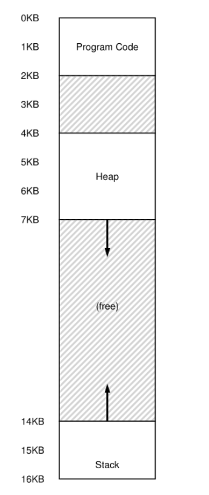

Como vemos, a pesar de que el espacio entre el *stack* y el *heap* no esta siendo usado por el proceso, aun toma memoria fisica cuando reubicamos el *address space* entero en algun lugar de la memoria fisica; por lo que, el enfoque simple de usar registros base-limite es poco economico. Tambien hace dificil ejecutar un programa cuando el *address space* entero no esta en memoria; por lo tanto, base-limite no es tan flexible.

### Segmentacion: Base-Limite Generalizado

La idea de **Segmentacion** es dividir el *address space* de un proceso en **Segmentos Logicos** (*code*, *heap* y *stack*). Cada segmento va a tener su propio registro base-limite en la MMU. Esto permite colocar cada semgmento en distintas partes de la memoria fisica y no tener que reservar todo el *address space* completo. La memoria fisica se usa solo para los segmentos realmente utilizados.

Ejemplo: Asumamos que queremos ubicar el *address space* de la imagen anterior en la memoria fisica. Con un par base-limite por segmento, podemos ubicar cada segmento **Independientemente** uno de otro en la memoria fisica.

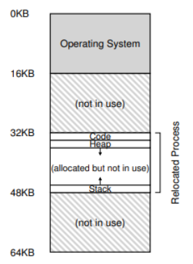

Se puede ver una memoria fisica de 64KB con tres segmentos en ella (hay 16KB reservados para el SO).
<br>Solo la memoria que es usada tiene asignado un espacio en la memoria fisica, y por lo tanto, *address spaces* mas grandes con mas cantidad de *adress space* no usadas (llamados ***Sparse Address Space*** (**Espacios de Direcciones Escasos**)) se pueden acomodar.
<br>Lo que se esper que que la estructura de hardware de nuestra MMU requiera soporte de semgmentacion: En este caso, un conjunto de tres pares de registros base-limites.

| Segmentos | Base  | Tamaño |
| :-------: | :---: | :----: |
|  *Code*   |  32K  |   2K   |
|  *Heap*   |  34K  |   3K   |
|  *Stack*  |  28K  |   2K   |

Cada segmento limite mantiene el tamaño de un segmento.
<br>En la tabla se puede ver que el segmento de codigo fue ubicado en la direccion fisica 32KB y que tiene un tamaño de 2KB, y el segmento del *heap* fue puesto en la direccion 34KB con un tamaño de 3KB. El tamaño del segmento es lo mismo que el registro limite; le dice al hardware exactamente cuantos bytes son validos para ese segmento.

Ejemplo de traduccion, tomando la imagen del ejemplo anterior. Asumamos que se hizo una referencia a la direccion virtual 100 (la cual esta en el segmento del codigo). Cuando la referencia toma lugar, el hardware agrega el valor base al *offset* dentro de ese segmento para llegar a la direccion fisica deseada: 100 + 32KB (32KB = 32768), o 32868. Entonces verificara que la direccion este dentro de los limites (100, 2KB), la encontrara, y emitira una referencia a la direccion de la memoria fisica 32868.
<br>O sea, los pasos generales para traducir una direccion virtual con segmentacion:
1. Identificar el segmento al que pertenece la Direccion virtual (*code*, *heap*, *stack*).
2. Obtener el inicio virtual del segmento (`base_virtual_segmento`).
3. Calcular el *offset* dentro del segmento:

```ini
offset = direccion_virtual - base_virtual_segmento
```

4. Verificar el limite del segmento: Comprobar $offset < limite$.
   * Si no se cumple => *segmentation fault*.
5. Obtener la base fisica del segmento (`base_fisica_segmento`).
6. Calcular la direccion fisica:

```ini
Direccion_Fisica = base_fisica_segmento + offset
```

7. Usar la direccion fisica para acceder a memoria fisica.

Entonces en el ejemplo anterior tenemos que se hizo una referencia a la direccion virtual 100, la cual esta en el segmento del codigo (o sea la base virtual es 0). Sabemos que el limite (tamaño) de `code` es de 2KB (2048) y que la base fisica es de 32 KB (32 * 1024 = 32768).
<br> Entonces el *offset* es igual a la direccion virtual (100) - base virtual (0), tenemos que el offset es 100, como 100 es menor que 2KB (2048) (limite) entonces es valida. Luego para calcular la direccion fisica sumamos la base fisica (32 KB = 32768) mas el offset que calculamos (100), y nos da que la direccion fisica es 32868.

Ahora vemos en una direccion del *heap*, direccion virtual 4200. La base del *heap* es de 34KB (34KB = 34816). Dado que el *heap* comienza en la direccion virtual 4KB (4096) (base virtual), el *offset* de 4200 es realmente es la direccion virtual (4200) menos la base virtual (4096), o sea 104. Como el limite del *heap* es 3KB, entonces el *offset* es valido. Entonces tomamos ese *offset* y se lo sumamos al registro base de la direccion fisica (34KB = 34816) para obtener la direccion fisica deseada: 34920.

### ¿A que Segmento Nos Referimos?

El hardware usa registros de segmentos durante la traduccion. ¿Como sabe cual es el *offset* dentro de un segmento, y a que segmento pertenece una direccion?
<br>Un enfoque, a veces referido como un enfoque **Explicito**, es cortar el *address space* en funcion de los bits superiores de una direccion virutal. En el ejemplo anterior, tenemos tres segmentos; por lo que necesitamos dos bits para lograr nuestra tarea (dos bits ya que se puede contar hasta 4 con esa cantidad; 00, 01, 10, 11). Si usamos los primero dos bits de nuestra direccion virtual de 14 bits para seleccoinar el segmento, nuestra direccion virtual se tendria que ver algo asi:


Si los primeros dos bits son 00, el hardware sabra que la direccion virtual esta en el segmento de *code*, y por lo tanto usara el par base-limite del codigo para reubicar la direccion a la ubicacion fisica correcta. Si los primeros dos bits son 01, el hardware sabra que la direccion es del *heap*. Tomemos del ejemplo la direccion virtual del *heap* (4200) y la traduzcamo. La direccion virtual 4200, en binario, es:

$$
01_{segmento} |  000001101000_{offset}
$$

Los primeros dos bits (01) ke dicen al hardware a que segmento nos estamos refiriendo. Los utlimos 12 bits son el *offset* del segmento: 0000 0110 1000, o 0x068 en hexa, 0 104 en decimal. Sumando el registros base al *offset*, el hardware llega a la direccion fisica final. Notar que el *offset* facilita verificar el limite: Podemos simplemente verificar que el *offset* sea menos que el limite; si no lo es, la direccion es ilegal.

### ¿Que pasa con el *stack*?

El *stack* a sido reubicado en la direccion fisica 28KB en el diagrama anterior, pero con una diferencia: Crece hacia atras. En la memoria fisica, comienza en 28KB y crece hacia atras hasta 26KB, que corresponde a la direccion virtual 16KB a 14KB, por lo que la traduccion tiene que ser diferente.
<br>Lo primero que necesitamos es hardware. En vez de solo valores de base-limite, el hardware tambien necesita saber en que direccion crece el segmento (por ejemplo, un bit, 1 cuando el segmento crezca en direccion positiva o 0 para direccion negativa).

|    Segment     | Base  | Size(max 4K) | Grows positive? |
| :------------: | :---: | :----------: | :-------------: |
| $$Code_{00}$$  |  32K  |      2K      |        1        |
| $$Heap_{01}$$  |  34K  |      3K      |        1        |
| $$Stack_{11}$$ |  28K  |      2K      |        0        |

Ahora que el hardware conoce que segmentos pueden crecer de forma negativa, ahora traduce las direcciones virtuales de forma diferente. Tomamos un ejemplo de direccion virtual del *stack* y la traducimos.
<br>Asumamos que queremos acceder a la direccion virtual 15KB, la cual debe ser mapeada en la direccion fisica 27KB. Nuestra direccion virtual, en binario es 11 1100 0000 0000 (en hexa 0x3C00). El hardware usa los primeros dos bits (11)para designar el segmento, pero entonces estamos dejando un *offset* de 3KB. Para obtener el *offset* negativo, debemos restarle a los 3KB el tamaño maximo del segmento: En el ejemplo, un segmento puede ser de 4KB, por lo que el *offset* negativo es 3KB menos 4KB, lo cual es igual a -1KB. Simplemente sumamos el *offset* negativo a la base (28KB) para llegar a la direccion fisica: 27KB. La verificacion del limite la puede calcular asegurando que el valor absoluto del *offset* negativo es menor o igual que el tamaño del segmento actual (en este caso, 2KB).

### Soporte para compartir

Para guardar memoria, a veces es util **Compartir** ciertos segmentos de memoria entre *address space*. En particular, ***Code Sharing*** es comun.
<br>Para soportar compartir, necesitamos ayuda del hardware, de forma de **Proteccion de Bits**. Un soporte basico agrega pocos bits por segmento, indicando ya sea que un segmento puede o no leer o escribir un segment. Seteando un segmento de codigo como lectura, el mismo codigo puede ser compartido a traves de multiples procesos, sin preocuparnos de dañar el aislamiento; mientras que cada proceso aun cree que esta accediendo a su propia memoria privada, el SO secretamente esta compartiendo memoria que no puede ser modificada por el proceso, y por lo tanto la ilusion se mantiene.

### Segmentacion: Grano Fino vs Grano grueso

En los ejemplos que dimos han sido centrados en sistemas de pocos segmentos (*code*, *heap*, *stack*); podemos pensar que nuestra segmentacion es de **Grano Grueso**, como corta los *address space* en granos de chunks relativamente grandes. Pero, algunos de los primeros sistemas eran mas flexibles y le permitian a los *address space* consistir de un mayor numero de segmentos mas chivos, y se conocia como segmentacionde **Grano Fino**.
<br>Soportar muchos segmentos requiere mas ayuda del hardware con una **Tabla de Segmentos**. Como las tablas de segmentos soportaban la creacion de un numero mas grande de segmentos, entonces esto les permitio al sistema usar de forma mas flexible los segmentos.

### Soporte del SO

De la segmentacion surge un nuevo numero de problemas para el SO. ¿Que debe hacer el SO en un *context switch*? Los registros de los segmentos deben ser guardados y recuperados. Claramente, cada proceso tiene su propio *address space*, y el SO debe asegurarse de iniciar estos registros correctamente antes de permitirle a un proceso ejecutarse nuevamente.
<br>Otro problema es la interaccion del SO cuando un segmento crece o se reduce. Por ejemplo, un programa puede llamar a `malloc()` para guardar un objeto. En algunos casos, el *heap* existente sera capaz de cumplir el requerimiento, y por lo tanto `malloc()` encontrara espacio libre para el objeto y retornara un puntero a el. En otro caso, el segmento *heap* necesitara crecer. En este caso, la libreria de asignacion de memoria hara una *system call* para agrandar el *heap*. El SO entonces proporsionara mas espacio, actualizando el registro del tamaño del segmento por el nuevo tamaño, e informando a la libreria; entonces la libreria puede asignar espacio para el nuevo objeto y retornar exitosamente. Notar que el SO podria rechazar la peticion si no hay mas memoria fisica disponible o si decide que el proceso que la pidio ya tiene demasiada.
<br>El ultimo problema es la gestion del espacio libre en la memoria fisica. Cuando se crea un nuevo *address space*, el SO tiene que ser capaz de encontrar espacio en la memoria fisica para sus segmentos. Antes, asumimos que cada *address space* tenia el mismo tamaño, por lo que la memoria fisica se podia pensar como un puñado de slots donde se podian poner los procesos. Ahora, tenemos un numero de segmentos por proceso, y cada segmento tiene un tamaño diferente.
<br>El problema general es que la memoria fisica se llena de huevos de espacio libre, haciendo dificil la asignacion de memoria a nuevos segmentos, o que crezcan los que ya existen. Este problema es llamado **Fragmentacion Externa**.

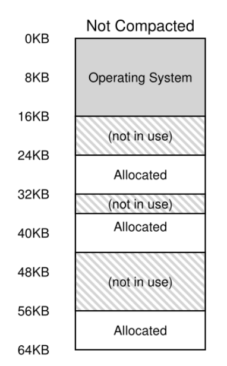

Supongamos que llega un proceso y desea guardar un segmento de 20KB. En la imagen, hay 24KB libres, pero no es un segmento contiguo. Por lo tanto, el SO no puede satisfacer la peticion de 20KB.
<br>Una solucion podria ser **Compactar** la memoria fisica reorganizando los segmentos existentes. Por ejemplo, el SO podria frenar cualquier proceso que se este ejecutando, copiar sus datos en una region contigua de la memoria, cambiar sus valores de los registros del segmento al punto de la nueva ubicacion, y por lo tanto tener una extencion mas grande de memoria libre con la cual trabajar. Pero, compactar sale caro, copiar segmentos usa mucha memoria y una gran cantidad de tiempo de procesador.

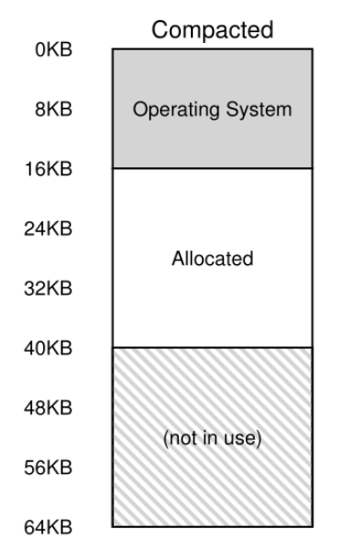
* Ejemplo de memoria compactada.

## Capitulo 17: Gestion de Espacio Libre

El manejo del espacio libre resulta sencillo cuando el espacio esta dividido en unidades de espacio constante; si se solicita espacio solo entregar la primera entrada libre (**Paginacion**). Pero se vuelve dificil al tratar con bloques de espacio libre de diferentes tamaños.

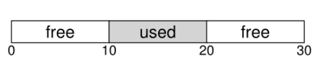

En la imagen se ve un ejemplo de este problema. En este caso, el espacio total disponible es de 20 bytes; desafortunadamente, esta fragmentado en dos *chunks* de 10 bytes cada uno. Como resultado, una peticion por 15 bytes fallara a pesar de que hay 20 bytes libres.

### Suposiciones

Asumiremos una interfaz como la que proporsiona `malloc()` y `free()`. Especificamente `void * malloc(size_t size)` tomoa un solo parametro (`size`), el cual es el numero de bytes pedidos por la aplicacion; y le llega un puntero a la region de ese tamaño. La rutina complementaria `void free(void *ptr)` toma un puntero y libera el chunk correspondiente.
<br>La ***Free List*** es una estructura que contiene referencias a todos los chunks libres del espacio de la region de memoria administrada.
<br>Tambien asimos que nos vamos a centrar en la **Fragmentacion Externa**. Los asignadores tambien tienen problemas de **Fragmentacion Interna**; si un asignador recibe chunks de memoria mas grandes de los que pidio, tal espacio es considerado **Fragmentacion Interna**.
<br>Tambien supondremos que una vez que la memoria es entregada a un cliente no puede ser reubicada en otra ubicacion de la memoria. Una vez que se llama a `mallo()` con memoria dentro del *heap*, esta no puede ser tocada por la libreria hasta que se use `free()`. Por lo tanto, no compacteremos el espacio libre si es posible, lo cual debera ser util para combatir la fragmentacion. La compactacion deberia, sin embargo, ser usada en el SO para tratar con la fragmentacion cuando se implementa **Segmentacion**.
<br>Por ultimo, se supone que el asignado administra una region contigua de bytes.

### Mecanismos de Bajo nivel

#### Division y Fusion
Una *free list* contiene un conjunto de elementos que describen el espacio libre que todavia queda en el *heap*. Por lo tanto, asumamos el siguiente *heap* de 30 bytes:


La *free list* para este *heap* deberia tener dos elementos. Una entrada describe el primer segmento de 10 bytes (bytes 0-9), y otra entrada describe el otro segmento libre (bytes 20-29).


Una petision por cualquier cosa mas grande de 10 bytes va a fallar y rotornara `NULL`; no hay un unico chunk contiguo de memoria disponible de este tamaño. Una peticion para exactamente 10 bytes se podria satisfacer por cualquier chunk libre.
<br>Supongamos que tenemos una peticion de un solobytes de memoria. En este caso, el asignador hara una accion conocida como **Division**: Encontrara un chunk libre de memoria que pueda satisfacer la peticion y lo dividira en dos. El primer chunk lo retornara al que hizo la peticion; y el segundo permanecera en la lista. Por lo tanto, en el ejemplo, si se hace una peticion por 1 byte, el asignador decide usar el segundo de los elementos de la lista para satisfacer la peticion, la llamada a `malloc()` retornara 20 (la direccion de la regoin de 1 byte) y la lista quedara algo asi:

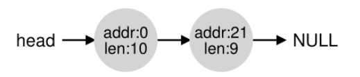

Se puede ver que la lista se mantuvo intacta; el unico cambio es que la region libre ahora comienza en 21, y el largo de esa region ahora es 9. Por lo tanto, **la division es comunmente usada en los asignadores cuando una peticion es menor que el tamaño de algun chunk libre** en particular.
<br> Otro mecanismo usado en muchos asigadores es conocido como **Fusion** del espacio libre. Tomemos el ejemplo del principio (10bytes libres, 10 bytes usados y otrso 10 bytes libres).
<br>Dado este *heap*, ¿Que pasa cuando una aplicacion llama a `free(10)`? Si lo sumamos al espacio libre de nuevo a nuestra lista, terminaremos con una lista como esta:

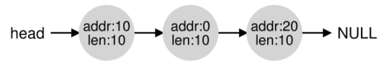

El problema: A pesar de que el *heap* entero esta libre, parece estar dividido en tres chunks de 10 bytes cada uno. Por lo tanto, si el usuario hace una peticion de 20 bytes, no encontrara un chink libre de esas caracteristicas y fallara.
<br>Lo que hacen los asignadores para evitar este problema es **Fusionar** el espacio libre cuando un chunk de memoria es liberado. Cuando retorna un chunk liberado en memoria, mira que esta retornando y a los chunks libres cercanos; si el nuevo espacio libre esta al lado de un (o dos) chunks libres, los ordena en un solo chunk mas grande. Por lo tanto, con la Fusion, nuestra lista seria:


### Rastreando el Tamaño de las Regiones Asignadas

Notar que la interfaz para *free(void *ptr)* no toma por parametro el tamaño; por lo que es asumido por el puntero dado, la libreria `malloc()` puede determinar rapidamente la dimension de la region de memoria a libera y puede incorporar de vuelta en la *free list*.
<br>Muchos asignadores guardan un poco de informacion extra en el *header* del bloque el cual mantiene en la memoria, usualmente justo antes de devolver el chunk de memoria. Veamos un ejemplo:

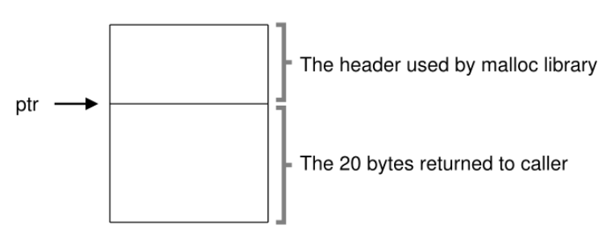

En este ejemplo estamos examinando un bloque asignado de 20 bytes, apuntado por `ptr`; imaginemos que el usuario llamo a `malloc()` y guardo el resultado en `ptr`, o sea, `ptr = malloc(20)`.
<br>El *header* como minimo contiene el tamaño de la region asignada (en este caso 20); y tambien debe contener punteros adicionales para acelerar la desasignacion, un numero magico para proporcionar verificacion de integridad, y otra informacion. Asumamos un *header* simple el cual contiene el tamaño de la region y un numero magico:

```c
typedef struct{
  int size;
  int magic;
} header_t;
```

El ejemplo podria verse algo asi:

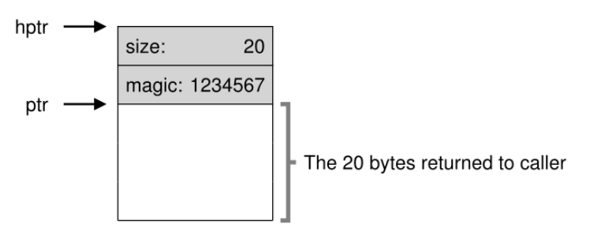

Cuando el usuario llama a `free(ptr)`, la libreria usa un puntero aritmetico simple para descubrir donde comienza el *header*:

```c
void free(ptr){
  header_t *hptr = (header_t *) ptr-1;
  ...
  }
```

Despues de obtener dicho puntero al *header*, la libreria puede determinar facilmente si el numero magico coincide con el valor esperado (`assert(htpr->magic) == 1234567`) y calcular el tamaño total de la region recien liberada por medio de la matematica (o sea, sumando el tamaño del *header* al tamaño de la region). Notar que el tamaño de la region libre es el tamaño del *header* mas el tamaño del espacio asignado por el usuario. Por lo tanto, cuando un usuario pide N bytes de memoria, la libreria no busca un chunk libre de tamaño N si no, busca un chunk libre de tamaño N mas el tamaño del *header*.

Resumen rapido por si no quedo claro el tema del ***Header*** (**Encabezado**). Cuando el asignador (`malloc()`) te da memoria, no te da el bloque solo. En realidad, te da:

```
[ HEADER ]
[ BLOQUE QUE EL PROGRAMA USA ]
```

El *Header* es una estructura (unos poco bytes) que esta justo antes del bloque que recibimos. Sirve para guardar informacion que el sistema necesita. Por ejemplo:
* El tamaño del bloque asinado.
* Si el bloque esta libre o ocupado.
* Un puntero al siguiente bloque.
* etc.

Se guarda el tamaño del bloque para cuando se llama a `free(ptr)` el sistema no sabe cuanto mide el bloque que le estas devolviendo, nosotros solo le pasamos un puntero. Entonces, se necesitar mirar el *header* qye guardo antes para saber.

#### Insertanto una *Free List*

En una lista mas normal, cuando se asigna un nuevo nodo, solo llamamos a `malloc()` cuando necesesitamos espacio para el nodo. Pero, en la libreria de asignacion de memoria, no se puede hacer esto. En cambio, se necesita construir la lista dentro del mismo espacio libre.
<br>Asumamos que tenemos un chunk de memoria de 4096 bytes para administrar (o sea, el *heap* es de 4KB). Para administrar esta *free list*, primero tenes que inicializar dicha lista; inicialmente, la lista deberia hacer una entrada, de tamaño 4096 (menos el tamaño del *header*). La descripcion de un nodo de la lista se veria algo asi:

```c
typedef struct __node_t {
  int size;
  struct ___note_t * next;
} node_t;
```

Estamos asumiendo que el *heap* es construido de algun espacio libre adquirido via una llamada a la *system call* `mmap()`; esta no es la unica forma para construir dicho *heap* pero nos sirve especificamente para este ejemplo. El codigo:

```c
// mmap() returns a pointer to a chunk of free space
node_t *head = mmap(NULL, 4096, PORT_READ|PORT_WRITE,
                    MAP_ANON|MAP_PRIVATE, -1, 0);
head->size = 4096 - sizeof(t);
head->next = NULL;
```

Despues de ejecutar este codigo, el *heap* contiene una *free list* con un solo nodo, de tamaño 4088. El puntero *head* contiene el inicio de la direccion de este rango; vamos a asumir que es 16KB. Visualmente, el *headp* se veria asi:

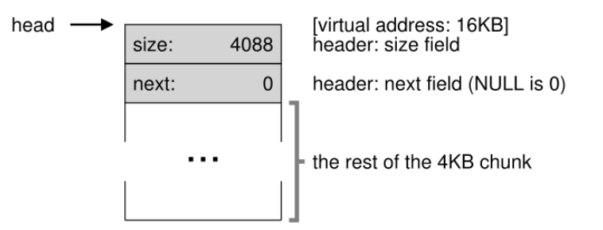

Ahora supongamos que un chunk de memoria es pedido, digamos de tamaño de 100 bytes. Para cumplir con la peticion, la libreria encontrara un chunk de largo suficiente; dado que hay un solo chunk libre (de tamaño 4088), elegira este chunk. Entonces, el chunk sera dividido en dos: Un chunk suficientemente grande para servir a la peticion (mas el *header*), y el resto como chunk libre. Asumamos un *header* de 8 bytes, el espacio en el *heap* ahora se veria asi:

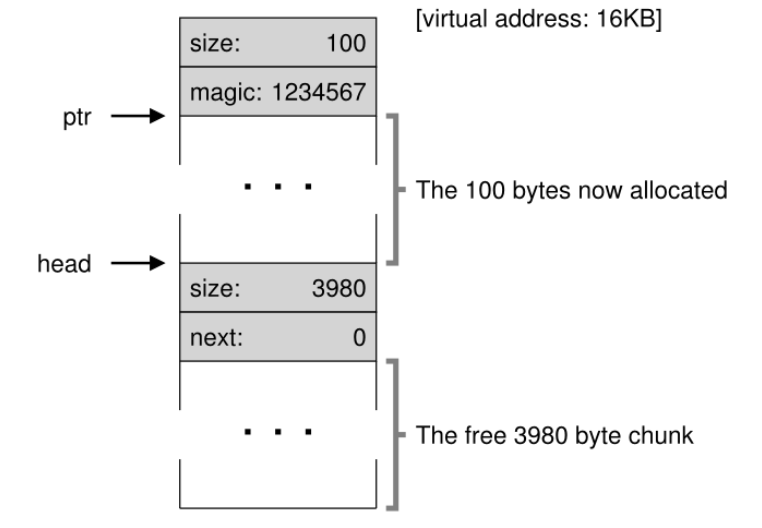

Por lo tanto, por la peticion de 100 bytesm la libreria asignara 108 bytes del existente chunk libre, retornara un puntero a el, escondera la informacion del *header* inmediatamente antes de la asignacion de espacio para el futuro uso de `free()`, y reducira el unico nodo libre en la lista a 3980 bytes (4088-108).
<br>Ahora veamos al *heap* cuando tiene asignada tres regiones, cada una de 100 bytes (108 incluyendo el *header*):

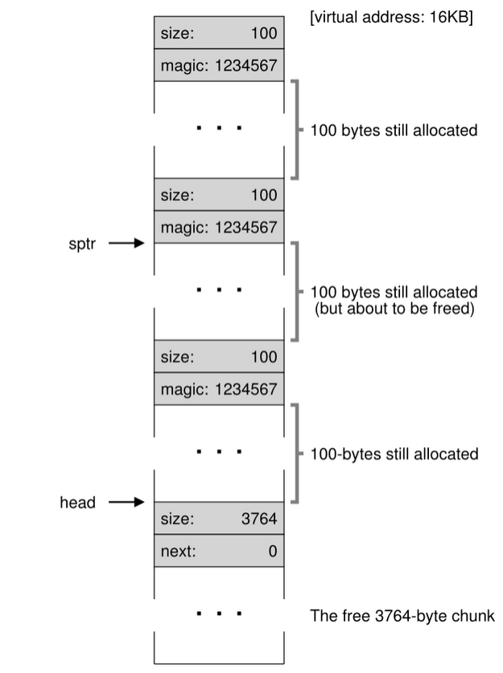

Como vemos, los primeros 324 bytes del *heap* ahora estan asignados, y se puede ver tres *headers* en ese espacio. La *free list* sigue siendo poco interesante: Tiene un solo nodo (siendo apuntado por *head*), pero ahora solo tiene 3764 bytes de tamaño despues de las tres divisiones.
<br> Si el programa devuelve memoria usando `free()`, entonces la aplicacion devuelve medio chunk de memoria asignada, llamando a `free(16500)` (se llega al valor 16500 sumando el inicio de la region de memoria, 16384, a los 108 del chunk anterior y los 8 bytes del *header* de ese chunk). Este valor esta apuntado por `sptr` en el diagrama anterior.
<br>La libreria inmediatamente se da cuenta del tamaño de la region libre, y entonces agrega el chunk libre de nuevo en la *free list*. Asumiendo que lo insertamos en el *head* de la *free list*, el espacio ahora luciria asi:

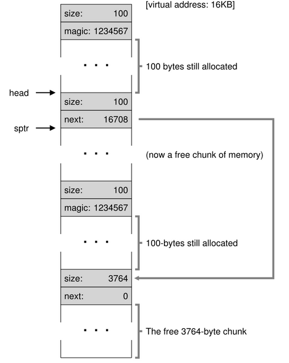

Tenemos una lista que empieza con un chunk libre pequeñ (100 bytes apuntados por el *head* de la lista) y un chunk libre grande (3764 bytes). Nuestra lista finalmente tiene mas de un element.
<br>Un ultimo ejemplo: Asumamos que los ultimos dos chunks que estan en uso son liberados. Sin fusion, terminariamos con fragmetacion:

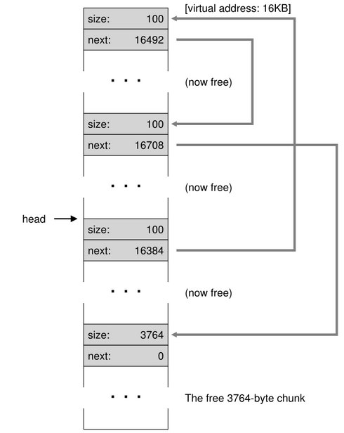

Como se puede ver, tenemos mucho desorden ya que nos olvidamos de **Fusionar** la lista. A pesar de que toda la memoria esta libre, esta cortado en piezas, por lo tanto aparenta ser una memoria fraccionada y no una sola.

#### Agregando el *Heap*

¿Que deberiamos hacer si el *heap* no alcanza para el espacio? El enfoque mas facil seria fallar. En algunos casos es la unica opcion, y por lo tanto retornar `NULL`.
<br>Los asignadores mas tradicionales inician con un *heap* chico y piden mas memoria al SO cuando la necesitan. Esto significa que hacen algun tipo de *system call* (por ejemplo, `sbrk`) para agrandar el *heap*, y entonces asignar los nuevos chunk ahi. Para satisfacer la peticion `sbrk`, el SO encuentra paginas fisicas libres en el *address space* del proceso que hizo la peticion, y entonces retorna el valor del final del nuevo *heap*; en este punto, un *heap* mas grande esta disponible, y la peticion puede ser atendida satisfactoriamente.

### Estategias Basicas

El asignador ideal es rapido y minima la fragmentacion. Pero, dado que la cadena de asignacion y liberaciones puede ser arbitraria, cualquier estrategia particular puede ser mala dado una mala sucesion de entradas.

1. #### *Best Fit*

Se busca a traves de la *free list* al bloque libre mas **Pequeño** de los espacios iguales o superiores al solicitados. Al hacer de una busqueda **Exhaustiva** en la *free list*, genera una penalizacion de *perfomance*, y una fragmentacion en espacios libres pequeños.

2. #### *Workst Fit*

Se busca al bloque mas **Grande** disponible, se usa el espacio necesario, y se devuelve lo restante a la *free list*. Genera los mismos ***Overheads*** al realizar tambien una busqueda **Exhaustiva** (fragmentando esta vez en bloques libres grandes).

3. #### *First Fit*

Usa el **Primer** bloque de la lista lo suficientemente grande para cumplir con lo solicitado. Su ventaja es la **Velocidad** ya que evita realizar una busqueda exhaustiva, pero "**Contamina** el **Comienzo** de la *free list* al concentrar alli la fragmentacion en bloques pequeños.

4. #### *Next Fit*

Igual que *First Fit* pero utiliza un puntero que le permite comenzar la busqueda desde la **Ultima Posicion** revisada la vez anterior. Desparrama la Fragmentacion a lo largo de la *free list* y mantiene la **Velocidad** del enfoque anterior, pero requiere un puntero extra en la implementacion.

#### Ejemplos

Supongamos una **free list** con tres elementos, de tamaño 10, 30 y 20 (se ignoran los *headers* y otros detalles):


Asumamos una peticion de asignacion de tamaño 15. Un enfoque *Best Fit* buscaria en la lista entera y encontraria que 20 es el *Best Fit*, ya que es el menor espacio libre que puede servir para la peticion. El resulstao de la Free List:


Como se ve, queda un chunk libre pequeño. Un enfoque *Workst Fit* es similar pero en cambio busca el chunk mas grande, en el ejemplo seria 30. La lista resultante:


*First Fit*, en este ejemplo, hace lo mismo que *Workst Fit*, encontrar el primer bloque libre que pueda satisfacer la peticion. La diferencia es en el costo de la busqueda.

### Otros Enfoques

#### Listas Segregadas

Se utiliza en aplicaciones que tengan peticiones recurrentes de tamaño similar, se crea una lista para el manejo de objetos de ese tipi, y se envian las demas epticiones al *allocator* general. La fragmentacion es mejor y los pedidos de dicho tamaño se satisfacen rapido.
<br>Por ejemplo, el *Slab Allator* asigna un numero de *Object Caches* para objetos del kernel que se solicitan seguido. Si le falta espacio pide mas *slabs* (bloques pequeños) de memoria. Este *allocator* tambien mantiene los *free objects* de las listas en un estado pre inicializado.

#### *Buddy Allocation*

La memoria libre es pensada como un gran espacio de tamaño $2^{N}$. Caundo se hace una peticion de memoria, la busqueda de espacio libre recursivamente divide el espacio libre en dos hasta que encuentra un bloque suficientemente grande para acomodar la peticion. En Este punto, el bloque pedido es retornado al usuario. Un ejemplo de un espacio libre siendo dividio en la busqueda de un bloque de 7KB:

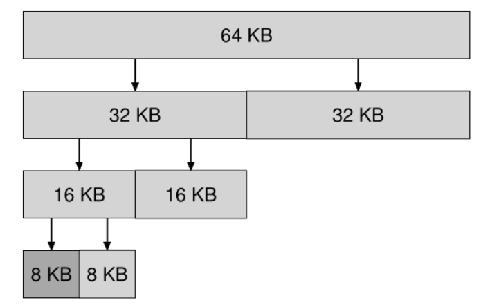

Se ve que el bloque de 8KB de mas a la izquierda es asignado y retornado al usuario; notar que este esquema sufre de **Fragmentacion Interna**, dado que solo puede dar bloques de tamaño multiplo de potencias de dos.
<br>Cuando un bloque se libera se chequea que su "*Buddy*" del mismo tamaño este libre, si lo esta los combina, y asi recursivamente hasta hacer *coalescing* de todo o encontrar un "*Buddy*" en uso; simplifica el *coalescing* pero genera Fragmentacion Interna.

## Capitulo 18: Introduccion a la Paginacion

El SO toma uno de dos enfoques para resolver casi cualquier problema de administracion de espacio. El primero es cortar el espacio en piezas de **tamaño variable**, como vimoes con la **Segmentacion**. Pero, esta solucion tiene problemas. En particular, cuando divide un espacio en chunks de diferentes tamaños, el mismo espacio se **Fragmenta**, y por lo tanto las asignaciones son mas dificiles.
<br>Por lo que, se debe considerar un segundo enfoque: Cortar el espacio en piezas de **tamaño fijo**. Esta idea es llamada **Paginacion**. En vez de dividir el *address space* de un proceso en segmentos logicos de tamaño variable (por ejemplo, *code*, *heap*, *stack*), lo dividimos en unidades de tamaño fijo, que las llamaremos **Paginas**. Vemos a la memoria fisica como un *array* de slots de tamaño fijo llamados ***Page Frames***; cada uno de esos *frames* puede contener una sola pagian de memoria virtual.

### Ejemplo y Descripcion General

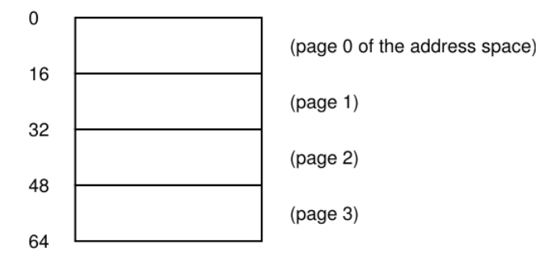

Se presenta un *address space* de 64 bytes de tamaño total, con cuatro paginas de 16 bytes.

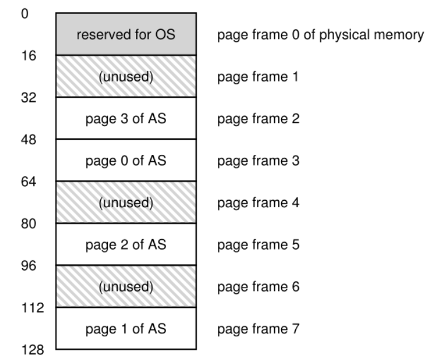

Como vemos, la memoria fisica tambien contiene numero de *slots* de tamaño fijo, en este caso 8 *pages frames* (haciendo una memoria de 128 bytes). Las paginas del *addres space* virtual ha sido ubicado en diferentes lugares a lo largo de la memoria fisica; el diagrama tambien muestra el SO usando algo de memoria fisica para el mismo.

Las ventajas de la Paginacion son:
* **Flexibilidad**: Es capaz de apoyar la abstraccion del *address space* eficientemente, mas alla de como el proceso use el *address space* (por ejemplo, no se asume la direccion de crecimiento del *heap*/*stack* o como son usados).
* **Simplicidad**: Permite manejar el espacio libre (la *free list*) tan solo otorgando la cantidad de paginas necesarias (y evitando la fragmentacion externa). Tomando el ejempo anterior, cuando el SO quiere ubicar en el *address space* de 64 bytes en nuestra memoria fisica de 8 paginas, es facil encontrar 4 paginas libres; dado que el SO mantiene una *free list* de todas las paginas libres, el SO tiene ubicada la pagina virtual 0 del *address space* en el *frame* fisico 3, la pagina virtual 1 del *address space* en el *frame* fisico 7, la pagina 2 en el *frame* 5, y la pagina 3 en el frame 2. Los *pages frames* 1, 4 y 6 estan libres.

Para recordadr donde esta ubicada cada pagina virtual del *address space* en la memoria fisica, el SO mantiene una estructura de datos conocida como ***Page Table*** por proceso. El rol principal de la *page table* es guardar las traducciones de direcciones para cada pagina virtual del *address space*. En nuestro ejemplo, la *page table* deberia tener las siguientes cuatro entradas:

(*Virtual Page* 0 &rarr; *Physical Frame* 3), (VP 1 &rarr; PF 7), (VP 2 &rarr; PF 5), y (VP 3 &rarr; PF 2)

Imaginemos que el proceso con el **address space** anterior (64 bytes) esta haciendo un acceso a memoria.

```assembly
movl  <virtual address>,  %eax
```

Especificamente, prestemos atencion a la carga explicita de los datos de la direccion `<virtual address>` en el registro `eax`.
<br>Para **Traducir** esta direccion virtual que genero el proceso, primero tenemos que dividirla en dos componentes: El **Numero de Pagina Virtual** (***Virtual Page Number***) (**VPN**), y el **Offset** en la pagina. Para este ejemplo, dado que el *address space* es de 64 bytes, necesitamos 6 bits en total para nuestra direccion virtual ($2^{6}=64$). Por lo tanto, nuestra memoria virtual puede ser conceptualizada asi:

|  Va5  |  Va4  |  Va3  |  Va2  |  Va1  |  Va0  |
| :---: | :---: | :---: | :---: | :---: | :---: |

Va5 es el bit mas significativo de la direccion virtual, y Va0 es el bit menos significativo. Dado que sabemos el tamaño de la pagina (16 bytes), podemos dividir la direccion virtual asi:

|  Va5  |  Va4  |   Va3    |   Va2    |   Va1    |   Va0    |
| :---: | :---: | :------: | :------: | :------: | :------: |
|  VPN  |  VPN  | *offset* | *offset* | *offset* | *offset* |

El tamaño de la pagina es de 16 bytes en un address space de 64 bytes; por lo que necesitamos ser capaces de seleccionar 4 paginas, y los primeros 2 bits de la direccion hacen justamente eso. Por lo tanto, tenemos una VPN de 2 bits. Los bits restantes nos dicen en que bytes de la pagina estamos interesados, 4 bits en este caso; esto lo llamos *offset*.
<br>Cuando un proceso genera una direccion virtual, el SO y el hardware deben comunicarse para traducirla en una direccion fisica. Por ejemplo, asumamos que la carga anterior es la direccion virtual 21:

```assembly
movl  21,  %eax
```

Pasanod 21 a binario, tenemos 010101, y por lo tanto podemos examinar esta direccion virtual y ver como se descompone en Numeros de Pagina Virtual (VPN) y *offset*:

|   0   |   1   |    0     |    1     |    0     |    1     |
| :---: | :---: | :------: | :------: | :------: | :------: |
|  VPN  |  VPN  | *offset* | *offset* | *offset* | *offset* |

Por lo tanto, la direccion virtual 21 esta en el quinto byte (0101) de la pagina 01. Con nuestra VPN, podemos indexar nuestra *page table* y encontrar en que *frame* fisico recide la pagina virtual 1. En la *page table* de arriba el **Numero de Frame Fisico** (***Physical Frame Number***) (**PFN**) o **Numero de Pagina Fisica** (***Physical Page Number***) (**PPN**) es 7 (111). Por lo tanto, podemos traducir esta direccion virtual reemplazando el VPN con el PFN y entonces emitir la carga de memoria fisica.

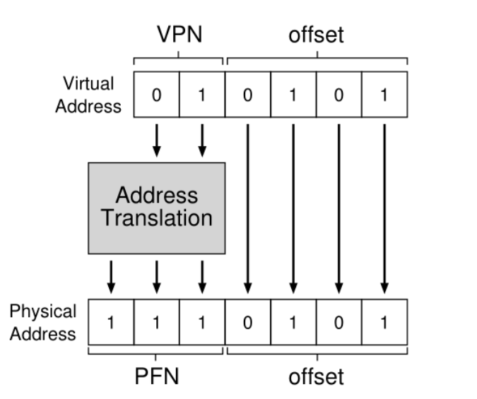

Notar que el *offset* se mantiene igual (o sea, no se traduce), ya que el *offset* solamente nos dique **que bit dentro de la pagina queremos**.

### ¿Donde se Guardan las *Pages Tables*?

Las *Pages Tables* son terriblemente grandes, por lo que no mantenemos ningun hardware especial en el chip en la MMU para guardar la *page table* de un proceso en ejecucion. En cambio, guardamos la *page table* de cada proceso en algun lugar de la memoria. Asumamos por ahora que las *page table* viven en la memoria fisica que administra el SO.

### ¿Que Hay Realmente en una *Page Table*?

Las *Pages Tables* son estructuras de datos usadas para mapear las direcciones virtuales a direcciones fisicas. Al ser muy largas y muchas (cada una tiene muchas ***Page Table Entry*** (**PTE**); una VPN de 20 bits, por ejemplo, implica $2^{20}$ traducciones) no se almacenan en la MMU, si no directamente en la memoria.

#### Organizacion
La mas simple es *Linear Page Table*; la *page table* es vista como un *array* el cual se indexa con el VPN y se busca el PTE (entrada en la *page table*) de dicha indexacion para encontrar el PFN.

Cada PTE tiene algunos bits importantes:
* ***Valid Bit***: Permite reservar *address space* al marcar paginas como invalidas, evitanto tener que asignarles memoria (por ejemplo, el espacio aun no solicitado entre el *code*/*heap* y el *stack* de un proceso al momento de crearlo).
* ***Protection Bits***: Indican si una pagina puede ser leida, escrita o ejecutada.
* ***Present Bit***: Indica si se encuentra en memoria fisica o en disco.
* ***Dirty Bit***: Indica si una pagina ha sido modificada desde que fue traida a memoria.
* ***Accessed Bit*** ("*Reference*"): Indica si la pagina ha sido accedida (util para determinar paginas populares que debe ser mantenida en memoria).

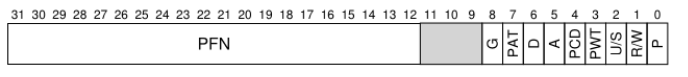
* En la imgaen se de la PTE, donde ***P*** = *Present Bit*, ***R/W*** = *Allowed Read/Write*, ***U/S*** = *Allowed Access to User-Mode Processes*, ***PWT/PCD/PAT/G*** = *Hardware Catching*, ***A*** = *Accesed*, ***D*** = *Dirty*, ***PFN***.

Notar que diferentes procesos (y diferentes VPN) pueden apuntar a una misma pagina (direccion) fisica (lo que reduce el numero de paginas fisicas en uso). Para esos casos, puede haber un bit ***G*** que indica si la pagina es compartida globalmente entre mas de un proceso.

Tanto el *Valid Bit* como los *Protection Bit* pueden lanzar una *trap* en caso de intentar acceder a la pagina cuando no se deberia poder hacerlo.

### Rapidez y Paginacion

La paginacion requiere que se realice una referencia a memoria extra para buscar la traduccion de la *page table* (de virtual a fisica, de la VPN a PTE y luego a PFN), lo cual es costoso, y dado el tamaño de las *pages tables*, se relentiza demasiado el sistema.
<br>Cuando corre, cada instruccion fetcheada genera dos referencias de memoria; una a la *page table* para encontrar el *Physical Frame* en la que la instruccion reside, y otra a la instruccion en si misma para poder fetchearla hacia la CPU.

## Capitulo 19: Traducciones Mas Rapidas: TLB

La paginacion requiere un gran mapeo de informacion, el cual normalmente esta almacenado en memoria fisica, y la paginacion requiere una busqueda extra para cada direccion virtual generada por los procesos. Ir a memoria por la traduccion antes de cada instruccion hace perder al CPU demasiado ciclos de clock en espera.
<br>Para aumentar la velocidad de la traduccion de las direcciones, el SO se apoya en el hardware; usa una parte del chip MMU llamada ***Translation-Lookaside*** o **TLB**, el cual es una **Cache** de traduccion de direcciones virtuales a fisicas, y por esto la llamamos ***Adress-Translation Cache***.
<br>Cada vez que hay una referencia virtual a memoria, el hardware primero revisa la TLB para ver si la traduccion esta ahi y, si esta, la traduccion es realizada rapidamente sin necesidad de acceder a la *page table* y causar un cuello de botella en el *pipeline* del CPU.

### Algoritmo Basico de la TLB

Supongamos una *page table* y un TLB manejado por el hardware. El algoritmo consiste en:
1. Extraer el VPN de la direccion virtual y revisar si el TLB tiene la traduccion para este VPN.
2. Si lo tiene (***TLB Hit***), obtiene el PFN de la ***TLB entry***, la concatena al *offset* de la direccion virtual original, y consigue la direccion fisica deseada para acceder a memoria (mientras que los chequeos de proteccion no fallen).
3. Si no tiene la traduccion (***TLB Miss***), el hardware accede a la *page table* para encontrar la traduccion y, asumiendo que la direccion virtual es valida y accesible, la sube a la TLB. La proxima vez que se busque esa traduccion, va a ser *TLB hit* y se ejecutara rapido.

#### Ejemplo: Accediendo a un *Array*

Vamos a asumir que tenemos un *array* de 10 enteros de 4 bytes en la memoria, comenzando en la direccion virtual 100. Asumamos tambien que tenemos un espacio de direcciones chico de 8 bits, con paginas de 16 bytes; por lo tanto una direccion virtual tiene una VPN de 4 bits ($2^{4}$ (VPN)$= 16$ (*pages*)) y un *offset* de 4 bits (hay 16 bytes en cada una de estas paginas).


En el diagrama se ve el *array* en las 16 paginas de 16 bytes del sistema. Ademas se ve que la primera entrada del *array* (`a[0]`) inicia en (VPN = 06, *offset* = 04): solo tres enteros de 4 bytes entrar en esa pagian. El *array* continua en la siguiente (VPN = 07), donde esta las primeras cuatro entradas (`a[3]` ... `a[6]`). Finalmente, las ultimas tres entradas de las diez del *array* (`a[7]` ... `a[9]`) estan localizadas en la siguiente pagina del *address space* (VPN = 08).
<br>Ahora consideremos un loop simplre que accede a cada elemento del *array*:

```c
int sum = 0;
for (i = 0; i < 10; i++) {
  sum += a[i];
}
```

Para simplificar, supongamos que los unicos accesos a memoria que genera este loop son al *array*. Cuando se accede al primer elemento del *array* (`a[0]`), la CPU vera una carga a la direccion virtual 100. El hardware extra el VPN de la direccion (VPN = 06), y lo usa para verificar el TLB para una traduccion valida. Asumiendo que es la primera vez que el programa accede al *array*, el resultado sera un ***TLB Miss***.
<br>EL siguiente acceso es a `a[1]`, sera un ***TLB Hit***. Dado que el segundo elemento del *array* esta empaquetado al lado del primero, vive en la misma pagina y dado que ya accedimos a la primera pagina entonces la trauccion ya esta cargada dentro del TLB. Acceder a `a[2]` encuentra otro ***TLB Hit***, dado que vive en la misma pagina que `a[0]` y `a[1]`.
<br>Pero, cuando el programa acceda a `a[3]`, nos encontramos con otro ***TLB Miss***. Sin embargo, una vez mas, las siguientes entradas (`a[4]` ... `a[5]`) seran un ***TLB Hit***, dado que todas viven en la misma pagina en la memoria.
<br>Finalmente, acceder a `a[7]` causa un ultimo ***TLB Miss***. Los ultimos dos accesos (`a[8]` y `a[9]`) reciben los beneficios de la actualizacion del TLB, causando dos ***TLB Hit***.

En resumen, durante los 10 accesos a memoria del *array* tenemos: 3 ***TLB Miss*** y 7 ***TLB Hit***. Por lo que, nuestro ***TLB Hit Rate*** (numero de *hits* devidido el numero total de accesos) es 70%. La TLB se beneficia de la ***Spatial Locality*** (que los elementos estan cercas uno de otros) y, si el programa se vuelve a ejecutar rapidamente se beneficia de ***Temporal Locality*** (la rapida re-referenciacion a items en memoria en el tiempo) ya que todavia formaran parte de la TLB y volverian ser *hits*.
<br>Obviamente, ante mayor sea el tamaño de las paginas o de la TLB, mayor porcentaje de ***TLB hit*** se genera y mayor se aprovechan estas localidades.

### Manejo de los *TLB Miss*

Antes, los *TLB miss* eran manejados por el hardware. En sistemas modernos son manejados por el software, usando un ***Software-Managed TLB***; en un *miss* el hardware solo levanta una excepcion que pausa el flujo de instrucciones, eleva el privilegio a modo kernel, salta al ***Trap Handler***, busca la traduccion en la *page table*, y actualiza la TLB con sitrucciones privilegiadas, para luego volver de la *trap* y que el hardware re-ejecute la ejecucion.
<br>El *return from trap* luego de un *TLB miss* debe volver a ejecutar la misma instruccion que causo el *miss* para esta vez dar *hit*, a diferencia del *return from trap* normal que ejecuta la siguiente instruccion (el PC es diferente en cada caso).

El SO debe tener cuidado de no causar un loop de *TLB misses* (por ejemplo, el *trap handler* se encuentra en una memoria virtual no cacheada en la TLB), y para esto tiene diversas estrategias que puede usar. La prinicipal ventaja de que el *TLB miss* sea manejado por software son su **Simplicidad** y **Flexibilidad**; se puede implementar cualquier estructura de datos que se necesite sin requerir un cambio en el hardware.

### Contenido de la TLB

Un TLB tipico debe tener 32, 64 o 128 entradas y debe ser lo que se llama **Completamente Asociativo**. Basicamente, esto significa que cualquier traduccion dada puede estar en cualquier lugar del TLB, y el hardware debe buscar en todo el TLB en paralelo para encontrar la traduccion deseada. La entrada de TLB se ve algo asi:

|  VPN  |  PFN  | *other bits* |
| :---: | :---: | :----------: |

Entre esos *Other Bits* suele incluirse:
* ***Valid Bit*** que indica si una entrada tiene una traduccion valida para esa direccion de memoria virtual o no.
* ***Protection Bits R/W/X*** que determinan si se puede acceder a una pagina (*read*, *write*, *excecute*).
* ***Address Space Identifier***.
* ***Dirty Bit***.
* Y otros.

Notar que el *TLB entry* (PTE) el *valid bit* es diferente al *valid bit* de la *page table*, el cual marcaba que una *page table* no ha sido asignada (*allocated*) por el proceso y no debe ser usada por ningun programa.

### Problema con TLB: *Context Switch*

El TLB contiene traducciones virtuales a fisicas que son validas solo para el proceso actual; esas traducciones no son significativas para otros proceso. Como resultado, cuando cambiamos de un proceso a otro, el hardware, o el SO (o ambos) deben ser tener cuidado que el proceso que se esta por ejecutar no use accidentalemte traducciones de algun proceso previo.
<br>Ejemplo, cuando un proceso (P1) se esta ejecutando, se asume que el TLB esta guardando en cache las traducciones que son validas para P1, o sea, vienen de la *page table* de P1. Asumamos que la decima pagina virtual de p1 es mapeada al *frame* fisico 100.
<br>Asumamos que existe otro proceso (P2), y que el SO decide hacer un *context switch* y ejecutarlo. Asumamos que la decima pagina virtual de P2 es mapeada al *frame* fisico 170. Si las entradas de ambos procesos estan en la TLB, el contenido de la TLB seria:

|  VPN  |  PFN  | valid | prot  |
| :---: | :---: | :---: | :---: |
|  10   |  100  |   1   |  rwx  |
|  --   |  --   |   0   |  --   |
|  10   |  170  |   1   |  rwx  |
|  --   |  --   |   0   |  ---  |

VPN 10 se traduce a PFN 100 (P1) y PFN 170 (P2), pero el hardware no puede distringuir que entrada es significativa para que proceso. Cuando se produce un *context switch* entre procesos, las traducciones en la TLB para el ultimo proceso no son significativas para el proceso a punto de ejecutarse.
<br>Para solucionar este problema, un enfoque es limpiar la TLB en un *context switch*, se setean todos los bits validos a 0.
<br>Esta solucion funciona. Pero, tiene un costo: Cada vez que un proceso se ejecuta, debe incurrir en el *TLB miss* si toca sus datos y paginas de codigo. Si el SO cambia entre procesos frecuentemente, el costo sera alto.
<br>Para reducir el costo, los sistemas agregan soporte de hardware para permitiri compartir el TLB a traves de los *context switch*. Especificamente, se provee un campo ***Adress Space Identifier*** (**ASID**) (**Identificador de Espacio de Direcciones**) en el TLB.
<br>Si tomamos el ejemplo anterior y le agregamos el ASID:

|  VPN  |  PFN  | valid | prot  | ASID  |
| :---: | :---: | :---: | :---: | :---: |
|  10   |  100  |   1   |  rwx  |   1   |
|  --   |  --   |   0   |  --   |  --   |
|  10   |  170  |   1   |  rwx  |   2   |
|  --   |  --   |   0   |  --   |  --   |

Por lo tanto, con los ASIDs podemos mantener traducciones de diferentes procesos al mismo tiempo sin confundirlos.
<br>Hay otro caso donde dos entradas del TLB son similares. Si hay dos entradas para dos procesos diferentes con dos diferentes VPN que apuntan a la misma pagina fisica:

|  VPN  |  PFN  | valid | prot  | ASID  |
| :---: | :---: | :---: | :---: | :---: |
|  10   |  101  |   1   |  rwx  |   1   |
|  --   |  --   |   0   |  --   |  --   |
|  50   |  101  |   1   |  rwx  |   2   |
|  --   |  --   |   0   |  --   |  --   |

En este caso puede surgir cuando dos procesos comparten una pagina. En el ejemplo, el proceso 1 esta compartiendo la pagina fisica 101 con el proceso 2; P1 mapea esta pagina en la decima pagina de su *address space*, y P2 mapea la Quincuagésimo (50) pagina de su *address space*.

### Problema: Politica de Reemplazo

La memoria cache son veloces pero pequeñas. Si para insertar una nueva entrada en la TLB es necesario reemplazar una vieja, se debe elegir una politica para realizar ese ***Cache Replacement***. La idea siempre es bajar el porcentaje de *TLB miss*; puede elegirse borrar la que mas tiempo lleva sin usarse (**LRU**: ***Least Recently Used***) para tratar de mantener la localidad temporal, o simplemente borar una *Aleatoria*, que no presenta casos borde como LRU (por ejemplo, ante un recorrido en loop de un *array* que no entre en la TLB).

## Capitulo 20: Tablas de Paginacion Mas Pequeñas

Un problema ya mencionado es que las *page tables* ocupan mucho espacio en memoria, y cada proceso tiene su *page table*. La idea es administrar la memoria de manera mas eficiente, reduciendo el *overhead* de mantener una sola gran *page table*.

### Solucion Simple: Paginas Mas Grandes

Una forma facil de resolverlo seria usando paginas mas grandes, pero estas generarian un gran desperdicio de espacio dentro de las paginas cuando un proceso requiere de poca memoria, llevando a **Fragmentacion Interna**.

### Enfoque Hibrido: Paginas y Segmentos

La idea es combinar Paginacion y Segmentacion. Se puede ver que esto funciona examinando una *page table* lineal. Asumamos que tenemos un *address space* en el cual las porciones de *heap* y *stack* usadas son chicas. Por ejemplo, usamos un *address space* de 16KB con 1KB de paginas:

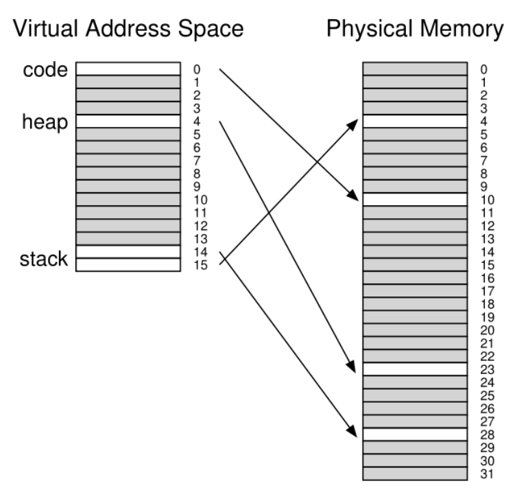

La *page table* para este *address space* es:

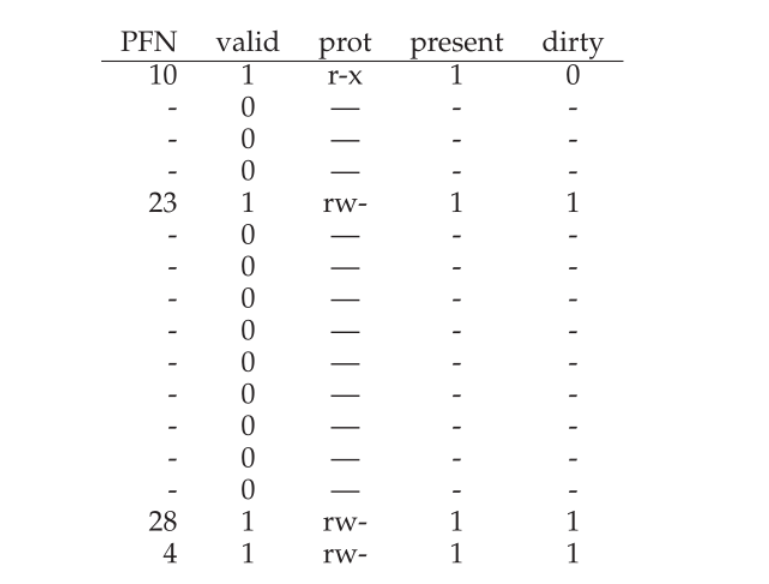

Se asume que la unica pagina de codigo (VPN 0) esta mapeada a la pagina fisica 10, el *heap* de una sola pagina (VPN 4) a la pagina fisica 23, y el *stack* de dos paginas en el otro extremo del *address space* (VPN 14 y 15) estan mapeadas a la pagina fisica 28 y 4 respectivamente. Como se puede ver gran parte de la *page table* esta sin usar, llena de entradas invalidas.
<br>Por lo tanto, el enfoque hibrido: En vez de tener una sola *page table* para el *address space* entero del proceso, ¿Porque no tener una por cada segmento logico? En ele ejemplo, se podrian tener tres *pages table*, una para el *1*, otra para el *stack* y una ultima para el *heap*.
<br>Pero en Segmentacion tenemos un registro base que nos dice donde vive cada segmento en la memoria fisica, y un registro limite que nos dice el tamaño de cada segmento. En el enfoque hibrido, seguimos teniendo esa estructura en la MMU, la diferencia, es que aca usamos la base para mantener el *address space* de la *page table* de cada segmento. El limite es usado para indicar el final de la *page table* (osea, cuantas paginas validas tiene).

Ejemplo, asumamos un *address space virtual* de 32 bits con 4KB de paginas, y un *address spaces* dividido en cuatro segmentos. Solo usaremos tres segmentos para el ejemplo, *code*, *stack* y *heap*.
<br>Para determinar a que segmento se refiera una direccion usaremos los primeros dos bits del *address space*. Asumamos que el 00 es el segmento sin usar, el 01 para el *code*, el 10 para el *heap*, y el 11 para el *stack*. Por lo que, una direccion virtual se veria algo asi:

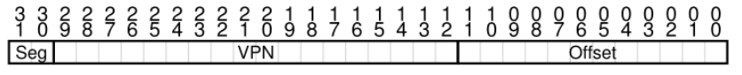

Asumamos que en el hardware hay tres pares de base-limite una para cada una de las partes (*code*, *heap*, *stack*). Cuando un proceso se esta ejecutando, el registro base de cada uno de esos segmentos contiene la direccion fisica de una *page table* lineal para cada segmento; por lo que, cada proceso en el sistema ahora tiene tres *page tables* asociadas. En un *context switch*, estos registros deben ser cambiados para reflejar la ubicacion de las *page tables* de nuevos procesos.

La diferencia mas importantes en el esquema hibrido es la presencia del registro limite por segmento; Cada registro limite mantiene el valor de la cantidad maxima de pagina valida en el segmento. Por ejemplo, si en el segmento del codigo esta usando las primeras tres paginas (0, 1 y 2), la *page table* del segmento del codigo tendra solo tres entradas y el registro limite sera seteado en 3; los accesos a memoria mas alla del final del segmento generaran una excepcion y se terminara la ejecucion del proceso.
<br>Pero, notar que este enfoque tambien tiene problemas.
* Requiere el uso de segmentacion; la segmentacion no es tan flexible, ya que asume un patron de uso del *address space*; si tenemos un *heap* grande pero poco usado, aun podemos terminar con una gran cantidad de desperdicion de *page table*.
* Causa Fragmentacion Externa.

### *Page Tables* Multinivel

Este enfoque no usa Segmentacion. Este enfoque lo llamamos ***Page Table MultiNivel***, convierte la *page table* lineal en algo parecido a un arbol.
<br>Primero, se divide la *page table* en unidades de tamaño de una paginas; entonces, si una pagina entera de una PTE es invalida, no asignamos esa pagina a la *page table*. Para rastrear si una pagina de la page table es valida o no, usamos una nueva estructura, llamada ***Page Directory***. La *Page Directory* puede ser usada para que nos diga donde esta una pagina de la *page table* o si toda la pagina de la *page table* contiene paginas no validas.

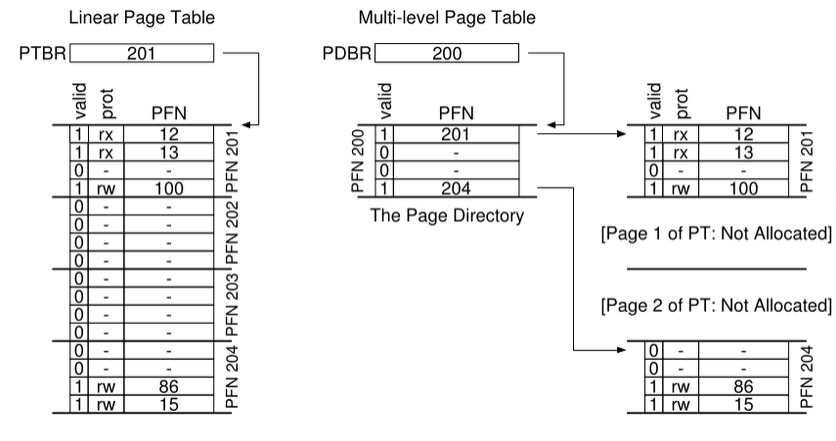

A la izquierda hay una *page table* lineal; aunque mas de la mitad de las regiones no son validas, aun necesita un espacio de la *page table* para esas regiones. A la derecha hay una *page table multinivel*. La *page directory* marca solo dos paginas de la *page table* como validas; por lo que, solo esas dos paginas de la *page table* estan en la memoria.
<br>La *page directory* contiene una entrada para cada pagina de la *page table*. Consiste de un numero de ***Page Directory Entry*** (**PDE**). Una PDE tiene un ***Valid Bit*** y un PFN. Pero, el significado del *valid bit* es diferente: Si la PDE es valida, significa que al menos una de las paginas a las que apunta la *page* es valida, o sea, en al menos una PTE de la pagina apuntada por esa PDE, el *valid bit* esta seteado en uno. Si la PDE no es valida, del resto de los PDE no estan definidos.

La *Page Tables MultiNivel* tiene algunas ventajas sobre los enfoques anteriores:
* La pagina multinivel solo asigna espacio de *page table* en proporcion a la cantidad de *address space* que estes usando; por lo que es compacta y soporta *address spaces* poco usado.
* Cada porcion de la *page table* encaja perfectamente dentro de una pagina, haciendo facil de manejar la memoria.

Notar que tiene un costo; en un *TLB miss*, se necesitara dos cargas de memoria; primero al *page directory* y luego a la *page table*. Esto es un ejemplo de ***trade off***, ganamos memoria pero perdemos mucho mas tiempo en un *TLB miss*.

### Ejemplo Detallado

Imaginemos un *address space* de 16KB, con paginas de 54 bytes. Por lo que tenemos un *addres space virtual* de 14 bits, con 8 bits para la VPN y 6 bits de *offset*. Una pagina lineal deberia tener $2^{8}$ (256) entradas.

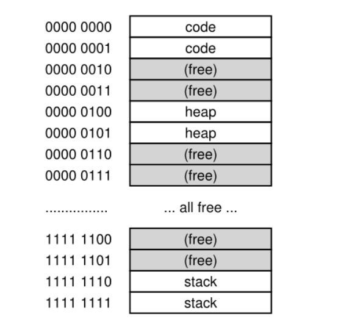

Las paginas virtuales 0 y 1 son para el *code*, las 4 y 5 para el *heap* y las 254 y 255 para el *stack*; el resto de las paginas del *address space* estan sin usar.
<br>Para construir una page table de dos niveles, empezamos con la *page table* lineal y la separamos en unidades de tamaño de una pagina; asumamos que cada PTE es de 4 bytes. Por lo que nuestra *page table* es de 1KB. Dado que tenemos 64 bytes de paginas, la pagina de 1KB puede ser dividad en 16 paginas de 64 bytes; cada pagina puede tener 16 PTEs.
<br>Se necesita entender como tomar el VPN y usarlo para indexar dentro la *page directory* y entonces dentro de la pagina de la *page table*. Como cada una es un *array* de entradas; entonces, todo lo que se necesita saber es como armar un indice para cada una de las piezas de la VPN.
<br>Primer indexamos dentro de la *page directory*. Nuestra *page table*: 256 entradas acomodadas a lo largo de 16 paginas. Como resultado, necesitamos 4 bits para la VPN para indexar dentro de la *page directory*, para eso usaremos los primeros 4 bits para el VPN:

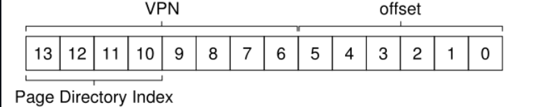

Una vez que extraemos el ***page directory index*** (**PDI**) de la VPN, podemos usarlo para encontrar la direccion de la PDE con el siguiente calculo:

```
PDEAddr = PageDireBase + (PDI * sizeoff(PDE))
```

Este resultado es nuestra *page directory*.
<br>Si la entrada de la *page directory* es valida, tenemos que buscar la PTE desde la pagina de la *page table* apuntada por esta PDE. Para encontrar esta PT, tenemos que indexar en la porcion de la page table usando el resto de los bits de la VPN:

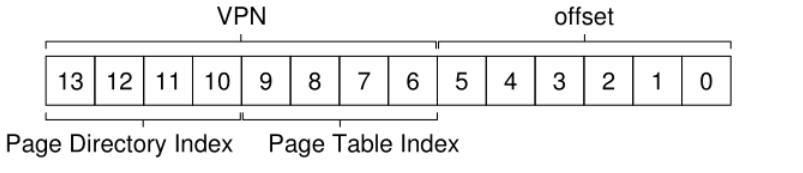

Este PTI puede ser usado para indexar dentro de la *page table*, dandonos la direccion de nuestra PTE:

```
PTEAddr = (PDE.PFN << SHIFT) + (PTI * sizeof(PTE))
```

Notar que el PFN obtenido de la PDE debe ser shifteado a la izquierda antes de combinarlo con el indice de la *page table* para formar la direccion de la PTE.
<br>Para ver si esto tiene sentido, vamos a llebar una pagina multinivel con algunos valores, y los traduciremos en una direccion virtual. Empecemos con la *page directory* para este ejemplo.

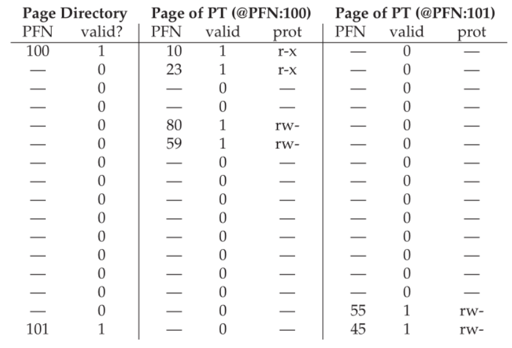

Podemos ver que cada PDE describe algo sobre una pagina de la *page table* para el *address space*. Tenemos dos regiones validas en el *address space* (al inicio y al final), y un par de mapeos invalidos entre ellas.
<br>En la pagina 100 (el PFN de la primer pagina de la *page table*), tenemos la primer pagina de 16 entradas de la page table para las primeras 16 VPNs en el *address space*.
<br>Esta pagina de la *page table* contiene el maep de las primeras 16 VPN; las VPNs 0 y 1 son validas (segmento del *code*), y tambien la 4 y 5 (el *heap*). Por lo que, la *table* tiene la informacion mapeada para cada una de esas paginas.
<br>La otra pagina valida de la *page table* esta dentro del PFN 101. Esta pagina contiene los mapeos para los ultimos 16 VPNs del *address space*.
<br>Los VPNs 245 y 255 (el *stack*) tienen mapeos validos. Podemos ver cuanto espacio es posible ahorrar con una estructura multinivel. En vez de alojar las 16 paginas de una *page table* lineal, alojamos solamente tres.
<br>Finalmente, usamos esta informacion para hacer una traduccion. Aca hay una direccion que refiere al primer byte de la VPN 254: `0x3F80` o `11 1111 1000 0000` en binario.
<br>Recordemos que usamos los primeros 4 bits del VPN para indexar dentro de la *page directory*. Por lo que, `1111` (15) elegira la ultima entrada de la *page directory*. Estos nos apunta a una pagina valida de la *page table* ubicada en la direccion `101`. Entonces usamos los siguientes 4 bits del VPN (`1110`) para indexar dentro de esa pagina de la *page table* y encontrar la PTE deseada. `1110` es justo arriba de la ultima entrada (14) en la pagina, y nos dice que la pagina 254 de nuestro *address space virtual* esta mapeada en la pagina fisica 55. Concatenamos el PFN = 55 (`0x37`) con el *offset* = 000000, podemos formar la direccion fisica deseada y emitir la peticion al sistema de mmeoria.

```
PhysAddr = (PTE.PFN << SHIFT) + offset = 00 1101 1100 0000 = 0x0DC0
```

### Mas de Dos Niveles

En el ejemplo anterior, asumimos que una *page table* solo tiene dos niveles. Pero en algunos casos, es posible un arbol de mas niveles.
<br>Ejemplo, asumamos que tenemos un *address space virtual*, y una pagina de 512 bytes. Por lo que nuestra direccion virtual tiene una VPN de 21 bits y un offset de 9 buts.
<br>Para determinar cuantos niveles hacen falta en una tabla multinivel para hacer que todas las piezas de una *page table* entren en una pagina, empezamos determinando cuantas PTEs entran en una pagina. Dado que nuestro tamaño de pagina de 512 bytes, y asumiendo un PTE de 4 bytes, vemos que podemos tener 128 PTEs en una sola pagina. Cuando indexamos en una pagina de la *page table*, podemos concluir que necesitamos los 7 bits menos significativos ($log_{2}128$) de la VPN como indice:

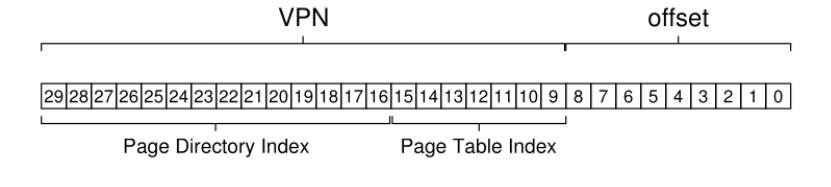

Notar cuantos bits quedan en la *page directory*: 14. Si nuestra *page directory* tiene $2^{14}$ entradas, no ocupa una pagina, si no 128, y por lo tanto nuestro objetivo de hacer que cada pieza de una *page table* multinivel entre en una pagina falla.
<br>Para solucionar este problema, se construye un nivel mas en el arbol, dividiendo el mismo *page directory* en multiples paginas, y agregando otro *page directory* encima de ese, para apuntar a las paginas del *page directory*:

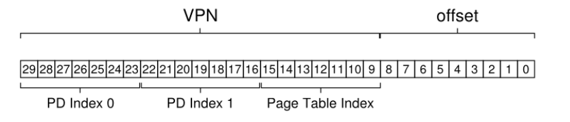

Ahora cuando se indexa en el nivel mas alto del *page directory*, usamos los bits mas significativos de la direccion virtual; este indice puede ser usado para encontrar la PDE del *page directory* de mas alto nivel. Si es valido, el segundo nivel del *page directory* es consultad con la combinacion del PFN de la PDF de mayor nivel y la siguiente parte de la VPN. Finalmente, si es valido, la direccion de la PTE puede ser formada usando el indice de la *Page Table* combinado con la direccion de la PDE de segundo nivel.

### Swapear *Page Tables* al disco

Hasta ahora suponiamos que las *page tables* estaban en memoria del kernel, pero incluso con todos estos "trucos", las *page tables* puede ser demasiado grandes para entrar en memoria todas al mismo tiempo. Cuando esto pasa, algunas se colocan en **Memoria Virtual del Kernel**, permitiendo **Pasar** (***Swapear***) algunas de estas *page tables* al disco cuando hay poca memoria. Claramente, este *swap* introduce una penalizacion de tiempo grande, ya que si un proceso intenta leer memoria virtual de su *address space* y esta no esta en la RAM, se genera un ***Page Fault*** y la misma debe ser traida desde el disco.

### ¡¡¡Ejemplos Practicos!!!

Recordar que son estructuras de datos que, a partir de una direccion virtual de 32 bits (arriba), permiten generar una direccion fisica de 32 bits (64 si se usa PAE (***Physical Addres Extension***)).

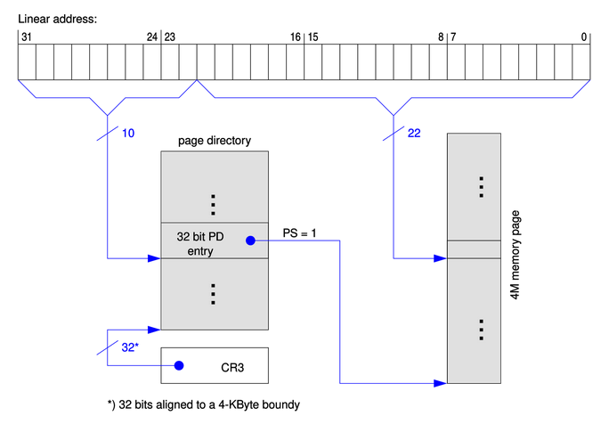
* *Page Table* 10/22 (de un nivel) para paginas de 4MB.

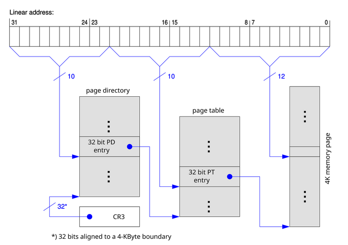
* *Page Table* 10/10/12 (de dos niveles) para paginas de 4KB, de un i386 (x86).

* **CR3**: Registro especial de 32 bits que es solo modificable en modo kernel, apunta a la base de la tabla de *Page Directory*. Los ultimos 12 bits (3 hexa) del CR3 siempre son 0 (en hexa) porque siempre debe estar alineado a saltos de 4KB.
* ***Page Directory***: Tabla que tiene 1024 entradas, cada una de 32 bits (4 bytes). 1024 x 32 bits = 4KB lo cual es el tamaño de la tabla. Para direccionar esas 1024 entradas son necesarios los 10 bits mas significativos de la direccion virtual ($2^{10} = 1024$).
<br>La entrada seleccionada es un puntero que define la base de la *page table* (su posicion 0 ya que crece de forma negativa, o sea, la posicion desde la cual se comienza a contar (descontar) para usar el proximo indice).
* ***Page Table***: Tabla de 1024 entradas de 32 bits, cuya base esta dada por el puntero de la *page directory*, y cuyo indice esta dado por los 10 bits que le siguen a los usados por la *page directory*. La entrada seleccionada es un puntero (20 bits) que indican la base de la pagina fisica que se va a usar.
* ***Memory Page***: Es la pagina fisica que se va a leer, cuya base esta dada por la *page table*. Tiene 4KB entradas, para lo cual son necesarios los 12 bits menos significativos (llamados *offset*) de la direccion virtual ($2^{12} = 4KB$) para seleccionar la pagina.

Recordar que una pagina no puede contener segmentos (*heap*, *stack*, *code*) de distintos tipos para proteger a cada uno de manera adecuada.
<br>En un sistema con paginas lineales puede que una *page table* corresponda a un proceso. En uno de paginas multinivel hay todo un directorio por cada proceso, el cual puede tener una o mas tablas.

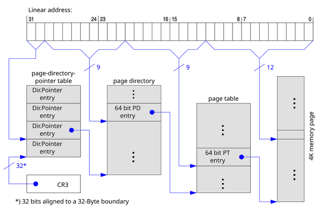
* *Page Table* 9/9/12 (de tres niveles) de un i386 (x86) con PAE (***Physical Addres Extension***)

PAE permite direccionar mas de 4GB de memoria fisica ($2^{32}$ bytes, limite del diseño anterior) al pasar las *tables entries* de 32 bits a 64 bits (sumando mas espacio en la *page frame number* de cada una de ellas). Para ello, añade un nivel mas en la jerarquia de las *page tables*. El *virtual address space* todavia es de hasta 4GB (32 bits).

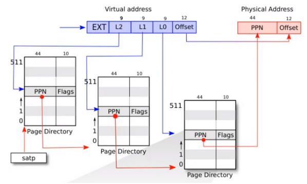
* Traduccion de direciones en la arquitectura RISC-V (9/9/9).

*Page Diretory* ahora con un ancho de 64 bits (al igual que la direccion virtual) y con direcciones fisicas de 56 bits.
<br>Notar que al ser 9/9/9/12 usa los bits menos significativos de los 64 ahora disponibles (los restantes son bits EXT de extension).

# Concurrencia

## Capitulo 26: Introduccion a la Concurrencia

Introduciremos una nueva abstraccion para un solo programa en ejecucion: La de **Hilo** (***Thread***). En vez de nuestra clasica vision de un solo punto de ejecucion en un programa, un programa **Multi-Hilo** (***Multi-Threaded***) tiene mas de un punto de ejecucion. Otra forma de pensarlo es que cada hilo es mas como otro proceso separado, con una diferencia: Comparten el mismo *address space* y por lo tanto pueden acceder a los mismos datos.
<br>El estado de un hilo es muy similar al de un proceso. Tiene un PC que rastrea de donde esta obteniendo instrucciones el programa. Cada hilo tiene su propio *set* de registros privados que tuliza para calculos; por lo tanto, si hay dos hilos que estan ejecutando en un solo procesador, cuando cambia de ejecutar T1 a ejecutar T2, se produce un *context switch*. El *context switch* entre hilos es muy similar al *context switch* entre procesos, como el estado de registros de T1 debe ser guardado y el estado de los registros de T2 deben ser restaurados antes de ejecutarlos. Con los procesos, guardabamos el estado en un **Bloque de Control de Procesos** (**PCB**); ahora, necesitamos uno o mas **Bloque de Control de Hilo** (**TCB**, ***Thread Control Block***) para guardar el estado de cada hilo de un proceso. La diferencia es que el *context switch* que hacemos entre hilos, en comparacion a los proces, es que el *address space* permanece igual (o sea, no es necesario cambiar la *page table* que estamos usando).
<br>Otra diferencia entre hilo y proceso esta sobre el *stack*. El *address space* de un proceso (al que ahora se puede llamar **Proceso de un Hilo**), hay un solo *stack*, usualmente residiendo abajo del *address space*. Pero, en un proceso multi-hilo, cada hilo se ejecuta independientemente y pueden llamar a varias rutinas para hacer lo que tienen que hacer. En vez de un solo *stack* en el *address space*, habra uno por hilo.
<br>Supongamos que tenemos un proceso multi-hilo que tiene dos hilos; el *address space* resultante de ve de la siguiente manera:

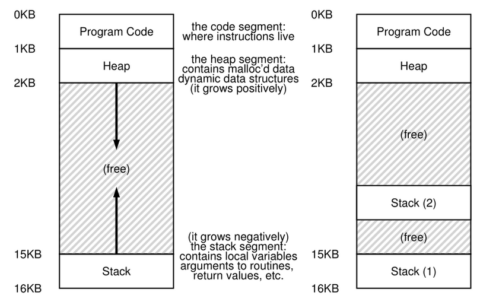

Vemos que tenemos dos *stacks* esparcidos en el *address space* del proceso. Por lo que, cualquier asignacion en el *stack* de variables, parametros, valores de retorno, y mas cosas que estan en el *stack* sera ubicado en lo que llamamos *Thread-Local-Storage* (**ALmacenamiento del Hilo Local**), o sea, el satck del hilo relevante.

### ¿Porque Usar Hilos?

* **Paralelismo**: Se puede dividir el trabajo en hilos, haciendolo mas rapido y eficiente (en caso de que el *overhead* no supere la ganancia). Convertir un programa ***Single-Threaded*** (de un hilo) a ***Multi-Thread*** es llamado **Paralelizacion**.
* Evita **Bloquear** un programa dado la lentitud de I/O; mientras un hilo espera, el planificador  de la CPU puede cambiar a otro hilo, el cual este listo para ejecutarse y hacer algo util. Los hilos permiten superposicion de I/O con otras actividades en un solo programa.
<br>A diferencia de hacer ***Multiprogramming*** (Dividir una tarea en muchos procesos), al compartir *address space* es mas facil compartir informacion.

### Ejemplo: Creacion de un Hilo

Supongamos que queremos ejecutar un programa que crea dos hilos, y que cada uno haga un trabajo independiente, en este caso, imprime "`A`" o "`B`".

```c
#include <stdio.h>
#include <assert.h>
#include <pthread.h>
#include "common.h"
#include "common_threads.h"

void *mythread(void *arg) {
  printf("%s\n", (char *) arg);
  return NULL;
}

int main(int argc, char *argv[]) {
  pthread_t p1, p2;
  int rc;
  printf("main: begin\n");
  Pthread_create(&p1, NULL, mythread, "A");
  Pthread_create(&p2, NULL, mythread, "B");
  // La funcion pthread_join espera a que el hilo termine
  Pthread_join(p1, NULL);
  Pthread_join(p2, NULL);
  printf("main: end\n");
  return 0;
}
```

La funcion `main` crea dos hilos, los cuales ejecutan la funcion `mythread`, aunque con diferentes argumentos. Una vez que un hilo es creado, puede ejecutarse de inmediato, o ponerlo en la lista de *ready*.
<br>Despues de crear los hilos, `main` llama a `Pthread_join`, que espera a que se complete la ejecucion de un hilo en particular.
<br>Veamos el posible orden de ejecucion de este programa:

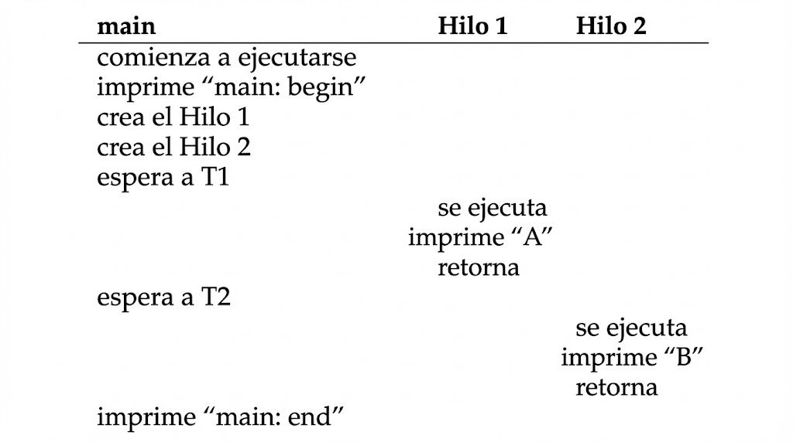

El diagrama muestra una posible secuencia de ejecucion, pero no es la unica, ya que el planificador puede ejecutar los hilos en cualquier orden. Por ejemplo, una vez que se crea un hilo, se puede ejecutar directamente, lo cual dejaria el siguiente orden de ejecuion:

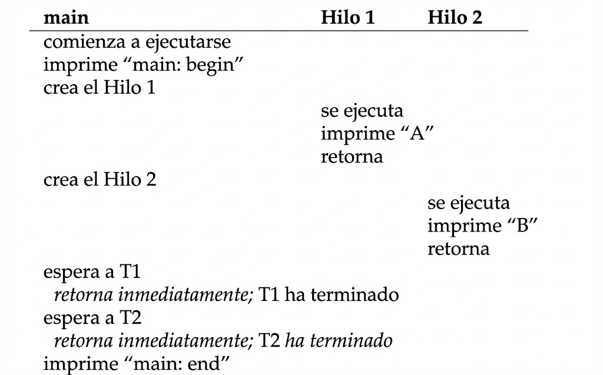

Tambien podriamos ver printeado B antes de A, o sea, digamos que el planificador decide ejecutar `T2` primero incluso si `T1` se creo antes; no hay razon para asumir que el hilo que se crea antes se ejecutara primero:

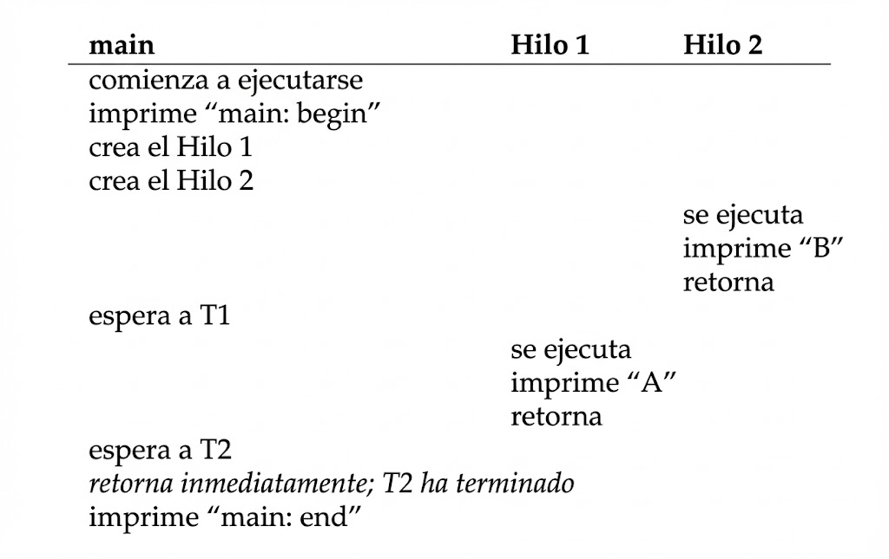

Una forma de ver la creacion de hilos es como hacer una llamada a una funcion, en vez de ejecutar la funcion y volver al llamador, el sistema crea un nuevo hilo de ejecucion para la rutina que esta siendo llamada, y se ejecuta independientemente del llamador, quizas antes de volver de la creacion, o quizas mucho despues.

### ¿Porque se Vuelve Peor? Datos Compartidos

El ejemplo anterior estuvo bueno porque mostraba como se crean los hilos y como se puede ejecutar en diferente orden dependiendo del planificador. Lo que no se mostro es como interactuan los hilos cuando comparten datos.
<br>Imaginemos un ejemplo donde dos hilos quieren actualizar una variable global compartida:

```c
#include <stdio.h>
#include <pthread.h>
#include "common.h"
#include "common_threads.h"

static volatile int counter = 0;

// mythread()
//
// Simplemente suma 1 al contador repetidamente, en un bucle
// No, this is not how you would add 10,000,000 to
// a counter, but it shows the problem nicely
void *mythread(void *arg) {
  printf("%s: begin\n", (char *) arg);
  int i;
  for (i = 0; i < 1e7; i++) {
    counter = counter + 1;
  }
  printf("%s: done\n", (char *) arg);
  return NULL;
}

// main()
//
// Simplemente lanza dos hilos (pthread_create)
// y luego espera por ellos (pthread_join)
//
int main(int argc, char *argv[]) {
  pthread_t p1, p2;
  printf("main: begin (counter = %d)\n", counter);
  Pthread_create(&p1, NULL, mythread, "A");
  Pthread_create(&p2, NULL, mythread, "B");

  // join espera a que los hilos terminen
  Pthread_join(p1, NULL);
  Pthread_join(p2, NULL);
  printf("main: done with both (counter = %d)\n",
  counter);
  return 0;
}
```

Notar que agrupamos la creacion de los hilos y las rutinas `join` para simplificar la salida en caso de un fallo; para un programa como este, queremos al menos notar cuando ocurre un error, pero no hacer nada inteligente (como salir xd). Por lo que, `pthread_create()` solo llama a `pthread_create()` y se asegura que el codigo de retorno sea cero, si no lo es, imprime un mensaje y sale.
<br>Tambien en vez de usar dos funciones separadas para los hilos, usamos una solo bloque de codigo, y le pasamos al hilo un argumento para que impriman letras diferentes.
<br>Finalmente, podemos ver que cada hilo esta tratando de sumar un numero a la variable compartida `counter`, y haciendolo 10 millones de veces. Por lo que, el resultado final deseado es 20 millones.
<br>Ahora compilamos y ejecutamos el programa. A veces, se comporta como esperamos:

```shell
prompt> gcc -o main main.c -Wall -pthread; ./main
main: begin (counter = 0)
A: begin
B: begin
A: done
B: done
main: done with both (counter = 20000000)
```

Pero, cuando ejecutamos este programa, incluso en un solo procesodor, no necesariamente tnemos el resultado deceado:

```shell
prompt> ./main
main: begin (counter = 0)
A: begin
B: begin
A: done
B: done
main: done with both (counter = 19345221)
```

Lo ejecutamos una vez mas y obtenemos:

```shell
prompt> ./main
main: begin (counter = 0)
A: begin
B: begin
A: done
B: done
main: done with both (counter = 19221041)
```

### *Scheduling* y *Race Conditions*

La Ejecucion de los procesos es administrada por el *scheduler* del SO, por lo que no se puede asumir que hilo se ejecutara en cada momento (incluso si uno es creado antes que otro); una vez llamado, cada uno se ejecuta de forma independiente del hilo que lo creo hasta retornar. Esto aumenta la complejidad general del funcionamiento del sistema, por lo que es preferible intentar minimizar las interacciones entre ellos.

Si diferentes hilos comparten informacion da a lugar a errores. Por ejemplo (el ejemplo anterior), en el caso de dos hilos incrementando un contador; el hilo 1  puede modificar la variable, pero si antes de poder guardar el resultado, un *context switch* guarda el estado actual del proceso y corre el hilo 2 (el cual modifica la variable y guarda en memoria el nuevo valor) cuando vuelva a correr el hilo 1 este realizara la instruccion que anteriormente no pudo, guardando el valor del contador que el tenia, pisando el contenido y haciendo que el resultado sea diferente al esperado.
<br>Esto es llamado una ***Race Condition*** (**Condicion de Carrera**) (o mas bien ***Data Race***) y genera resultados **Indeterministas**.

Cuando mas de un hilo ejecuta una misma parte del codigo que contiene un recurso compartido, (por ejemplo, una variable o estructura de datos) y se genera una *race condition*, esa parte es llamada **Seccion Critica**. Como esas zonas no deberian ser ejecutadas al mismo tiempo por mas de un hilo, se busca asegurar una **Exclusion Mutua** que garantice el acceso de un solo hilo a la vez.

### Atomicidad

Una solucion que garantiza la exclusion mutua es tener instrucciones que, en un solo paso, se ejecuten por completo y remuevan asi la posibilidad de un *interrupt* intermedio. O sea, que sean **Atomicas**; que o bien la instruccion se ejecute hasta completarse, o bien no se ejecute.
<br> Algo atomico es indivisble. En concurrencia, una operacion Atómica es aquella que se ejecuta completamente, sin interrupciones, por lo que no puede ser interrumpida por otro hilo.

En general esto no es posible, por lo que, usando soporte del hardware y del SO, se construyen diferente **Primitivas de Sincronizacion**; codigo *multi-thread* en el que cada hilo accede a las secciones criticas de forma sincronizada y controlada, evitando las condiciones de carrera y asegurando la exclusion mutua.
<br>O sea, las primiticas de sincronizacion son mecanismos que provee el SO y el hardware para poder coordinar hilos.

## Capitulo 27: API de los Hilos

### Creacion de los Hilos

Para crear un programa multi-hilo, primero es necesario crear nuevos hilos, por lo que debe existir alguna interfaz de creacion de hilos. En POSIX:

```c
include <pthread.h>
int
pthread_create(
                pthread_t *thread, 
                const pthread_attr_t *attr,
                void *(*start_routine)(void*),
                void *arg
              );
```

`pthread_create()` toma 4 argumentos:
* `thread` es un puntero a una estructura de tipo `pthread_t`; se usa esta estructura para interactuar con el hilo, por eso se la pasamos a la funcion para inicializarla.
* `attr` es usado para especificar cualquier atributo que deba tener el hilo. Por ejemplo, setear el tamaño del *stack* o informacion sobre la prioridad de planificacion del hilo. Un atributo es inicializado con una llamada separada a `pthread_attr_init()`. Pero, en muchos casos, los que vienen por defecto estan bien; en algunos casos, tambien se le puede pasar `NULL`.
* `start_routine` es el mas complejo, solamente pide que funcion deberia empezar a ejecutar el hilo. En C, esto se lo llama **Puntero a una Funcion**, y esto nos dice que se espera un nombre de una funcion, al cual se le pasa un solo argumento de tipo `void *`, y la cual retorna un valor de tipo `void *`.
<br>En cambio, si una rutina necesita un argumento de tipo `int`, en vez de un puntero `void`, la declaracion se veria algo como:

```c
int pthread_create(..., // los dos primeros argumentos son los mismos
                    void *(*start_routine)(int),
                    int arg
                  );
```

Y si en vez de eso la rutina toma un puntero a `void`, pero retorna un `int`, se veria:

```c
int pthread_create(..., // los dos primeros argumentos son los mismos
                  int (*start_routine)(void *),
                  void *arg);
```

* El ultimo argumento, `arg` es el argumento para ser pasado donde el hilo comienza la ejecucion.

Ejemplo:

```c
#include <stdio.h>
#include <pthread.h>

typedef struct {
  int a;
  int b;
} myarg_t;

void *mythread(void *arg) {
  myarg_t *args = (myarg_t *) arg;
  printf("%d %d\n", args->a, args->b);
  return NULL;
}

int main(int argc, char *argv[]) {
  pthread_t p;
  myarg_t args = { 10, 20 };

  int rc = pthread_create(&p, NULL, mythread, &args);
  ...
}
```

En el ejemplo, solo creamos un hilo al que le pasan dos argumentos, empaquetados en un solo tipo definido por nosotros (`myarg_t`). El hilo, una vez creado, puede simplemente castear este argumento al tipo deseado y desempaquetar los argumentos como deseamos.

### Finalizacion de los Hilos

Para finalizar un hilo, debemos llamar a la rutina `pthread_join()`.

```c
int pthread_join(
                  pthread_t thread, 
                  void **value_ptr
                );
```

Esta funcion toma dos argumentos:
* `pthread_t` es usado para especificar por cual hilo esperar. Esta variable es inicializada en la creacion del hilo.
* `void **value_ptr` es un puntero al valor de retorno que deseamos obtener. Dado que una puede retornar cualquier cosa, esta definida para retornar un puntero a `void`; dado que `pthread_join()` cambia el valor del argumento pasado, necesitamos pasar un puntero y no el valor.

Ejemplo:

```c
typedef struct { int a; int b; } myarg_t;
typedef struct { int x; int y; } myret_t;

void *mythread(void *arg) {
  myret_t *rvals = Malloc(sizeof(myret_t));
  rvals->x = 1;
  rvals->y = 2;
  return (void *) rvals;
}

int main(int argc, char *argv[]) {
  pthread_t p;
  myret_t *rvals;
  myarg_t args = { 10, 20 };
  Pthread_create(&p, NULL, mythread, &args);
  Pthread_join(p, (void **) &rvals);
  printf("returned %d %d\n", rvals->x, rvals->y);
  free(rvals);
  return 0;
}
```

Se ve en el codigo, se crea un solo hilo, y se le pasan un par de argumentos a traves de la estructura `myargt_t`. Para retornar los valores, se usa el tipo `myret_t`. Una vez que el hilo termina de ejecutarse, el hilo principal, el cual estaba esperando dentro de `pthread_join()`, retorna y puede acceder a los valores retornados del hilo.
<br>Notar:
1. Muchas veces no tenemos que hacer todo eso de empaquetar y desempaquetar los argumentos. Por ejemplo, si creamos un hilo sin argumentos, podemos pasarle `NULL` como argumento. De forma similar, podemos pasar `NULL` en `pthread_join()` si no queremos preocuparnos del valor de retorno.
2. Si queremos pasar un solo valor, no necesitamos empaquetarlo:

```c
void *mythread(void *arg) {
  long long int value = (long long int) arg;
  printf("%lld\n", value);
  return (void *) (value + 1);
}

int main(int argc, char *argv[]) {
  pthread_t p;
  long long int rvalue;
  Pthread_create(&p, NULL, mythread, (void *) 100);
  Pthread_join(p, (void **) &rvalue);
  printf("returned %lld\n", rvalue);
  return 0;
}
```

3. Hay que tener cuidado en como son retornados los valores del hilo. Especificamente, nunca retornar un puntero al que se refiera a algo del *stack* del hilo. Por ejemplo, un codigo peligroso:

```c
void *mythread(void *arg) {
  myarg_t *args = (myarg_t *) arg;
  printf("%d %d\n", args->a, args->b);
  myret_t oops; // ALLOCATED ON STACK: NOOOO!
  oops.x = 1;
  oops.y = 2;
  return (void *) &oops;
}
```

En este caso la variable `opps` esta en el *stack* de `mythread()`. Pero, cuando la retorna, el valor se desasigna, por lo que, devuelve un puntero a una variable sin asignar.
<br>Finalmente usar `pthread_create()` para crear un hilo, y enseguida llamar a `pthread_join()`, es una forma rara de crear un hilo. La forma correcta es llamada **Llama de Procedimientos**

### *Locks*

Las funciones que provee la libreria de *threads* de POSIX para proveer exclusion mutua a una seccion critica a traves de ***Locks***. El par de rutinas mas baico para usar son:

```c
int pthread_mutex_lock(pthread_mutex_t *mutex);
int pthread_mutex_unlock(pthread_mutex_t *mutex);
```

Cuando se tiene una seccion critica, y necesita ser protegida para asegurar su correcta ejecucion, los *locks* son utiles. Imaginemos un codigo:

```c
pthread_mutex_t lock;
pthread_mutex_lock(&lock);
x = x + 1;
pthread_mutex_unlock(&lock);
```

La intencion del codigo: si no hay otro hilo que mantenga el *lock* cuando se llama a `pthread_mutex_lock()`, el hilo adquirira el *lock* y entrara en la seccion critica. De hecho, si otro hilo tiene el *lock*, el hilo que esta intentando tener el *lock* no retornara de la llamada hasta que lo adquiera. Muchos hilos pueden quedar trabados dentro de la funcion de adquisicion; solamente los procesos con el *lock* pueden llamar a `unlock`.
<br>Desafortunadamente, el codigo esta roto. El primero problema es la falta de inicializacion adecuada. Todos los *locks* deben ser inicializados apropiadamente para asegurar que tienen los valores correctos para iniciar y por lo tanto hacer el trabajo que deseamos cuando el `lock` y el `unlock` se llamen.
<br>Hay dos formas de incializar los *locks*. Una forma es usar `PTHREAD_MUTEX_INITIALIZER`:

```c
pthread_mutex_t lock = PTHREAD_MUTEX_INITIALIZER;
```

Esto setea el *lock* con valores por defecto y hace que el candado sea usable. La forma dinamica para hacerlo es llamar a `pthread_mutex_init(pthread_mutex_t *mutex, const pthread_mutexattr_t *attr)`:

```c
int rc = pthread_mutex_init(&lock, NULL);
assert(rc == 0); // siempre verifica que la operación fue exitosa
```

El primer argumento (`pthread_mutex_t *mutex`) es la direccion del mismo *lock* que se desea inicializar. El segundo argumento (`const pthread_mutexattr_t *attr`) es un conjunto de argumentos opcionales. Siempre que se inicializa un *lock*, debe llamarse `pthread_mutex_destroy()` para liberar los recursos asociados al *lock* cuando ya no se necesita.
<br>El segundo problema, del codigo de ejemplo, es que falla al verificar errores de codigo cuando llama a `lock` y `unlock`. Minimamente se usa ***Wrappers*** que afirman que la rutina tuvo exito.

```c
/// mantiene el código limpio; solo usar si `exit()` está bien en caso de fallo
void Pthread_mutex_lock(pthread_mutex_t *mutex) {
  int rc = pthread_mutex_lock(mutex);
  assert(rc == 0);
}
```

Existen otras dos rutinas de interes en la libreria de *threads* de POSIX:

```c
int pthread_mutex_trylock(pthread_mutex_t *mutex);
int pthread_mutex_timedlock(
                              pthread_mutex_t *mutex, 
                              const struct timespec *abstime
                            );
```

Estas dos llamadas son usadas en la adquisicion de *locks*. `trylock` retorna un fallo si el *lock* ya lo tiene otro hilo; `timedlock` retorna despues de un tiempo o despues de adquirir el *lock*, 0 si tiene exito (o sea logra bloquear el mutex), si fallo devuelve un numero positivo que representa el error. Por lo tanto, `timedlock` con un tiempo de espera de 0 es similar a `trylock`.

### Variables de Condicion

Las **Variables de Condicion** son utiles cuando algun tipo de señalizacion debe tomar lugar entre los hilos, si un hilo esta esperando que otro haga algo antes de continuar. Ejemplo: Imaginemos que tenemos un Hilo A (el padre) y un Hilo B (el hijo). El padre quiere verificar que el hijo terminó su tarea antes de continuar. **Sin Variable de Condición**: El padre tendría que preguntar constantemente: "¿Ya terminaste? ¿Ya terminaste? ¿Ya terminaste?". Esto desperdicia CPU brutalmente. **Con Variable de Condición**: El padre dice: "Voy a dormir. Despiértame cuando termines". La Variable de Condición es el mecanismo que permite al padre "irse a dormir" y al hijo "tocar el timbre" para despertarlo. Se usan dos rutinas principales para que los hilos interactuan:

```c
int pthread_cond_wait(pthread_cond_t *cond, pthread_mutex_t *mutex);
int pthread_cond_signal(pthread_cond_t *cond);
```

Para usar una variable de condicion, se tiene que tener un *lock* que este asociado con la condicion. Cuando se llame a cualquiera de estas rutinas el *lock* debe estar adquirido. 
<br>`pthread_cond_wait` pone al hilo llamador a dormir, y por lo tanto espera que otro hilo le mande una señal. Un uso tipico es:

```c
pthread_mutex_t lock = PTHREAD_MUTEX_INITIALIZER;
pthread_cond_t cond = PTHREAD_COND_INITIALIZER;

pthread_mutex_lock(&lock);

while (ready == 0) {
  pthread_cond_wait(&cond, &lock);
}

pthread_mutex_unlock(&lock);
```

En el codigo, despues de inicializar el candado y la condicion, un hilo verifica si la variable `ready` ya ha sido seteada a otra cosa que no sea cero. Si no, el hilo llama a la rutina `wait` para dormir hasta que otro hilo lo despierte.
<br>El codigo que despierta al hilo, el cual se debe ejecutar en otro hilo, debe ser algo asi:

```c
pthread_mutex_lock(&lock);
ready = 1;
pthread_cond_signal(&cond);
pthread_mutex_unlock(&lock);
```

Un par de cosas a tener en cuenta sobre la secuencia del codigo. Primero, cuando señalizamos (asi como al modificar la variable `ready`), siempre nos tenemos que asegurar de tener el *lock*.
<br>Segundo, la llamada `wait` toma un *lock* como argumento, cuando la llamada a `signal` solo toma una condicion. La razon de esta diferencia es que `wait`, ademas de poner el hilo a dormir, libera el *lock*. Pero, antes de retornar luego de ser despertado la llamada `pthread_cond_wait()` readquiere el *lock*. Por lo que, asegura que cada vez que el hilo que esta esperando se ejecuta entre la adquisicion del *lock* al principio de la secuencia `wait`, y la liberacion del *lock* al final, manteniendo el *lock*.
<br>Por ultimo, el hilo que esta esperando verifica la condicion en un bucle, en vez de un `if`, usar `while` es lo mas facil y seguro de hacer.

## Capitulo 28: *Locks*

### Idea Basica

Un ***lock*** es una variable que protege una seccion critica y solo puede estar en uno de dos estados: **Disponible** (o **Libre**) si ningun hilo lo posee, o **Adquirido** (o **Ocupado**) si un hilo lo posee. Esta variable puede contener informacion adicional, como el identificador del hilo propietario o una cola de espera.

Consideremos el ejemplo de una seccion critica que actualiza una variable compartida: `balance = balance + 1`.

Para proteger esta operacion y garantizar que se ejecute de forma atomica, la encapsulamos con un *lock*:

```c
lock_t mutex; // Variable de bloqueo globalmente asignada

...

lock(&mutex);
balance = balance + 1;
unlock(&mutex);
```

Aca `mutex` es la variable de bloqueo. `lock` y `unlock` son las rutinas que se encargan de adquirir y liberar el *lock* respectivamente:
* `lock()`: Un hilo llama a esta funcion para intentar adquirir el *lock*. Si esta disponible, el hilo lo adquiere, se convierte en su "propietario" y entra en la seccion critica. Si otro hilo ya posee el *lock*, el nuevo hilo que intenta adquirirlo se detendra y esperara hasta que sea liberado.
* `unlock()`: Cuando un hilo propietario del *lock* termina de ejecutar la seccion critica, llama a esta funcion para liberarlo, dejandolo disponible de nuevo. Si hay otros hilos esperando, uno de ellos podra entonces adquirir el *lock* y entrar a la seccion critica.

### `Pthread Locks`

En la biblioteca de hilos POSIX, los *locks* son conocidos como `mutex`, un termino que destaca su proposito: Proporcionar **Exlusion Mutua**.
<br>Ejemplo de uso en `Pthreads`:

```c
pthread_mutex_t lock = PTHREAD_MUTEX_INITIALIZER;

pthread_mutex_lock(&lock);
balance = balance + 1;
pthread_mutex_unlock(&lock);
```

Es importante notar que se puede utilizar **Diferentes Bloqueos para Proteger Diferentes Variables** y estructuras de datos. Esta estrategia es conocida como **Bloqueo de Grano Fino** (***Fine-Grained***), permite que varios hilos operen en diferentes secciones criticas simultaneamente, siempre que no compitan por el mismo recurso. Esto aumente significativamente la concurrencia en comparacion con el enfoque de **Grano Grueso** (***Coarse-Grained***), donde un unico bloqueo protege todo el sistema, forzando a los hilos a esperar incluso cuando no hay un conflicto real de acceso.

### Construccion y Evaluacion de *Locks*

¿Como se puede construir un *lock* que sea a la vez correcto y eficiente? La construccion de una primitiva de sincronizacion robusta no es trivial; requiere una cooperacion entre el hardware, que debe proporcionar instrucciones especiales (que no pueden ser interrumpidas), y el SO, que debe ofrecer soporte para la gestion eficiente de los hilos.
<br>Una **Primitiva de Sincronizacion** es un mecanismo de bajo nivel más básico utilizados para coordinar la ejecución de hilos.

Para evaluar si una implementacion de *lock* es efectiva, se debe consisderar tres criterios fundamentales:
1. **Exclusion Mutua**: Un hilo adquiere el *lock* y, mientras lo posee, ningun otro hilo puede adquirirlo.
2. **Equidad** (***Fairness***): Cada hilo que compite por el *lock* tiene la misma oportunidad de adquirirlo. En un sistema injusto podria permitir que un hilo sufra de *starvation* (inanicion).
3. **Rendimiento** (***Perfomance***): Este criterio se analiza en diferentes escenarios:
  * **Sin Contencion**: La sobrecarga cuando un solo hilo adquiere y libera el *lock*.
  * **Con Contencion en una Sola CPU**: El rendimiento cuando multiples hilos compiten por el *lock* en un unico procesador.
  * **Con Contencion en Multiples CPUs**: El rendimiento cuando los hilos competidores se ejecutan en diferentes procesadores.

### Primer Intento de Implementacion de *Locks*

El primer enfoque, que es el mas simple, se baso en el control de las interrupciones del procesador. Pero, este metodo presenta serias limitaciones. Luego en los enfoques posteriores utilizando unicamente operaciones de carga y almacenamiento de memoria estandar demostraron ser incorrectos, sentando las bases para la necesidad de un soporte de hardware mas sostificado para garantizar la atomicidad.

La primera solucion para garantizar exclusion mutua en sistemas mono-core (monoprocesador) fue **Deshabilitar las Interrupciones**. El codigo era muy simple:

```c
void lock() {
    DisableInterrupts();
}

void unlock() {
    EnableInterrupts();
}
```

Al deshabilitar las interrupciones antes de entrar en una seccion critica, un hilo se aseguraba de que no seria interrumpido, ejecutando su codigo de forma atomica. Pero, este enfoque presenta desventajas:
* **Privilegio y Confianza**: Requiere otorgar a los programas la capacidad de ejecutar una operacion privilegiada. Un programa malicioso o con errores podria monopolizar la CPU o colgar el sistema por completo al no volver a habilitar las interrupciones.
* **Incompatibilidad con Multiprocesadores**: Este metodo es ineficaz en sistemas multi-core (multiprocesadores) ya que  deshabilitar las interrupciones en un procesdor no impide que otro hilo se ejecute en un procesador diferente y acceda a la misma seccion critica.
* **Perdida de Interrupciones**: Deshabilitar durante un periodo prolongado puede hacer que el sistema pierda eventos importantes, como la notificacion de que una operacion de I/O en disco ha finalizado.

A pesar de estas limitaciones, este metodo todavia se utiliza en contextos muy especificos, como dentro del propio nucleo del SO. Alli, el problema de la "confianza" desaparece, ya que el SO se confia a si mismo para ejecutar estas operaciones privilegiadas de forma correcta y por periodos muy breves.

#### Intento Fallido: Usando Solo *Loads*/*Stores*

Tras descarte el control de interrupciones, el siguiente paso fue intentar construir un *lock* utilizando una unica variable `flag` y operaciones de *load* y *store* estandar. La idea era que un hilo esperara en un bucle mientras el `flag` estuviera en `1` (ocupado) y luego lo estableciera en `1` para tomar el bloqueo.

```c
void lock(lock_t *mutex) {
  while (mutex->flag == 1) {  // Probar el flag
    ; // Espera activa
  }
  mutex->flag = 1; // Tomar el bloqueo
}
```

Este enfoque fracasa por dos razones:
1. **Problemas de Correccion**: No garantiza la exclusion mutua. Para entender el error, imaginemos un planificador malicioso:

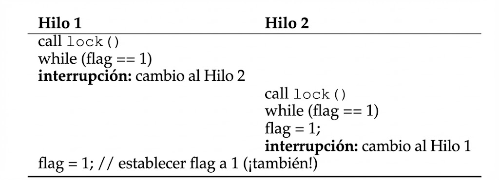

El hilo 1 lee el `flag` y ve que es `0`. Justo antes de que pueda escribir `1`, ocurre una interrupcion. El planificador ejecuta al hilo 2, que tambien lee el `flag` (que sigue siendo `0`), escribe `1` en el y entra en la seccion critica. Cuando el hilo 1 se reanuda,  no vuelve a comprobar el `flag`; simplemente ejecuta la siguiente instruccion, que es escribir `1`, y tambien entra en la seccion critica. Ambos hilos estan ahora en seccion critica, violando la exclusion mutua.
2. **Problemas de Rendimiento**: La tecnica de esperar un bucle, conocida como **Espera Activa** (***spin-waiting***), es extremadamente ineficiente. Un hilo que espera consume ciclos de CPU de forma continua sin realizar ningun trabajo util. En un sistema monoprocesador, esto es particularmente grave, ya que el hilo que posee el *lock* no puede ejecutarse para liberarlo mientras otros hilos esta girando.

### *Locks* Basados en Hardware (*Spin Locks*)

El fracaso de los enfoques basados solamente en software llevo a los diseñadores de sistemas a incorporar soporte de hardware especificos para la sincronizacion. Se crearon instrucciones atomicas que realizan multiples operaciones (como leer y modificar una ubicacion de memoria) como una unidad invisible. Estas instrucciones permitieron construir *locks* correctos, aunque inicialmente introdujeron el problema de la espera activa, dando a lugar a los llamados ***Spin Locks***.

#### Construyendo *Spin Locks* Funcionales con *Test-And-Set*

Una de las primeras y mas simples instrucciones para sincronizacion es ***Test-And-Set***. Estas instruccion atomica lee el valor antiguo de una direccion de memoria, escribe un nuevo valor en esa misma direccion y devuelve el valor antiguo. Todo esto ocurre como una unica operacion invisible. Aunque su nombre varia entre arquitecturas (por ejemplo, `ldstub` o `xchg`), su funcionalidad es la misma.

```c
int TestAndSet(int *old_ptr, int new) {
  int old = *old_ptr;
  *old_ptr = new;
  return old;
}
```

Usando `TestAndSet`, podemos construir un *Spin Lock* funcional

```c
typedef struct __lock_t {
  int flag;
} lock_t;

void init(lock_t *lock) {
  // 0: lock is avaible, 1: lock is held
  lock->flag = 0;
}

void lock(lock_t *lock) {
  while (TestAndSet (&lock->flag, 1) == 1); // spin-wait (do nothing)
}

void unlock(lock_t *lock) {
  lock-flag = 0;
}
```

Este diseño resuelve el problema de la exclusion mutua. Cuando un hilo llama a `lock()`, `TestAndSet` devuelve el valor antiguo del `flag` (`0` si esta libre) y simultaneamente lo establece en `1`. Solo el primer hilo que ejecute la instruccion cuando el `flag` es `0` recibira un `0` como retorno y adquirira el *lock*. Cualquier otro hilo recibira un `1` y permanecera girando en el bucle.

Evaluemos el *spin lock* en `TestAndSet` segun nuestros criterios:
* **Exclusion Mutua**: Es correcta. La atomicidad de *TestAndSet* garantiza que solo un hilo puede adquirir el *lock* a la vez.
* **Equidad**: Es deficiente. No ofrece ninguna garantia de que un hilo en espera eventualemente adquiera el *lock*. Es posible que un hilo sufra de inanicion y gire indefinidamente mientras otros hilos adquieren y liberan el *lock* repetidamente.
* **Rendimiento**:
  * **En Sistemas de una Sola CPU**: Es problematica. Si un hilo que posee el *lock* es interrumpido, otros hilos podrian pasar quatum de tiempo completos girando inutilmente, ya que el propietario del *lock* no puede ejecutarse para liberarlo.
  * **En sistemas multi-CPU**: Es razonable si las secciones criticas son cortas. Un hilo en una CPU puede girar mientras espera que otro hilo en una CPU diferente libere el *lock*, lo que puede suceder rapidamente.

#### *Compare-And-Swap*

Una instruccion atomica mas potente es ***Compare-And-Swap***:

```c
int CompareAndSwap(int *ptr, int expected, int new) {
  int original = *ptr;
  if (original == expected) {
    *ptr = new;
  }
  return original;
}
```

Esta instruccion compara el contenido de una direccion de memoria con un valor esperado y, solo si coinciden, actualiza esa direccion con un nuevo valor. En cualquier caso, devuelve el valor original de la memoria.

```c
void lock(lock_t *lock) {
  while(CompareAndSwap(&lock->flag, 0, 1) == 1);  // Spin
}
```

Implementar un *spin lock* con `CompareAndSwap` es funcionalemnte similar a hacerlo con `TestAndSet`: Un hilo intenta cambiar atomicamente el `flag` de `0` a `1` y gira si no lo consigue.

#### *Load-Linked* y *Store-Conditional*

Aglunas arquitecturas ofrecen un par de instrucciones que trabajan juntas: `LoadLinked` (LL) y `StoreConditional` (SC).
* `LoadLinked` simplemente carga un valor desde la memoria.
* `StoreConditional` intenta escribir un nuevo valor en la misma direccion, pero solo tiene exito si no ha habido ninguna otra escritura en esa direccion desde la ejecucion del `LoadLinked` por parte del mismo hilo.

```c
int LoadLinked(int *ptr) {
  return *ptr;
}

int StoreConditional(int *ptr, int value) {
  if (No hay actualización para *ptr desde LL a esta dirección) {
    *ptr = value;
    return 1; // Success!
  } else {
    return 0; // Failed to update
  }
}
```

Juntas, se pueden usar para construir un *lock*:

```c
void lock(lock_t *lock) {
  while(1) {
    while (LoadLinked(&lock->flag) == 1); // Spin until it's zero
    if (StoreConditional(&lock->flag, 1) == 1) {
      return; // if set-to-1 was success: done
              // otherwise: try again
    }
  }
}

void unlock(lock_t *lock) {
  lock->flag = 0;
}
```

La forma en que evitan una condicion de carrera es precisa: Si el hilo 1 ejecuta `LoadLinked` y es interrumpido, el hilo 2 puede ejecutarse, ejecutar su propio `LoadLinked`, su `StoreConditional` (que tiene exito) y adquirir el *lock*. Cuando el hilo 1 se reanuda e intenta su `StoreConditional`, este fallara porque la memoria fue modificada por el hilo 2, forzandolo a reintentar todo el bucle y garantizando asi la exclusion mutua.

#### *Fetch-And-Add*

La instruccion atomica `FetchAndAdd` incrementa un valor en memoria y devuelve su valor de forma indivisible. Esta instruccion permite construir un ***Ticket Lock***, una implementacion mas sostificada que garantiza la equidad.

```c
int FetchAndAdd(int *ptr) {
  int old = *ptr;
  *ptr = old + 1;
  return old;
}
```

La logica se basa en dos variables: `Ticket` y `turn`.

```c
void lock(lock_t *lock) {
  int myturn = FetchAndAdd(&lock->ticket);  // Obtiene un numero de ticket
  while (lock->turn != myturn); // Espera hasta que sea su turno
}

void unlock(lock_t *lock) {
  lock->turn = lock->turn + 1;  // Cede el turno al siguiente
}
```

Cuando un hilo desea adquirir el *lock*, obtiene un numero de ticket unico (`myturn`). Luego espera activamente hasta que el contador global `turn` coincida con su numero. A diferencia de los *spin locks* simples, el *ticket lock* garantiza la equidad, eliminando el riesgo de inanicion que vimos antes. Los hilos son atendidos en el orden en que solicitaron el *lock*.

### Superando el *Spinning*: Soporte del SO

Todos los *locks* basados en hardware que vimos hasta ahora comparten un defecto: La **Espera Activa** o ***Spinning***, que desperdicia valioso ciclos de CPU. Esto es especialmente problematico en sistemas con una sola CPU. Para evitar el *Spinning* se requiere ir mas alla del hardware y utilizar el soporte del SO para gestionar de manera inteligente los hilos en espera, poniendolos a "dormir" en lugar de dejarlos girando.

#### Enfoque Simple: Ceder (*Yield*)

En un primer intento para evitar el *spinning* continuo es hacer que el hilo ceda voluntariamente la CPU en lugar de girar. Esto se logra reemplazando el bucle de espera por una llamada al sistema como `yield()`.

```c
void init() {
  flag = 0;
}

void lock() {
  while (TestAndset(&flag, 1) == 1) {
    yield();  // Give up the CPU
  }
}

void unlock() {
  flag = 0;
}
```

`yield()` mueve al hilo del estado de *Running* al de *Ready*, permitiendo que el planificador ejecute otro hilo.

* **Ventajas**: En un escenario simple con dos hilos en una CPU, este enfoque funciona bien. El hilo en espera cede la CPU, permitiendo que el hilo que posee el bloqueo se ejecute y lo libere.
* **Desventajas**: Con muchos hilos compitiendo, si el propietario del *lock* es interrumpido, los demas entraran en un ciclo de `lock() - yield()`, generando una gran cantidad de *context switch* costosos. Mas importante aun, este enfoque no resuelve el problema de la inanicion, ya que no hay garantia sobre que hilo se ejecutara a continuacion.

#### Usando Colas: Durmiendo en Lugar de Girar

La solucion mas robusta para evitar *spinning* es poner a los hilos en espero a dormir y despertarlos solo cuando el bloqueo este disponible. Esto requiere soporte explicito del SO, como las primitivas de solaris:
* `park()`: Pone a dormir al hilo que la invoca.
* `unparck(threadID)`: Despierta a un hilo especifico.

Una implementacion combina estas primitivas con otras ideas que ya hemos visto:

```c
typedef struct __lock_t {
  int flag;
  int guard;
  queue_t *q;
} lock_t;

void lock_init(lock_t *m) {
  m->flag = 0;
  m->guard = 0;
  queue_init(m->q);
}

void lock(lock_t *m) {
  while (TestAndSet(&m->guard, 1) == 1); //acquire guard lock by spinning
  if (m->flag == 0) {
    m->flag = 1; // lock is acquired
    m->guard = 0;
  } else {
    queue_add(m->q, gettid());
    m->guard = 0;
    park();
  }
}

void unlock(lock_t *m) {
  while (TestAndSet(&m->guard, 1) == 1); //acquire guard lock by spinning
  if (queue_empty(m->q)) {
    m->flag = 0; // let go of lock; no one wants it
  } else {
    unpark(queue_remove(m->q)); // hold lock
                                // (for next thread!)
  }
  m->guard = 0;
}
```

* `guard`: Un *spin lock* que protege el acceso a la cola de espera (`q`) y a la variable `flag`. Esto convierte al bloqueo en una solucion hibrida: El *spinning* no se elimina, pero se confina a una seccion critica breve y controlada dentro del propio codigo del *lock*.
* `queue_t`: Una cola donde se añaden los identificadores de los hilos que estan esperando el *lock*.
* `flag`: Indica el estao del *lock* principal (0 si esta libre y 1 si esta ocupado).

Un detalle crucial es como se transfiere el bloqueo. Cuando un hilo en `unlock()` despierta al siguiente, le pasa directamente la propiedad del *lock* (el `flag` permanece en 1). Esto es necesario porque el hilo recien despertado no posee el `guard` y, por lo tanto, no puede establecer el `flag` de forma segura. La propiedad se transfiere para garantizar la correcion.

Esta implementacion sufre un problema sutil conocido como la **Carrera de Despertar/Espera** (***Wakeup/Waiting Race***): Un hilo podria decidir que va a dormir, ser interrumpido, y que otro hilo lo despierte (`unpark`) antes de que logre dormirse (`park`), causando que duerma indefinidamente. Solaris soluciona esto con una llamada opcional, `setpark()`, que permite al hilo declarar su intencion de dormir, evitando la condicion de carrera.

#### Diferente SO, Diferente Soporte

Otros SO ofrecen un soporte similar con diferentes interfaces. Linux, por ejemplo, proporciona el `futex` (***Fast Userpace Mutex***), que asocia una cola en el kernel a una direccion de memoria especifica.
* `futex_wait(address, expected)`: Pone a dormir a un hilo si el valor en `address` coincide con `expected`.
* `futex_wake(address)`: Despierta a un hilo que esta esperando en la cola asociada a `address`.

#### *Locks* de Dos Fases (*Two-Phases Locks*)

Un *Lock* de Dos Fases es un enfoque hibrido que combina la mejor de ambos mundos, reconociendo que girar puede ser eficiente si el *lock* se libera rapidamente.
1. **Fase 1** (***Spinning***): Al intentar adquirir un *lock* ocupado, el hilo espera activamente (gira) durante un breve periodo de tiempo.
2. **Fase 2** (***Sleeping***): si el *lock* no se libera durante la primera fase, el hilo deja de girar y se pone a dormir, evitanto asi un mayor despedicio de CPU.

Este enfoque busca el equilibrio, optimizando para secciones criticas cortas sin penalizar excesivamente las largas.

## Capitulo 30: Variables de Condicion

En la programacion concurrente, los *lock* son una herramienta fundamental, pero no son suficientes para resolver todos los problemas de sincronizacion. Con frecuencia, un hilo necesita detener su ejecucion y esperar a que una condicion especifica se cumpla antes de continuar. Por ejemplo, un hilo padre podria necesitar a que su hijo termine su tarea. El desafio central es implementar esta espera de una manera que no desperdicie recursos del sistema.

### Evaluacion del Enfoque Ineficiente

Un primer enfoque para que un hilo padre espere a un hijo podria ser el uso de una variable compartida. El hilo padre entraria en un bucle, verificando repetidamente el valor de esta variable hasta que el hijo la modifique para indicar que ha terminado.

```c
volatile int done = 0;

void *child(void *arg) {
  printf("child\n");
  done = 1;
  return NULL;
}

int main(int argc, char *argv[]) {
  printf("parent: begin\n");
  pthread_t c;
  pthread_create(&c, NULL, child, NULL);  // Child
  while (done == 0);  // Spin
  printf("parent: end\n");
  return 0;
}
```

Aunque esta solucion, conocida como **Espera Activa** (***Spinning***), es duncional, es muy ineficiente. El hilo padre consume ciclos de CPU de forma continua simplemente para verificar una condicion, un desperdicio de recursos que podrian ser utilizado por otros hilos o procesos. Se necesita un mecanismo que permita al hilo "dormir" hasta que la condicion se cumpla.
<br>Las **Variables de Condicion** surgen como la solucion elegante y eficiente para este problema, proporcionando una forma estructurada para que los hilos esperen condiciones sin malgastar la CPU.

### Variables de Condidicion

Una **Variable de Condicion** (**CV**) es, a nivel conceptual, una cola explicita en la que los hilos pueden suspender su ejecuion (ponerse a "dormir") cuando una condicion del programa no es la deseada. Mas tarde, otro hilo que modifique el estado del programa puede notificar a uno o mas de los hiloes en espera para que "despierten" y continuen su ejecucion. Esta idea se remonta a los "semaforos privados" de Dijkstra y fue formalizado como "variables de condicion" por Hoare.

Las variables de condicion se manejan principalmente a traves de dos operaciones: `wait()` y `signal()`. En el estandar POSXI, estas operaciones corresponden a las siguientes funciones:
* `pthread_cond_wait(pthread_cond_t *c, pthread_mutex_t *m);`
* `pthread_cond_signal(pthread_cond_t *c);`

La operacion `wait()` tiene una interaccion crucial y obligatoria con un `mutex`. su funcionamiento es el siguientes:
1. El hilo que llama a `wait()` debe tener el `mutex` asociado bloqueado.
2. Al ser llamada, `wait()` libera atomicamente el `mutex` y pone a dormir al hilo. Este paso es atomico para evitar condiciones de carrera, donde un hilo podria perder una señal entre la verificacion de la condicion y el momento de irse a dormir.
3. Cuando el hilo es despertado por una señal, vuelve a adquirir el `mutex` antes de que la funcion `wait()` retorne.

Este diseño garantiza que el estado compartido, protegido por el `mutex`, pueda ser modificado y verificado de manera segura.

#### Ejemplo

```c
int done = 0;
pthread_mutex_t m = PTHREAD_MUTEX_INITIALIZER;
pthread_cond_t c = PTHREAD_COND_INITIALIZER;

void thr_exit() {
  pthread_mutex_lock(&m);
  done = 1;
  pthread_cond_signal(&c);
  pthread_mutex_unlock(&m);
}

void *child(void *arg) {
  printf("child\n");
  thr_exit();
  return NULL;
}

void thr_join() {
  pthread_mutex_lock(&m);
  while (done == 0)
    pthread_cond_wait(&c, &m);
  pthread_mutex_unlock(&m);
}

int main(int argc, char *argv[]) {
  printf("parent: begin\n");
  pthread_t p;
  pthread_create(&p, NULL, child, NULL);
  thr_join();
  printf("parent: end\n");
  return 0;
}
```

En el codigo se utiliza una variable de condicion para resolver correctamente el problema del padre que espera al hijo.
<br>Este codigo funciona correctamente en los dos escenarios posibles de ejecucion:
1. **El padre se ejecuta primero**: Llama a `thr_join()`, adquiere el `mutex`, y comprueba que la variable `done` es 0. Llama a `pthread_cond_wait()`, lo que libera el `mutex` y lo pone a dormir. Cuando el hijo se ejecuta, establece `done` en 1 y llama a `pthread_cond_signal()` para despertar al padre. El padre, al despertar, vuelve a adquirir el `mutex`, verifica que `done` es 1, sale del bucle, libera el `mutex` y continua.
2. **El hijo se ejecuta primero**: El hijo adquiere el `mutex`, establece `done` en 1, y emite la señal. Como el padre aun no esta esperando, la señal no tiene efecto. Cuando el padre finalmente se ejecuta y llama a `thr_join()`, adquiere el `mutex`, comprueba que `done` ya es 1, y por lo tanto, nunca necesita llamar a `wait()`.

La variable de estado `done` es indispensable. Si se omite, se produce un error conocido como ***Lost Wakeup*** (**Despertar Perdido**), como se muestra en el siguiente codigo erroneo:

```c
void thr_exit() {
  pthread_mutex_lock(&m);
  pthread_cond_signal(&c);
  pthread_mutex_unlock(&m);
}

void thr_join() {
  pthread_mutex_lock(&m);
  pthread_cond_wait(&c, &m);
  pthread_mutex_unlock(&m);
}
```

El fallo ocurre si el hijo se ejecuta primero y llama a `signal()` antes de que el padre llame a `wait()`. En este caso, la señal se pierde para siempre, y cuando el padre finalmente llame a `wait()`, se quedara bloqueado indefinidamente. La variable `done` previene esto al registrar el estado.

Asimismo, el `mutex` tambien es indispensable. Sin el, se abre una sutil condicion de carrera. Consideremos la siguiente implementacion hipotetica sin bloqueo:

```c
void thr_exit() {
  done = 1;
  pthread_cond_signal(&c);
}

void thr_join() {
  if (done == 0)
    pthread_cond_wait(&c);
}
```

El problema ocurre de la siguiente manera: El padre llama a `thr_join()` y verifica que `done` es 0. Justo en este momento, antes de que pueda llamar a `wait()`, es interrumpido por el planificador. El hilo se ejecuta por completo, cambia `done` a 1 y emite la señal. Como nadie esta esperando, la señal se pierde. Cuandoo el padre reanuda su ejecucion, llama a `wait()` y se duerme para siempre. El `mutex` previene esta carrera al asegurar que la verificacion  de `done` y la llamada a `wait()` sean atomicas y respecto a la modificacion de `done` y la llamada a `signal()`. 

#### Principio Clave de Diseño

Para garantizar la correctitud del codigo, se debe seguir una regla simple pero fundamental: Siempre mantener el `mutex` bloqueado al llamar tanto a `signal()` como a `wait()`. La llamada a `wait()` lo requiere por definicion, y aunque en algunas cosas `signal()` podria funcionar sin el *lock*, mantenerlo es la practica mas segura y robusta.

### El Problema del Productor/Consumidor (Buffer Acotado)

El problema del productor-consumidor, tambien conocido como el problema del buffer acotado, es un pilar en el estudio de la concurrencia. En este escenario, uno o mas hilos **Productores** general datos y los colocan en un buffer compartido, mientras que uno o mas hilos **Consumidores** extraen del buffer para procesarlos. Este patron es comun en sistemas reales, como en un servidor web multihilo donde los hilos productores aceptan peticiones HTTP y los hilos consumidores las procesan, o en las *pipes* de UNIX, que conectan la salida de un proceso con la entrada de otro.

Un primer intento de solucion podria usar un unico `mutex` y una unica variable de condicion. Los productores esperarian si el buffer esta lleno, y los consumidores si esta vacio.

```c
int loops; // Must initialize somewhere...
cond_t cond;
mutex_t mutex;

void *producer(void *arg) {
  int i;
  for (i = 0; i < loops; i++) {
    pthread_mutex_lock(&mutex); //p1
    if (count == 1) { // p2
      pthread_cond_wait(&cond, &mutex); //p3
    }
    put(i); //p4
    pthread_cond_signal(&cond); //p5
    pthread_mutex_unlock(&mutex); //p6
  }
}

void *consumer(void *arg) {
  int i;
  for (i = 0; i < loops; i++) {
    pthread_mutex_lock(&mutex); //c1
    if (count == 0) { // c2
      pthread_cond_wait(&cond, &mutex); //c3
    }
    int tmp = get(); // c4
    pthread_cond_signal(&cond); //c5
    pthread_mutex_unlock(&mutex); //c6
    printf("%d\n", tmp);
  }
}
```

Esta solucion falla en presencia de multiples consumidores. Consideremos un productor (Tp) y dos consumidores (Tc1, Tc2).
1. Tc1 se ejecuta, ve el buffer vacio y llama a `wait()`, quedando dormido.
2. Tp se ejecuta, produce un dato, y llama a `signal()`, lo que mueve a Tc1 de la cola de espera a la cola de listos (*ready queue*). Tc1 esta listo para ejecutarse, pero aun no se esta ejecutando.
3. Antes de que Tc1 pueda ejecutarse, Tc2 "se cuela", adquiere el `mutex`, ve que el buffer esta lleno, consume el dato, y libera el `mutex`.
4. Finalmente, Tc1 se ejecuta. Como ya paso la verificacion `if` antes de dormir, procede directamente a llamar a `get()`, intentando consumir un dato de un buffer que ahora esta vacio. Esto provoca un error.

Este fallo se debe a la **Semantica Mesa**, que son las que implementan la mayoria de los sistemas. Bajo estas semanticas, una señal es solo una pista de que el estado ha cambiado, pero no una garantia. Cuando un hilo despierta, debe re-evaluar la condicion, ya que otro hilo podria haber notificado el estado mientras tanto. El enfoque alternativo, las **Semanticas Hoare**, garantiza que el hilo despertado se ejecute de inmediato, pero es mas complejo de implementar.

#### Solucion Mejorada

La solucion al problema es reemplazar la sentencia `if` por un bucle `while`.

```c
void *producer(void *arg) {
  int i;
  for (i = 0; i < loops; i++) {
    pthread_mutex_lock(&mutex); //p1
    while (count == 1) { // p2
      pthread_cond_wait(&cond, &mutex); //p3
    }
    put(i); //p4
    pthread_cond_signal(&cond); //p5
    pthread_mutex_unlock(&mutex); //p6
  }
}

void *consumer(void *arg) {
  int i;
  for (i = 0; i < loops; i++) {
    pthread_mutex_lock(&mutex); //c1
    while (count == 0) { // c2
      pthread_cond_wait(&cond, &mutex); //c3
    }
    int tmp = get(); // c4
    pthread_cond_signal(&cond); //c5
    pthread_mutex_unlock(&mutex); //c6
    printf("%d\n", tmp);
  }
}
```

con `while`, cuando Tc1 finalmente se ejecuta, vuelve a comprobar la condicion. Al ver que el buffer esta vacio (ya que Tc2 ya consumio el dato), volvera a llamar a `wait()` y se dormira correctamente. Sin embargo, esta solucion contiene fallos.
<br>El problema ahora radica en el uso de una unica variable de condicion. Imaginemos dos consumidores (Tc1, Tc2) y un productor (Tp).
1. Tc1 y Tc2 intenta consumir, ven el buffer vacio y se duermen en la misma Variable de Condicion.
2. Tp produce un dato y señaliza, despertando a Tc1. Luego, Tp intenta producir otro dato, pero como el buffer esta lleno, llama a `wait()` y se duerme en la misma Variable de Condicion que Tc2.
3. Tc1 despierta, consume el dato y, criticamente, llama a `signal()` para despertar a un hilo.
4. El problema es: ¿A quien despierta? Deberia despertar al productor, ya que el buffer ahora esta vacio. Pero, como todos esperan en la misma Variable de Condicion, podria despertar al otro consumidor.
5. Si Tc2 despierta, vera el buffer vacio y volvera a dormirse. Mientras tanto, Tp, el unico que podria hacer progresar el sistema, permanece dormido. Tc1 tambien se dormira en su siguiente iteracion. Todos los hilos terminan dormidos, un **Interbloqueo** (***Deadlock***).

#### Solucion Correcta para un Buffer Unico

La solucion es utilizar dos variables de condicion distintas para dirigir las señales de forma inequivoca:
* `empty`; Los productores esperan en esta variable de condicion cuando el buffer esta lleno. Los consumidores señalizan en esta variable de condicion despues de consumir un dato.
* `full`: Los consumidores esperan en esta variable de condicion cuando el buffer esta vacio. Los productores señalizan en esta variable de condicion despues de producir un dato.

```c
cond_t empty, full;
mutex_t mutex;

void *producer(void *arg) {
  int i;
  for (i = 0; i < loops; i++) {
    pthread_mutex_lock(&mutex); 
    while (count == 1) { 
      pthread_cond_wait(&empty, &mutex); 
    }
    put(i); 
    pthread_cond_signal(&full); 
    pthread_mutex_unlock(&mutex); 
  }
}

void *consumer(void *arg) {
  int i;
  for (i = 0; i < loops; i++) {
    pthread_mutex_lock(&mutex); 
    while (count == 0) { 
      pthread_cond_wait(&full, &mutex); 
    }
    int tmp = get(); 
    pthread_cond_signal(&empty); 
    pthread_mutex_unlock(&mutex); 
    printf("%d\n", tmp);
  }
}
```

Con este diseño, un consumidor solo puede despertar a un productor, y un productor solo puede despertar a un consumidor, eliminando la ambiguedad y el riesgo de interbloqueo.

#### Generalizacion a la Solucion Final (Buffer Multiple)

Para mejorar la eficiencia y la concurrencia, la solucion se generaliza para un buffer con multiples ranuras (`MAX > 1`). Esto permite que los productores añadan varios elementos antes de tener que dormir, y viceversa para los consumidores.

```c
int buffer[MAX];
int full_ptr = 0;
int use_ptr = 0;
int count = 0;

void put(int value) {
  buffer[full_ptr] = value;
  full_ptr = (full_ptr + 1) % MAX;
  count++;
}

int get() {
  int tmp = buffer[use_ptr];
  use_ptr = (use_ptr + 1) % MAX;
  count--;
  return tmp;
}
```

La logica de sincronizacion se adapta para reflejar el tamaño del buffer.

```c
// Logica del productor
pthread_mutex_lock(&mutex); 
while (count == MAX) { 
  pthread_cond_wait(&empty, &mutex); 
}
put(i); 
pthread_cond_signal(&full); 
pthread_mutex_unlock(&mutex); 

// Logica del consumidor
pthread_mutex_lock(&mutex); 
while (count == 0) { 
  pthread_cond_wait(&full, &mutex); 
}
int tmp = get(); 
pthread_cond_signal(&empty); 
pthread_mutex_unlock(&mutex); 
printf("%d\n", tmp);
```

#### Principios Clave del Diseño

La regla de oro es: **Siempre usar un bucle `while` para verificar las condiciones, nunca un `if`**. Esto no solo maneja correctamente las semanticas Meca, sino que tambien protege contra "despertares espurios" (*spurious wakeups*), un fenomeno donde un hilo puede despertar de `wait()` sin haber sido señalizado explicitamente. El bucle `while` garantiza que la condicion se re-evalue siempre, lo que hace al codigo robusto.

### Condiciones de Cobertura

En algunos escenarios, un hilo que señaliza no tiene suficiente informacion para saber a que hilo especifico debe despertar. Este problema fue descrito por Lampson y Redell en el contexto de un asignador de memoria multihilo, como se ilustra en el siguiente codigo:

```c
// how many bytes of the heap are free?
int bytesLeft = MAX_HEAP_SIZE;

// need lock and condition too
cond_t c;
mutex_t m;

void *allocate(int size) {
  pthread_mutex_lock(&m);
  while (bytesLeft< size) {
    pthread_cond_wait(&c, &m);
  }
  void *ptr = ...; // get mem from heap
  bytesLeft -= size;
  pthread_mutex_unlock(&m);
  return ptr;
}

void free(void *ptr, int size) {
  pthread_mutex_lock(&m);
  bytesLeft += size;
  pthread_cond_signal(&c); // whom to signal???
  pthread_mutex_unlock(&m);
}
```

Consideremos un asignaodr de memoria con la siguiente situacion:
1. El hilo Ta solicita 100 bytes de memoria. No hay suficiente, por lo que se duerme en una variable de condicion.
2. El hilo Tb solicita 10 bytes. Tampoco hay suficientes, y tambien se duerme en la misma variable de condicion.
3. El hilo Tc libera 50 bytes de memoria y llama a `signal()`. 

El problema es que la señal podria despertar incorrectamente a Ta, que necesita 100 bytes y no puede continuar. El hilo que deberia ser despetado es Tb, que solo necesita 10 bytes y si podria proceder. El hilo Tc, al liberar memoria, no sabe que hilo estan esperando ni cuanta memoria necesita cada uno.

#### Solucion `broadcast()`

La solucion a este dilema es usar `pthread_cond_broadcast()`, en lugar de `pthread_cond_signal()`.
* `pthread_cond_broadcast()`: Despierta a todos los hilos que estan esperando en la variable de condicion.

Al despertar a todos, se garantiza que cualquier hilo que pueda continuar (como Tb en el ejemplo) lo hara. Los hilos que no puedan continuar (como Ta) simplemente re-evaluaran la condicion en su bucle y volveran a dormirse.
<br>Este enfoque define una **Condicion de Cobertura** (***Covering Condition***): Una condicion que, de manera conservadora, cubre todos los casos en los que un hilo podria necesitar despetarse. La desventaja es un posible impacto en el rendimiento, ya que se pueden despertar muchos hilos innecesariamente.

## Capitulo 31: Semaforos

Los **Semaforos** son una de las primitivas de sincronizacion mas fundamentales y versatiles en la historia de la programacion concurrente. Fueron inventados por Dijkstra como una herramienta unificada y potente para resolver una amplia gama de problemas de concurrencia. La genialidad de su diseño radica en que un unico mecanismo puede ser utilizado tanto para implementar *locks* como para gestionar la señalizacion entre hilos, un rol que en otros modelos desempeñan las variables de condicion.
<br>Historicamente, las dos operaciones principales sobre semaforos, hoy conocidas como `sem_wait()` y `sem_post()`, fueron denominadas por Dijkstra como `P()` y `V()`.

Formalmente, un **Semaforo** es un objeto que contiene un valor entero y que es manipulado a traves de dos operaciones atomicas: `sem_wait()` y `sem_post()`. El comportamiento del semaforo esta determinado por el valor inicial que se le asigna.
<br>La inicializacion se realiza mediante la funcion `sem_init()`, como se muestra a continuacion:

```c
sem_t s;
sem_init(&s, 0, 1);
```

En el codigo, se declara un semaforo `s` y se inicializa con un valor de 1. El proposito de los argumentos es:
1. `&s`: Es un puntero al semaforo que se va a inicializa.
2. `0`: Un indicador de que el semaforo sera compartido entre hilos del mismo proceso.
3. `1`: El valor inicial del semaforo.

Una vez inicializado, el comportamiento de las operaciones `sem_wait()` y `sem_post()` se describe en el siguiente pseudocodigo:

```c
int sem_wait(sem_t *s) {
  // Decrementa el valor del semaforo s en uno.
  // Espera si el valor del semaforo s es negativo.
}

int sem_post(sem_t *s) {
  // incrementa el valor del semaforo s en uno.
  // Si hay uno o mas hilos esperando, despierta a uno.
}
```

* `sem_wait(sem_t *s)`: Esta operacion decrementa el valor del semaforo en uno. A continuacion, comprueba el valor resultante: Si es negativo, el hilo se bloquea; en caso contrario, continua su ejecucion.
* `sem_post(sem_t *s)`: Esta operacion incrementa el valor del semaforo. Si despues del incremento hay hilos bloqueados esperando en este semaforo, el sistema despierta a uno de ellos para que pueda continuar su ejecucion.

Una variante clave en la definicion clasica de Dijkstra es que, cuando el valor del semaforo es negativo, su valor absoluto es igual al numero de hilos que estan actualmente en espera.

### Semaforos Binarios

Una de las aplicaciones mas directas de los semaforos es la proteccion de secciones criticas, una tarea para la cual habitualmente usamos *locks*. Un semaforo utilizado para este fin se conoce como **Semaforo Binarios**, ya que su estado puede interpretarse como "adquirido" o "no adquirido".
<br>Para usar este semaforo como *lock*, la seccion critica debe estar encapsulada entre una llamada a `sem_wait()` y `sem_post()`.

```c
sem_t m;
sem_init(&m, 0, X); // ¿Cual debe ser el valor de X? 1

sem_wait(&m);
// Seccion Critica
sem_post(&m);
```
Para esta construccion funcione correctamente como *lock*, el valor inicial del semaforo (X) debe ser 1. Esto permite que el primer hilo que llegue pueda "adquirir" el *lock*, mientras que los siguientes deberan esperar.
<br>Consideremos un escenario con un solo hilo:
1. El hilo llama a `sem_wait(&m)`. El valor del semaforo se decrementa en 1 a 0.
2. Como el valor es 0 (no negativo), el hilo no se bloquea y entra en la seccion critica.
3. Al salir, el hilo llama a `sem_post(&m)`. restaurando el valor del semaforo a 1.

### Semaforos para Ordenamiento

Mas alla de la exclusion mutua, la sincronizacion es crucial para imponer un orden especifico en la ejecucion de eventos entre diferentes hilos. Un semaforo es una herramienta ideal para este proposito.
<br>Consideremos un problema simple: Un hilo padre crea un hilo hijo y necesita esperar a que este ultimo termine su trabajo antes de continuar.

```c
sem_t s;

void *child(void *arg) {
  printf("child\n");
  sem_post(&s); // Señaliza que el hijo ha terminado
  return NULL;
}

int main( int argc, char *argv[]) {
  sem_init(&s, 0, X); // ¿Cual debe ser el valor de X? 0
  printf("parent: begin\n");
  pthread_t c;
  pthread_create(&c, NULL, child, NULL);
  sem_wait(&s); // Espera por la señal del hijo
  printf("parent: end\n");
  return 0;
}
```

En este caso, el padre debe esperar (`sem_wait()`) una señal que el hijo enviara al finalizar (`sem_post()`). Para que esto funcione, el valor inicial del semaforo (X) debe ser 0. Esto garantiza que si el padre llega a esperar antes de que el hijo haya terminado, se bloqueara. Analicemos los dos posibles casos:

#### Caso 1: El padre se ejecuta antes de que el hijo llame a `sem_post()`

1. El padre llama a `sem_wait(&s)`. El valor del semaforo es 0.
2. `sem_wait` decrementa el valor a -1. Como es negativo, el padre se bloquea, pasando al estado *Sleep*.
3. Eventualmente, el hijo se ejecuta, realiza su trabajo y llama a `sem_post(&s)`.
4. El valor del semaforo se incrementa de -1 a 0.
5. La operacion `sem_post` despierta al padre, moviendolo al estado *Ready* para que pueda continuar su ejecucion.

#### Caso 2: El hijo se ejecuta y termina antes de que el padre espere

1. El hijo se ejecuta y llama a `sem_post(&s)`. El valor del semaforo se incrementa de 0 a 1.
2. Cuando el padre llega a `sem_wait(&s)`, el valor del semaforo es 1.
3. `sem_wait` decrementa el valor a 0. Como el resultado no es negativo, el padre continua inmediatamente sin bloquearse.

En ambos casos, el orden deseado (el padre termina despues del hijo) se cumple.

### El Problema del Productor/Consumidor (Buffer Acotado)

El problema del Productor-Consumidor, tambien conocido como buffer acotado. En el, uno o mas hilos **Productores** generan datos y los colocan en un buffer compartido de tamaño finito. Simultaneamente, uno o mas hilos **Consumidores** extraen y procesan esos datos. La sincronizacion es necesaria para evitar que los productores escriban en un buffer lleno y que los consumidores lean de un buffer vacio.

#### Primer intento

Una primera solucion utiliza dos semaforos para gestionar el estado del buffer:
* `empty`: Inicializado a `MAX` (el tamaño del buffer), cuenta el numero de espacios vacios.
* `full`: Inicializado a 0, cuenta el numero de espacios ocupados.

El productor espera en `empty` antes de añadir un elemento y señaliza en `full` despues. el consumidor hace lo contrario.

```c
// Logica del Productor
sem_wait(&empty);
put(i);
sem_post(&full);

// Logica del Consumidor
sem_wait(&full);
get(i);
sem_post(&empty);
```

Esta solucion funciona bien para un unico productor y un unico consumidor. Pero, con multiples productores-consumidores, presenta una condicion de carrera. Por ejemplo, si dos productores ejecutan `put()` casi simultaneamente, podrian pasar la verificacion `sem_wait(&empty)` y escribir ambos en la misma posicion del buffer (`buffer[0]`) antes de que el indice `full` se actualice, provocando la perdida de datos.

#### Añadiendo Exclusion Mutua

Para solucionar la condicion de carrera, es necesario proteger el acceso al buffer con el *lock* de exclusion mutua, que podemos implementar con un semaforo binario inicializado en 1. Un intento seria rodear toda la logica del productor y del consumidor con el *lock*.

```c
// Logica del Productor
sem_wait(&mutex);
sem_wait(&empty);
put(i);
sem_post(&full);
sem_post(&mutex);

// Logica del Consumidor
sem_wait(&mutex);
sem_wait(&full);
get(i);
sem_post(&empty);
sem_post(&mutex);
```

Esta solucion es erronea porque puede provocar un **Interbloqueo** (***Deadlock***). Condieremos el siguiente escenario:
1. El buffer esta vacio (`full` es 0).
2. El consumidor se ejecuta primero. Adquiere el `mutex`.
3. A continuacion, llama a `sem_wait(&full)`. Como el buffer esta vacio, el consumidor se bloquea, pero sigue manteniendo el *lock* `mutex`.
4. El productor se ejecuta. Para poder desbloquear al consumidor (produciendo un dato y llamando a `sem_post(&full)`), primero debe adquirir el *lock* `mutex`.
5. el productor llama a `sem_wait(&mutex)` y se bloquea, ya que el consumidor lo tiene.

Ambos hilos quedan bloqueados indefinidamente, esperando un recurso que el otro posee.

#### Solucion Final

El error anterior se soluciona reduciendo el alcance del *lock*. El `mutex` solo debe proteger las operaciones que manipulan directamente el buffer y sus indices (`put()` y `get()`), no las operaciones de espera en `empty` y `full`.

```c
// Logica del Productor
sem_wait(&empty);
sem_wait(&mutex);
put(i);
sem_post(&mutex);
sem_post(&full);

// Logica del Consumidor
sem_wait(&full);
sem_wait(&mutex);
get(i);
sem_post(&mutex);
sem_post(&empty);
```

Esta version, el *lock* se adquiere antes de acceder al buffer y se libera inmediatamente despues. Las esperas (`sem_wait`) en `empty` y `full` ocurren fuera de la seccion critica. De este modo, un hilo puede bloquearse esperando a que el buffer se llene o se vacie sin impedir que otros hilos adquieran el `mutex` para cambiar el estado del buffer, y eventualmente, despertarlo.

### *Locks* de Lectura-Escritura

Los *locks* de lectura-escritura son una primitiva de sincronizacion mas flexible, diseñada para estructuras de datos donde las operaciones de lectura son mucho mas frecuentes que las de escritura. su objetivo es permitir el acceso concurrente a multiples lectores siempre que no haya ningun escritor, pero garantizar el acceso exclusivo para un unico escritor.
<br>La implementacion con semaforos utiliza dos semaforos (`lock` y `writelock`) y un contador (`readers`).

```c
typedef struct _rwlock_t {
  sem_t lock; // lock binario
  sem_t writelock; // permite UN escritor o MUCHOS lectores
  int readers; //  numero de lectores en la seccion critica
} rwlock_t;

void rwlock_init(rwlock_t *rw) {
  sem_init(&rw->lock, 0, 1);
  sem_init(&rw->writelock, 0, 1);
  rw->readers = 0;
}
```

* `rwlock_acquire_readlock`: un lector primero adquiere un lock binario para proteger el contador `readers`. Incrementa `readers`. El paso crucial ocurre si el primer lector (`readers == 1`). En este caso, este lector es responsable de adquirir el `writelock`, lo que bloquea a cualquier escritor que intente entrar. Finalmente, libera el *lock*, permitiendo que otros lectores antren.
* `rwlock_release_readlock`: El lector adquiere *lock* para modificar el contador de forma segura. Decrementa `readers`. Si es el ultimo lector en salir (`readers == 0`), es su responsabilidad liberar el `writelock`, permitiendo asi que un escritor, si estaba esperando, pueda proceder. Finalmente, libera el *lock*.
* `rwlock_acquire_writelock`/`rwlock_release_writelock`: Estas funciones son muy simples: Simplemente adquieren (`sem_wait`) y liberan (`sem_post`) el `writelock`, garantizando que solo un escritor pueda acceder a la vez y bloqueando tanto a otros escritores como a todos los lectores.

Las principales desventajas de esta implementacion es el riego de inanicion. si hay un flujo constante de nuevos lectores, es posible que un escritor nunca tenga la oportunidad de adquirir el `writelock`, ya que el contador `readers` nunca llegara a 0.

### Los Filosofos Cenando

El problema de los filosofos cenando es un ejercicio clasico de concurrencia planteado por Dijkstra. Entre cada par de filosofos hay un tenedor (cinco en total). Para comer, un filosofo necesita tomar los dos tenedores adyacentes: El de su izquierda y el de su derecha. 

#### Primer Intento

Una solucion intuitiva consiste en que cada filosofo intente tomar primero su tenedor izquierdo y luego el derecho. Podemos modelar cada tenedor como un semaforo inicializado en 1.

```c
void get_forks(int p) {
  sem_wait(&forks[left(p)]);
  sem_wait(&forks[right(p)]);
}
```

Esta solucion conduce a un interbloqueo. Si todos los filosofos deciden comer al mismo tiempo y cada uno logra tomar su tenedor izquierdo, todos se quedaran bloqueados indefinidamente esperando por el tenedor derecho, que esta en manos del filosofo vecino. Se crea asi una dependencia ciclica de la que ningun hilo puede salir.

#### Soluciona Funcional

La Solucion mas simple para evitar el interbloqueo es romper la simetria en la adquisicion de recursos. Si un filosofo adquiere los tenedores en un orden diferente al resto, la dependencia ciclica se rompe. Por ejemplo, podemos hacer que el ultimo filoso (el numero 4) tome el tenedor derecho y luego el izquierdo.

```c
void get_forks(int p) {
  if (p == 4) {
    sem_wait(&forks[right(p)]); // Primero el derecho
    sem_wait(&forks[left(p)]); // Luego el izquierdo
  } else {
    sem_wait(&forks[left(p)]); // Primero el izquierdo
    sem_wait(&forks[right(p)]); // Luego el derecho
  }
}
```

Con este cambio, ya no es posible que todos los filosofos se queden bloqueados con un solo tenedor en la mano. Al menos un filosofo (el numero 4 o sus vecinos) podra adquirir ambos tenedores, comer y liberarlos, permitiendo que el sistema progrese.

### Regulacion de Hilos

Otro uso practico de los semaforos es la regulacion de hilos, una "region intensiva en memoria", requiere una gran cantidad de memoria para ejecutarse. Si todos lo hilos entran en esta region a la vez, la demanda de memoria podria superar la memoria fisica disponible, provocando ***Thrashing*** (intercambio constante de paginas con el disco) y degradando gravemente el rendimiento del sistema.

Un semaforo puede resolver este problema de manera elegante:
1. Se inicializa un semaforo a un valor `N`, donde `N` es el numero maximo de hilos que permite que esten en la region critica simultaneamente.
2. La region critica se rodea con `sem_wait()` y `sem_post()`.

Los primeros `N` hilos que llegan podran entrar tras decrementar el semaforo. El hilo `N+1` se bloqueara en `sem_wait()` hasta que uno de los hilos que estan dentro termine y llame a `sem_post()`, liberando un "espacio".

### Como Implementar Semaforos

Los semafotos son una primitiva de alto nivel, pero pueden implementarse utilizando primitivas de bajo nivel, como *locks* y variables de condicion. A continuacion se presenta una implementacion llamada ***Zemaphores***.
<br>La estructura de datos de un *Zemaphore* contiene un valor entero, un *lock* y una variable de condicion.

```c
typedef struct __Zem_t {
  int value;
  pthread_cond_t cond;
  pthread_mutex_t lock;
} Zem_t;

void Zem_wait(Zem_t *s) {
  mutex_lock(&s->lock);
  while (s->value <= 0) {
    cond_wait(&s->cond, &s->lock);
  }
  s->value--;
  mutex_unlock(&s->lock);
}

void Zem_post(Zem_t *s) {
  mutex_lock(&s->lock);
  s->value++;
  cond_signal(&s->cond);
  mutex_unlock(&s->lock);
}
```

La logica de las operaciones es la siguiente:
* `zem_wait()`: El hilo adquiere el *lock*. Usa un bucle y `cond_wait()` para esperar hasta que el valor del semaforo sea mayor que 0. Una vez que puede proceder, decrementa el valor y libera el *lock*.
* `zem_post()`: El hilo adquiere el *lock*, incrementa el valor y señaliza (`cond_signal`) a un posible hilo en espera antes de liberar el *lock*.

Una sutil diferencia con la definicion original de Dijkstra es qu en esta implementacion el valor del semaforo llega a ser negativo. Esto significa que el invariante clasico, donde el valor absoluto del semaforo negativo indica el numero de hilos en espera, ya no se mantiene en esta implementacion moderna.

## Capitulo 32: Problemas Comunes de Concurrencia

### *Non-Deadlock Bugs*

#### *Atomicity-Violation Bugs*

La serializabilidad deseada entre accesos a memoria multiples es violada (se espera una ejecucion atomica pero no es asi durante la ejecucion). Normalmente (pero no siempre) la solucion es directa; poner *locks* alrededor de la zona a proteger.

#### *Order-Violation Bugs*

El orden deseado entre dos (o mas), accesos a memoria no es respetado. La solucion usual es el uso de variables de condicion, pero el uso de semaforos tambien puede servir.

### *Deadlock Bugs*

Ocurre cuando hay una dependencia de *locks* entre hilos. Por ejemplo, si un hilo T1 tiene el *lock* L1 y esta esperando por L2, pero el hilo T2 tiene en su poder L2, y esta esperando por L1.

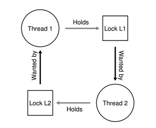
* Ciclo indicativo de un *Deadlock*.

En un caso simple con asegurar el orden de adquisicion de los *locks* bastaria para evitar el problema, pero en codigos mas complejos es necesario construir un sistema de *locking* que evite el *deadlock* potencial en las dependencias circulares que ocurren naturalmente en el codigo.
<br>Otra razon por la que ocurren *deadlocks* es debido a la **Encapsulacion** de las implementaciones y las construcciones en forma modular, las cuales pueden interaccionar con los *locks*.

#### Condiciones para un *Deadlock*

Se deben cumplir todas las condiciones para que ocurra un *deadlock*:
* ***Mutual Exclusion***: Hilos reclaman control exclusivo sobre recursos que necesitan.
* ***Hold-and-wait***: Hilos mantienen recursos asignados a ellos (por ejemplo: *lock*) mientras esperan por recursos adicionales (otro *lock*).
* ***No Preemption***: Los recursos no pueden ser removidos "a la fuerza" de los hilos que los tienen.
* ***Circular Wait***: Existe una cadena circular de hilos de forma que cada hilo mantiene control de uno o mas recursos que estan siendo solicitados por el siguiente hilo en la cadena.

#### Prevenir *Circular Wair*

Una forma de prevenirlo es escribir codigo proveyendo un orden total en la adquisicion de los *locks*. En sistemas complejos con muchos *locks* esto es complicado y se usa un orden parcial para estructurar la adquisicion.
<br>Tanto orden total como parcial requieren un cuidadoso diseño de estrategias de *locking*. Al ser solo una convencion, un programador que ignore el protocolo puede causar *deadlocks*.

#### Prevenir *Hold-and-wait*

Puede ser evitado adquiriendo atomicamente todos los *locks* a la vez. Esto requiere un *lock* global de prevencion que debe ser adquirido antes que los demas, lo cual genera algunos problemas; se necesita saber con anterioridad que *locks* requiere el hilo para obtenerlos de antemano, lo cual se complica con la encapsulacion. Esto disminuye drasticamente la concurrencia ya que los *locks* son controlados antes, en vez de serlo solo cuando son necesarios para el hilo, disminuyendo tambien el rendimiento.

#### Prevenir *No Preemption*

Generalmente los *locks* se encuentran en estado *held* hasta la llamada de `unlock()`, por lo que los hilos se mantienen esperando. Algunas librerias proveen rutinas para tratar de obtener el *lock* (*trylock*) que devuelvan un codigo de error este si esta en control de otro hilo (*held*).
<br>Esto genera un nuevo problema; si dos hilos intentan esto y fallan continuamente en conseguir el *lock*, no se produce un *deadlock* pero el programa no progresa; un ***Livelock***. Una solucion es poner un retraso (generalmente aleatorio) antes de reintentar, disminuyendo las posibilidades de competencia entre hilos. Esto significa retomar un *lock* por la fuerza, solo posibilita tratar de obtener el *lock*.

#### Prevenir *Mutual Exclusion*

La tecnica es evitar la necesidad de exclusion mutua. Para ello se pueden construir estructuras de datos que no requieran *locks* explicitos (*lock-free*) usando instrucciones de hardware.

#### Evitar *Deadlocks* a Traves del *Scheduler*

En vez de prevenir *deadlocks*, se los evita. Requiere conocimiento global de que *locks* pueden ser solicitados por los hilos durante su ejecucion, para que el *scheduler* los ejecute de forma tal que se garantice que no ocurra un *deadlock*. Este enfoque disminuye la concurrencia; no es muy usado.

#### Detectar y Recuperarse

Ante la ocurrencia de un *deadlock*, emplear un sistema de deteccion y recuperacion. Un detector corre periodicamente, construyendo un grafico de los recursos y chequeando por ciclos. Si hay un *deadlock* se elimina uno de los procesos o, en casos graves, se reinicia todo el sistema.

# Persistencia

## Capitulo 36: Dispositivos I/O

Los dispositivos de entrada/salida (I/O) son un componente fundamental de cualquier sistema informatico. Su importancia es tal que un sistema sin ellos pierde su proposito. Un programa sin ninguna entrada siempre producira el mismo resultado, volviendose predecible y limitado. Por otro lado, un programa sin ninguna salida ejecuta sus calculos en el vacio, sin un proposito visible para el usuario. Para que los sistemas informaticos sean funcionales e interesantes, tanto la entrada como la salida son requisitos indispensables.

### Arquitectura del Sistema

La arquitectura fisica de un sistema informatico es el punto de partida para entender la interaccion con los dispositivos I/O. Esta estructura no es arbitraria; responde a limitaciones impuestas por la fisica y el coste, optimizando el rendimiento al colocar los componentes mas rapidos y costosos mas cerca de la unidad central de procesamiento (CPU).

#### Arquitectura Clasica

La arquitectura "clasica" organiza el sistema en una jerarquia de buses compartidos.

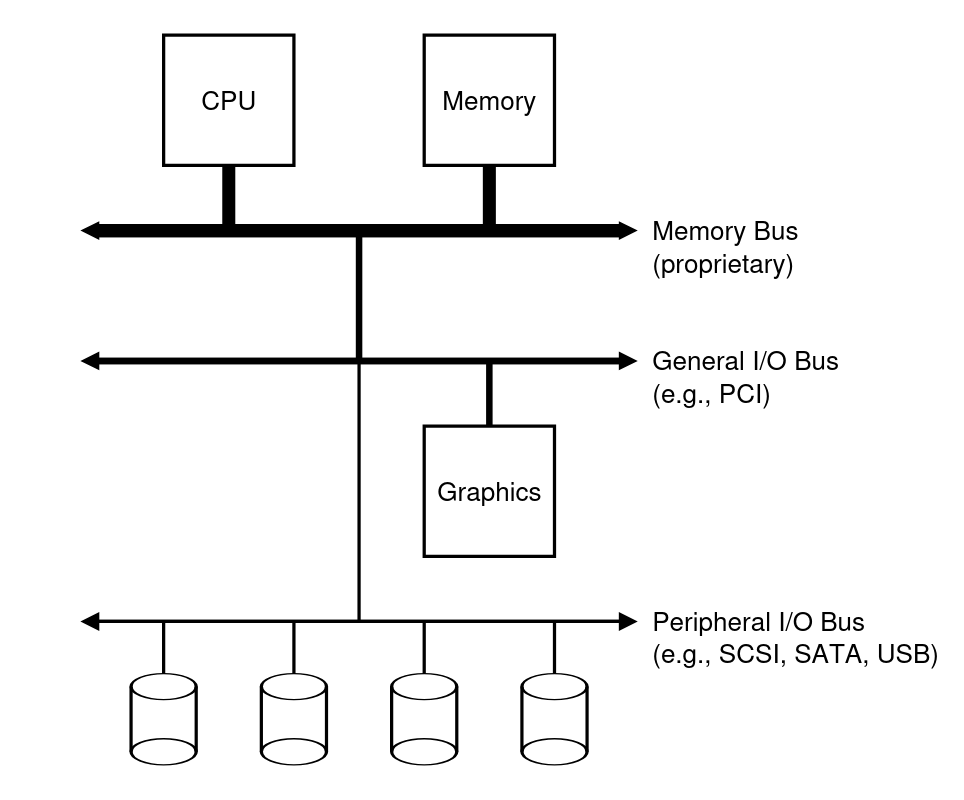
* Jerarquia de conexiones; sistema de arboles. Las interfaces (conectores) usadas por los dispositivos son estandar para todos los fabricantes y deben corresponderse en compatibilidad fisica, electrica y logica (protocolo de comunicacion).

En la imagen se ve una arquitectura de sistema prototipico, representando visualmente el compromiso entre velocidad, coste y distancia fisica a la CPU. En la cima, la CPU y la memoria se conectan mediante un "**Bus de Memoria**" corto y de alta velocidad. De este, se deriva un "**Bus General de I/O**" (por ejemplo, PCI) mas lento para dispositivos de alto rendimiento como una tarjeta grafica. En la base de la jerarquia, un "**Bus Periferico de I/O**" (por ejemplo, SCSI, SATA, USB) se conecta al bus general, agrupando dispositivos de bajo rendimiento como discos, teclados o ratones, que puedan tolerar una mayor latencia y un menor ancho de banda.

Esta estructura jerarquica se justifica por dos razones principales:
1. **Fisica**: Los buses de alta velocidad, como el bus de memoria, deben ser fisicamente cortos para mantener la integridad de la señal. Esto limita el numero de dispositivos que se pueden conectar directamente.
2. **Coste**: La ingenieria de buses de alto rendimiento es cara. Por ello, se reserva para componentes criticos como la memoria y los graficos, mientras que utilizan dispositivos mas lentos se agrupan en buses perifericos mas economicos y largos, que puedan acomodar un mayor numero de dispositivos.

#### Arquitectura Moderna

En sistemas modernos han evolucionado para superar los cuellos de botella de los buses compartidos, adoptando arquitecturas mas complejas que utilizan interconexiones **Punto a Punto** de alta velocidad. Este salto evolutivo permite conexiones dedicadas para los componentes mas exigentes.

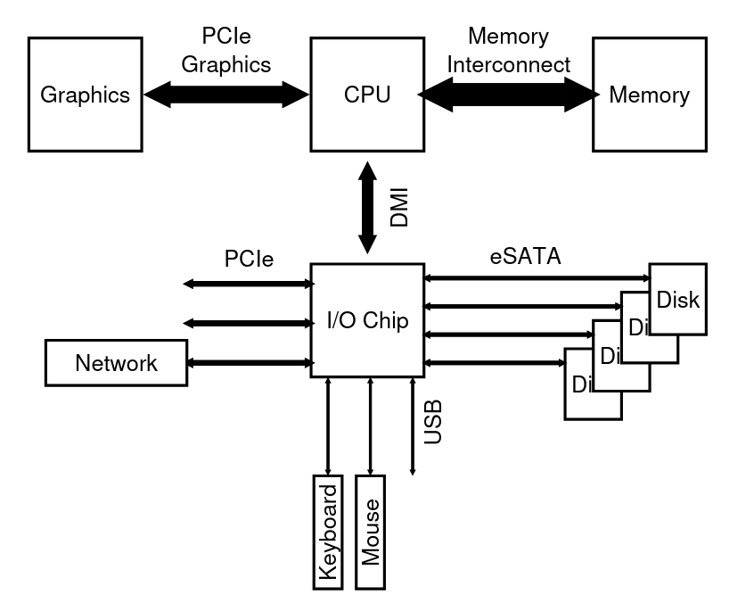

En el diagrama se muestra una arquitectura de sistema moderna que muestra el cambio hacia conexiones dedicadas. La CPU tiene enlaces punto a punto de alto rendimiento con la memoria y la tarjeta grafica (via PCIe), evitando la contencion de un bus compartido. La CPU se comunica con un "**Chip de I/O**" centralizado (a traves de DMI), que actua como un concentrador para el resto de los perifericos, ofreciendo conexiones especializadas como eSATA para discos, USB para dispositivos de bajo rendimiento y ranuras PCIe adicionales para componentes de alto rendimiento como una tarjeta de red.

En esta configuracion, la CPU mantiene conexiones directas y de alto rendimiento con la memoria y los graficos. El resto de los dispositivos se conectan a un chip de I/O centralizado, que gestionan las diferentes interfaces (como eSATA, USB y PCIe) para los perifericos.

### Dispositivos Canonicos

Para entender los principios de interaccion con el hardware sin perdernos en detalles de cada dispositivo especifico (discos, tarjeta de red, etc), es util emplear un modelo abstracto o "canonico". Este modelo representa las caracteristicas comunes a la mayoria de los dipositivos de I/O.

Un dispositivo canonico consta de dos componentes claves:
* **La Interfaz de Hardware**: Es la cara que el dispositivo presenta al SO. Se compone de un conjunto de registros (estado, comando, datos) que el software del sistema puede leer y escribir para controlar el dispositivo. Es analoga a la API de un software.
* **La Estructura Interna**: Esta es la parte especifica de la implementacion del dispositivo, responsable de ejecutar las operaciones. Puede variar desde un simple conjunto de chips hasta un sistema complejo con su propio microcontrolador, memoria y software interno especializado, conocido como ***Firmware***.

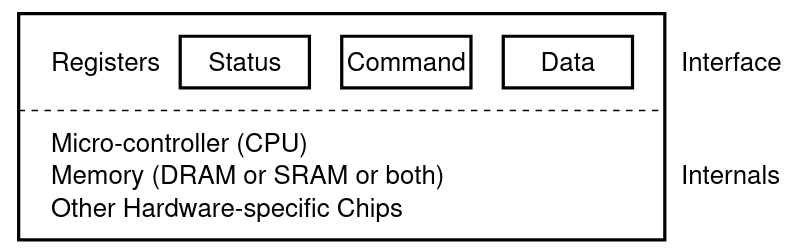
* Ejemplo de dispositivo de hardware canonico y sus partes principales

En el diagrama se muestra un dispositivo canonico que ilustra la separacion entre la interfaz de control y la logica de implementacion. La seccion "interfaz" muestra los tres registros (estado, comando, datos) que el sistema puede manipular externamente. La seccion "Interna" representa la caja negra de la implementacion, que contiene un microcontrolador (CPU), memoria y "otros chips especificos de hardware" que realizan el trabajo real.

Estos dispositivos son computadoras en si mismas (poseen CPU, registros, RAM, ROM, protocoloes de comunicacion) que corren un software interno especializado, conocido como ***Firmware***.
<br>Los dispositivos tambien pueden diferenciarse por como comparten datos entre si; los de **Bloque** permiten que se pueda volver a leer informacion que ya se paso, y de **Caracter** no.

El SO utiliza la interfaz de hardware siguiendo un conjunto de reglas o protocolos para comunicarse con el dispositivo y solicitarle que realice tareas.

### Protocolo

El dispositivo de ejemplo esta compuesto por 3 registros, a traves de los cuales el SO lo controla:
* ***Status Register***, el cual muestra el estado del dispositivo.
* ***Command Register***, el cual le indica al dispositivo que realice cierta tarea.
* ***Data Register***, el cual envia o recibe datos.

```c
while (STATUS == BUSY); // wait until device is not busy

Write data to DATA register
Write command to COMMAND register
  (starts the device and execute the command)

while (STATUS == BUSY); // wait until device is done with your request
```
* Interaccion tipica del SO con un dispositivo

Un protocolo de comunicacion es el conjunto de pasos que el SO debe seguir para interactuar con la interfaz de un dispositivo. El protocolo mas basico y sencillo se basa en el **Sondeo** (***Pollin***).
<br>Este protocolo se desarrolla en cuatro pasos:
1. **Sondear el Estado**: El SO lee repetidamente el registro de estado del dispositivo en un bucle, esperando a que el bit de "ocupado" (*BUSY*) se desactive. Esta espera activa es precisamente lo que se conoce como **Sondeo** (***Polling***) y asegura que el dispositivo esta listo para recibir un nuevo comando.
2. **Transferir Datos**: El SO escribe los datos necesarios para la operacion en el registro de datos del dispositivo. Cuando la CPU se encarga directamente de este movimiento de datos, la tecnica se conoce como **Entrada/Salida Programada** (***Programmed I/O*** o ***PIO***).
3. **Enviar el Comando**: El SO escribe el comando deseado (por ejemplo, "leer", "escribir") en el registro de comando. Esta accion inicia la operacion en el dispositivo.
4. **Esperar la Finalizacion**: El SO vuelve a sondear el registro de estado en un bucle, esperando a que el dispositivo complete la operacion y deje de estar ocupado.

Aunque este protocolo es funcional por su simplicidad, su principal desventaja es la ineficiencia. El sondeo consume ciclos de CPU de manera activa mientras simplemente espera, un tiempo que podria ser utilizado por otros procesos para realizar trabajo util.

### Reduccion de la Sobrecarga (*Overhead*) de la CPU con Interrupciones

El protocolo anterior resulta ineficiente ya que haciendo *polling* de un dispositivo lento desperdicia demasiado *CPU time*. Esto puede evitarse, por ejemplo, cambiando en un *context switch* al proceso que espera por otro que pueda aprovechar el CPU. Luego, cuando el dispositivo termine su operacion, puede enviar un *hardware interrupt*, causando un ***Interrupt Handler*** que despierte al proceso que hizo I/O.
<br>De esta forma, los *interrupts* permiten hacer ***Overlap***; superponer procesos para que cuando uno se bloquee esperando un I/O, otro pueda ejecutarse en ese tiempo.

Este enfoque no resulta eficiente para dispositivos rapidos, los cuales se ven relentizados por los *context switch*. Tampoco para *networks*, donde muchos paquetes pueden generar cada uno un *interrupt* y llevar a un ***Livelock*** donde el SO no pueda ejecutar ningun *user program*.

Por ello, si el dispositivo es rapido se hace ***Polling***, y si es lento se usan ***Interrupts***. Si no se conoce la velocidad del mismo (o esta puede variar) se usa un enfoque **Hibrido** de **Dos Fases**, haciendo *polling* por un corto periodo y lanzando una interrupcion si el dispositivo no termino.

Otra optimizacion basada en *interrupts* es el ***Coalescing***, en el cual un dispositivo que requiere un *interrupt* espera un poco antes de entregarlo al CPU. Mientras tanto, otros pedidos de I/O podrian terminar, pudiendo juntar multiples *interrupts* en uno solo, disminuyendo asi el ***Overhead***.

### Movimientos de Datos mas Eficientes con DMA

Cuando ocurre un PIO (I/O con el CPU involucrado) encargado de transferir un bloque de datos a un dispositivo, el CPU se sobrecarga con una tarea trivial, ya que enviar datos es lento. 

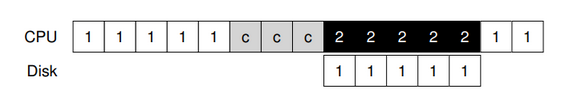
* Tiempo de CPU en ejecucion y en el cpiado de memoria principal hacia el dispositivo (c).

La solucion a ello es usar un ***Direct Memory Access*** (DMA); un dispositivo especifico encargado de hacer transferencias de datos entre otros dispositivos y la memoria principal sin intervencion del CPU. Para usarlo, el SO informa al DMA donde se encuentran los datos en memoria, cuantos debe copiar, y a que dispositivo debe mandarlos. Luego, el CPU queda libre y puede realizar otra tarea.
<br>Cuando el DMA termina, hace un *interrupt* que le da a conocer al SO que la transferencia ya termino, pudiendo el proceso que realizo el I/O retomar su ejecucion.

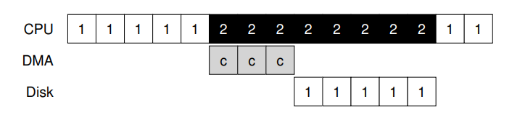
* Tiempo de copiado de memoria al disco desacoplado al del CPU, gracias al uso de un DMA.

### Metodos de Interaccion con Dispositivos

Para la comunicacion entre el SO y los dispositivos se pueden utilizar dos metodos diferentes:
* **Tener Instrucciones de I/O Explicitas**, las cuales especifican una manera en la que el SO puede mandar datos a los registros de un dispositivo especifico, permitiendo la construccion de protocolos como el ya visto. Dichas instrucciones son privilegiadas y el SO es la unica entidad con permisos para manejar los dispositivos.
* **Usar una ***Memory-Mapped I/O***** (memoria mapeada) con la cual el hardware hace que los registros de los dispositivos se vean como direcciones de memoria, las cuales pueden ser accedidas por el SO mediante un *load* (*to read*) o un *store* (*to write*) en la direccion. Es el hardware quien direciona dicha accion al dispositivo.

### *Drivers* de Dispositivos

Para que los dispositivos, cada uno con su interfaz especifica, puedan encajar en los distintos SO generales, se utilizan una **Abstraccion** en el nivel mas bajo llamada el ***Device Driver***; la pieza de software en el SO que sabe en detalle como funciona el dispositivo. Cualquier forma de interaccion con el mismo esta encapsulada en su interior. Son necesarios para cualquier dispositivo que se conecte al sistema, los cuales son descubiertos y cargados por el kernel.


* *Stack* del sistema de dispositivos usados por Linux.

En la imagen se puede ver que un sistema de archivos (o una aplicacion por encima de este) le pasa inadvertida la especificacion de que clase de disco se esta usando; simplemente realiza un pedido de ***Block*** *read/write* al bloque generico, el cual redirecciona al ***Driver*** de dispositivo apropiado, el cual maneja los detalles de ejecutar el pedido especifico.
<br>El diagrama tambien muestra la interfaz ***Raw*** a los dispositivos, la cual permite aplicaciones especiales (como un ***File-System Checker*** o una herramienta de **Desfragmentacion de Discos**).

---

## Capitulo 37: Discos Duros

Los *drivers* son la principal forma de persistencia de almacenamiento de datos en los sistemas de computadoras y la mayor parte de los sistemas de archivos se basan en su comportamiento.

### La Interfaz

El *driver* de un disco consiste en un numero de **Sectores** (bloques de 512 bytes) los cuales pueden ser leidos o escritos y estan numerados de 0 a `n-1`, para un disco de `n` bloques. Eso es llamado el ***Address Space del Driver***. Un disco puede ser visto como un array de sectores.

Las operaciones con multiples sectores son posibles y muchos *File System* pueden leer o escribir 4KB a la vez (o mas), pero cuando se escribe en el disco el *driver* solo asegura la Atomicidad en la escritura de bloques de 512 bytes. Por ende, si la computadora se apaga solo una parte de la escritura se guarda (esto es llamado ***Torn Write*** o **Lectura Rasgada**).
<br>Se asume que el acceso a dos bloques cercanos entre ellos dentro del *driver address space* es mas rapido que si estuvieran lejos uno del otro, y que acceder a los bloque de forma secuencial, uno detras de otro, es la forma mas rapida de hacerlo.

### Geometria

El primer componente de un disco es el ***Platter*** (**Plato**); una superficie circular dura donde los datos son almacenados de forma persistente al inducir cambios magneticos. Un disco puede tener uno o mas platos y cada uno de ellos tiene dos lados llamados ***Surface*** (**Superficie**).

Los platos estan unidos alrededor del ***Spindle*** (**Eje**) el cual esta conectado a un motor que gira los platos a un ritmo constante (fijo y preestablecido) medido en **Rotaciones por Minuto** (**RPM**). Por ejemplo, un disco moderno con ritmo de 10000 RPM implica que cada rotacion dura 6 ms.

Los datos son codificados en sectores circulares concentricos llamados ***Tracks*** (**Pistas**). Una sola superficie contiene cientos de pistas, cada una con cientos de sectores los cuales son la unidad minima de informacion que puede ser leida o escrita. El conjunto de las pistas con igual radio (misma distancia al eje), de ambas caras de todos los platos, son llamado un **Cilindro**.

Para leer y escribir en la superficie se utiliza un ***Disk Head*** (**Cabezal del Disco**); mecanismo que permite sentir (no toca al plato) los patrones magneticos o introducir un cambio en ellos. Hay uno por superficie (dos por plato) y esta unido a un ***Disk Arm*** (**Brazo del Disco**), el cual se mueve a traves de la superficie para poner el cabezal encima de la pista deseada.
<br>La rapidez de movimiento de estas dos partes es el principal limitante en la velocidad de estos dispositivos. Este cuello hace que sea muy importante colocar los datos de forma lo mas continua posible (desfragmentada).

Asi, cualquier informacion en disco se lee/escribe siguiendo un sistema de cuatro "coordenadas"; plato, superficie, pista y sector.

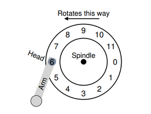
* Una pista de un plato, con su correspondiente eje, brazo y cabezal sobre el sector seis.

### Latencia de una Sola Pista: Retraso Rotacional

Para procesar un pedido, estando ya dentro de la pista deseada, el disco debe esperar que el sector deseado rote hasta estar bajo el cabezal. Esto es el ***Rotation Delay*** (**Retraso Rotacional**).
<br>Si el retraso de rotacion total del plato es `R`, el disco debera esperar un promedio `R/2` para que el bloque deseado este bajo el cabezal (o, en el peor de los casos, espera `R`).

### Tiempo de Busqueda: *Seek Time*

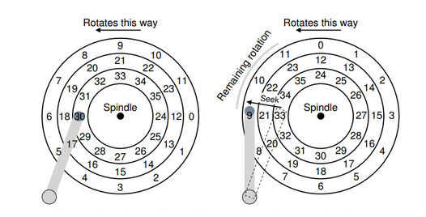
* Ejemplo de disco con multiples pistas con un *set* de sectores cada una.

Los discos modernos tienen multiples pistas. Un pedido de lectura (en el ejemplo, al sector 11) implica que, antes de poder esperar a la rotacion del sector deseado, el brazo debe mover el cabezal a la pista correcta. El tiempo promedio de ese proceso es llamado ***Seek Time*** (**Tiempo de Busqueda**).

Recien una vez el sector se encuentra bajo el cabezal se puede iniciar la fase de transferencia de datos. El tiempo de la operacion es la suma del *seek time* y el retraso de rotacion.

$$
SeekTime + RotationDelay
$$

#### Otros Detalles

Mientras el brazo se mueve para cambiar de pista, el disco sigue rotando. Por ello, muchos *drivers* emplean algun tipo de ***Track Skew*** (**Desviacion de la Pista**), haciendo que el primer sector de una pista no este alineado con el ultimo de la pista anterior, para asegurar que las lecturas secuenciales sean eficientes cuando se cruza ese limite (cambio de pista).

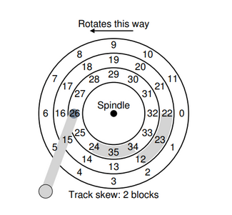
* *Tack Skew* de datos secuenciales (sectores 23 y 24) en pistas diferentes.

Las pistas exteriores tienen mayor longitud y por lo tanto mas sectores que los interiores, por lo que son llamadas ***Multi-Zoned Disk Drivers*** (**Multi Zonas del Disco**). A igual cantidad de sectores (como en la imagen) las pistas interiores tendran mayor dencidad de informacion.

Una parte importante de los discos es el **Cache**, algunas veces llamado ***Track Buffer***. Es una pequeña memoria que el disco usa para mantener datos que fueron leidos del disco o escrito.
<br>Por ejemplo, si el *drive* esta leyendo un sector de una pista puede decidir leerlos todos y guardarlos en el cache por si hay un uso posterior en el corto plazo, ahorrando asi tiempo. En escritura, el *drive* puede elegir informar que la escritura se ha completado cuando los datos estan en su memoria cache (***Write Back Caching***, rapido pero riesgoso), o cuando se han terminado de escribir en disco (***Write Through***).

La interfaz fisica de comunicacion del disco es lo que limita la velocidad de transferencia del mismo con la computadora. Los estandares de interfaz son, por ejemplo, SATA, USB, etc.

### Calculo de Tiempo de I/O

La performance de un disco, en particular su ***I/O Time***, puede ser representado como:

$$
T_{I/O} = T_{seek} + T_{rotation} + T_{transfer}
$$

Esto es asi porque leer/escribir un dato consta de esos tres momentos (posicionar el cabezal en la pista indicada (***seek***), esperar a que el disco rote para que el bosque se posicione bajo el cabezal (***Rotation Delay***), y por ultimo leer/escribir efectivamente el sector (**Tiempo de Transferencia Maxima** (sin mover cabezal, no la promedio), dado por el ancho de banda maximo)).

El ritmo del I/O **($R_{I/O}$** o **Tasa de Transferencia de Lectura al Azar**) para un tamaño de datos se usa para comparar discos y es el tamaño transferido dividido por el tiempo que tomo:

$$
R_{I/O} = \frac{Size_{Transfer}}{T_{I/O}}
$$

No confudir con la velocidad de transferencia dada en las tablas de decripcion de los discos, la cual hace referencia a la velocidad para datos secuenciales.

Para analizar la diferencia en desempeño, los tipos de cargas de trabajo pueden dividirse en **Accesos Random** (aleatorio) o ***Sequential*** (secuenciales), y los discos pueden ser separados en los centrados en ***High Performance*** (alto desempeño, altas rotaciones, bajo *seek time*, transferencias rapidas) o en ***Capacity*** (capacidad de datos).
<br>La mayor diferencia de desempeño entre los discos centrados en *performance* o capacidad se ve ante cargas de trabajo de accesos aleatorios, pero son "casi" iguales para accesos secuenciales.

Por ejemplo, para calcular cuanto tardaria un acceso random de 4KB *read* en un disco *high performance*, usamos los datos del fabricante:

$$
T_{seek} = 4ms\\
T_{rotation} = 2ms\\
T_{transfer} = 30 microsecs
$$

* $T_{seek} = 4ms$ es un promedio, no la busqueda total (la  cual puede ser mas del doble).
* El *delay* ($T_{rotation}$) se calcula directamente de los RPM; 15000 RPM son 250 RPS, por que cada rotacion son 4ms, y el disco tendra un promedio de media rotacion de 2ms.
* El $T_{transfer}$ es el tiempo que toma la operacion, dada la tasa de transferencia (velocidad, dato) y el tamaño del archivo. No es para averiguar cuanto tiempo demora en comenzar.

Asu, $T_{I/O} = 4ms + 2ms + 0,03ms = 6,03ms$, por lo que el $R_{I/O}$ para 4KB es de $\frac{4KB}{6,03ms} = 0,66MB/s$.

### Planificacion en el Disco

Frente a varios pedidos de I/O, el SO los administra mediante el ***Disk Scheduler*** el cual examina los pedidos y decide cual correr a continuacion (orden). A diferencia del *scheduler* de procesos, el de disco puede hacer una aproximacion bastante acertada de cuanto va a tardar un I/O (al calcular *seek time* y el posible retraso de rotacion) por lo que puede elegir ejecutar primero al pedido que menos va a tardar en completarse (seguir el principio de *Shortest Job First* (**SJF**)).

#### SSFT: *Shortest Seek Time First*

Ordena la lista de *request* (pedidos) de I/O por pista y elige el *request* mas cercano a completarse en esa pista, y asi en cada pista. No es ideal porque la geometria del *drive* no esta disponible para el SO; solo es un array de bloques (no ve su forma circular en el plato del disco).
<br>Esto se puede arreglar implementando ***Nearest-Block-First*** (**NBF**) (**El Bloque Mas Cercano Primero**), pero aun asi mantiene el problema de la ***Starvation*** para las pistas cuando hay muchos *requests* en la misma pista interior.

#### *Elevator* (SCAN)

Este algoritmo hace que el cabezal se mueva atras y adelante a traves del disco respondiendo a *request* en orden a traves de las pistas. Un solo paso a traves del disco en un ***sweep***. Si hay un *request* en una pista que ya se visito en este *sweep* debera esperar al siguiente en cola.

Hay variantes de este algoritmo, como **F-SCAN** que congela la cola de pedidos cuando hace *sweep* y los pedidos que lleguen durante el *sweep* van a otra cola para ser atendidos luego, o **C-SCAN** (*circular scan*) que en vez de hacer *sweep* en ambas direcciones a traves del disco, solo cambia desde el exterior al interior, y va de vuelta a la exterior directamente para empezar de nuevo.
<br>C-SCAN es mas justo para que las pistas exteriores e interiores, ya que SCAN favorecia las interiores visitandolas dos veces. Por sus caracteristicas, suele ser llamado ***Elevator Algorithm***.

#### SPTF: *Shortest Positionen Time First*

Las dos politicas de *scheduler* anteriores seguian el principio de SJF pero ignoran el tiempo de rotacion. SPTF elige el siguiente *request* a cumplir dependiendo del tiempo relativo del *seek* comparado a la rotacion. Si el *seek time* es mas alto se usa **SSFT**, pero si el *seek* es mas rapido que la rotacion, SPTF sirve para mejorar la *performance*.

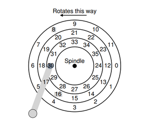
* En este ejemplo, convendria responder al pedido del bloque 8 antes que el 16.

#### Otros Problemas de *Scheduling*

En los discos pueden acomodar multiples pedidos y tener sofisticado *schedulers* internos ellos mismos, por lo que el ***Scheduler del SO*** solo le pasa los pedidos que ve como las mejores opciones al *scheduler* del disco el cual, con el conocimiento de la posicion del cabezal, y de otros parametros, realiza el *scheduling* final.

Otra tarea hecha por los *schedulers* del disco es el **I/O Merging**; ante un pedido de, por ejemplo, los bloques 33 y 34, el *scheduler* los combina en uno solo del bloque 33, reduciendo *overheads*.

El SO puede seguir una politica de enviar los pedidos de I/O al disco tan pronto como los recibe, lo cual es llamado ***Work-Conserving*** (el disco nunca para mientras haya pedidos), o esperar un poco por si llega un nuevo y mejor pedido de I/O, lo cual es denominado ***Non-Work-Conserving*** y mejora la eficiencia general.

---

## Capitulo 38: RAID

---

## Capitulo 39: Archivos y Directorios

Un dispositivo de almacenamiento persistente (***Persisten Storage***), como un **Disco Duro** o un **Disco de Estado Solido**, almacena informacion de forma permanente (al menos un largo tiempo).

### Archivos y Directorios

Para la virtualizacion del almacenamiento se utilizan dos abstracciones clave:

El **Archivo** (***File***) es un array de bytes, donde cada uno puede ser escrito o leido. Cada archivo tiene un ***Low-Level Name*** (El Nombre por el cual el SO lo identifica), normalmente un numero llamado ***Inode Number***.

La mayoria de los SO no conoce la lectura del archivo (imagen, archivo de texto, etc); la unica responsabilidad del ***File System*** (**Sistema de Archivos**) es almacenar dichos datos de forma persistente en el disco para que esten disponibles al ser requeridos.
<br>El **Directorio** (***Directory***) tiene un *low-level name* y su contenido es una lista de pares "**Nombre** que ve el usuario" y "***Low-Level Name***" (un diccionario que asocia nombres e *inode numbers*).
<br>Los directorios son almacenados en otros directorios, creando asi un **Arbol de Directorios** (o **Jerarquia de Directorios**; ***Directory Hierarchy***). Dicha jerarquia comienza en un **Directorio Raiz** (***Root***) y se usa un **Separador** para nombrar los subsecuentes **Sub-Directorios** hasta el archivo o directorio deseado. Siguiente dicho nombre se puede obtener el ***Absolute Pathname*** (**Ruta Absoluta**). Los directorios y archivos pueden tener el mismo nombre mientras no esten en la misma localizacion del arbol del sistema de archivos.

Los archivos suelen tener dos partes en su nombre separadas por un punto; la primera es el nombre del mismo y la segunda indica el **Tipo** de archivo. Esto es solo una **Convencion**, no hay nada que asegure que un archivo contenga lo que declara contener.
<br>Si un archivo pesa menos de 12 bits, puede ser guardado directamente en el **Inode** (en lugar de en un bloque de data) para ahorrar espacio.

La relacion entre el tamaño de los archivos (*file size*, FS) y el espacio que verdaderamente usa en el disco (*Disk Usage*, DU) puede ser:
* **FS > DU**: El sistema "miente" indicando espacio libre que en realidad no esta disponible, apuntando a un bloque de disco que no existe.
* **FS = DU**: Ocurre en sistemas como Ext4.
* **FS < DU**: Sucede al guardar archivos menores al tamaño minimo de bloque, o al guardar una traza de *inodes* de forma secuencial.

### Interfaz del *File System*

Las siguientes son diferentes formas en las que un *file system* permite interactuar con el almacenamiento persistente y las abstracciones creadas sobre este:

#### Crear archivos

Puede hacerse con la *system call* ***Open*** con la *flag* ***O_CREAT***.:

```c
int fd = open("foo", 0_CREAT | 0_WRONLY | O_TRUNC, S_IRUSR | S_IWUSR);
```

Las ***Flags*** del ejemplo indican que si el archivo no existe, debe ser creado (***O_CREAT***), que solo puede ser escrito (***O_WRONLY***), y que, si el archivo ya existe, debe ser truncado a 0 bytes borrando su contenido (***O_TRUNC***). El tercer parametro especifica los **Permisos** que tendra el archivo, haciendo que pueda ser leido y escrito por el creador (***S_IRUSR | S_IWUSR***).

La funcion `open` devuelve un ***File Descriptor*** (**FD**); un entero privado por cada proceso usado en sistemas UNIX para acceder a archivos; una vez es creado se utiliza el FD para leer/escribir en el mismo (si se tienen los permisos), por lo que se considera que el FD es una "***Capability***" (**Capacidad**); un poder para realizar cirtas operaciones.

Los *file descriptors* son manejados por el SO y almacenados en la estructura del proceso. Un array (con un numero maximo) mantiene un registro de los archivos que tienen abierto a la vez cada proceso. Cada entrada del array es un puntero a la **Estructura del Archivo**, y permite ver la informacion del mismo.

#### Leer y Escribir en Archivos

Para acceder y leer un archivo ya existente se debe abrir (`open`) el archivo y luego usar la *syscall* ***Read***. Recordar cerrar el archivo.

```shell
prompt> strace cat foo
...
open("foo", O_RDONLY | O_LARGEFILE)     =3
read(3, "hello\n", 4096)                =6
write(1, "hello\n", 6)                  =6 
hello
read(3, "", 4096)                       =0
close(3)                                =0
...
prompt>
```
* Ejemplo de traza de *system calls* llamadas por `cat` sobre el archivo `foo`. Para rastrear las *syscalls* hechas por un proceso durante su ejecucion se usa ***Strace***.

En el programa de ejemplo se abre un archivo solo para lectura. `open` devuelve el FD 3 (3 porque cada proceso ya tiene abiertos 3 FD: 0 para `stdin`, 1 para `stdout` y 2 para `stderr`), por lo que a partir de ahora el SO ya sabe a que archivo se refiere el proceso con FD 3. El primer `read` lee "hello", luego usa `stdout` FD = 1 para escribir (`write`) por pantalla lo que leyo. Al intentar leer nuevamente ve que ya no queda nada por leer, por lo que cierra el archivo con `close(3)` (refiriendose al FD 3).

#### Leer y Escribir en Archivos No Secuenciales

Para escribir o leer de un archivo de forma no secuencial, sino desde un lugar determinado, se usa un ***Offset*** para indicar el lugar de comienzo (a diferencia del caso anterior que usaba el principio del archivo). Para ello se usa la *system call* ***Lseek***.

```c
off_t lseek(int fildes, off_t offset, int whence);
```

El primer argumento usado es el **FD**, el segundo es la **Posicion** en el archivo, y el tercero determina como se realiza la **Busqueda** (absoluta, relativa o dependiendo del tamaño del archivo):
* Si `whence == SEEK_SET`, el *offset* se setea a *offset* bytes.
* Si `whence == SEEK_CUR`, el *offset* se setea a su posicion actual + *offset* bytes.
* Si `whence == SEEK_END`, el *offset* se setea al tamaño del archivo + *offset* bytes.

Parte de la abstraccion de un archivo abierto es que siempre se tiene un ***Offset Actual*** (lugar donde "se esta") que determina donde hacer el siguiente lectura/escritura., y se actualiza implicitamente cuando ocurre *read/write* de `N` bytes (*offset* = *offset* + `N`) o explicitamente con `lseek()`. El *offset* se guarda en la estructura propia del archivo, la cual tambien permite al SO determinar los permisos del mismo a que archivo se apunta (*inode*) y el *current offset*. Dichas estructuras representan a todos los archivos abiertos, y el conjunto de elleas es la ***Open Files Table***.

#### Entradas Compartidas de la *File Table*

Generalmente la relacion entre FD y una entrada en la *file table* es 1-a-1. Incluso si mas de un proceso lee el mismo archivo al mismo tiempo, cada uno tendra su propia entrada en la *open file table* ya que cada lectura/escritura es independiente y tiene su propio *offset*.

Sin embargo, una ***Entry*** en la *open file table* puede ser **Compartida**. Esto sucede cuando un padre crea un hijo con `fork()`, donde el hijo ajusta su *offset* con `lseek()` y luego se crea. Esto resulta util cuando se esta trabajando de forma cooperativa en el mismo archivo. Otro caso de *entry* compartida es el de la `dup()` *syscall*, la cual permite al nuevo proceso crear otro FD que refiera al mismo archivo que ya esta abierto. Esto es util cuando se escriben operaciones de **Redireccion** (por ejemplo, de *output*), creando un FD que apunte al archivo deseado e intercambiando el *stdout* que tienen un proceso por dicho FD.

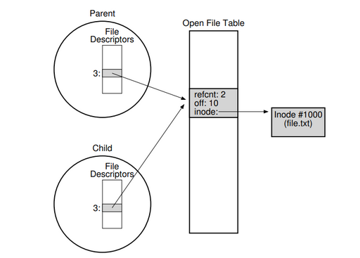
* Entrada de la *open file table* compartida por dos procesos; padre e hijo.

El campo `refcnt` (***Reference Count***, **Contador de Referencias**) indica la cantidad de procesos que han abierto el archivo de la *entry*, la cual solo sera removida cuando tal contador llegue a 0.

#### Escribir de Forma Inmediata

Cuando un proceso llama a `write()` le solicita al SO que escriba ciertos datos en **Almacenamiento** persistente en algun momento del futuro cercano. El *file system*, por razones de desempeño, **Amortigua** (***Buffer***) dichos `writes` en memoria por algun tiempo antes de ser ejecutados por el dispositivo de almacenamiento. Aunque este proceso puede ser rapido, hay casos en los que un *crasheo* puede llevar a la perdida de dicha memoria si esta aun no llego a escribirse en disco.

Para aplicaciones **Criticas**, existen protocolos de recuperacion de datos que necesitan la habilidad de **Forzar** escritura a disco. El *file system* de UNIX provee una API llamada `fsync(int fd)`, la cual fuerza a escribir todos los datos **Sucios** (***Dirty***, aun en el *buffer*) al disco, en el archivo especificado por el FD, y retornar cuando todos los `writes` se hayan completado.

#### Renombrar Archivos

En una linea de comandos puede lograrse con el comando `mv`, el cual llama a la *syscall* `rename(char *old, char *new)`, que toma el nombre viejo y el nuevo. La *syscall* `rename` es critica, por lo que normalmente es ejecutada de forma atomica.

#### Obtener Informacion Sobre Archivos

El sistema mantiene ciertas informacion sobre cada archivo, la cual es llamada ***Metadata***. Para leerla se usan las *syscalls* `stat()` y `fstat()`, las cuales toman un *pathname* o FD a un archivo y leen una estructura `stat` en la cual se encuentran datos como *size*, *inode number*, *ownership*, ultima vez que fue accedido o modificado, etc,
<br>La mayoria de los sistemas guardan esta informacion en una estructura llamada ***Inode***, los cuales estan en disco pero normalmente se copian a memoria aquellos que estan en uso para lograr un acceso mas rapido (ya que seguramente deban ser actualizados).

#### Eliminar Archivos

El comando `rm` usa, entre otras llamdas varias, la *syscall* `unlink()`, la cual toma el archivo a ser removido y devuelve 0 si tiene exito. Notar que su nombre es `unlink`, no *delete* ni *remove*.

#### Crear Archivos

Se utiliza la *syscall* `mkdir()`. Una vez creado el directorio, este se considera vacio aunque se genera con dos entradas dentro; **Si mismo** y su "**Padre**" ("padre" en el arbol de directorios).

No se puede escribir directamente en un directorio; usar `write()` escribiria en la metadata del mismo, la cual esta protegida por el *file system*. Debe escribirse en el directorio de forma **Indirecta**, ya que es la forma en la que el sistema protege la integridad de los directorios.

#### Leer Directorios

En vez de abrir un directorio si fuera un archivo, se usan un grupo de 3 *syscalls*: `opendir()`, `readdir()` y `closedir()`. Estas se llaman en un ciclo que lee las entradas del directorio de a una hasta que este vacio, imprimiento cada vez el **Nombre** e **Inode** del archivo que lee.

La estructura interna de un directorio (`struct dirent`) mapea el nombre de cada archivo del directorio con su *inode number* y otros datos (*offset* al siguiente *direct*, tamaño y su tipo).

#### eliminar Directorios

Los directorios se borran llamando a `rmdir()`, la cual requiere que previamente el directorio este vacio, con el fin de evitar eliminar archivos involuntariamente.

#### *Hard Links*

Una forma de crear una *entry* en el arbol del *file system* (ademas de crear un nuevo archivo) es a traves de la *syscall* `link()`, la cual toma como argumento un *pathname* viejo y uno nuevo. Al hacer `link` de un archivo viejo con uno nuevo se crea una nueva forma de referirse al mismo archivo viejo; ahora dos nombres refieren al mismo archivo (al mismo *inode number* que el archivo original) pero el archivo en si no se copia de ninguna forma.

Al generar un *file* se crea una estructura (*inode*) que contiene la informacion sobre el archivo, y luego se "linkea" un nombre que el usuario puede ver a ese *inode* y se pone ese `link` en el directorio. Al usar `unlink()` para borrar un archivo, se reduce el ***Reference Count*** (***Link Count***) del *inode number* y, si ya no ha referencias, se libera el *inode* y los bloques de memoria asigados.

#### *Links* Simbolicos

Los *hard links* son limitados ya que no se puede crear uno para un directorio (para evitar un ciclo en el arbol de directorios) y no se puede hacer un *hard link* a archivos almacenados en otras particiones del disco (porque los *inodes* solo son unicos en cada *file system*, no se comparten entre *file system*, por lo que se podria repetir el mismo numero). En estos casos se usa un ***Symbolic Link*** (o ***Soft Link***). Su creacion es similar a la de un *hard link* y funciona de la misma forma, pudiendo acceder a un mismo archivo a traves de dos nombres diferentes.
<br>La diferencia reside en que un *soft link* es un archivo en si mismo, de un tipo diferente; no es un *file* ni un directorio, sino que es de un tercer tipo. Un *soft link* esta formado por el *pathname* del archivo al que esta linkeado en forma de un dato dentro del archivo *soft link*.
<br>Por la forma en la que estan creados se abre la posibilidad de una ***Dangling Reference*** (**Referencia Colgante**) si se borra el archivo origianl (ya que eso no implica que el *soft link* se borre).

### Bits de Permiso

El *File system* presenta una virtualizacion amigable del disco. A diferencia de las abstracciones del CPU y la memoria, los archivos suelen ser compartidos entre procesos y no ser privados.

El mecanismo de ***Permission Bits*** (**Bits de Permiso**) consiste en asignar a cada archivo/directorio/*softlink* una serie de bits que determinan quien puede acceder a los mismos. se dividen en tres grupos: Lo que puede hacer el **Dueño** del archivo, lo que puede hacer alguien que pertenezca a un **Grupo**, y lo que puede hacer cualquiera (normalmente llamado ***Other***).

```shell
prompt> ls -l foo.txt
-rw-r--r-- 1 remzi wheel 0 Aug 24 16:29 foo.txt
```
* Ejemplo de Bits de permiso para un archivo; lectoescritura para el dueño, y solo permiso de lectura tanto para el grupo como para "cualquiera".

Consiste en 10 bits. El primero indica el **Tipo**; '-' para un archivo, 'd' para un directorio y '1' para un *soft link*. Los siguientes 9 indican los **Permisos**; 3 para el *owner*, los siguientes 3 para el grupo y los ultimos 3 para "cualquiera". Estos paquetes de tres consisten en un bit de ***read***, uno de ***write*** y uno de **Ejecucion**, los cuales valen 'r', 'w' y 'x' si estan permitidos, o '-' si no lo estan.

El dueño del archivo puede cambiar estos permisos son el comando `chmod`, el cual modifica el ***File Mode*** del archivo. En los directorios el bit de ejecucion otorga permiso al usuario para hacer cosas como cambiar directorios dentro del mismo, lo que en combinacion del bit de *write* permite crear archivos dentro del directorio.

Otros *file system* usan controles diferentes, como por ejemplo un ***ACL*** (**Access Control List**) por cada directorio; una forma mas poderosa de representar quien puede acceder a cada recurso.

### Crear y Montar un *File System*

Para ensamblar el arbol de directorios a partir de muchos sistemas de archivos subyacentes, se crea un nuevo *file system* y se lo monta para hacer sus contenidos accesibles. Para ello se usa la herramienta `mkfs`, la cual recibe como *input* un dispositivo (la particiion de un disco) y un tipo de *file system*, y escribe un *file system* vacio empenzando en el directorio ***root*** de esa particion.

Una vez dicho *file system* es creado, debe ser accesible dentro del *file system tree* mas general, para lo cual se usa el programa `mount`. Esta toma el ***Mount Point*** (**Punto de Montaje**) y un directorio ya existente, y pega el *file system* a montar en el arbol de directorios en ese punto.

---

## Capitulo 40: Implementacion del *File System*

El *file system* es la estructura de datos en disco que mantiene los archivos de forma consistente. El kernel mantiene diferentes ***Virtual File System*** para todos los formatods que sabe leer; UFS, FAT, exFAT, NTFS, ISO, EXT, etc. y cada particion puede tener un formato diferente (cada uno de los cuales tiene sus *features* y limitaciones).

El **VSFS** (***The Very Simple File System***) es una version simplificada de un sistema de archivos de UNIX (**UFS**: *Unix File System*) usada para instroducir diferentes estructuras del disco, metodos de acceso y politicas.

### Como Implementar un *File System*

El funcionamiento del modelo se basa en dos aspectos claves:
1. **Las Estructuras de Datos en el *File System***: Los tipos de estructuras *on-disk* (en disco) utilizadas por el *file system* para organizar sus datos y su metadata. Los sitemas mas sencillos usan estructuras simples (arrays de bloques), los mas complejos emplean estructuras de tipo arbol.
2. **Los Metodos de Acceso del *File System***: Como se mapean las llamadas hechas por los procesos (`open`, `read`, `write`) en las estructuras de datos, que estructuras se lee/estriben en la ejecucion de cada *syscall* en particular, y que tan eficientemente se ejecutan esos procesos.

### Organizacion General

En VSFS el disco es dividido en bloques, numerados de 0 a N-1, usando un tamaño unico de bloque de 4KB. La mayor parte de estos bloques es usada para almacenar datos de usuario en lo que es llamada la ***Data Region***.

La metadata que el *file system* guarda para cada archivo (permisos, tamaño, dueño, cuando se creo, cantidad de bloques asignados, etc) es guardada en una estructura llamada ***Inode***, para la cual se reserva un espacio en determinado bloques del disco llamado ***Inode Table***. La cantidad total de *inodes* almacenados (en cada bloque, por la cantidad de bloques reservados para ello) es el numero **Maximo de *Files*** que el *file system* va a poder almacenar.
<br>Generalmente, cualquier informacion en el *file system* que no sea *user data* es llamada ***Metadata***.

Las ***Allocation Structure*** (**Estructuras de Asignacion**) son usadas para determinar si los bloques estan ocupados o libres. Para ello VSFS emplea un **Bitmap**, estructura la cual usa un bit para cada bloque asignado (0 = libre, 1 = en uso). se necesita un bitmap por cada tipo de bloque a referenciar (uno para los de *inode*, otro para los de *user data*) y por simplicidad se usa un bloque para almacenar cada *inode* (por mas que un bit map de dos bloques de 4KB cada uno podria ver hasta 32KB objetos asignados).

El bloque 0 es usado para el ***Superblock*** (**Superbloque**), el cual contiene la informacion sobre el *file system* (cantidad de *inodes* y *data blocks*, inicio de la *inode table*, etc) y es leido por el SO al momento de montaje para inicializar diferentes parametros y añadir el volumen al *file system tree*.

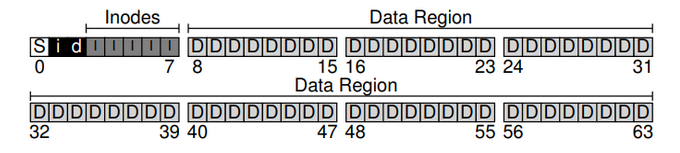
* Disco separado en N = 64 bloques, con una region de datos, una de *inodes* (*inodes table* de 5 bloques), dos bloques de bitmap y un bloque de *superblock*.

### El *Inode*

El nombre de ***Inode*** proviene de ***Index Node***, ya que originalmente los nodos se organizaban en un array. Cada *inode* esta implicitamente referenciado por un numero (el ***i-number***); el ***Low-level name*** mencionado en el capitulo anterior. En VSFS dado un *i-number* podemos calcular donde esta almacenado en el disco el *inode* al que se refiere.

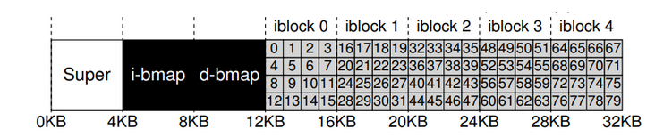
* Tabla de inodos de 20KB (cinco bloques de 4KB); 80 nodos de 256 bytes cada uno.

Por ejemplo, para leer el *inode* 32 en la tabla, el *file system* primero calcula el *offset* de la region de inodos (`inumber * sizeof(inode_t)` = 32 * 256B = 8192 B = 8 KB), lo suma a la **Direccion Inicial** de la *inode table* (12KB), y obtiene la direccion del bloque de *inodes* deseados (20KB *block*).

Los discos no son direccionables por bytes sino por sectores, normalmente de 512 B cada uno. Por ende, para señalar el bloque de *inodes* que contiene al *inode* 32, el *file system* debera primero calcular el sector en el cual se aloja el bloque. ($\frac{20KB}{512B} = \frac{20 B * 1024}{512 B} = 40$).

```c
blk    = (inumber + sizeof(inode_t)) / blocksize;
sector = ((blk * blocksize) + inodeStartAddr) / sectorSize;
```
* Ecucacion para calcular bloque y sector.

Una forma en la que el *inode* puede referirse a donde estan los bloques de datos es tener dentro uno o mas ***Direct Pointers*** (*disk addresses*, punteros directos) en donde cada puntero se refiere a un bloque que pertenece al *file*. Dichos enfoque es limitado y no funciona para archivos mas grandes que el tamaño del bloque multiplicado por el numero de punteros directos en el *inode*.

#### Indexacion de Multiple Nivel

Una forma de dar soporte a archivos mas grandes es tener un puntero especial llamado ***Indirect Pointer*** que en vez de apuntar a un bloque con *user data* apunta a un bloque con punteros que apuntan a *user data*. Si un archivo se pasa del limite de tamaño, se usa un bloque de *data region* como bloque indirecto y un *indirect pointer* del *inode* pasa a apuntar a este bloque de punteros.

Con bloques de 4KB y direcciones de disco de 4 bytes, un bloque añade 1024 punteros y un archivo (que por ejemplo, ya tenia 12 punteros directos) puede crecer hasta (12 + 1024) * 4KB = 4114KB.
<br>Para dar soporte a archivos mas grandes se puede agregar un segundo puntero; el ***Double Indirect Pointer***. Este puntero apunta a un bloque que tiene punteros a bloques indirectos, los cuales contienen punteros a *data block*. De esta forma se pueden direccionar archivos de hasta 4GB. Si se requiere almacenar archivos mas grandes, se puede hacer un ***Triple Indirect Pointer***.

Este enfoque ***Multi-Level Index*** genera un arbol imbalanceado, pero como la mayoria de archivos almacenados en los sistemas son pequeños, es eficiente.

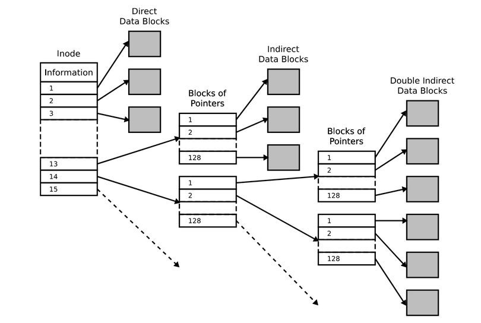
* Estructura de *inodes* con hasta doble indireccion.

### FAT

Otros *file system*, como FAT (*File Allocation Table*), usan enfoques diferentes al anterior; en lugar de punteros indirectos usan una *linked list* (lista ligadas) para cada archivo. Cada entrada del arreglo *Directory Entry* apunta al primer bloque del archivo, el cual apunta al siguiente bloque (no necesariamente contiguo), etc. El ultimo bloque del archivo apunta a EOF (*End Of File*, por ejemplo '-1').
<br>Al no almacenar en el *directory entry* otras entradas (como el *size* del archivo), este proceso secuencial hace que FAT sea malo para busquedas al azar, ya que las lecturas son de orden N (dependen del tamaño del archivo).

Si dos archivos apuntan a un mismo bloque ("cadenas cruzadas"), o si se produce un ciclo, se produce una **Corrupcion** del *file system*. El programa para detectarlo es chkdsk.

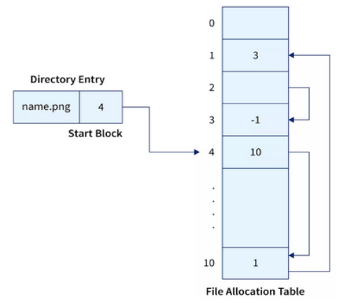
* Implementacion del FAT *file system*; forma de almacenar bloques de archivos.

FAT12 = 12 bits para indices de bloques -> tengo hasta $2^{12}$ bloques = 4096 bloques -> si cada uno es de 4KB, el tamaño maximo del area de datos para este *file system* es $2^{12} * 2^{12} B = 2^{24} B = 16MB$.

### Organizacion de Directorios

En VSFS un directorio solo contiene una lista de pares (***Entry Name***, ***Inode Number***); por cada archivo o directorio en un directorio se tienen un string y un numero en la *data block*(s) del mismo.

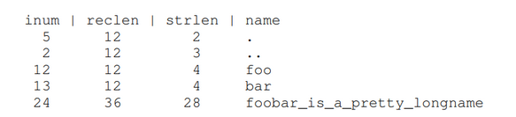
* ejemplo de directorio 'dir' (*inode number* 5) con 3 archivos en disco (con *inodes* 12, 13 y 24). Ademas, se indica la longitud del nombre (incluyendo '\0') y el espacio sobrante (*reclen*). El directorio actual es la entrada '.', mientras que el directorio padre es la entrada '..'.

Los *files systems* diferencian directorios de archivos normales especificando su tipo en un campo de sus *inodes*. El directorio tiene *data blocks* señalados por el *inode* (y tal vez bloques indirectos) que almacenan en la *data region*.
<br>Cada tabla de directorios puede apuntar a archivos y a otros directorios, pero por consistencia un mismo nombre no puede apuntar a dos *inodes* diferentes. Notar que nada impide que usen ciclos de directorios.

### Manejo del Espacio Libre

En VSFS se usan dos bitmaps (para *inodes* y para *data*) para el manejo del espacio libre que siguen la pista de que inodos y bloques de datos estan libres y cuales asignados, permitiendo encontrar espacio al crear un *file* o directorio (y actualizar su estado a usado).
<br>Algunas politicas de *pre-allocation* pueden ser usadas en este proceso, como elegir una secuencia de bloques libres de un tamaño minimo, para buscar un mejor rendimiento al usar una porcion contigua del disco.

### Rutas de Acceso: Lectura y Escritura

El flujo de operaciones para leer o escribir un archivo requiere involucrar una serie de operaciones de I/O y ***Access Path*** (rutas de acceso). En los siguientes casos se asume que el *file system* ya se monto (por lo tanto el *superblock* fue leido por el SO y cargado en memoria) pero que todo el resto (*inodes*, directorios, etc) sigue en disco.

#### Leer un Archivo del Disco

El primer paso es llamar a `open`, para lo cual el *file system* necesita encontrar el *inode* del archivo para obtener la informacion del mismo (permiso, tamaño, etc). Al recibir un *pathname*, primero debe atraversarlo para poder encontrar el *inode* del *file*. Para ello comienza en el ***Root Directory*** (**/**), leyendo el *inode* del mismo (para lo cual el *i-number* del *inode root*, el cual es conocido por el *file system* al ser montado y suele ser el numero 2).

Luego, el *file system* busca punteros a *data blocks* en el *inode de root*, loc cuales señalan a los contenidos de *root directory* y permiten al *dile system* leer el directorio y buscar el *inode* del siguiente componente del *path name*. Este proceso se repite hasta atravesar el *path name* y llegar al *inode* deseado. El paso final de `open` es leer/escribir el *inode* de bar en memoria; el *file system* hace el check de permisos, asigna un ***File Descriptor*** para este proceso y retorna al usuario.

Una vez abierto el archivo, se llama a `read`. A lo largo de la lectura se va actualizando el ***Last Time Access*** y el *offset* del *inode* (el cual empieza en 0 si se lee desde el comienzo del archivo, o en otro valor si se usa `lseek`). Se lee primer bloque del archivo, consultando al *inode* para ver donde se almacena dicho bloque, y se repite el mismo procedimiento con cada bloque del *file*.

En algun punto se cierra el archivo, para lo cual el *file system* solo desasigna el espacio que le dio al *file descriptor*, sin involucrar ninguna operacion I/O. Notar que la cantidad de I/O que hace `open` depende de lo largo del *path name*; a mayor longitud, mas *inodes* deben ser buscados y leidos.

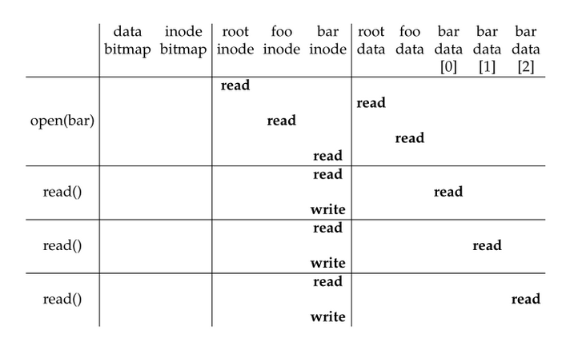
* Operaciones de I/O en el proceso de lectura de un archivo con *datapath* de largo 2 ("/foo/bar/"). Linea de tiempo descendiente.

#### Escribir en un Archivo del Disco

Se realiza un `open` que sigue en el mismo proceso de atravesar el *datapath* que en el caso de las lecturas. Luego, la aplicacion llama a `write` para actualizar los contenidos del archivo.

Escribir un archivo puede requerir **Asginar** (**Allocar**) un nuebo bloque (a menos que se sobreescriba en uno), por lo que antes de escribir los datos en disco se debe decidir que nuevo bloque asignarle, y por ende actualizar otras estructuras del disco de forma apropiada (como el *data bitmap* y el *inode*).
<br>Por este motivo, cada `write` genera 5 operaciones de I/O: Una para **Leer** el *data bitmap* (encontrar un bloque libre), otra para **Escribir** en el bitmap (actualizarlo para marcar el nuevo bloque como asignado), dos para leer y luego escribir el *inode* (en el cual se actualiza la localizacion del bloque), y finalmente una mas para escribir los datos en el bloque en si.

El costo es aun mas alto cuando se crea un archivo, ya que ademas de allocar el *inode* el sistema debe asignar espacio en el directorio que va a contener el nuevo archivo (una *entry*).

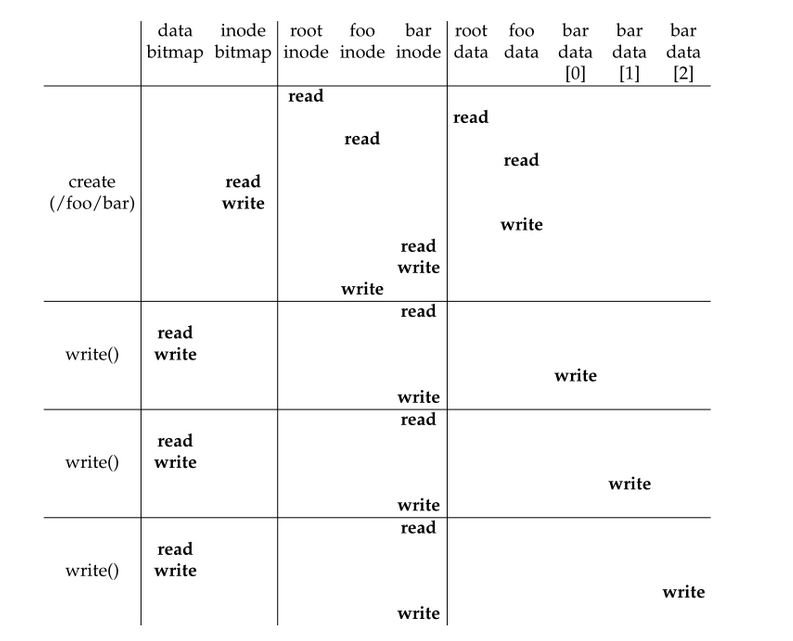
* Operaciones de I/O en el proceso de creacion de un archivo usando un *datapath* de largo 2 ("`/foo/bar`") y escribiendo en el 3 bloques. Linea de tiempo descendiente. Notar qye requiere de 10 I/Os para crear el archivo y 5 I/Os por cada *alloc* de memoria.

### Cache y *Buffers*

El alto costo de cada operacion de I/O afecta el desempeño del *file system*. Por ello los primeros sistemas usaban una ***Fixed-Size Cache*** (Cache de un Tamaño Fijo) para mantener alli a los bloques mas utilizados. Pero, este **Particionamiento Estatico** de memoria puede causar un despercidio si se guarda mas espacio de memoria para la cache de la que se usa realmente.
<br>Los sistemas actuales emplean **Particionamiento Dinamico**, en donde se integran paginas de memoria virtual en una **Cache de Paginas Unificadas**. De esta forma, la memoria puede ser asignada de forma flexible.
<br>Esta cache es mas util en la lectura que en la escritura, ya que la primera no necesita un manejo individual para pasar los datos de forma persistente, cosa que la estructura  si. Frente a esto se usa un ***Write Buffering***, el cual disminuye los I/Os al **Retrasar** los `writes` y permitir al *file system* juntar varias actualizaciones en un solo **Lote** (o directamente evitarlos si, por ejemplo, un proceso crea o escribe un archivo pero luego lo borra), y ademas incrementa el desempeño al almacenar en un *buffer* en memoria un numero de `writes`, permitiendo al *scheduler* del sistema encargarse de los siguientes I/Os.

Como se vio en el capitulo anterior, existe un *trade-off* al usar *buffers* de escrituras, ya que un crasheo del sistema podria llevar a que se pierdan los datos que aun no ha sido escrito en el disco, lo que hace que suelan ser usados por aplicaciones criticas.

---

## Capitulo 41: Localidad y *Fast File System*

Los primeros *file systems* eran simples y proveian las abstracciones necesarias (archivos y una jerarquia de directorios) mediante el uso de un *superblock* (S) que contenia la informacion de todo el *file system* (tamaño del volumen, cantidad de *inodes*, un puntero a la cabeza de una *free list*, etc), una region con los *inodes* del sistema, y una gran region de *data blocks*.
<br>Toda la estructura necesaria por el *file system* que no sea datos de usuario, es ***Overhead***.

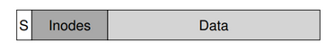
* Estructura de un *file system* simple.

Sin embargo estos modelos tenian un mal desempeño ya que estaban diseñados sin tener en cuenta las caracteristicas del hardware de almacenamiento (discos rotacionales con pistas y cabezales que se benefician de la localidad de los datos) por lo que esparcian los datos (bloques) en diferentes ubicaciones (como si de una memoria RAM se tratase) generando gran **Fragmentacion**, lo que llevaba a tener grandes tiempos de busqueda para cada bloque ya que la lectura no se podia hacer de forma secuencial (incluso para bloques de un mismo archivo).
<br>Frente a esto, eran muy usadas las herramientas de desfragmentacion para reorganizar los bloques de los archivos (y los bloques libres) de posicion contiguas.

Otro problema de estos modelos era el tamaño de bloque; al ser muy pequeño (512 bytes) se disminuia la **Fragmentacion Interna** (minimizando el desperdicio de espacio dentro de cada bloque) pero hacia la transferencia de datos todavia mas ineficiente al requerir mas busquedas.

### FFS: *Fast File System*

Para solucionar esos problemas se creo el ***Fast File System*** (**FFS**) cuyo diseño de las estructuras del *file system* y de las politicas de asignacion de espacio son "*disk aware*" (conscientes del disco). Si bien la implementacion interna cambio, se mantuvo la misma interfaz (API).

#### Grupo de Cilindros

FFS organiza al disco en una coleccion de ***Cylinder Groups*** (**Grupos de Cilindros**). Un **Cilindro** es un conjunto de pistas (*tracks*) en diferentes superficies del disco que estan a la misma distancia del centro. Un numero de cilindros consecutivos forman un **Grupo**.


* *Tracks* (pistas) en cilindros, formando grupos de cilindros en un disco de 6 platos.

Los discos no aportan informacion al *file system* como para que este sepa si un cilindro particular esta en uso; solo informan el *address space* de los bloques y esconden los detalles de su geometria. Es por eso que los sistemas modernos organizan el disco en **Grupos de Bloques**, cada una de una **Porcion** consecutiva del *address space* del disco.

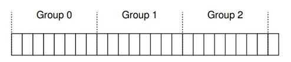
* Seccion de memoria vista como grupos de bloques.

Ya sea con cilindros o grupos de bloques, FFS asegura que si se colocan dos archivos en el mismo grupo y se accede a uno despues de otro, no se van a necesitar largas busquedas a traves del disco. Para almacenar archivos y directorios en estos grupos, el FFS necesita tener la habilidad de ponerlos en un bloque y seguir la pista de toda la informacion necesaria sobre ellos. Para esto, incluye en cada grupo de cilindros a las estructuras de un *file system*; espacio para *data blocks*, *inodes*, estructuras para localizar los lugares libres y asignados (un bitmap por region *inodes*/*data*). Ademas, por razones de fiabilidad se coloca una copia de respaldo del *superblock*.


* Contenido de un grupo de cilindros usando FFS; *Superblock*, *inode bitmap*, *data bitmap*, *inodes*, datos.

#### Politicas de Asignacion

El FFS debe decidir como posicionar archivos y directorios (y la metadata asociada), buscando mantener "cosas relacionadas juntas, y no relacionadas separadas" para mejorar la *performance*. Para esto sigue dos politicas que permiten que los archivos esten cerca de sus *inodes* y que los *files* en un directorio esten cerca unos de otros:
<br>Para el posicionamiento de directorios busca un grupo de cilindros con un bajo numero de directorios (para mantener un balance) y un alto numero de *inodes* libres, y pone los datos del directorio y su inodo en su grupo.
<br>Para posicionar los archivos trata de asignar los bloques de cada *file* en el mismo grupo de bloques que su *inode* (para prevenir largas busquedas), y ademas posiciona a todos los archivos que estan en un directorio en el mismo grupo de cilindros en el que esta dicho directorio.

Para los archivos grandes se aplica una excepcion en la politica de posicionamiento. Para evitar que estos llenen un grupo de bloques por completo, cada cierto numero de estos asignados en el primer grupo de bloques, FFS posiciona el siguiente "gran" pedazo del archivo en otro grupo (tal vez elegido por su bajo uso), y asi subsecuentemente hasta almacenar todo el archivo.
<br>Para evitar que esta separacion en partes afecte la *performance*, se elige el tamaño de esas partes con cuidado para lograr que el tiempo usado en buscar la siguiente parte sea pequeña en comparacion al usado para transferir los datos de esa parte. Esta tecnica de reducir el *overhead* haciendo mas trabajo por cada "*paid overhead*" se llama ***Amortization***.

#### Otros Aspectos de FFS

Para disminuir la fragmentacion interna en los bloques de 4KB FFS utiliza **Sub-Bloques** de 512 bytes los cuales el *file system* asigna mientras el archivo crece, y al llegar a los 4KB libera los sub-bloques luego de copiarlos todos a un bloque de 4KB.
<br>Para evitar los I/Os extra que esto supe, se suele utilizar un *buffer* de escrituras para hacerlas directamente en bloques de 4KB, evitando la creacion de sub-bloques cuando son innecesarios.

Otros aspectos de FFS es la tecnica de **Parametrizacion**. Durante las lecturas secuenciales es lo suficientemente rapido para requisitar los siguientes bloques a leer antes de que estos pasen por el cabezal del disco, evitando rotaciones extra.
<br>Ademas, a nivel usuario, FFS permitio **Nombres Mas Largos en los Archivos** (mas de 8 char) e introdujo los conceptos de ***Symbolic Link*** y *rename* atomico.

## Capitulo 42: Consistencia ante Errores: FSCK y *Journaling*

La estructuras de datos del *file system*, a diferencia de las de la memoria, deben ser persistentes. Por ello es necesario poder actulizarlas manteniendo consistencia ante **Perdida de Energia** o **Crasheos del Sistema** mientras se realiza ese proceso.

Solo una operacion de lectura puede ser ejecutada a la vez, por lo que la posibilidad de dejar una estructura en estado **Inconsistente** no solo esta presente mientras se realiza una escritura, sino para las operaciones que se encuentran esperando en el *buffer*.

El siguiente es un ejemplo de una **Carga de Trabajo** (***Workload***) que actualiza estructuras de disco adjuntando un *data block* a un archivo existente abriendo el *file*, llamando a `lseek()` para mover el *file offset* al final del *file*, y luego realizando un `write` de 4KB al *file* antes de cerrarlo.
<br>Se asume una estructura de datos estandar, un *inode bitmap* (8 bit, 1 por *inode*), un *data bitmap* (8 bits, uno por bloque de datos), 8 *inodes* en 4 bloques y 8 *data blocks*.

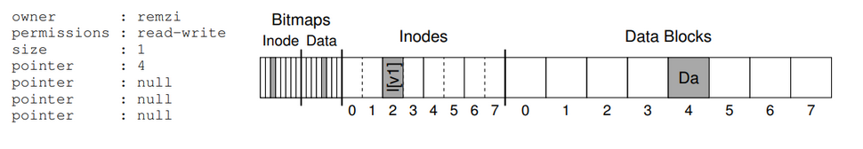
* Primera version del *inode*; l(v1). Estructura de disco con el bloque 4 y el *inode* 2 asignados y marcados en sus bitmaps.

Al agregar un nuevo bloque se deben actualizar 3 estructuras en disco: ***inode*** (*pointer* hacia el nuevo bloque y actualizar el tamaño del *file*), ***Data Block*** (En la *data region estructure*), y el ***Bitmap*** de los *data blocks*.

Es decir, el *file system* debe realizar 3 `writes` en disco, lo cual no puede suceder inmediatamanete ni a la vez; los nuevos datos esperan en un ***Page/Buffer Cache*** de memoria hasta que el *file system* decida escribirlos y el *file system* realice la *write call*. Si un crasheo ocurre una vez comenzados a escribirse en disco pero antes de que se completen los 3, el *file system* queda en un "*Funny State*".

### Escenario de *Crash*

Casos en los que solo un `write` se completa:

* Solo el ***Data block*** se actualizo: Los datos estan en disco pero ningun *inode* apunta a ellos y el bitmap no indica que el bloque este asignado, por lo que es como si la estructura nunca hubiera sucedido. No es un problema desde el punto de problema de consistencia.
* Solo el ***inode*** se actualizo: *Inode* apunta a donde deberia estar el *data block*, pero alli solo se encuentra **Basura**. El bitmap muestra al bloque como libre/no asignado pero el *inode* indica que hay informacion, por lo que se produce una inconsistencia en la estructura de datos.
* Solo el ***Bitmap*** se actualizo: Se muestra al bloque como asignado pero no hay *inode* que apunte a este. Esta inconsistencia generara un ***Space Leak*** (perdida de espacio) ya que el bloque nunca podra ser usado por el *file system*.

Casos en los que solo dos `writes` se ejecutan:

* ***Inode*** y ***Bitmap*** actualizados: La metadata es consistente ya que el *inode* apunta al bloque correcto y el bitmap lo marca como asignado, pero el mismo contiene **Datos Basura**.
* ***Inode*** y ***Data block*** actualizados: El *inode* aounta al bloque correcto y los datos estan ahi, pero el bitmpa no marca el bloque como asignado, lo que genera una inconsistencia.
* ***Bitmap*** y ***Data block*** actualizados: Se genera una incosistencia entre el *inode* y el bitmap. El bloque fue escrito y se indica que esta en uso, pero ningun *inode* lo señala por lo que no se sabe a que *file* pertenece.

Ante la posibilidad de que generen estructuras de datos incosistentes, lectura de datos basura al usuario y perdida de espacio, se busca modificar al *file system* de forma atomica entre un estado consistente y otro nuevo. Sin embargo el disco solo puede una escritura al mismo tiempo, lo cual genera un ***Crash Consistency Problem***.

### Solucion 1: Verificar el Sistema de Archivos (FSCK)

El enfoque consiste en dejar que sucedan incosistencias y, antes de que el *file system* se monte, ejecutar **FSCK** (***File System Checker***) para verificar su estado, encontrar esas inconsistencias y arreglarlas. Para garantizar el buen estado del *file system* FSCK analiza:

* ***SuperBlock***: Chequeos de sensatez, principalmente que el tamaño del *file system* sea mayor al de los bloques asignados. Si esta corrupto, se puede usar una copia alternativa.
* ***Free Blocks***: Se escanean *inodes* e *indirect blocks* para saber que bloques estan asignados al *file system* y generar una version correcta de los bitmaps e *inodes* asignados.
* ***Inodes State***: Cada *inode* es chequeado por corrupcion y otros problemas (por ejemplo, que su campo `type` sea valido). Si se detectan incosistencias que no pueden arreglarse, el *inode* es eliminado y el bitmap correspondiente es actualizado acorde a ello.
* ***Inode Links***: Se comprueba la cuenta de links de cada *inode* (cantidad de referencias al archivo) comparandolos con el resultado de escanear el arbol de directorios desde *root*. Si hay discrepancias se arreglan actualizando el valor del *inode*. Si se encuentra un *inode* asignado pero sin referencias, se lo mueve al directorio *lost+found*.
* **Duplicados**: Se chequean punteros duplicados (dos inodos apuntando al mismo lugar) y puede decidirse copiar el bloque para que cada *inode* tenga el propio (y actualizar uno de esos punteros). si un *inode* se detecta como corrupto es eliminado.
* ***Bad Blocks***: Se chequean punteros a bloques corruptos escaneando la lista de punteros. Un puntero es considerado corrupto si apunta fuera de su rango permitido (por ejemplo, a un bloque por fuera de su particion) y en este caso es eliminado.
* ***Directory Checks***: Se verifica que las primeras dos entradas de cada directorio sean '.' y '..', ya que cada referencia a un *inode* esta asignada, y que ningun directorio este conectado a mas de un "padre" en la jerarquia de directorios.

Al realizar tantas comprobaciones exhaustivas, FSCK resulta costoso y especialmente lento para discos de gran capacidad, por lo que en la actualidad otras soluciones son mas utilizadas.

### Solucion 2: *Journaling* (*Write-Ahead Logging*: Registro de Escritura)

Al momento de actualizar el disco, antes de sobreescribir las estructuras en su lugar, se escribe en una estructura organizada como un ***Log*** (registro) una descripcion de la modificacion que se esta por hacer, procedimiento llamado ***Write Ahead***.
<br>El *log* garantiza que, despues de un eventual crasheo en medio de la operacion de actualizacion del disco, su informacion va a permitir reintentar la escritura sabiendo exactamente que parte del disco debe repararse y como hacerlo (en vez de tener que escanear el disco entero). *Journaling* añade algo de *overhead* en cada actualizacion, pero reduce mucho el tiempo de recuperacion.

### ext3

Un *file system* con *journaling* usado por linux es ***ext3***. Este divide al disco en grupos de bloques, cada uno con un *inode bitmap*, *data bitmap*, *inodes* y *data blocks*. La estructura del *journaling* ocupa un pequeño espacio en la particion.

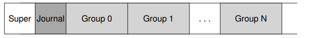
* Estructura del *journal* en el disco.

#### *Data Journaling*

Antes de realizar un *update* a disco, debe escribirse el *log*. Este consta de un bloque inicial **TxB** con informacion sobre el *update* (como la direccion de destino y una ***Transaction Identifier*** (**TID**); un ID de la operacion), una serie de bloques con el contenido de los bloques a escribir llamados ***Physical Logging*** (la informacion fisica de la *update* en el *journal*), y un bloque **TxE** que indican el final de la operacion y contiene una copia del TID.

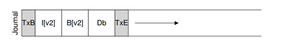
* *Log* de escritura de *inode* l(v2), bitmap B(v2) y *datablock* (Db).

Una vez dicha operacion esta en disco, se puede comenzar a ejecutar el pedido de `write` en si y actualizar las *data structures* en disco (escribir el contenido de los bloques de *physical logging*), proceso llamado ***Checkpointing***.

Para evitar incosistencias provenientes de posibles crasheos durante las escrituras del *journal*, el *file system* primero hace el *transaccional write* de todos los bloques menos el TxE, y al finalizar escribe el TxE. La escritura de este ultimo logra ser atomica gracias a que el disco garantiza la atomicidad de `writes` de 512 bytes.

#### *Recovery*

Para recuperarse luego de un crasheo (en cualquier parte de la secuencia de escritura), el *file system* usa los contenidos del *journal*:
* Si el *crash* es antes que la actualizacion pendiente se escriba en el *log* (*journal commit*), se saltea/ignora y el *write* no ocurre.
* Si el *crash* ocurre despues del *commit* pero antes de que el *checkpoint* se complete, el *file system* Recupera la *update* escaneando el *log* y buscando las transacciones encomendadas en el disco en el booteo del sistema. Luego, dichas transacciones vuelven a ejecutarse (son repetidas en orden). Es por esto que esta forma de *logging* es llamada ***Redo Logging***. Un crasheo durante esta secuencia solo llevaria a repetir el proceso nuevamente.

#### Agrupar Actualizaciones del *log*

Debido a que hacer un *Commit* en cada *update* del disco puede añadir bastante trafico al mismo, algunos sistemas agrupan los *updates* en un buffer para evitar *writes* excesivos.

#### Hacer el *log* Finito

Para evitar que se llene la estructura finita del *log* y se inutilice el sistema (al no poder *commitear* mas *transactions* al disco), los *file systems* con *journaling* tratan el *log* como una estructura de datos ciruclar, reutilizando una y otra vez (por eso *journal* es llamado ***Circular Log***).
<br>El sistema libera el espacio de la transaccion asignada del *log* una vez completado el *checkpoint*, marcando la misma como libre en el *superblock* del *journal*. En este ultimo se guardan los datos de las transacciones que todavia no llegaron al *checkpoint*.

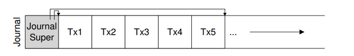
* *Superblock* y contenidos del *journal*.

De esta forma, el protocolo de *journaling* consta de cuatro partes:
1. ***Journal Write***: Escribir la transaccion en el *log* (TxB y contenidos a actulizar).
2. ***Journal Commit***: Escribir el *transaction commit block* (TxE) en el *log*; lo que pone a la transaccion en estado de ***Committed*** (encomendada).
3. ***Checkpoint***: Escribir los contenidos de la *update* (*metadata* y *data*) en su destino en disco.
4. ***Free***: Marcar la transaccion como *free* en el *journal* al actualizar el *journal superblock*.

Se espera a que cada paso finalice antes de comenzar con el siguiente.

#### *Metadata Journaling*

Notar que, si bien *data journaling* permite una recuperacion rapida ante crasheos, cada bloque se esta escribiendo en disco dos veces, lo que genera un gran *overhead* debido al alto costo de I/O.

Una forma de aumentar la *performance* es usar modelos como ***Ordered Journaling*** (tambien llamado ***Metadata Journaling***), en los cuales la *data* no es escrita en el *journal*; esta es directamente escrita en disco y solo la metadata es copiada en el *journal*.

El protocolo de *metadata journaling* consiste en:
1. ***Data Write***: Escribir los datos en su direccion final.
2. ***Journal Metadata Write***: Escribir la transaccion en el *log* (TxB y contenidos a actualizar).
3. ***Journal Commit***: Escribir el *transaction commit block* (TxE) en el *log*.
4. ***Checkpoint Metadata***: Escribir el contenido de la nueva metadata en su destino en disco.
5. ***Free***: Marcar la transaccion como *free* en el *journal* al actualizar el *journal superblock*.

Notar que con el paso 1 se evita que ante un crasheo un puntero quede apuntando a datos basura, ya que la informacion es escrita en disco antes de crear el puntero mismo.

## Capitulo 43: *File System* Estructurados por *Logs*

