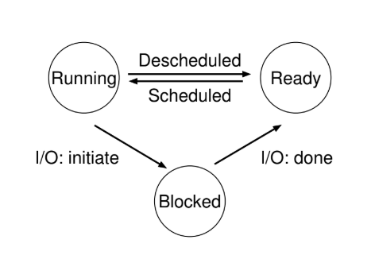

# Resumen

Este resumen esta pensando para entender Sistemas Operativos y poder tener las herramientas necesarias para el Final.

## Virtualizacion de la CPU

### Capitulo 2: Introduccion al SO

El SO (Sistema Operativo) es el **Software** que se encarga de que sea facil correr programas de forma eficiente y correcta. Para ello utiliza la **Virtualizacion**; una tecnica para representar al hardware de una forma simple, segura y eficiente, gracias a la  cual los programas pueden correr en simultaneo compartiendo CPU (Procesador), memoria (RAM) y dispositivos (Discos).

La interaccion entre el SO y los usuarios se da mediante una interfaz **API** (una **Standard Library**) que provee **System Calls** (Llamadas al Sistema) a los programas.

Como muchos programas corren concurrentemente, el SO tambien se encarga de ser el **Administrador** de los **Recursos**, entregando el uso del hardware real a los programas de forma eficiente y siguiendo diferentes **Mecanismos** y **Politicas**.

#### Virtualizacion de la CPU

El SO crea la ilusion de que hay muchos CPUs disponibles para que muchos programas puedan correr en simultaneo. La ejecucion de estos es manejada por diferentes **Mecanismos** y **Politicas** establecidas por el SO.

#### Virtualizacion de la Memoria

La **Memoria Fisica** no es mas que un `array` de bytes, y para poder leer o escribir en ella se necesita especificar una Direccion** en donde hacerlo.

Los programas acceden a memoria todo el tiempo, ya sea por informacion (archivos) o porque su propio codigo se encuentra alli (en cada instruccion `fetch` se accede a memoria).

Al ser **Virtualizada**, cada programa tiene su propio **Espacio Direccionable** de **Memoria Virtual** (**Address Space**). Esas direcciones no se corresponden con las reales de la memoria fisica (y por lo tanto, pueden repetirse entre programas), y es el SO quien se encarga de luego **Mapear** (traducir) esas direcciones de memoria virtual.

Los accesos a memoria de un programa no afectan (o no deberian xd, por proteccion) a otros programas o al SO mismo (eso es, aislamiento de procesos).

#### Concurrencia

Los problemas de concurrencia surgen con la ejecucion de programas en simultaneo (compartiendo memoria y CPU) o por programas que usan **Multiples Hilos**. Requiere de la ejecucion **Atomica** de instruccioness (toda la ejecucion de una sola vez, sin interferencias) para evitar comportamientos indefinidos y problemas de seguridad. Con el fin de evitar esas **Race Condition** (o posibles **Deadlocks**), se utilizan **Locks**, **Semaforos**.

#### Persistencia

La informacion en RAM es **Volatil** (su contenido se pierde al interrumpir el suministro de electricidad), por lo que el SO debe encargarse de la persistencia de la informacion. Lo hace a traves de hardware (con dispositivos de **I/O**, como discos) y el software (**Sistema de Archivos**).

Los dispositivos de almacenamiento no son virtualizados para cada programa, si no que estos pueden compartir informacion entre ellos. Poseen una velocidad muchos menor a la de la memoria RAM, pero son mas baratos y con una capacidad mayor.

----

### Capitulo 4: La Abstraccion de los Procesos

Un **Proceso** es la abstraccion del SO de un programa en ejecucion; el programa es un objeto estatico (codigo), mientras que el proceso es un objeto dinamico (corriendo en memoria).

La tecnica de ir intercalando varios procesos concurrentes, ejecutando uno a la vez, es conocida como **Time Sharing** (Tiempo Compartido), consiste en dividir un recurso (en el espacio) entre proceos que deseen utilizarlo.

#### Virtualizacion

Para lograr la ilusion de que hay muchas CPU (y, a su vez, que los procesos no tengan el control directo de lo que se ejecuta en la CPU fisica), el SO usa **Mecanismos** de bajo nivel; protocolos para implementar distintas funcionalidades. Algunas de ellas son el **Context Switch** (cambios de contextos), que permite cambiar un proceso en ejecucion por otro, y las diferentes **Politicas** de los **Planificadores**: algoritmos que toman decisiones sobre la distribucion de los recursos limitados en base a distintos factores y prioridades.

#### Procesos

Un proceso puede ser descrito (y por lo tanto guardado) por su **Estado**:

1. **Memoria**: Las instrucciones y la informacion que el proceso lee estan en memoria. La memoria a la que un proceso puede acceder (**Address Space**) es parte del proceso mismo.

2. **Registros** de la CPU: El programa puede leer o actualizar registros (como el **Program Counter** (**PC**), el **Stack Pointer**, o el **Frame Pointer**).

3. **Almacenamiento**: Un proceso puede acceder al almacenamiento (dispositivos I/O) para asegurar la persistencia.

#### API de los Procesos

Cualquier interfaz de procesos de un SO debe poder:

1. **Crear** nuevos procesos.

2. **Destruir** procesos en caso de que no terminen por si mismos.

3. **Esperar** la finalizacion de un proceso.

4. Tener **Control**: otros tipos de control, como la suspencion de un proceso.

5. Conocer su **Estado**: Poder mostrar informacion de un proceso.

Los programas utilizan estas funciones mediante **System Calls** proporcionadas por la API.

#### Creacion de un Proceso

Para correr un programa (osea convertirlo en proceso) el SO debe **Cargar** su codigo y su informacion estatica (con un formato ejecutable) del disco a la memoria, en el Address Space del proceso.

Se deben proporcionar memoria **Stack** (variables locales, parametros de llamada, direcciones de retorno, etc)y **Heap** (informacion dinamica y variables en tamaño, estructura de datos como listas; todo lo relacionado con `malloc`y `free`) para el programa. En el Stack, ademas, el SO establece los parametros `argv` (arreglos de cadenas (de tipo `char *`) que contiene los argumenos como `strings`) y `argc count` (entero que indica **Cuantos** argumentos se pasaron al programa desde la linea de comandos. Siempre es al menos 1, ya que se incluye el nombre del programa).


* Memoria asignada a un proceso al momento de su creacion.

#### Estado de un Proceso

Cada proceso esta en alguno (solo uno) de los siguientes estados:

* **Running**: En ejecucion.

* **Ready**: En espera, listo para ejecutarse.

* **Blocked**: No puede correr hasta que otro evento ocurra (por ejemplo un dispositivo I/O).

* **Zombie**: El proceso hijo finaliza, pero el padre aun no ha llamado a `wait()` para leerlo.



* Transiciones entre estados de un proceso.

El paso entre los distintos estados esta dado por eventos del software o hardware, llamadas **Interrupciones** (por ejemplo de reloj, del disco duro, etc).

A lo sumo puede haber `n` procesos en estado de Running, siendo `n` = cantidad de cores (nucleos).

#### Estructura de datos del SO

Listas de procesos (**Process List**): Contiene el listado de los procesos listos para correr o corriendo.

**PCB** (*Process Control Block*): Estructura de datos que, en cada entrada de sus tuplas, almacena el **Contexto de los Registros**, el mapa de la memoria, el estado del proceso, su *Process id* (**PID**), los archivos abiertos, el directorio actual (**PWD**: *Process Working Directory*), y el puntero al proceso padre. Ademas, almacena los datos de bajo nivel manejados por el procesador: el **Trap Frame** y el **Kernel Stack**.

Esta informacion sobre los procesos del sistema nos permite realizar un **Context Switch**: "congelarlos", guardar o colocar la informacion almacenada en los registros, y continuar la ejecucion de un proceso. El SO almacena un array de PCBs.

* **User Time**: Tiempo de computo del proceso en modo usuario.

* **CPU Time**: Tiempo total que un proceso ha usado la CPU. Si ejecuta mas de un hilo, es la suma del tiempo de todos ellos.

* **Wall Time**: Tiempo total real transcurrido, desde que comienza a ejecutarse un proceso hasta que termina.

#### Notar

* $$WallTime >= CPU Time$$: Cuando el proceso se ejecuta en un solo nucleo o en multiples nucleos pero sin paralelismo (un nucleo alternado entre varios hilos).

* $$WallTime < CPU Time$$: Puede llegar a suceder si el proceso se ejecuta en multiples nucleos simultaneamente (paralelismo), ya que el CPU time se suma en cada nucleo que esta en uso.

* $$UserTime < WallTime$$: El proceso parte del tiempo esperando: ya sea I/O, bloqueado, o al `return` del trap cuando hace una System Call y pasa a modo kernel.

* $$UserTime = WallTime$$: Un proceso sin hilos se ejecuta en modo usuario, sin interrupciones ni operaciones de I/O, sin llamadas al sistema, y no se bloquea ni o sufre Context Switches.

* $$UserTime > WallTime$$: Proceso multihilo, en el que cada hilo ejecuta en un core distinto y luego se suman todos sus tiempos de usuario.

#### Conceptos Importantes!!!!

* Un **Proceso** es un programa en ejecución. Lo constituye lo que llamamos **Machine state** o **Máquina de estado**, donde se encuentra la **Memoria**, la memoria que el proceso puede acceder es llamada **address spaces** o **Espacio de direcciones**. Los **Registros**, algunos importantes como por ejemplo el PC (*Program Counter*) que nos dice que instrucción es la siguiente en ejecutar, del programa el **Stack Pointer**, se usa para manejar la pila de los parametros de funciones, variables locales, return address. También tienen la información I/O.

* Lo que debe incluirse en cualquier interfaz de un SO, Estas APIs, estan disponibles en cualquier SO:

    - **Crear**: Metodo para crear nuevos procesos.

    - **Destruir**: Metodo para destruir un proceso / Forzar la detencion de un proceso.

    - **Esperar**: Metodo para esperar un proceso.

    - **Controles varios**: Por ejemplo: Metodo para suspender un proceso por un tiempo y, detener su ejecucion y despues continuar ejecutandolo.

    - **Estado**: Metodo para obtener informacion de estado de un proceso.

* Los proceso pueden estar en diferentes **Estados**:

    - **Running** es el estado con el control de la CPU.

    - **Ready** son los procesos en espera para usar la CPU.

    - **Blocked** puede ser cuando un proceso espera una interacción con algun I/O.


* Cuando queremos ejecutar mas de un proceso a la vez. El SO crea una ilusion **Virtualizando** la CPU. Esto lo logra ejecutando un proceso, luego deteniendolo y ejecutando otro, y asi sucesivamente, el SO puede crear la ilusion de que existen muchas CPUs virtuales cuando en realidad hay solo una CPU fisica. Esta tecnica es conocida como **Tiempo Compartido** de la CPU, permite a los usuarios ejecutar tantos procesos concurrentes como deseen.

* Para implementar la virtualizacion de la CPU, el SO necesitara maquinaria de bajo nivel a la que llamaremos **Mecanismo**; son metodos o protocolos de bajo nivel que implementan una parte de la funcionalidad necesaria. Por ejemplo: **Context Switch**.

* Encima de estos mecanismos reside parte de la inteligencia del SO, en forma de **Politicas**. Son algoritmos para tomar algun tipo de decision dentro del SO. Por ejemplo: las politicas de planificacion.

* La contrapartida del tiempo compartido es el **Espacio Compartido**, donde un recurso se divide (en el espacio) entre aquellos que deseen utilizarlo.

---

### Capitulo 5: La API de los Procesos

Interfaz que permite interaccionar con la abstraccion de los procesos.

La creacion de procesos en Unix se da con dos System Calls: `fork()` y `exec()`.

Puede usarse `wait()` para esperar que un proceso creado termine. 

Cada proceso tiene un identificador unico, un numero llado **PID**.

* `argc`: Entero que representa el numero de argumentos pasados a la linea de comandos. Incluye el nombre del programa como el primer argumento, por lo que `argc` siempre es al menos 1.

* `argv[]`: Array de punteros a cadenas de caracteres que contiene el nombre del programa a ejecutar (en `argv[0]`) y los argumentos pasados al programa en el resto de posiciones. Siempre esta terminado po un puntero `null` (`argv[argc]` = `null`).

#### `fork()` System Call

Crea un nuevo proceso. El proceso creado es una **Copia** casi identica del proceso donde fue llamado `fork()` (**Parent**); el proceso creado (**Child**) tiene una copia del **Address Space** (mapa de memoria) pero es su propia memoria privada, sus propios **Registros** pero con el mismo contenido, el mismo **PC**, etc.

Tiene aridad (numero de argumentos) 0 (No toma argumentos) y devuelve un entero; 0 para el proceso Child, y el PID del Child para el proceso padre (o un numero negativo si falla). Sus ejecuciones no son deterministas; son dos procesos diferentes y el *Scheduler* va a determinar cual ejecuta en cada momento.

#### `exec()` System Call

Es una familia de System Call (por ejemplo `execv`) que se utilizan para correr un programa diferente al programa desde el cual se la llama. Usa el nombre de un programa como argumento (`argv`), carga el **Ejecutable**, y sobreescribe el segmento de codigo actual. Luego, el SO corre ese programa.

* `execv()`: El primer argumento es el *path* al programa, el segundo argumento es un array de punteros a los argumentos, terminado en `null`.

* `execvp()`: El primer argumento es el nombre *file* del programa (se busca en el *path* actual), el segundo argumento es un array de punteros a los argumentos.

* `execl()`: se pasan los argumentos como una lista explicita en la llamada, uno por uno, terminando con `null`.

#### `wait()` System Call

Es usada por un proceso Parent para **Esperar** a que el proceso **Child** termine de ejecutarse. Recien en ese momento el Parent continua su ejecucion.

Si un Parent tiene multiples Childs, puede usar la version `waitpid()` para especificar el PID de un Child especifico al cual esperar (si no, el retorno del `wait` se vuelve no determinista).

La separacion de `fork()` y `exec()` (diferenciando la creacion de la ejecucion) da la oportunidad de ejecutar procesos de diversas formas y con varias funcionalidades en el medio, ya que permite cambiar las **Variables de Entorno** y los **Archivos Abiertos** (*File Descriptors*) en el espacio intermedio entre la ejecucion de un proceso y otro.

Por ejemplo: Permite utilizar una pipe (|) en shell para redireccionar (usando `open`, `close` y `dup` (duplicar el *file descriptor*)) la salida de un comando/proceso hacia el input del siguiente.

#### Control de Procesos y Usuarios

`kill()`: Familia de System Calls usadas para enviar distintas señales (**Signals**) asincronas a un proceso, por ejemplo: `SIGSTOP`, `SIGKILL`, `SIGCONT`, etc.

`signal()` es usada por los procesos para hacer *catch* de sañes enviadas al mismo. Esta es una forma primitiva de comunicacion entre los procesos.

Con la nocion de usuario se limita quien gana control sobre los recursos del sistema y quien puede controlar todos los procesos, o solo los propios (por razones de seguridad).

#### Conceptos Importantes!!!!

* **System Call**:

    - `fork()` es una **system call** usada para crear un proceso nuevo. Este proceso nuevo es una copia casi exacta del proceso que lo llamamos ("El padre"). El proceso nuevo ("El hijo"), no empieza en el main del padre, si no que empieza a partir de donde se llamo `fork()` en el padre. El padre recive de `fork()` el **PID** del hijo, a el hijo recive de `fork()` un cero. `fork()` imprime $2^{n}$ con `printf("a")` n cantidades de `fork()`.

    - `wait()` es la función que utiliza un proceso padre para esperar a que su proceso hijo termine de ejecutarse, "entra en modo zombie". Una vez termina de ejecutarse y vuelve `wait()`, se termina de ejecutar el padre.

    - `exec(const char *path, char *const argv[])` se usa para que un proceso hijo se diferencie, o ejecute un programa diferente al del padre. Simplemente toma el nombre de un ejecutable y algunos argumentos, carga su código de ese ejecutable y sobreescribe el código correspondiente al segmento del hijo. Este NO crea un proceso nuevo, solo lo transforma. Una llamada correcta de `exec()` nunca vuelve.

    - `execvp(const char *file, char *const argv[])`: El primer argumento es el nombre *file* del programa (se busca en el *path* actual), el segundo argumento es un array de punteros a los argumentos.

    - `execv()`: El primer argumento es el *path* al programa, el segundo argumento es un array de punteros a los argumentos, terminado en `null`.

    - `execl()`: se pasan los argumentos como una lista explicita en la llamada, uno por uno, terminando con `null`.

    - `kill()` se usa para mandar *signals* a un proceso, incluyendo directivas para pausar, matar y otros imperativos utiles.

    - `signal()` se usa en un proceso para "agarrar" varias signals.

---

### Capitulo 6: Ejecucion Directa Limitada (LDE)

Para virtualizar la CPU el SO necesita compartir el CPU Fisico entre varios trabajos simultaneo.

La idea principal es ejecutar uno un poco y cambiar a otro rapidamente generando la ilusion de procesamiento simultaneo. Con **Time Sharing** se alcanza la virtualizacion.

Ademas, debe lograrse asegurando la **Performance** (virtualizar sin sobrecargar el sistema) y el **Control** (como correr cada proceso mientras mantenemos control de la CPU).

#### Ejecucion Directa Limitada

Consiste en correr directamente el programa en la CPU; el SO hace los preparativos (crea una nueva entrada para el proceso en la tabla de procesos (osea crea un nuevo **PCB**), reserva memoria para el programa, carga desde el sistema de archivos el codigo ejecutable a la memoria, pone el `argv` y `argc` en la pila (Stack), limpia los registros, y llama al `main`) y lo ejecuta.

#### Operaciones Restringidas

La ventaja del metodo de Ejecucion Directa Limitada es su **Ejecucion Rapida**, pero debe controlarse que el proceso no haga cosas que no queremos que haga sin el apoyo del SO. Para ello, se usan **Operaciones Restringidas** al modo en el que sean ejecutadas.

En **User Mode** (Restringido) el codigo corre con restricciones (como accesos al I/O o a memoria no permitida; hacerlo llevaria a una excepcion, lo que haria que el SO termine el proceso).

En **Kernel Mode** (Privilegiado), modo en el que funciona el SO, el proceso no tiene restricciones y puede hacer operaciones privilegiadas.

El modo de usuario cuenta con System Calls para solicitar operaciones que tiene restringidas. Estas instrucciones ejecutan una **Trap** que salta al kernel mode elevando el privilegio y realizando la instruccion (si el SO la permite). Al terminar, se realiza un **Return From Trap** y baja el nivel de privilegios, volviendo a user mode.

Antes de ejecutar una trap se guardan los registros (contexto) del proceso que llamo a la trap, en un **Kernel Stack** (uno por proceso), para su posterior restablecimiento al volver a user mode. El kernel debe verificar que codigo ejecutar cuando ocurran determinadas excepciones, para lo cual el SO setea una **Trap Table** al momento del booteo que establece eso y ademas indica la localizacion de los **Trap Handlers**. Estos ultimos seran ejecutados por el SO en modo kernel.

Esta indireccion garantiza seguridad y genera una abstraccion que permite cambiar de kernel mientras se mantenga el numero id de las System Calls.

Una trap puede ser ocasionada por:

* Un **Timer Interrupt** (evento asincrono).

* Un **Hanware Device Interrupt** (evento asincrono).

* Una **Syscall** (evento sincrono).

* Una **Excepcion** (errores, acceso indebido a memoria; evento sincrono).

El SO reacciona a cualquiera de ellas de la misma forma (Trap Handler).

Para especificar la System Call, se usa una **System-Call Number**; el codigo que el usuario señala que quiere ejecutar y que el Kernel en el **Trap Handler** verifica y, si es valida, ejecuta. Esto ofrece proteccion para no darle control total al usuario (para que no salte a una direccion de memoria no autorizada), pero falla al no controlar el input que el usuario usa como argumento de las Syscalls.

En **LDE** (*Limited Direct Execution*) en el booteo inicia la trap table y el CPU recuerda su localizacion (operacion privilegiada). Luego, cuando corre un proceso, el Kernel configura algunas cosas (nodo en el process list, allocating memory) antes de hacer el return from trap, para ejecutar el proceso cambiando el CPU a user mode. Mas adelante, si el proceso quiere llamar a una System Call, trapea de vuelta al SO que maneja la llamada y luego vuelve con un return from trap a user mode.

Cada proceso tiene un Kernel Stack, donde los registros (incluyendo el PC) se guardan y restauran (por hardware) cuando se entra o sale del kernel.


* Linea de tiempo de las dos fases del protocolo de LDE ante una trap por instruccion privilegiada.

#### Intercambio entre Procesos

Si un proceso corre en el CPU, el SO no esta corriendo. Sin embargo, el mismo debe asegurarse poder recuperar el control para cambiar de proceso y lograr *time sharing*

#### Enfoque Colaborativo: Esperar a Nuevas System Calls

El SO confia en el proceso en ejecucion y da por sentado que cada cierto periodo liberaria el CPU para que el SO decida que correr; al ejecutarse una trap o al llamar a una System Call (incluso de manera explicita, con la llamada `yield`) se cederia y transferiria el control al SO.

#### Enfoque NO Colaborativo: El SO Toma el Control

Utilizando Mecanismos del hardware, el SO puede retomar el control del CPU mediante el **Timer Interrupt**; un dispositivo que cada varios milisegundos realiza una interrupcion. Esta cuando ocurre se ejecuta un **Interrupt Handler** en el SO, que le permite retomar el control.

En el booteo el SO deja explicitado que codigo correr en una interrupcion, momento en el que ademas comienza el timer.

El hardware se encarga de guardar el estado del proceso actual al momento de la interrupcion para su posterior return-from-trap.


* En cada proceso una porcion se ejecuta en user mode y otra en kernel mode. Para pasar el scheduler, se da un segundo cambio de contexto; de kernel mode al scheduler.

* En el cambio de contexto de user mode a kernel mode, debemos guardar todo. En el cambio de contexto del kernel mode al scheduler, en cambio, podemos hacer algunas asunciones.

#### Guardar y Restaurar el Contexto

Si cuando el SO toma control y decide cambiar a otro proceso (usando la rutina *switch*), ejecuta un codigo de bajo nivel, el **Context Switch**, que le permite guardar los valores de los registros del programa en ejecucion (en el Kernel Stack del proceso) y restaurar otros para el proceso que pasara a ejecutarse (desde su Kernel Stack).

Si hay un **Timer Interrupt** (trap), es el **Hardware** quien guarda los registros en el Stack de Kernel.

Si hay un **Switch** por parte del SO, es el **Software** quien guarda/restaura los registros del Kernel en la estructura del proceso.

Cada vez que se da un context switch, por ejemplo: ante una Syscall exception, el proceso pierde Performance, y tarda determinados ciclos en retomar la velocidad que tenia antes de la misma.

#### Concurrencia

Para que no ocurran *interrupts* simultaneas, se suelen deshabilitar las interrupciones mientras se esta lidiando con interrupciones. Tambien se usan **Locks** para proteger las estructuras internas.


* Linea de tiempo de la segunda fase del protocolo de LDE ante una interrupcion por tiempo.

#### Resumen

En LDE se ejecuta **Directamente** al programa en el CPU, habiendo configurado antes al hardware para poder **Limitar** lo que cada proceso puede ejecutar, y habiendo el SO preparado a la CPU configurando al momento del boot al controlador de **Traps** y al **Timer** de interrupciones, y luego ejecutando procesos solo en **Modo** restringido.

#### Conceptos Importantes!!!!

* **Limited Direct Execution** o **Ejecución Directa Limitada**, la parte de "Direct Execution" se refiere a ejecutar sea cual sea el programa directamente en la CPU. La parte de "Limited" se refiere a NO dejar que cualquier proceso se apodere de la CPU indefinidamente o que realicen una instrucción ilegal.

* **User mode**, todo código que corra en este modo esta restringido en las instrucciones que puede realizar.

* **Kernel mode**, es donde corre el SO. Los programas que corren en este modo pueden realizar lo que quieran incluyendo operaciones privilegiadas.

* **System calls**, permiten al kernel exponer cuidadosamente partes claves de funcionalidad a programas en el modo usuario. Para ejecutar una syscall, el programa ejecuta una instrucción **"Trap"**, que salta al kernel mode. Al terminar de ejecutar la syscall, se vuelve al user mode con una **"return from trap"** instrucción. Al realizar el trap y return from trap se guardan y leen los registros PC, entre otros registros del proceso hasta el **Kernel Stack**.

* Hay dos fases en el Protocolo Ejecución Directa Limitada:
    
    1. **"Al Bootear"**, el kernel inicializa la **trap table** y la CPU recuerda la ubicación de los **trap handlerss** para su futuro uso.
    
    2. **"Al correr un proceso"**, el kernel realiza algunas cosas antes de realizar un return from trap para iniciar la ejecución de un proceso.

* `yield()` es una syscall que transfiere el control de la CPU al SO.

* **Non-Cooperative Approach** o **Enfoque no cooperativo**, es cuando el SO tiene formas de recuperar la CPU, ya sea con **timers interrupts** u otros tipos de interrupciones o cuando los procesos llaman a una syscall.

* Un **Timer Interrupts** es una interrupción programable para realizarce cada cierto tiempo, en general milisegundos una vez ocurrido el interrupt, el proceso se detiene, y un interrupt hendler pre-configurada en el SO se ejecuta.

* **Cooperative Approach** o **Enfoque cooperativo**, es cuando el SO no tiene forma de recuperar la CPU de un proceso, a menos que se realice un `yield()` u otras syscall o que termine el proceso.

---

### Capitulo 7: Planificacion de la CPU

Las politicas de alto nivel (**Scheduling Policies**, o **Disciplines**) son algoritmos utilizados el *scheduler* del SO para decidir que procesos ejecutar y en que orden.

#### Presunciones Sobre la Carga de Trabajo

Antes de ver como se desarrolla una politica, hacemos algunas suposiciones sobre los procesos que corren en el sistema (la carga de trabajo, o *workload*), las cuales no son realistas:

1. Todos duran lo mismo hasta acabar.

2. Todos llegan al mismo tiempo.

3. Una vez empiezan, se ejecutan hasta acabar.

4. Solo usan CPU (no I/O).

5. Sabemos de antemano el tiempo que toma su ejecucion.

#### Metricas de la Planificacion

El **Turnaround Time** ($$T_{turnaround}$$) es la metrica que mide el tiempo total que tarda un proceso desde que llega al sistema hasta que finaliza:

$$
T_{turnaround} = T_{completion} - T_{arrival}
$$

(Tiempo de entrega = Tiempo de finalizacion - Tiempo de llegada).

Si se cumple la suposicion (2), $$T_{arrival} = 0$$, lo que hace $$T_{turnaround} = T_{completion}$$

$$T_{turnaround}$$ es una metrica de **Performance** (rendimiento). $$T_{response}$$ es una metrica **Fairness** (que tan justo es), que se suele contrastar con la de Performance.

#### Politica: **FIFO** (*First In, First Out*) (tambien llamado *FCFS*: *First Come First Serve*):
    
Es simple y facil de implementar pero con mal $$T_{turnaround}$$. Puede sufrir de **Convoy Effect**, es decir, puede llegar antes un proceso mas largo que los demas y relentizar al resto, teniendo a procesos mas cortos en espera, ya que cada proceso corre hasta finalizar , aumentando asi el tiempo promedio de entrega del sistema.


#### Politica: *Shortest Job First* (*SJF*):

Siempre corre el proceso **Mas Corto** primero, minimizando asi el $$T_{turnaround}$$ promedio.

Si llega primero un proceso largo sera ejecutado, y si luego llega uno mas corto debera esperar a que finalice el primero, empeorando el $$T_{turnaround}$$ (se genera el mismo **Convoy Effect**).


#### Politica: *Shortest Time-to-Completion First* (*STCF*) (llamado *PSJF*: *Preemptive Shortest Job First*):

Los procesos no corren hasta acabar. El *scheduler* puede hacer **Preempt** de un trabajo (darle prioridad) y realizar un context switch en los momentos en los que el SO retoma el control del CPU (interrupts, Syscalls, etc). Tiene mal *Response Time*.


#### Metrica: *Response Time*

Las computadoras actuales deben tener una Performance interactiva con el usuario, y esto se mide en *Response Time*:

$$
T_{response} = T_{firstRun} - T_{arrival}
$$

Tiempo de respuesta: Tiempo desde que el proceso llega hasta que es ejecutado por primera vez; Primeroa ejecucion - Momento de llegada.

#### Politica: *Round Robin* (*RR*)

Corre los procesos durante un periodo de tiempo fijo o hasta que acaben (este segmento, **Time Slice**, es llamado **Quantum**). Al ser cortado por un Q, el proceso va al final de una FIFO. Cambia de proceso cada cierto tiempo fijo de entre los trabajos que hay en una cola hasta que finalicen. Este *Time Slice* debe ser **Multiplo** del **Timer** interrupt del sistema para que el SO pueda tomar control y hacer el context switch en ese momento.

La duracion del time slice es importante; si es muy corta es bueno para el $$T_{response}$$ pero puede empeorar la Performance al aumentar la cantidad de context switchs. A la vez, debe ser suficientemente larga para amortizar el costo del cambio y no empeorar la Performance, y corta como para mantener un $$T_{response}$$ aceptable.

RR es **Fair** (justa), lo que hace que sea mala en su tiempo de entrega. Es un *Tradeo-off* a considerar dependiendo del objetivo que se tenga con el scheduler.

Ante dos procesos que arriban a la vez se debe establecer una politica que determine cual se ejecuta, pero si uno ya estaba *ready* antes que otro, se respeta el orden FIFO, no el de la politica.


#### Incorporando I/O

Todos los programas que usan I/O no usan la CPU mientras realizan ese trabajo, ya que esperan a que este se complete (quedando el proceso en estado *Blocked*). Durante este tiempo, el *scheduler* puede correr otro proceso. Cuando el I/O termina, el *Scheduler* tambien decide que hacer; si lo deja en espera (*Ready*) o si lo ejecuta nuevamente (*Running*, con un context switch).

De esta forma, se utiliza con mas eficiencia el CPU, suponiendo cortos periodos de uso del CPU y el I/O a la vez entre programas, tratando cada pequeño tiempo de uso del CPU como proceso y maximizar el uso de los recursos.


* Uso de los recursos con y sin superposiciones de procesos.

#### NO mas Oraculo

Si olviamos la suposicion (5), normalmente no se sabe la longitud de un proceso. Sin esto *SJF* y *STCF* no funcionan bien.

#### Conceptos Importantes!!!!

* El **Scheduler** es el encargado de elegir si un proceso sigue corriendo o se cambia a otro proceso. De elegir cambiar de proceso, el SO ejecuta un **Context Switch**, basicamente el SO guarda los valores de registros del proceso en ejecución y lee los valores de registros del proceso a ejecutarse.

* Hay dos tipos de saves/restore de registros.

    1. Es cuando ocurre un timer interrupts, los user registers del proceso en ejecución son implicitamente guardados por el hardware, usando el kernel stack del proceso.
    
    2. Ocurre cuando el SO decide cambiar de proceso A al B, donde los kernel registers son explicitamente guardados por el software, pero en la memoria de la estructura del proceso.

* **Workload** se le dice al proceso corriendo actualmente en el sistema.

* **Turnaround Time** o **Tiempo de entrega**, es el tiempo en el que un proceso/trabajo se completa, menos el tiempo en el que el trabajo llega al sistema ($$T_{entrega} = T_{finalizacion} - T_{llegada}$$). Es una metrica de performance.

* **FIFO**, el proceso que primero llega, es el primero que termina de ejecutarse.

* **SJF**, un caso extra del FIFO, donde de un conjunto de procesos que llegan al mismo tiempo, se ejecuta el que se ejecuta mas rapido hasta el que se ejecuta mas lento, osea el que tiene menos tiempo de ejecución primero.

* **NON-Preemtive** schedulers o planificador **no apropiativo**, corren un proceso hasta completarlo, para recien ahi considerar si ejecutar otro proceso.

* **Preemptive** scheduler o planificador **apropiativo**, frenan un proceso para ejecutar otro en particular, el scheduler puede realizar un context switch.

* Un SJF es un scheduler non-preemptive. Hacerlo preemptive un SJF es un **STCF**, el cual al ingresar procesos al sistema, analiza si son más cortos para dejar o cambiar el proceso que se esta ejecutando.

* **Response time** o **Tiempo de respuesta**, es el tiempo en el que un proceso se ejecuta por primera vez, menos el tiempo en el que llega al sistema. ($$T_{respuesta} = T_{1ra-ejecución} - T_{llegada}$$).

* **Roun Robin** (RR), ejecuta un proceso por un time slice o **Quantum**, al terminarse ese quantum se cambia a otro proceso. Repitiendo esos pasos hasta que se terminen todos. Con un quantum razonable, es un exelente scheduler de response time y malo de turnaround time.

* Tenemos dos tipos de scheduler:

    1. (SJF, STCF) optimizan el turnaround time a coste del response time.

    2. (RR) optimiza el ronsponse time a coste del turnaround time.

* **Overlaping** o **Superposición**, es cuando se ejecuta un proceso A, mientras un proceso B que se venia ejecutando de antes, se bloquea por una operación I/O.

---

### Capitulo 8: Cola Multinivel con Retroalimentacion (*MLFQ*)

#### Politica: *MLFQ* (*Multi-Level Feedback Queue*):

Busca optimizar tanto el *turnaround time* como el *response time*, osea, tener a la vez buena Performance y ser interactivo, brindando una respuesta adaptativa a la carga.

#### Reglas Basicas

*MLFQ* cuenta con diferentes colas (*queues*) con un diferente nivel de prioridad cada una. Los procesos en estado *Ready* quedan posicionados en ellas y el *MLFQ* decide correr en base a la prioridad de cada proceso. Esta prioridad varia en base al **Comportamiento Observado** anteriormente; Si el mismo normalmente suelta el CPU para esperar un I/O (proceso *I/O-bound*), el *MLFQ* mantiene su prioridad alta viendolo como un proceso interactivo. En cambio, frente a usos prolongados del CPU (proceso *CPU-bound*), el MLFQ le baja prioridad.

La MLFQ trata de aprender del Comportamiento de los procesos para predecir el **Futuro Comportamiento**. O sea, la **Prioridad Cambia** con el tiempo.

Ademas, periodicamente (cada un tiempo S) se aumenta la prioridad de todos los procesos (**Priority Boost**) Poniendolos en la cola de mayor prioridad. Esto garantiza que los procesos no se queden sin CPU time (evita **Starvation** si se ejecutan demasiados procesos interactivos), que si un **Long-Running Job** se vuelve **Interactivo** el scheduler lo trate como tal (en vez de quedarse en las colas de baja prioridad), y que los procesos no puedan **Jugar** con el **Scheduler** (liberando el CPU justo antes de terminar su *Time Slice* para mantenerse en prioridad alta y monopolizar su uso).

La duracion de S debe ser bien elegida para que no haya starvation (si es muy largo) y que los procesos interactivos funcionen eficientemente (no muy corto). Por otra parte, para prevenir que un proceso juegue con el scheduler para evitar bajar de cola de prioridad, se le da a cada proceso un tiempo total (dependiendo de la cola; time slice mas cortos a mayor prioridad) que no debe sobrepasar, independientemente de si fue un uso de los CPU interrumpido o si hubo context switch en el medio.


* Ejemplo de ejecucion sin (izquieda) y con (derecha) *Gaming Tolerance*.

Las decisiones sobre la cantidad de colas, la duracion de los slices, el quantum de cada cola, o cada cuanto hacer el boost, depende de los objetivos del planificador, y varian de un SO a otro. Son decisiones fundamentales, y suelen ser llamadas **Constantes Vudu**. En algunos SO, se permite al usuario establecer sugerencias sobre la prioridad de algunos programas.

#### En Resumen

Las reglas de la *MLFQ* consisten en:

1. Si $Prioridad(A) > Prioridad(B)$, se ejecuta **A** (B no).

2. Si $Prioridad(A) = Prioridad(B)$, se ejecuta A y B en **RR**.

3. Cuando un trabajo ingresa al sistema, se coloca en la cola de **Prioridad mas alta**.

4. Una vez que un trabajo utilice su **Tiempo** asignado en un nivel dado (independientemente de cuantas veces haya renunciado a la CPU), su **Prioridad se reduce**.

5. Despues de un periodo de tiempo determinado (**S**), todos los trabajos del sistema se mueven a la **Cola de mas Alta Prioridad*.

#### Las Politicas de Planificacion Vistas Son:

* **FIFO**: *First In First Out*, (starvation, trade off turnaround).

* **SJF**: *Shortest Job First*, (starvation, trade off turnaround).

* **STCF**: *Shortest Time to Completion First*

* **RR**: *Round Robin*, (quantum, response).

* **MLFQ**: *Multi-Level Feedback Queue*, (quantum, response).

#### Conceptos Importantes!!!!

* **Multi-level Feedback Queue** (MLFQ), este scheduler intenta optimizar el turnaround time y minimizar el reponse time. Utilizando una Queue de prioridades. Al tener un proceso con la misma prioridad, se ejecuta en forma RR.

* **Allotment** o **Tiempo Asignado** es la cantidad de tiempo que un proceso puede usar en una prioridad, antes de que el scheduler se la reduzca.

* **Starvation** o **Inanición** o **morir de hambre**. Sucede cuando hay muchos proceso interactivos que en conjunto consumento todo el CPU time, opacando a los proceso de larga duración sin recivir CPU time. **Game the scheduler** es cuando se encuentra una forma de engañar al scheduler para aprovecharse.

* Concluimos con 5 reglas de la MLFQ:

    1. Si Prio(A) > Prio(B) => A se ejecuta y B no.

    2. Si Prio(A) = Prio(B) => A y B se ejecutan en RR.

    3. Al entrar un proceso al sistema, se posiciona en la prioridad mas alta.

    4. Si un proceso utiliza todo su allotment en un nivel de prioridad, se le reduce de prioridad.

    5. Al cabo de un tiempo `S`, todos los procesos del sistema se mueven a la prioridad mas alta.

* **Wall time**, es el tiempo de reloj que pasa.

* **user time**, es el tiempo en el modo usuario.

* **system time**. es el tiempo en el modo kernel.

---

## Virtualizacion de Memoria

### Capitulo 13: El Espacio de Direcciones

#### Multiprogramacion y *Time Sharing*

Cuando muchos procesos comenzaron a correr al mismo tiempo, el SO debio comenzar a mediar (switchear entro los procesos) para lograr una mayor eficiencia economica en el uso del CPU. Ademas, se volvio importante la nocion de interactividad.

Una forma de resolver esos problemas fue el time sharing; ir intercambiando entre los procesos (en cada cambio guardar todo su estado y registro en el disco) hasta que todos terminen. Esto resulta lento y tiene mal rendimiento cuanto mas crece la memoria.

En el mejor caso, conviene dejar los procesos en memoria y cambiar entre ellos sin guardar en disco cada vez. Al haber varios programas a la vez en memoria, la proteccion se volvio importante. Los procesos no debian leer o escribir en la memoria de otros procesos.

#### El espacio de Direcciones

El **Address Space** es la abstraccion de la memoria fisica que crea el SO, y es lo que ve un programa corriendo; la virtualizacion de memoria que le proporciona a los procesos la ilusion de un espacio de memoria amplio y privado.

El address space (espacio **Direccionable**) de un proceso contiene todo el estado de la memoria del programa en ejecucion; el **Codigo** mismo del programa, el **Stack** y el **Heap** (por el momento ignoraremos otros elementos como variables estaticas):

* El **Stack** es usado para guardar la cadena de llamadas a funcion; direccion de retorno, variables locales y parametros.

* El **Heap** se utiliza para almacenar elementos dinamicamente (*Dynamically Allocated*), o sea, es memoria manejada por el usuario (usando funciones como `malloc` en C).


* Ejemplo de Address Space. La direccion 0x00 es virtual; en realidad el programa se encuentra en una direccion arbitraria de la memoria fisica.

El codigo tiene tamaño fijo (pero no es necesariamente estatico; puede ser *self-modifying code*) lo cual lo hace facil de poner en memoria. En cambio, el stack y el heap pueden crecer o decrecer mientras el programa corre. Al poner en forma opuesta el heap y stack (por convencion) podemos permitirles **Cambiar** su **Tamaño** siguiendo direcciones opuestas (luego, al trabajar con multiples hilos esta forma simple de ubicarlos ya no sirve).

La direccion en la que el proceso se ve a si mismo en su **Memoria Virtual**, y en base a ella hace requisitos al SO, el cual debe traducir estas **Direcciones Virtuales** a memoria fisica real a la hora de responder los pedidos del programa (como por ejemplo: guardar un archivo), para lo cual utiliza la ayuda del hardware.

#### Objetivos

El trabajo del SO es virtualizar la memoria. Para hacerlo bien, debe cumplir 3 objetivos:

1. **Transparencia**: La implementacion de la memoria virtual debe "ser invisible" para el programa, el cual debe creer que tiene su propia memoria fisica. El SO junto al hardware crean esta ilusion.

2. **Eficiencia**: La virtualizacion debe ser lo mas eficiente posible en terminos de tiempo y espacio. Para esto el SO utiliza distintas caracteristicas del hardware, como la TLB.

3. **Proteccion**: El SO debe proteger los procesos unos de otros, asi como proteger al SO de los procesos. Para eso aisla a la memoria de los procesos (solo pueden acceder a su address space) para que no puedan interferir entre si, permitiendo por ejemplo, que uno falle sin que afecte al resto.

#### Conceptos Importantes!!!!

* **Espacio de direcciones**, es el espacio del programa en ejecución. Contiene todo el estado de memoria del programa en ejecución:

    - El código del programa.

    - El **Stack**, mantiene un seguimiento de donde se encuentra en la cadena de llamada de funciones, asi como también para asignar variables locales, pasar parametros y devolver valores.

    - El **Heap**, es usado para asignaciones dinamicas, manejo de memoria del usuario, como las que deberia recibir de una llamada `malloc()`.

---

### Capitulo 14: API de la Memoria

#### Tipos de Memoria

Corriendo un programa de C hay dos tipos de memoria:

1. El **Stack**. Las asignaciones y reasignaciones las maneja el compilador **Implicitamente**. El compilador asigna la memoria necesaria y cuando ya no es necesaria la desasigna.

2. El **Heap**. Para cosas que requieren mas permanencia se usa el heap, donde las asignaciones y reasignaciones las realiza el usuario **Explicitamente**.

#### `malloc()`

Se le da un tamaño (en bytes o un puntero a un `int`) pidiendo dicho espacio en memoria heap. Si lo logra, devuelve un puntero (sin tipo, para castear) a dicha memoria. Si falla, devuelve `null`. Normalmente se utiliza `sizeof()` como operador para explicitar el tamaño requerido en memoria.

* `calloc()` ademas inicializa la memoria asignada en cero.

* `realloc()` copia una region de memoria y le asigna un espacio de tamaño diferente.

En caso de `strlen(s)` recordar agregar un `+1` para el caracter *end-of-string*.

#### `free()`

Para liberar memoria asignada en el heap se llama a `free()` con el puntero devuelto por `malloc()` como argumento; el tamaño de la memoria a liberar es buscado automaticamente por la libreria de asignacion de memoria.

Tanto `malloc()` y `free()` no son System Calls; son parte de la libreria de manejo de memoria `stdlib`. Las System Calls son `brk()` y `sbrk()`, que mueven el break; la memoria maxima a la que puede acceder el heap, y `mmap()`, que permite mapear un archivo en memoria. Usualmente no se usan.

#### Errores Comunes

Algunos lenguajes tienen un manejo de memoria automatico (**Garbage Collector**), lo que hace que no sea necesario liberar memoria explicitamente. En aquellos que no lo tienen (como C), algunos errores son comunes:

* Olvidarse de asignar memoria: **Segmentation Fault**. Muchas rutinas esperan ya tener memoria asignada al ser llamadas (por ejemplo: `strcpy()`).

* No asignar memoria suficiente: **Buffer Overflow**. Normalmente se asigna la memoria justa, algunas veces `malloc()` deja un poco de margen para evitar errores. Cuando no es suficiente, un overflow de bytes puede ocurrir.

* Olvidarse de inicializar la memoria asignada: **Uninitialized Read**. Si se llama a `malloc()`pero no se le asignan valores a la memoria asignada, el programa eventualmente puede acceder a ella y leer del heap informacion de valor desconocido, causando comportamientos no previstos.

* Olvidarse de liberar memoria: **Mmeory Leak**. Cuando ya no se usa, la memoria debe ser liberada. De no hacerlo, puede llevar a acabar la memoria en aplicaciones *long-running*.

* Liberar memoria que todavia se puede necesitar: **Dangling Pointer**. Si un programa libera memoria antes de usarla se queda con un puntero colgante, llegando a crashear o sobreescribir memoria valida.

* Liberar memoria repetidamente: **Double Free**. Los programas pueden intentar liberar memoria mas de una vez, lo cual genera comportamientos indefinidos o crasheos.

* Llamar a `free()` incorrectamente: **Free Incorrectly**. `free()` solo espera que se le pase como argumento un puntero devuelto por `malloc()`. Con cualquier otro valor o argumento el `free()` es invalido.

#### Conceptos Importantes!!!!

* `malloc()`, consulta por espacio en el heap pasando el tamaño, y cualquier caso te devuelve un puntero, al nuevo espacio asignado, si falla devuelve `NULL`. El unico parametro que toma es del tipo `size_t` el cual solamente describe cuantos bytes necesitas.


* `free()`, libera memoria del heap. Toma como argumentos un puntero retonado por `malloc()`.

* `malloc()` y `free()` NO son syscalls pero si son librery calls, pero estan construidas por algunas system calls.

* `brk`, es usada para cambiar la locación de quiebre del programa: la ubicación del final del heap. Toma como argumento la dirección del nuevo final, e incrementa o decrementa el tamaño del heap.

* `mmap()`, crea una región de memoria **anonima** en tu programa. Esta memoria puede ser tratada como un heap y manejada igual.

* `calloc()` asigna memoria y las inicia en cero antes de retornarla.

* `realloc()` reserva una region de memoria nueva mas grande, copia el contenido de la region vieja, y retorna el puntero a la nueva region.

---

### Capitulo 15: Traduccion de Direcciones

En el desarrollo de la virtualizacion del CPU nos centramos en el mecanismo general LDE, cuya idea es dejar el proceso correr en el hardware la mayor parte del tiempo, y que en ciertos puntos clave el SO se involucre y tome decisiones que le permitan asegurarse, con ayuda del hardware, mantener el control mientras trata de mantenerse fuera del camino del proceso.

En la **Virtualizacion** de la memoria se busca algo similar; obtener **Control** y **Eficiencia** mientras se provee la virtualizacion. La eficiencia es lo que dicta que se use el apoyo del hardware. Controlar implica que el SO asegure que ninguna aplicacion tenga permitido acceder a otroa memoria salvo a la suya, y asi proteger aplicaciones unas de otras y al SO de las aplicaciones (lo que tambien requiere ayuda del hardware).

Algo mas que necesitamos del sistema de **Memoria Virtual** (**VM** o MV) es **Flexibilidad**; que los procesos puedan usar su address spaces como quieran, haciendo asi el sistema mas sencillo.

#### Virtualizar Memoria Eficiente y Flexiblemente

La idea es realizar un **Hardware-Based Address Translation** (*traduccion de direcciones en base a hardware*, o solo *address translation*); eb cada referencia a memoria se hace una traduccion de direccion por el hardware para redireccionar la referencia a memoria de la aplicacion (direccion virtual) a su localizacion real en memoria.

El hardware NO virtualiza la memoria, solo provee un mecanismo de bajo nivel para lograrlo eficientemente. Es el SO quien se involucra y maneja la memoria, sabiendo que localizaciones estan libres y cuales en uso, y manteniendo asi control sobre como la memoria es usada.

#### Suposiciones

Por ahora supondremos, por simplicidad, 3 cosas irreales:

* El address space del usuario esta localizado de forma *continua* en memoria fisica.

* El tamaño del address space es menor que la memoria fisica.

* Todos los address space tienen el mismo tamaño.


* Ejemplo de programa cargado en memoria. Su direccion inicial es 0 (no 32KB) y crece hasta un maximo de 16KB (hasta los 48KB). Cualquier referencia a memoria que el programa haga debe estar dentro de estos limites. El primer bloque de memoria es para el SO mismo. El valor de su registro Base es 32K, y el Bound es de 16K.

#### Reubicacion Dinamica de Memoria (Apoyada en el Hardware)

Para virtualizar la memoria, el SO debe poner a cada programa en un lugar diferente a la direccion 0. Para hacerlo de forma transparante (sin que el proceso se de cuenta), se usan las ideas de **Base and Bounds** y **Dynamic Relocation** (reubicacion dinamica):

Se utilizan 2 **Registros de Hardware**; uno llamado **Base Register** y el otro **Bounds** (*limite*). La base es el inicio del proceso en la memoria, o sea, el desplazamiento (*offset*) desde la posicion 0. el Limite marca hasta donde se puede acceder a memoria, de manera continua desde la base. Este par de registros nos permiten direccionar espacios en cualquier lugar de la memoria fisica y al mismo tiempo asegurar que el programa solo acceda a su propio address spaces (proteccion).

Como cada programa cree estar en la direccion 0 y el SO quien al cargarlos decide donde ponerlos en memoria fisica, y establece los registros base y bounds con ese valor. Cualquier referencia generada por el programa sera traducida por el procesador usando:

$$
Physical Addres = Virtual Address + Base
$$

Cada referencia a memoria creada por el proceso es una **Direccion Virtual**, el hardware almacena los contenidos de la base a la direccion y el resultado es la **Direccion Fisica**.

El transformar una direccion virtual en una fisica es a lo que nos referimos con **Addres Translation** (traduccion de direcciones). El **Hardware** toma la direccion virtual que el proceso cree referenciar y la transforma en la memoria fisica donde esta realmente la informacion. Debido a que esto ocurre **Durante** la **Ejecucion**, y porque podemos mover el address space incluso despues de que el programa comenzo a ejecutarse, la tecnica se llama **Dynamic Relocation**.

En todo este proceso el SO **Verifica** que la direccion a la cual quiere acceder el proceso este adentro de los limites de su addres space con el registro bounds. En caso de que el proceso acceda algo fuera de su address space (o una direccion negativa) el CPU levanta una excepcion.

Base y Bounds son estructuras de datos del hardware mantenidas en el chip (un par por CPU) en la **MMU** (*Memory Manafement Unit*). La MMU es el hardware encargado de traducir las direcciones de memoria virtuales en direcciones fisicas (integrando paginacion en el proceso).

#### Apoyo del Hardware

El hardware debe proveer al SO distintos mecanismos para lograr la virtualizacion de la memoria:

* La posibilidad de soportar dos modos de ejecucion (usuario y kernel).

* Proporcionar los registros **Base y Bounds**.

* La capacidad de **Chequear** que la memoria a la que se intenta acceder se encuentra dentro de los limites de base/bound y, en ese caso, **Traducir** la memoria virtual/fisica.

* Otorgar las **Instrucciones Privilegiadas** para que el SO pueda **Modificar** los registros Base y Bounds (igual que poder modificar los *exception handler*), mientras un proceso esta en ejecucion.

* Generar excepciones cuando un programa trata de acceder a memoria ilegal o fuera de su address space, parando el proceso y retornando el control al SO corriendo el **Exception Handler**; lo mismo que ocurre si un proceso trata de ejecutar una instruccion privilegiada.

#### Problemas del SO

Usando las herramientas proporcionadas por el hardware, el SO logra la virtualizacion de la memoria. Para ello, cuenta con 3 posibilidades.

1. **Administracion de la Memoria (heap)**:

    - Encontrar **Espacio** para el address space de un proceso cuando este es creado, para lo cual el SO busca el espacio en la estructura de datos (**Free List**) y la asigna.

    - Luego, cuando un proceso termina (por si mismo o la fuerza por el SO) debe quitarlo del scheduler, reclamar la memoria y agregar dicho espacio a la free list.

2. **Manejo de los Registros Base/Bounds**: Debe **Guardar** y **Restaurar** los registros Base y Bounds en cada **context Switch**, guardar sus valores en memoria (en alguna estructura por cada proceso, como la estructura del proceso mismo (**Process Structure** o **Process Control Block**; **PCB**)), y al restaurarlos debe pasarle dichos valores al CPU.

3. **Definicion de los Exception Handler (manejo de excepciones)** en el momento de booteo, para luego ser ejecutado en caso de accesos a memoria ilegal (errores **Out Of Bounds**; fuera de rango) o intentos de uso de instrucciones privilegiadas.

#### Conceptos Importantes!!!!

* **traducción de direcciones**, redirige referencia de memoria del programa a la ubicación real en memoria. Transofrma una dirección virtual en una dirección física es la tecnica a la que nos referimos.

* **base-limite**, este par nos permite ubicar en el espacio de direcciones en cualquier lugar que querramos de la memoria física. El limite esta para ayudar con la protección. El proceso verifica que la memoria referenciada este dentro de los limites para asegurarse que es legal.

* Cuando cualquier referencia a memoria es generada por el proceso, es traducida por el procesador como: La Dirección Física va a ser igual a Dirección virtual más la base (Physical addres = virtual address + base). Cada referencia de memoria generada por el proceso es una **Dirección Virtual**, el hardware agrega el contenido del registro base a esa dirección y el resultado es una **Dirección Física**.

* Dado que la reubicación de la dirección sucede en tiempo de ejecución, y dado que podemos mover el espacio de direcciones incluso después de que el proceso comienza a ejecutarse, esta tecnica a veces es conocida como **reubicación dinámica**.

* **Memomry management ubit** (MMU) o **Unidad de administración de memoria**, es donde viven los registros base y limite.

* El SO corre en Modo privilegiado o modo kernel, donde tiene acceso a la máquina entera.

* Las aplicaciones corren en modo usuario, donde estan limitados en que pueden hacer.

* **Instrucciones Privilegiadas**, intrucciones especiales para modificar los registros base y limite, permitiendole al SO modificarlo cuando se ejecutan diferente procesos. Solo en modo kernel pueden modificarse los registros.

---

### Capitulo 17: Gestion de Espacio Libre

El manejo del espacio libre resulta sencillo cuando el espacio esta dividido en unidades de espacios constantes; si se solicita espacio solo entregar la primera entrada libre (**Paginacion**). Pero se vuelve dificil con bloques de espacio libre de diferentes tamaño.

#### Suposiciones

Contamos con una interfaz para administrar la memoria que provee las funciones `malloc(size_of)` y `free()`, tal y como las describimos anteriormente. Estas libreria meneja la memoria heap, y la estructura generica que maneja el free space es la **free list**, la cual contiene una referencia a todos los bloques de espacio libre en la region que maneja la memoria. Esta abstraccion se usa tanto en espacio de usuario como en espacio de kernel.

Una vez se llama a `malloc()` con memoria dentro del heap, esta no puede ser tocada por la libreria hasta que se use `free()`. Esto implica que hasta ese momento no es posible compactar el espacio libre (porque no podemos mover el bloque ya asignado). La compactacion puede ser usada por el SO para combatir la fragmentacion de usar segmentacion. Tambien asumimos que el allocator maneja una regios de bytes continua (osea, no va a crecer).

#### Mecanismos de Bajo nivel: Division y Fusion (Splitting and Coalescing)

Una free list contiene un conjunto de elementos que describen los espacios libres que quedan en la memoria heap. Consiste en una serie de listas ligadas con la direccion de los bloques, su longitud, y la direccion del siguiente espacio libre. Si se solicita un lugar mayor al disponible (puede que el espacio este desocupado pero no en un bloque continuo) el pedido falla.

Los allocators cuentan con dos mecanismos usados para administrar el espacio libre:

* **Splitting**: Cuando se solicita memoria, el allocator busca un bloque de memoria que satisfaga el pedido.Si el mismo tiene un tamaño **Mayor** al requerido, loo partira en dos y devolvera un puntero al primero (del tamaño justo necesario), manteniendo al segundo en la free list.

* **Coalescing**: Consiste en combinar los bloques de espacio libre continuos en uno solo. Este procedimiento se realiza cuando se libera espacio.

#### Seguimiento del Tamaño de las Regiones Asignadas

Al llamar a `free()` no se especifica el tamaño de la region a liberar; la libreria es capaz de darse cuenta sola y recuperar la memoria. Para lograr esto, la mayoria de allocators guardan informacion en un **Header Block** al inicio de cada bloque de memoria asignado.

El header contiene el **Tamaño** de memoria asignada a ese bloque. Ademas, puede contener **Punteros** para acelerar la recuperacion de memoria, un "numero magico" para verificar la **Integridad**, y otra informacion extra.

Notar entonces que el tamaño del bloque de memoria, o sea el espacio a liberar, ahora puede saberse rapidamente y consiste del tamaño del espacio solicitado mas el tamaño de la estructura de su header *size* y *magic* (mismo al hacer `alloc`). Esto es, tamaño solicitado **+ 8 bytes**.

#### Encastracion en una Lista de Espacios Libres

La free list se ecuentra en un bloque dentro del espacio libre mismo. Cuando se solicita espacio, se asigna al comienzo de la free list (header + bloque). Cada vez que se recibe un nuevo pedido, es asignado al final del bloque anterior (siempre y cuando el espacio disponible sea el suficiente).

Al liberarse un bloque, la celda "magic" pasa a ser un puntero "next" al siguiente chunk. De haber dos bloques contiguos que cumplen esa condicion, se los une y se modifica el puntero next.

#### Aumentando el Tamaño del Heap

los allocators suelen comenzar con una memoria heap pequeña e ir pidiendo mas espacio al SO a medida que lo necesitan. Este, si tiene exito, les devuelve la direccion del nuevo final del heap.

#### Estrategias Basicas

El allocator ideal es rapido, eficiente enn el uso del espacio (minimizando fragmentaciones) y escalable. No hay un unico enfoque mejor que el resto, pero existen varias **Politicas** de menejo de espacio libre que persiguen ese objetivo:

1. **Best Fit**:

    * Se busca a traves de la free list al bloque libre mas **Pequeño** de los espacios iguales o superiores al solicitado. Al hacer de una busqueda **Exhaustiva** en la free list, genera una penalizacion de Performance, y una fragmentacion en espacios libres pequeños.

2. **Worst Fit**:

    * Se busca al bloque mas **Grande** disponible, se usa el espacio necesario, y se devuelve lo restante a la free list. Genera los mismos **Overheads** al realizar tambien una busqueda **Exhaustiva** (fragmentando esta vez en bloques libres mas grandes).

3. **First Fit**:

    * Usa el **Primer** bloque de la lista lo suficientemente grande para cumplir con lo solicitado. Su ventaja es la **Velocidad** ya que evita realizar una busqueda Exhaustiva, pero "**Contamina**" el **comienzo** de ka free list al concentrar alli la fragmentacion en bloques pequeños.

4. **Next Fit**:

    * Igual a First Fit pero utiliza un puntero que le permite comenzar la busqueda desde la **Ultima Posicion** revisada la vez anterior. Desparrama la fragmentacion a lo largo de la free list y mantiene la **Velocidad** del enfoque anterior, pero requiere un puntero extra en la implementacion.

5. **Listas Segregadas**:

    * Ante apliciones que tengan peticiones **Recurrentes** de tamaño similar, se crea una nueva lista para el manejo de objetos de ese tipo, y se envian las demas peticiones al allocator general. La fragmentacion es menor y los pedidos de dicho tamaño se satisfacen mas rapido.

    * Por ejemplo, el **Slab Allocator** asigna un numero de **Object Caches** para objetos del kernel que se solicitan seguido. Si le falta espacio pide mas slabs (bloques pequeños) de memoria. Este allocator tambien mantiene los free objects de las listas en un estado pre inicializado.

6. **Buddy Allocation**:

    * Tanto la memoria libre como la memoria que se asigna son espacios de tamaño $$2^{N}$$. Cuando se solicita un **Bloque**, se divide el espacio libre por 2 hasta encontrar uno que satisfaga el pedido.

    * Cuando un bloque se libera se chequea que su "buddy" del mismo tamaño este libre, y si lo esta los combina, y asi recursivamente hasta coalescing (Unir bloques de memoria libres contiguos en uno solo mas grande) de todo o encontrar un "buddy" en uso; simplificar el **Coalescing** pero genera **Fragmentacion Interna**.

#### Conceptos Importantes!!!!

* **Fragmentación externa**, el espacio libre es cortado en pequeñas piezas de diferentes tamaños, peticiones subsecuentes pueden fallar a causa de no tener espacio libre contiguo que pueda satisfacer la petición.

* **free list**, es una estructura que contiene referencias a todos los chunks libres del espacio de la región de memoria administrada.

* **Fragmentación interna**, es cuando un asignado recibe chunks de memoria mas grande de los que pidio.

* **División** Encontrara un chunk libre de memoria que pueda satisfacer la petición y lo dividira en dos. El primer chunk lo retornara al que hizo la petición; y el segundo permanecera en la free list.

* **Fusión**, fusiona el espacio libre cuando un chunk de memoria es liberado. Mira cuidadosamente que esta retornado y a los chunk libres cercanos; si el nuevo espacio libre esta al lado de un chunk libre, los ordena en un solo chunk mas grande.

* **Best fit**: Primero, buscamos a traves de la free list y encontramos chunks de memoria libre que sean igual o más grande que el tamaño pedido. Entonces, retornamos el más chico de ese grupo de candidatos.

* **Worst fist**: Encuentra el chunk mas grande y devuelve la cantidad solicitada; mantiene el resto del chunk en la free list. Intenta dejar grandes chunks libres en vez de muchos chunks chicos.

* **First fit**: Encuentra el primer bloque de memoria que sea suficientemente grande retorna la cantidad pedida al usuario.

* **Next fit**: Mantiene un puntero adicional a la ubicación dentro del lista donde se miró por última vez. La idea es repartir las búsquedas de espacio libre por toda la lista de forma mas uniforme, evitando así fragmentación.

---

### Capitulo 18: Introduccion a la Paginacion

Si se corta el espacio disponible en bloques de tamaños diversos se genera fragmentacion, lo que complica la asignacion de espacio mientras mas espacio se ocupa.

Un enfoque diferente consiste en cortar el espacio en partes iguales de un tamaño estandar. Esto en memoria virtual se llama **Paginacion** (**Paging**) y cada unidad es una **Pagina** (**Page**). A la memoria fisica se la ve como un array de slots iguales llamados **Marcos de Pagina** (**Page Frame**).


* Ejemplo de Page Table en memoria fisica.

#### Descripcion General

La paginacion tiene varias ventajas comparado con los enfoques anteriores:

* **Flexibilidad**: Es capaz de apoyar la abstraccion del address space eficientemente, mas alla de como el proceso use el address space (por ejemplo: no se asume la direccion de crecimiento del heap/stack o como son usados).

* **Simplicidad**: Permite manejar el espacio libre (la free list) tan solo otorgando la cantidad de paginas necesarias (y evitando fragmentacion externa).

Para mantener un registro de donde cada pagina virtual del address space esta situada en memoria fisica, el SO guarda la informacion de cada proceso en una estructura conocida como **Page Table** (Tabla de Paginas), la cual almacena las **Adress Translation** de cada pagina virtual.

Para que el hardware y el SO traduzca una direccion virtual debemos dividir en 2 componentes la direccion: El **Virtual Page Number** (**VPN**, numero de pagina virtual) y el **Offset** de la pagina: Con el numero de pagina virtual se indexa la **Page Table** para encontrar el marco fisico (**Physical Frame Number**; **FPN**) en el cual reside la pagina; luego solo se reemplaza el VPN por el PFN y se mantiene el mismo offset (el cual señala el byte, dentro de la pagina, que estamos solicitando).


* Traduccion de una Virtual Page Number (VPN) a una Physical Frame Number (FPN).

#### Page Tables

Son las estructuras de datos usadas para mapear las direcciones virtuales a direccione fisicas. Al ser largas y muchas (cada una tiene muchas **Page Table Entry**(ies) (**PTE**); una VPN de 20 bits, por ejemplo, implica $$2^{20}$$ traducciones) no se almacenan en la MMU, sino directamente en memoria.

#### Organizacion

La mas simple es **Linear Page Table**; la page table es vista como un array el cual se indexa con el VPN y se busca el PTE (entrada en la page table) de dicha indexacion para encontrar el PFN.

Cada PTE tiene algunos bits importantes:

* **Valid Bit**: Permite reservar address space al marcar paginas como invalidas, evitando tener que asignarles memoria (por ejemplo: el espacio aun no solicitado entre el code/heap y el stack de un proceso al momento de crearlo).

* **Protection Bits**: Indica si una pagina puede ser leida, escrita o ejecutada.

* **Present Bit**: Indica si se encuentra en memoria fisica o en disco.

* **Dirty Bit**: Indica si una pagina ha sido modificada desde que fue traida a memoria.

* **Accessed Bit** ("Reference"): Indica si la pagina ha sido accedida (util para determinar paginas populares que deben ser mantenidas en memoria).


* Ejemplo de PTE, donde P = *present bit*, R/W = *allowed read/write*, U/S = *allowed access to user-mode processes*, PWT/PCD/PAT/G = *hardware catching*, A = *accessed*, D = *dirty*, PFN.

Notar que diferentes procesos (y diferentes VPN) pueden apuntar a una misma pagina (direccion) fisica (lo que reduce el numero de paginas fisicas en uso). Para esos casos, puede usarse un bit **G** que indica si la pagina es compartida globalmente entre mas de un proceso.

Tanto el valid bit como los protection bit pueden lanzar una trap en caso de intentar acceder a la pagina cuando no se deberia poder hacerlo.

#### Rapidez y Paginacion

La paginacion requiere que se realice una referencia a memoria extra para buscar la traduccion de la page table (de virtual a fisica, de la VPN a PTE y luego a PFN), lo cual es costoso, y dado el tamaño de las page tables, se relentiza demasiado el sistema.

Cuando corre, cada instruccion fetcheada genera dos referencias de memoria; una a la page table para encontrar el physical frame en la que la instruccion reside, y otra a la instruccion en si misma para poder fetchearla hacia la CPU.

#### Conceptos Importantes!!!!

* **Paginación**, Divide el espacio de direcciones de un proceso en unidades de tamaño fijo, llamadas **paginas**.

* La memoria física se ve como un array de slot de tamaño fijo llamado **page frame**, cada uno puede contener una sola pagina de memoria virtual.

* **Page table**, guarda traducciones de direcciones para cada pagina virtual del espacio de direcciones, permitiendo saber en que lugar de la memoria física esta cada pagina. Es una estructura de datos por proceso, si otro proceso se ejecuta, el SO debe tener una page table para el, dado que sus paginas mapean a diferentes lugares físicos.

* **Virtual Page Number** (VPN), es el número de pagina virtual en un esquema de memoria virtual. Se usa para identificar una página en el espacio de direcciones virtuales de un proceso antes de ser traducido a una dirección física.

* **Page Frame Number** (PFN) o **Page Physical Number** (PPN), es el identificador que asigna el SO a cada **frame** o bloque de memoria física.

* **Page Table Entry** (PTE), es cada una de las entradas de la page table que utiliza el SO para gestionar la traducción de direcciones virtuales a direcciones físicas. Cada PTE contiene la información necesaria para mapear una pagina virtual a un frame de memoria física.

* **Page table lineal**, es una page table la cual es solo un array. El SO indexa el array por el VPN, y mira el PTE en el indeice para encontrar el PFN deseado.

* El contenido de cada PTE:
    
    - **Valid bit** es comun para indicar si la traducción particular es valida.
    
    - **Protection bits**, indica ya sea si la pagina puese ser leida, escrita o ejecutada.
    
    - **Present bit** indica si la pagina esta en la memoria física o en el disco.
    
    - **Dirty bit**, indica si una pagina ha sido modificada desde que llego a la memoria.
    
    - **Reference bit** (a.k.a. **Accessed bit**) es usada para rastrear si una pagina ha sido accedida, es util para determinar que pagina son populares, y por lo tanto deverian mantenerse en la memoria.

---

### Capitulo 19: Traducciones Mas Rapidas (TLB)

La paginacion requiere un gran mapeo de informacion, el cual normalmente esta almacenado en memoria fisica, y la paginacion requiere una busqueda extra para cada direccion virtual generada por los procesos. Ir a memoria por la traduccion antes de cada instruccion hace perder al CPU demasiados ciclos de clock en espera.

Para aumentar la velocidad de la traduccion de las direcciones, el SO se apoya en el hardware; usa una parte del chip MMU llamada **Translation-Lookaside Buffer** o **TLB**, el cual es un **Cache** de traduccion de direcciones virtuales a fisicas, y por esto lo llamamos **Address-Translation Cache**.

Cada vez que hay una referencia a memoria, el hardware primero revisa la TLB para ver si la traduccion esta ahi y, de estarlo, la traduccion es realizada rapidamente sin necesidad de acceder a la Page Table y causar un cuello de botella en el pipeline del CPU.

#### Algoritmo Basico de la TLB

Supongamos una page table lineal y un TLB manejado por hardware. El algoritmo consiste en:

1. Extraer el VPN de la virtual address y revisar si el TLB tiene la traduccion para este VPN.

2. Si lo tiene (**TLB Hit**), obtiene el PFN de la TLB entry, lo concatena al offset de la direccion virtual original, y consigue la direccion fisica deseada para acceder a memoria (mientras que los chequeos de proteccion no fallen).

3. Si es **TLB Miss**(no tiene la traduccion), el hardware accede a la page table para encontrar la traduccion y, asumiendo que la direccion virtual es valida y accesible, la suve a la TLB. La proxima vez que busque esa traduccion, va a ser TLB Hit y se ejecutara rapido.

#### Localidad Espacial y Temporal

Supongamos un array y un loop que lo recorre linealmente. Si en cada pagina de la page table tenemos varios elementos del array, el primero al que queramos acceder de la pagina va a ser un miss (por lo que el TLB va a tener que buscar la traduccion) pero luego hara hit como todos los elementos que esten en la misma pagina, mejorando drasticamente el desempeño en comparacion a tener que buscar la traduccion de la referencia virtual para cada uno de ellos.


* a[0] seria miss pero a[1] serian hit, a[3] seria miss pero ... (etc).

Esto se da porque, ante un TLB miss, se guarda **Toda la page** en la TLB, y no solo la direccion cuya traduccion fue requerida. Osea, la TLB (la memoria cache) se beneficia de la **Spatial Locality** (que los elementos estan cerca unos de otros) y, si el programa se vuelve a ejecutar rapidamente (por ejemplo: un loop) se beneficia de **Temporal Locality** (la rapida re-referenciacion a items en memoria en el tiempo) ya que todavia formaran parte de la TLB y volverian a ser hit.

Claramente, ante mayor tamaño de las paginas o de la TLB, mayor porcentaje de TLB hit se genera y mayor se aprovechan estas localidades.

#### Manejo del TLB Miss

En sistemas antiguos CISC, los TLB miss eran manejos por hardware. En sistemas modernos **RISC** son manejos por el sofware, usando un **Software-Managed TLB**; en un miss el hardware solo levanta una excepcion que pausa el flujo de instrucciones, eleva el privilegio a modo kernel, salta al **Trap Handler** (un codigo dentro del SO), busca la traduccion en la page table, y actualiza la TLB con instrucciones privilegiadas, para luego volver de la trap y que el hardware re-ejecuta la ejecucion.

El return from trap luego de un TLB miss debe volver a ejecutar la **Misma Ejecucion** que causo el miss para esta vez dar hit, a diferencia del return from trap normal que ejecuta la siguiente instruccion (el PC, *Program  Counter Register*, es diferente en cada caso).

El SO debe tener cuidado de no causar un loop de TLB misses (si, por ejemplo, el trap handler se encuentra en una memoria virtual no cacheada en la TLB), y para esto tiene diversas estrategias que puede usar. Las principales ventajas de que el TLB miss sea manejado por software con su **Simplicidad** y **Flexibilidad**; se puede implementar cualquier estructura de datos que se necesite sin requerir un cambio en el hardware.

#### Contenidos de la TLB

Una TLB tipica tiene 32, 64 o 128 entradas y es **Fully Associative**, osea, el hardware buscara la traduccion en paralelo (rapidez constante) en todas las entradas. La TLB contiene **VPN | PFN | Other Bits**.

Entre esos otros bits suelen incluirse un **Valid Bit** que indica si una entrada tiene una traduccion valida para esa direccion de memoria virtual o no, **Protection Bits R/W/X**, que determinan si se puede acceder a una pagina (read, write, execute), **Address Space Identifier**, **Dirty Bits** y otros.

Notar que el TLB (PTE) valid bit es diferente al valid bit de la page table, el cual marcaba que una page table entry no ha sido asignada (allocated) por el proceso y no debe ser usada por ningun programa.

#### Context Switches

Las traducciones que hay en la TLB solo sirven para el proceso en ejecucion; al hacer un context switch dichas traducciones no debe ser usadas con el nuevo proceso.

Un enfoque frente a este problema es borrar el contenido de la TLB (**Flush**), seteando todos los valid bit en 0. Sin embargo, ante cambios de contexto frecuentes, se genera un alto costo al tener que buscar las traducciones cada vez.

Frente a esto, algunos sistemas se apoyan en el hardware al añadir un **Address Space Identifier** (**ASID**); un capo en la TLB que permite identificar a que proceso pertenecen las traducciones, pudiendo almacenar a la vez las de diferentes procesos.

#### Politicas de Reemplazos

Las memorias cache son veloces pero pequeñas. Si para insertar una nueva entrada en la TLB es necesario reemplazar una vieja, se debe elegir una politica para realizar ese **Cache Replacement**. La idea siempre es bajar el porcentaje de TLB miss; puede elegirse borrar la que mas tiempo lleva sin usarse (**LRU**: *Least Recently Used*) para tratar de mantener la localidad temporal, o simplemente borrar una **Aleatoria**, que no presenta casos borde como LRU (por ejemplo: ante un recorrido en loop de un array que no entre en la TLB).

#### Conceptos Importantes!!!!

* **Translation-Lookaside Buffer** (TLB) es parte de la MMU, es simplemente una **cache** de hardware de traducciones populares de direcciones virtuales a físicas.

* **TLB hit**, es cuando la TLB tiene la traducción para un VPN.

* Si la CPU no encuentra la traducción en la TLB tenemos un **TLB miss**, por lo que el hardware tiene que acceder a la page table para encontrar la traducción, esta acción es costosa, por lo que es mas lento que un TLB hit. Finalmente, actualiza la TLB, el hardware reintenta la instrucción; esta vez, la traducción esta en el TLB, y la referencia a memoria se hace rapido.

* En un TLB tipico debe ser **Completamente Asociativo**. Esto significa que cualquier traducción dada puede estar en cualquier lugar de la TLB, y que el hardware basca en todo el TLB en paralelo para encontrar la traducción deseada.

* El TLB comunmente tiene:

    - **Valid bit** el cual dice si la entrada tiene una traduccion valida o no.

    - **Protection bit**, los cuales indican como puede ser accedida una page table.

* **Space identifier** (ASID) es como un PID, pero tiene menos bits. Diferencia cualquier traducción identica.

---

### Capitulo 20: Tablas de Paginacion Mas Pequeñas

Un problema es que las page tables ocuran mucho espacio en memoria, cada proceso tiene su page table. La idea es administrar la memoria de manera mas eficiente, reduciendo el *Overhead* de manera de lograr una sola gran page table.

Intentar resolver el problema usando paginas mas grandes generaria un gran desperdicio de espacio dentro de las paginas cuando un proceso requiere de poca memoria, llevando a **Fragmentacion Interna**.

Por otro lado, intentar combinar paginacion y segmentacion para tener una page table por cada segmento del programa (code, heap, stack) en vez de una sola para todo el address space (lo que llevaba a marcar espacios de paginas sin usar como invalidas), o sea usar segmentacion externa con paginacion en cada segmento, falla ya que da por hecho cierto patron del uso del address space; si tenemos poco uso en un segmento determinado, se sigue desperdiciando espacio. A su vez, causa **Fragmentacion Externa**; las page table ahora son de tamaño arbitrario, dificultando la tarea de encontrar lugar para almacenarlas.

#### Page Tables de Nivel-Multiple

La solucion adoptada. No usa segmentacion pero busca solucionar el espacio desperdiciado por paginas invalidas/sin asignar en la page table. Este enfoque consigue la page table lineal en algo parecido a un arbol.

La idea es cortar la page table en unidades del tamaño de una pagina, y si una PTE (*Page Table Entry*) entera esta sin usar/invalida, directamente no allocar esa pagina (a diferencia de las page table lineales, en donde ocuparia memoria).

Para saber que pagina es valida (y, de serlo, donde esta en memoria) se utiliza una estructura llamada **Page Directory** (directorio de paginas, una "meta page table"), la cual indica donde esta una pagina de la page table, o si la pagina entera de la page table no contiene paginas validas.


* A la izquierda se observa una **Page Table Lineal** y en la derecha una **Page Table Multi-Nivel**. Se observa que solo la PTE 0 y 3 esta en uso.

Esta page table en dos niveles consta de un numero de **Page Directory Entry** (**PDE**) (entradas del directorio de paginas). Cada PDE tiene al menos un **Valid Bit** y un **Page Frame Number** (**PNF**), similar a PTE. El significado de este valid bit es que si la PDE es valida, al menos una de las paginas de la page table a la que señala la entry es valida, con que una sea valida el valid bit ya sera 1. Ademas tiene un bit **Present** que indica si la page table que le sigue esta presente o no.

Cada porcion de la page table entra en una pagina, haciendo facil para el SO obtener la siguiente pagina libre cuando necesite hacer crecer una page table (manejo de memoria mas facil). El **Page Directory Base Register** (**PDBR**) es un registro del procesador que apunta a la base del page directory.

Este enfoque permite no tener que almacenar page tables vacias, pero añade un **Nivel de Indireccion** a traves del page directory, que señala a partes de la page table, lo que permite poner las page table pages donde queramos en memoria fisica. El costo de este nivel extra es que ante un TLB miss ahora se deben hacer **Dos Cargas** antes de obtener la traduccion; primero el page directory y luego la page tables page. Esto es un ejemplo de **Trade Off**, ganamos memoria pero perdemos mucho mas tiempo en un TLB miss.

#### Mas de Dos Niveles

Cuando los bits de indexacion del Page Directory son muchos, no es posible que cada parte de la multi level page table entre en una pagina. Para solucionarlo, se puede añadir otro nivel en la forma de otro page directory por encima del primero, partiendo los bits de indexacion (PAE). Esto permite evitar o un page directory grande o una page table grande.

El primer page directory chequea validez, luego la entrada valida señala al segundo page directory, en el cual si la entrada de este es valida finalmente se llega a la traduccion de la VPN a la PFN.

Aumentar los niveles aumenta, nuevamente, el costo de la busqueda de la traduccion en este caso de un TLB miss.


* Ejemplo para paginas de 521 bytes y PTEs de 4 bytes.

#### Swapear Page Tables al Disco

Hasta ahora suponiamos que las pages table estaban en memoria del kernel, pero incluso con todos estos "trucos", las page tables pueden ser demasiado grandes para entrar en memoria todas al mismo tiempo. Cuando esto pasa, algunas se colocan en **Memoria Virtual del Kernel**, permitiendo **Pasar** (**Swapear**) algunas de estas page tables al disco cuando hay poca memoria. Claramente, este swap introduce una penalizacion de tiempo grande, ya que si un proceso intenta leer memoria virtual de su address space y esta no esta en la RAM, se genera un **Page Fault** y la misma debe ser traida desde el disco.

#### Ejemplos

Recordar que son estructuras de datos que, a partir de una direccion virtual de 32 bits (arriba), permiten generar una direccion fisica de 32 bits (64 si se usa PAE).


* Page Table 10/22 (de un nivel) para paginas de 4MiB.


* Page Table 10/10/12 (de dos niveles) para paginas de 4K, de un i386 (x86).

* **Cr3**: Registro especial de 32 bits solo modificable en modo kernel, que apunta a la Base de la tabla Page Directory. Los ultimos 12 bits (3 hexa) del CR3 siempre son 0 (en hexa) porque siempre debe estar alineado a saltos de 4K.

* **Page Directory**: Tabla que tiene 1024 entradas, cada una de 32 bits (4 bytes). 1024 x 32 bits = 4K lo cual es el tamaño de la tabla. Para direccionar esas 1024 entradas son necesarios los 10 bits mas significativos de la direccion virtual ($$2^{10}$$ = 1024). La entrada seleccionada es un puntero que define la base de la Page Table (su posicion 0 ya que crece de forma negativa, o sea, la posicion desde la cual se comienza a contar (descontar) para usar el proximo indice).

* **Page Table**: Tabla de 1024 entradas de 32 bits, cuya Base esta dada por el puntero de la Page Directory,  y cuyo indice esta dado por los 10 bits que le siguen a los usados por la Page Directory. La entrada seleccionada es un puntero (20 bits) que indica la base de la pagina fisica que se va a usar.

* **Memory Page**: Es la pagina fisica que se va a leer, cuya base esta dada por la Page Table. Tiene 4K entradas, para lo cual son necesarios los 12 bits menos significativos (llamados offset) de la direccion virtual ($$2^{12}$$ = 4K) para seleccionar la pagina.

Recordar que una pagina no puede contener segmentos (heap, stack, code) de distintos tipos para proteger a cada uno de manera adecuada.

En un sistema con paginas lineales puede que una Page Table corresponda a un proceso. En uno de paginas multinivel hay todo un directorio por cada proceso, el cual puede tener 1 o mas tablas.


* Page Table 9/9/12 (de tres niveles) de un i386 (x86) con PAE (Physical Address Extension).

Physical Address Extension permite direccionar mas de 4GB de memoria fisica ($$2^{32}$$ bytes, limite del diseño anterior) al pasar las tables entries de 32 bits a 64 bits (sumando mas espacio en el pagre frame number de cada una de ellas). Para ello, añade un nivel mas en la jerarquia de las page tables. El virtual address space todavia es de hasta 4GB (32 bits).


* Traduccion de direcciones en la arquitectura RISC-V (9/9/9).

Page Directory ahora con un ancho de 64 bits (al igual que la direccion virtual) y con direcciones fisicas de 56 bits.

Notar que al ser 9/9/9/12 usa los bits menos significativos de los 64 ahora disponible (los restantes son bits EXT de extension).

#### Conceptos Importantes!!!!

* **Page Directory**, es usada para que nos diga donde está una página de la page table o si toda la pagina de la page table contiene paginas no validas.

* **Page directory entry** (PDE) es una entrada en el page directory utilizado en esquemas de paginas de memoria.

* Una PDE tiene:

    - **Valid bit**. Si la PDE es válida, significa que al menos una de las páginas a las que apunta la page es válida, es decir, en al menos una PTE de la página apuntada por esa PDE, el valid bit esta seteado en uno. Si la PDE no es válido, del resto de los PDE no estan definidos.

* `PDEAddr = PageDirBase + (PDEIndex * sizeof(PDE))`

---

# Practica

## 1

Planificar con RR, Q = 2, para los siguientes procesos que tienen mezcla de computo CPU y espera I/O. Suponga que hay 3 nucleos de ejecucion (por eso cada celda de tiempo esta subdividida en 3 partes)


#### Solucion

| A - - | A - - | A - - | A° - - | A° B - | A° B - | A° C B | A° C B | A° B° C | A B° C | A B° C | C A B | C A - | C A - | C - - | C - - |

## 2

c(10,10,12)->(20,12). Supongamos que tenemos el registro de paginacion apuntando al marco fisico CR3=0C0CA


1. Completar el PD y la PT para que mapee las direcciones virtuales a fisicas como sigue:

* 0x00000BAD -> 0x0060DBAD

=> Tenemos 10 bit de PD, 10 bit de PF y 12 bit de Offset

0x00000BAD = 0000 0000 0000 0000 0000 1011 1010 1101

PD = 0000 0000 00 = 0x000

PT = 00 0000 0000 = 0x000

Offset = 1011 1010 1101 = 0xBAD

=> 0x0C0CA[0x000] = 0x0C01A, 0x0C01A[0x000] = 0x0CAFE

* 0xC0000FEE -> 0x0CAFE000

0xC0000FEE = 1100 0000 0000 0000 0000 1111 1110 1110

PD = 1100 0000 00 = 0x300

PT = 00 0000 0000 = 0x000

Offset = 1111 1110 1110 = 0xFEE

=> 0x0C0CA[0x300] = 0x0CAFE y 0x0CAFE[0x000] = 0x0CAFE

2. Continuando con el mapeo, hacer que ademas mapee de virtual a fisica.

* 0xFFFFF000 -> 0x0C0CA000

=> 0xFFFFF000 = 1111 1111 1111 1111 1111 0000 0000 0000

PD = 1111 1111 11 = 0x3FF

PT = 11 1111 1111 = 0x3FF

Offset = 0000 0000 0000 = 0x000

=> 0x0C0CA[0x3FF] = 0x0C01A y 0x0C01A[0x3FF] = 0x0C0CA

* 0xFFC00000 -> 0x0CAFE000

=> 0xFFC00000 = 1111 1111 1100 0000 0000 0000 0000 0000

PD = 1111 1111 11 = 0x3FF

PT = 0000 0000 00 = 0x000

Offset = 0000 0000 0000 = 0x000

=> 0x0C0CA[0x3FF] = 0x0C01A y 0x0C01A[0x000] = 0x0CAFE

#### Cuadro Final

```
0x0C0CA
-----------------------------
dir: Marco Fisico, XWRV
0x3FF: 0x0C01A, XMRV
...
...
0x003: 0x _ _ _ _ _, _ _ _ _
0x002: 0x _ _ _ _ _, _ _ _ _
0x001: 0x _ _ _ _ _, _ _ _ _
0x000: 0x0C01A, XMRV
-----------------------------
0x0C01A
-----------------------------
dir: Marco Fisico, XWRV
0x3FF: 0x0CAFE, _ _ _ _
...
0x300: 0x0CAFE, XWRV
...
0x003: 0x _ _ _ _ _, _ _ _ _
0x002: 0x _ _ _ _ _, _ _ _ _
0x001: 0x _ _ _ _ _, _ _ _ _
0x000: 0x0CAFE, XWRV
-----------------------------
0x0CAFE
-----------------------------
dir: Marco Fisico, XWRV
0x3FF: 0x0C0CA, _ _ _ _
...
...
...
0x003: 0x _ _ _ _ _, _ _ _ _
0x002: 0x _ _ _ _ _, _ _ _ _
0x001: 0x _ _ _ _ _, _ _ _ _
0x000: 0x0060D, XWRV
-----------------------------
```

## 3

Tenemos un esquema de paginacion RISC-V con paginas de 4 KB de 3 niveles con formato (9, 9, 9, 12) -> (44, 12) como muestra la imagen:


Supongamos que tenemos el registro de paginas apuntando al marco fisico satp= 0x00000000FE0.


1. Traducir de Virtual -> Fisica

* 0x0000 = 000 0000 00|00 0000 000|0 0000 0000 |0000 0000 0000

L2 = 0

L1 = 0

L0 = 0

Offset = 0000 0000 0000 

=> Como VPN[2] = 0 entonces accede a satp = 0x00000000FE0 a la direccion 0x000: 0x00000000FEA, como VPN[1] = 0, entonces accede a 0x00000000FEA a la direccion 0x000: 0x000000AD0BE, como VPN[0] = 0, entonces accede a 0x0000000ABAD a la direccion 0x000: 0x0000000ABAD = 0000 0000 0000 0000 0000 0000 0000 1010 1011 1010 1101 (44), como es valida entonces la usamos como PPN y le agregamos el offset de 0x0000, por lo que nos queda 0x0000000ABAD000 = 0000 0000 0000 0000 0000 0000 0000 1010 1011 1010 1101 0000 0000 0000 = a la direccion fisica.

* 0x1000 = 0001 0000 0000 (Se rellena con ceros a la izquierda) => 000 0000 00|00 0000 000|0 0000 0001 |0000 0000 0000

L2 = 0

L1 = 0

L0 = 1

Offset = 0x000

=> VPN[2] = 0 entonces se busca en la direccion 0x00000000FE0, buscamos la entrada 0x000 en la tabla; que es 0x00000000FEA, VPN[1] = 0, por lo que se busca en la direccion 0x00000000FEA, buscamos la entrada 0x000 en la tabla; que es 0x000000AD0BE y por ultimo VPN[0] = 1 por lo que se busca en la direccion 0x000000AD0BE, buscamos la entrada 0x001; que es 0x000CAFECAFE, pero esta entrada es invalida, por lo tanto 0x1000 no tiene una direccion Fisica.

* 0x2000 = 0010 0000 0000 0000 = 000 0000 00|00 0000 000|0 0000 0010 |0000 0000 0000

L2 = 0

L1 = 0

L0 = 1

Offset = 0x000
 
=> VPN[2] = 0 entonces se busca en la direccion 0x00000000FE0, buscamos la entrada 0x000 en la tabla; que es 0x00000000FEA, VPN[1] = 0, por lo que se busca en la direccion 0x00000000FEA, buscamos la entrada 0x000 en la tabla; que es 0x000000AD0BE y por ultimo VPN[0] = 2 por lo que se busca en la direccion 0x000000AD0BE, buscamos la entrada 0x002; que es 0x00000DECADA. Esta entrada es valida, pero no se puede escribir por lo que la direccion fisica de 0x2000 es 0x00000DECADA000.

* 0x300 = 0011 0000 0000 0000 = 000 0000 00|00 0000 000|0 0000 0011 |0000 0000 0000

L2 = 0

L1 = 0

L0 = 3

Offset = 0x000

=> VPN[2] = 0 entonces se busca en la direccion 0x00000000FE0, buscamos la entrada 0x000 en la tabla; que es 0x00000000FEA, VPN[1] = 0, por lo que se busca en la direccion 0x00000000FEA, buscamos la entrada 0x000 en la tabla; que es 0x000000AD0BE y por ultimo VPN[0] = 3 por lo que se busca en la direccion 0x000000AD0BE, buscamos la entrada 0x003; que es 0x00000D1AB10, pero esta entrada es invalida, por lo tanto 0x3000 no tiene una direccion Fisica.

2. Traducir la direccion fisica 0xDECADA980 a TODAS LAS VIRTUALES que la apuntan.

=> 0xDECADA980 = 1101 1110 1100 1010 1101 1010 1001 1000 0000

PPN = 0xDECADA

Offset = 0x980

=> Las direcciones virtuales que apuntan a 0xDECADA980 son:

* 000 0000 00|00 0000 000|0 0000 0010 |1001 1000 0000, 

* 000 0000 00|00 0000 001|0 0000 0010 |1001 1000 0000,

* 000 0000 00|00 0000 010|0 0000 0010 |1001 1000 0000,

* 000 0000 01|00 0000 000|0 0000 0010 |1001 1000 0000, 

* 000 0000 01|00 0000 001|0 0000 0010 |1001 1000 0000,

* 000 0000 01|00 0000 010|0 0000 0010 |1001 1000 0000,

* 000 0000 10|00 0000 000|0 0000 0010 |1001 1000 0000,

* 000 0000 10|00 0000 001|0 0000 0010 |1001 1000 0000,

* 000 0000 10|00 0000 010|0 0000 0010 |1001 1000 0000.

## 4

Describir que hace el programa, cuantos padres e hijos tiene, etc. Se ejecuta con: ./a.out (7 veces)

```c
int main(int argc, char **argv) {
    char buff[L] = {'\0'};
    if (argc < 2){
        return 0;
    }
    int rc = fork();
    if (rc < 0){
        return -1;
    }
    if (rc == 0 ){
        close(1);
        open(argv[0], 0);
        read(1, buff, L);
        close(0);
        open(argv[0], O-TRUNCATE| 0-WRONLY);
        write(0, buff, L);
    } else {
        execvp(argv[1], argv+1);
    }
}
```

vemos que el proceso hijo, cierra el descriptor de archivo 1 (stdout). Abre el archivo cuyo nombre esta en `argv[0]` (el nombre del programa, `./a.out`) en modo de lectura (`0`). Lee `L` bytes del archivo y los guarda en `buff`. Se cierra el descriptor `0` (stdin). Se vuelve abrir el mismo archivo en modo escritura (`O-WRONLY`), truncandolo (`0-TRUNCATE`). Se escribe el contenido en `buff` en el archivo.

Mientras que el padre reemplaza su programa por el de `argv[1]`.

Cada ejecucion de `/a.out` se crea un hijo (manipula el archivo `./a.out`) y el padre (ejecuta `execvp` con el comando `argv[1]`, si no hay argumento termina el programa) => cada ejecucion de `./a.out` crea un padre, pero este se reemplaza con `execvp` por lo que no hay padres acumulados, solo 1 padre activo por ejecucion (que luego desaparece) y cada ejecucion crea 1 hijo que permanece vivo despues de que el padre termina, por lo que hay 7 hijos. (idk)

### Files Descriptors

0) `stdin`: Entrada estándar (teclado o redirección desde otro archivo/comando).

1) `stdout`: Salida estándar (consola o redirección a un archivo).

2) `stderr`: Salida de error (consola o redirección a un archivo).

## 5 

Secuencia de fotos en un heap de 4 KB. Solo una operacion ocurre entre fotos del heap. Complete el que corresponde, tache la otra. Se usa la estructura de datos de OSTEP, Capitulo 17: "Free Space Management". En el malloc debe dat el parametro de entrada y el valor del puntero de salida, en el free solo el valor del puntero de entrada. Escribir todo en decima. La base del heap es la direccion virtual 16 KB, o sea en Foto 0, head = 16384 y crece hacia abajo.


=> La direccion base del heap (Foto 0): `head = 16384`

=> El heap tiene un tamaño de `4 KB = 4096 bytes`, por lo que las direcciones van desde `16384` hasta `16384 + 4096 = 20480` (pero como crece hacia abajo, en realidad se resta => las direcciones van desde `16384` a `12288`).

?????????????????????????????????????????????????????????????????????????

---

## Concurrencia

### Capitulo 26: Introduccion a la Concurrencia

Se introduce una nueva abstracción para un proceso en ejecución: el hilo (**thread**). Un programa de **hilos-múltiples** (multi-threaded) tiene más de un punto de ejecución; cada hilo es un sub-proceso en sí mismo que avanza de manera asíncrona, pero compartiendo todos un mismo address space (comparten heap y code).

Cada hilo mantiene su propio PC, registros y memoria stack (**thread local storage**), por lo que ante un cambio de contexto estos deben ser guardados y restaurados. Los diferentes bloques stack se almacenan en el mismo address space del proceso. Por ello, si el context switch es entre dos hilos del mismo proceso, se usa un **thread control block** (**TCB**) en lugar de un PCB, manteniendo address space y por tanto page table (las traducciones de la TLB todavía podrían servir), lo cual mejora el desempeño.

#### Ventajas de usar hilos

* **Paralelismo**: se puede dividir al trabajo en hilos, haciéndolo más rápido y eficiente (en caso de que el overhead no supere la ganancia). Convertir un programa **single-thread** (de un hilo) **multi-thread** es llamado **paralelización**.

* Evitar **bloquear** un programa en **espera** de un **I/O** (lento); mientras un hilo espera, el CPU hace un **overlap** (superpone) de tareas y puede ejecutar otra del mismo programa.

    * A diferencia de hacer **multiprogramming** (dividir una tarea en muchos procesos), al compartir address space es más fácil compartir información.

#### Scheduling y Race Condition

La ejecución de los procesos es administrada por el scheduler del SO, por lo que no se puede asumir que hilo se ejecutará en cada momento (incluso si uno es creado antes que otro); una vez llamado, cada uno se ejecuta de forma independiente a su caller hasta retornar. Esto aumenta la complejidad general del funcionamiento del sistema, por lo que es preferible intentar minimizar las interacciones entre ellos.

Que diferentes hilos puedan compartir información puede dar lugar a errores. Por ejemplo, en el caso de dos hilos incrementando un contador común; el primer hilo puede modificado la variable, pero si antes de poder guardar el resultado un context switch guarda el estado actual del proceso y corre el hilo 2 (el cual modifica la variable y guarda en memori el nuevo valor) cuando vuelva a correr el hilo 1 este realizara la instrucción que anteriormente no pudo, guardando el valor del contador que él tenía, pisando el contenido y haciendo que el resultado sea diferente al esperado.

Esto es llamado una **race condition** (o más bien **data race**, condición de carrera) y genera resultados **indeterministas**.

Cuando más de un hilo ejecuta una misma parte del código que contiene un recurso compartido, (por ej. una variable o estructura de datos) y se genera una race condition, esa parte es llamada **sección crítica**. Como esas zonas no deberían ser ejecutadas al mismo tiempo por más de un hilo, se busca asegurar una **exclusión mutua** que garantice el acceso de solo un hilo a la vez

#### Atomicidad

Una solución que garantiza la exclusión mutua es tener instrucciones que, en un solo paso, se ejecuten por completo y remuevan así la posibilidad de un interrupt intermedio. Es decir, que sean **atómicas**; que o bien la instrucción se ejecute hasta completarse, o bien no se ejecute.

En general esto no es posible, por lo que, usando soporte del hardware y del SO, se construyen diferentes **primitivas de sincronización**; código multi-thread en el que cada hilo accede a las secciones críticas de forma sincronizada y controlada, evitando las condiciones de  carrera y asegurando la exclusión mutua.

#### Conceptos Importantes!!!!

* **Theread** o **Hilo**: es como su fuera otro proceso separado, excepto por una diferencia, comparten el mismo espacio de direcciones y por lo tanto pueden acceder a los mismo datos. Tienen un PC que rastrea de donde esta obteniendo instrucciones el programa. Tienen sus propios set de registros privados que utilizada para calculos.

* El context switch entre hilos es muy similar al context switch entre procesos. Con los procesos, guardabamos el estado en un bloque de control de procesos (PCB); ahora, necesitamos uno o mas **Bloque de control de hilo** (TCBs) para guardar el estado de cada hilo de un proceso. La mayor diferencia es que el espacio de direcciones permanece igual (osea no es necesario cambiar la page table que estamos usando).

* En un proceso multi-hilo, cada hilo se ejecuta independietemente y puede llamar a varias rutinas. En vez de un solo stack en el espacio de direcciones, habra uno por hilo.

* Cualquier asignación en el stack de variables, parametros, valores de retorno, etc. será ubicado en lo que llamamos **Thread-Local Storage** (Almacenamiento del hilo local).

* ¿Porque usar hilos?
    
    1. **Paralelización**, es la tarea de transformar un programa de un solo hilo en un programa que hace trabajos en multiples CPUs.
    
    2. Evitar bloquear el progreso del programa dado la lentitud de I/O. Mientras un hilo espera, el planificador de la CPU puede cambiar a otro hilo, el cual este listo para ejecutarse y hacer algo útil. Los hilos permiten superposición de I/O con otras actividades en un solo programa.

* **Condición de carrera**: El resultado depende de los tiempos de ejecución del código.

* **Sección Critica**, es una piza de código que accede a una variable compartida y no debe ser ejecutado por más de un hilo.

* **Primitivas de sincronización**, con ayuda del hardware, en combinación con el SO, se puede construir código multi-hilo que acceda a secciones criticas de una forma sincronizada y controlada, por lo que seguramente produzca el resultado correcto.

---

### Capitulo 27: Api de los hilos

Para crear y controlar threads se utiliza la POSIX library:

* `pthread_t`: tipo thread.

* `pthread_attr_t`: tipo de los atributos de un hilo.

* `pthread_attr_init`: inicializa un objeto tipo pthread_attr_t con los atributos correspondientes.

* `Pthread_create`: crea un hilo.

* `Pthread_join`: ejecuta el hilo hasta que se complete.

* `pthread_mutex_destroy`

* `Pthread_create` toma 4 argumentos: `thread`, `attr`, `start_routine` y `arg`:

    - thread es un puntero a una estructura de tipo `pthread_t`, y es la estructura con que permite interactuar con el hilo una vez inicializada.
    
    - attr tiene tipo `pthread_attr_t` y es usado para especificar atributos del hilo (por ej. la prioridad de scheduling del hilo). Se inicializa anteriormente, usando `pthread_attr_init()`.
    
    - `start_routine` indica la función que debería ejecutar el hilo (function pointer en C) y espera algún nombre de función.
*arg es la lista de argumentos que se le pasa a la función que ejecuta el hilo (se usan void pointers para permitir cualquier tipo de argumento/resultado).


* `Pthread_join` permite esperar a que un hilo termine de ejecutarse antes de continuar la ejecución secuencial del programa. Esta rutina toma dos argumentos: thread, y value_ptr:

    - thread tiene tipo `pthread_t` y especifica el hilo a esperar.
    
    - `value_ptr` es un puntero al valor de retorno que se espera. 

Una vez se ejecuta la creación de un hilo, ya se tiene otra entidad en ejecución independiente de la original pero que usa el mismo address space.

Tanto en `Pthread_create` como en `Pthread_join` se puede usar NULL como argumentos.

Al terminar la ejecución de un thread su memoria stack se borra (como en cualquier proceso) por lo que un hilo nunca debe devolver un puntero a un valor en su stack.

Por otro lado, no todos los procesos usan join, ya que se pueden crear hilos “trabajadores” que se usen indefinidamente hasta que finalice la ejecución del programa más general. 

#### Locks

También provistos por la POSIX library, los locks permiten generar mutual exclusion en una sección crítica mediante sincronicidad, bloqueando el acceso antes de la misma, y liberando el lock al finalizar la ejecución de esta.

```c
int rc = pthread_mutex_init(&lock, NULL);
assert(rc == 0); //always check sucess!
```

* Inicialización de un lock.

Si ningún otro hilo posee el lock cuando pthread_mutex_lock() es llamado, el hilo lo adquiere y entra a la sección crítica. Si otro thread tiene el lock, el que intentó agarrarlo no volverá de la llamada hasta que lo consiga. Solo el hilo que tiene el lock puede llamar al unlock.

```c
pthread_mutex_t lock;
pthread_mutex_lock(&lock);
x = x + 1;  // or whatever your critical section is
pthread_mutex_unlock(&lock);
```

* Ejemplo de código que utiliza un lock para garantizar exclusión mutua.

La función `pthread_mutex_destroy()` es llamada para destruir el lock cuando ya no se lo usa más.

#### Variables de Condicion

Las condition variables son útiles para mantener algún tipo de **comunicación** entre hilos (por ej., esperar que otro hilo haga algo antes de continuar). Para usarlas se debe tener un lock asociado a esta, y se debe tener control de ese lock al momento de llamar la rutina (lock→rutina→unlock).

Hay dos rutinas principales:

```c
int pthread_cond_wait(pthread_cond_t *cond, pthread_mutex_t *mutex);
int pthread_cond_signal(pthread_cond_t *cond);
```

`pthread_cond_wait`: libera el lock y pone el hilo (quien la llama) a dormir hasta recibir la señal (cond) esperada, momento en el que vuelve a adquirir el lock. Suele ser llamada en un loop.

`pthread_cond_signal`: se ejecuta cuando un un hilo cambió algo en el programa, y se manda una señal a la condición señalada para despertar a los hilos que esperaban por la misma.

wait asume que el hilo tiene un lock en su poder que debe ser liberado al dormir el proceso para que otros hilos/procesos lo puedan adquirir. El hilo cuando se despierte debe readquirir el lock para poder ejecutarse.

wait debe liberar el lock y dormir el proceso de forma atómica, para evitar race conditions.

#### Conceptos Importantes!!!!

* Para crear un hilo usamos `pthread_create()`, que tiene cuatro argumentos:

    - `*thread`, es un puntero a una estructura de tipo `pthread_t`; usamos esta estructura para interactuar con el hilo, y por eso necesitamos pasarsela a `pthread_create()` para inicialzarla.
    
    - `*attr`, es usado para especificar cualquier atributo que deba tener el hilo. (por ejemplo, setear el tamaño del stack o quizas información sobre la prioridad de planifiacación del hilo).
    
    - `*(*start_routine)(void*)`, pide que función deberia empezar a ejecutar el hilo. Esto lo llamamos **Puntero a una función**, y esto nos dice que se espera un nombre de una función (`start_routine`), al cual se le pasa un solo argumento de tipo `void *`, y cual retorna un valor de tipo `void *`.
    
    - `arg`, es exactamente el argumento para ser pasado donde el hilo comienza la ejecución.
* `pthread_join()` lo que hace es esperar a que un hilo termine. Esta rutina toma dos argumentos:
    
    - El primero es de tipo `pthread_t`, y es usado para especificar por cual hilo esperar. Esta variable es inicializada en la creación del hilo.
    - El segundo es un puntero al valor de retorno que deseas obtener (`void **value_prt`). Dado que una que una puede retornar cualquier cosa, esta definida para retornar un puntero a `void`; dado que `pthread_join()` cambia el valor del argumento pasado, necesitas pasar un puntero y no el valor.

* **Locks** es un mecanismo de sincronización utilizado para garantizar que solo un hilo acceda a una sección critica del código a la vez. Sirve para prevenir condiciones de carrea.

* Para provver exculsión mutua a una sección critica a traves de locks, usamos: `int pthread_mutex_lock(pthread_mutex_y *mutex)` y `int pthread_mutex_unlock(pthread_mutex_t *mutex)`.

* Para inicializar un lock usamos la forma dinámica, llamamos a `pthread_mutex_init()` (`int rc = pthread_mutex_init(&lock, NULL);`):
    
    - El primer argumento es la dirección del mismo lock.
    
    - El segundo es un conjunto de argumentos opcionales.
    
    - Tambien se tiene que hacer el correspondiente llamado a `pthread_mutex_destroy()`.

* `int pthread_mutex_trylock(pthread_mutex_t *mutex)` retorna un fallo si el lock ya lo tiene otro hilo.

* `int pthread_mutex_timedlock(pthread_mutex_t *mutex, struct timespec *abs_timeout)` retorna despues de un tiempo o despues de adquirir el lock, lo que suceda primero, con un tiempo de cero se convierte en el caso `trylock`.

* **Variables de condición**. Son útiles cuando algun tipo de señalización debe tomar lugar entre los hilos, si un hilo está esperando que otro haga algo antes de continuar. para usar una condición de variable, uno tiene que tener ademas un lock que este asociado con esa condición. Cuando llamamos a cualquiera de esas rutinas el lock debe estar obtenido.

* Se usan dos rutinas para que los hilos interactuen:
    
    - `int pthread_cond_wait(pthread_cond_t *cond, pthread_mutex_t *mutex)`, pone al hilo llamador a dormir, y por lo tanto espera que otro hilo le mande una señal, usualmente cuando algo en el programa es cambiado que el hilo ahora dormirdo debe considerar. Como segundo argumento toma un lock, la razón es que ademas de poner al hilo llamador a dormir, libera el lock cuando pone a dicho llamador a dormir
    
    - `int pthread_cond_signal(pthread_cond_t *cond)`, se utiliza para despertar a un hilo que está esperando en una condición de variable.

---

### Capitulo 28: Locks

Un **lock** es una **primitiva de sincronización** abstracta que cuenta con solo una variable y, debido a la naturaleza secuencial del programa, permite proteger una zona de código. Se declara la variable lock de algún tipo y la misma tiene el estado del lock en cualquier momento dado.

Puede estar **available/disponible** (o **unlocked**, **free**), es decir ningún hilo tiene el lock en su posesión, o estar **acquired**/**adquirido** (o **locked**, **held**), lo que significa que un hilo (y solo uno) tiene el lock.

Se pueden guardar otros **datos** en el lock, como qué hilo tiene el lock en su poder (si lo hay), o una lista de los hilos en espera de adquirir el lock. Esta información está oculta al usuario. 

La rutina lock() trata de adquirir el lock y, si ningún hilo lo tiene en su control (is unlocked), va a hacerlo y entrar a la zona crítica. Este hilo es el llamado dueño/owner del lock. Si otro hilo llama lock() con la misma variable lock, no va a volver y se va a quedar en un bucle intentando conseguirlo, previniendo así que acceda a la zona crítica.

Los locks no otorgan control sobre el scheduler. Los hilos son entidades creadas por el programador y administradas por el SO; con los locks el usuario se asegura que solo un hilo pueda acceder a una sección de código al mismo tiempo.

#### Pthread locks

La POSIX library llama **mutex** a los locks, y los usa para proveer **mutual exclusion** entre hilos.

Las rutinas pasan variables a lock() y a unlock() porque pueden usarse diferentes locks para proteger diferentes zonas críticas. Esto aumenta la **concurrencia** ya que en vez de un solo bloque grande que se lockea cada vez que se accede a cualquier zona crítica en su interior (una estrategía de lock de grano grueso/**coarse-grained** locking), se pueden proteger diferentes datos y estructuras de datos con diferentes locks, permitiendo que más hilos accedan al código a la vez (**fine-grained** locking/de grano fino). Estas hacen uso de instrucciones provistas por el hardware para evitar race conditions que permitan que dos hilos obtengan un mismo lock.

Un lock puede implementarse de distintas maneras, tanto con ayuda del hardware como solo mediante software, pero siempre deben cumplir con ser **correctas** (proteger la región crítica) justas (evitar la starvation de hilos esperando entrar en una sección) y tener buen **desempeño**. A continuación se presentan algunas implementaciones:

#### Desactivar Interrupts

Una solución para asegurar la atomicidad en las secciones críticas es desactivar las interrupciones. Esto es efectivo pero solo funciona como solución para sistemas mono core y además significa confiar en que los programas no abusen de esto, llamando a lock para monopolizar el CPU y haciendo que el SO pierda el control del sistema. Se usa solo de manera interna y en regiones pequeñas y puntuales del sistema operativo.

#### Usar solo Loads/Stores

Se puede intentar construir un lock sin desactivar las interrupciones usando una variable flag para indicar si algún hilo tiene un lock en su posesión, y en caso de que así sea, hacer spin wait (un bucle “;” chequeando la condición del lock) hasta que el lock sea liberado.
Esto tiene problemas tanto de correctness (exactitud) ya que por concurrencia dos hilos podrían adquirir el lock, y de performance (desempeño) debido al alto coste de hacer spin waiting.

Estos dos intentos fallidos muestran que es necesario el soporte del hardware para construir soluciones que garanticen la exclusión mutua:

#### Spinlocks con Test-And-Set

El hardware provee soporte para instrucciones **test-and-set** (**atomic exchange**) atómicas.

Test and set devuelve el valor viejo apuntado por old_per, y actualiza el valor con new. Con esta instrucción se puede construir un **spin lock** (usando test-and-set para chequear la condición del lock, y solo saliendo del spin-wait si el valor viejo es 0).

El que se use spin lock para esperar a que el **owner** libere el lock hace que sea necesario un **preemptive scheduler**. Sin embargo, (y por más que se garantice correctness y performance para sistemas multi core) se pueden generar problemas de **fairness** con hilos en espera que pueden quedar en spin indefinidamente.

#### Compare-And-Swap

Otra primitiva soportada por hardware es **compare-and-swap** (CaS), o compare-and-exchange. Esta se basa en comparar el valor de la dirección especificada por ptr con el esperado y, si lo es, actualizar la memoria señalada por ptr con el nuevo valor. Luego, devuelve el valor original, permitiendo a quien llamó a compare-and-swap saber si se actualizó o no algún valor.

Se puede generar un lock similar al de test-and-set usando compare-and-swap en el chequeo de condición del loop. Compare and swap es una instrucción más poderosa que test and set, especialmente para algoritmos concurrentes que no usan locks (**lock-free synchronization**).

#### Load-linked y Store-Conditional

Algunas plataformas desacoplan las instrucciones anteriores (complejas) en dos más sencillas que ayudan en la construcción de estructuras de concurrencia (como locks) para secciones críticas, **load-linked** (ll) y **store-conditional** (sc).

Load-linked toma un valor de memoria y lo coloca en un registro. Store-conditional almacena en memoria el contenido de un registro, pero solo tiene éxito si no hubo **intervención** de almacenamiento en esa dirección (un store) luego de haber usado load-link. Si lo logra, devuelve 1, y si no, no actualiza el valor y devuelve 0 (detecta race conditions).

Con lock(), un hilo puede hacer spin wait esperando que flag=0 (que el lock está libre) y cuando esto pasa intentar adquirir el lock a través de store-conditional. Si lo logra, el hilo cambia atómicamente el valor de la flag a 1 y entra en la sección crítica. Puede que más de un hilo realice un load-linked y luego intente un store-conditional, debido a un interrupt y context switch, pero solo un store conditional lograra adquirir el lock, preservando la zona crítica.

#### Fetch-And-Add

Otra instrucción provista por el hardware es **Fetch-And-Add**, la cual atómicamente incrementa un valor mientras devuelve el valor viejo a una dirección particular. 

Con ella se puede construir un **ticket lock** que usa una variable ticket y turno combinados para construir el lock. Así, cuando un hilo quiere el lock hace un fetch-and-add atómico en el valor del ticket y ese valor se considera el turno (myturn) de dicho hilo. La variable global lock→turn es usada para determinar el turno de que hilo es, y cuando myturn==turn el hilo entra a la sección crítica. El unlock aumenta el valor del turno, y así el siguiente hilo en espera (si lo hay) puede entrar a la sección crítica. Este método asegura que todos los hilos progresen.

#### Demasiado Spinning

Estos métodos son simples y funcionan, pero pueden ser ineficientes si la cantidad de hilos esperando por un lock es grande, desperdiciando tiempo de procesador en mucho spinning.

* **Enfoque simple**: **Just yield** (“ceda el paso”)

Consiste en que el hilo haciendo spin ceda el CPU, con la esperanza de que se ejecute el hilo que libere el lock (o la condición) que espera. Asumimos que tenemos yield() provisto por el SO.

Este enfoque puede ser malo en **performance**, ya que el costo del context switch para correr el siguiente hilo es alto (aunque menor que hacer spinning) y no soluciona el problema de starvation.

* **Enfoque con colas**: **sleeping en vez de spinning**

Se puede ejercer control explícito sobre qué hilo es el siguiente para adquirir el lock después de que el actual lo libere, usando una cola con el **orden** de los hilos esperan el lock en modo sleep.

Debe ser hecho con cuidado, ya que un mal timing de context switch puede causar un wakeup/waiting race y que un hilo termine durmiendo para siempre.

* **Enfoque híbrido**: **Two-phase Locks**

En la primera fase el lock() hace **spin** por un pequeño periodo de tiempo con la esperanza de obtener el lock (por si justo estaba por ser liberado, si la sección crítica era pequeña). Si no lo consigue rápido, entra en segunda fase y el hilo es puesto a **dormir** hasta que se libere el lock.

#### Conceptos Importantes!!!!

* Al llamar a la rutina `lock()` se intenta adquirir el lock; si ningun otro hilo lo tomo (osea, esta libre), el hilo adquirira el lock y entrara en la sección critica; a veces se dice que este hilo es el **dueño del lock**

* Una vez que el dueño del lock llama a `unlock()`, la cerradura ahora está disponible (libre) nuevamente.

* **Grano grueso**, este enfoque nos dice que usamos un lock grande que se usa cada vez que se accede a una sección critica. Usa un único lock grande que abarca toda la sección critica, bloqueadno el acceso concurrente completo mientras un hilo trabaja.

* **Grano fino**, este enfoque protege diferentes datos y estructuras de datos con diferentes locks, lo que permite que más hilos esten en diferentes secciones criticas a la vez. Divide las secciones criticas en partes mas pequeñas y protege cada una con un lock independiente, permitiendo mayor concurrencia al permitir que múltiples hilos trabajen simultaneamente en diferentes partes.

* **Test-and-set**

```c
int TestAndSet (int * old_ptr, int new) {
    int old = * old_ptr; 	// recupera el valor antiguo en old_ptr
    * old_ptr = new;
    // almacena ‘new’ en old_ptr
    return old;
    // devuelve el valor anterior
}
```

* **Intercambio atómico**, es una instrucción atomica, se utiliza para implementar mecanismos de exclusión mutua. Devuelve el antiguo valor al que apunta el `old_ptr`, y actualiza simultaneamente dicho valor a `new`. La razon por la que se llama "test-and-set" (evaluar y establecer) es que le permite "evaluar" el valor anterior (que es lo que se devuelve) mientras simultaneamente "establece" la ubicación de la memoria en un nuevo valor, es suficiente para construir un simple **lock con espera ocupada**. Su función es leer el valor de una variable (generalmente un puntero) y, al mismo tiempo, establecer a un nuevo valor en una única operación indivisible (no puede ser interrumpida por ningun otro proceso o hilo durante su ejecución, lo que garantiza que dos procesos no puedan modificar la variable simultaneamente).

* **Locks con espera ocupada**, es el tipo de lock mas simple de construir y simplemente gira, usando ciclos de CPU, hasta que el lock está disponible.

* **Planificador Apropiativo**, es un planificador que en vez en cuando, interrumpe un hilo a traves de un temporizador, para ejecutar otro diferente.

* **`Compare-and-swap(int *ptr, int expected, int new)`** 

```c
int CompareAndSwap(int *ptr, int expected, int new) {
    int original = *ptr;
    if (original == expected){
        *ptr = new;
    }
    return original;
}
```
* **compare-and-exchange**, compara e intercambia para probar si el valor en la dirección especificada por `ptr` es igual a `expected`; si es así, actualiza la ubicación de la memoria señalada por `ptr` con el nuevo valor. En caso contrario, no hacer nada. En cualquier caso, devolver el valor original en esa ubicación de memoria, permitiendo así que el código que llama compare-and-swap sepa si tuvo exito o no. Con esta instrucción podemos construir un lock de una manera bastante similar a la de test-and-set. Es mas poderosa que test-and-set. ¿`new`?

* **`load-linked(int *ptr)`** 

```c
int LoadLinked(int *ptr) {
    return *ptr;
}
```

* funciona de manera similar a una instrucción de carga típica, y simplemente obtiene un valor de la memoria y lo coloca en un registro.

* **`store-conditional(int *ptr, int value)`** 

```c
int StoreConditional(int *ptr, int value) {
    if (no update to *ptr since LoadLinked to this address) {
        *ptr = value;
        return 1; // success!
    } else {
        return 0; // failed to update
    }
}
```

* solo tiene exito (y actualiza el valor almacenado en la dirección desde la que se acaba de realizar el load-linked) si no se ha relizado ningun Almacenamiento intermedio en la dirección. En caso de exito devuelve 1 y actualiza el valor en `ptr` para `value`, el valor en `ptr` no es actualizado y retorna 0.

* **`Fetch-and-Add(int *ptr)`**

```c
int FetchAndAdd(int *ptr) {
    int old = *ptr;
    *ptr = old + 1;
    return old;
}
```

* incrementa atómicamente un valor mientras devuelve el valor anterior en una dirección particular.

* **lock con turno**, en lugar de un valor unico, esta solución combina un boleto y una variable de turno para construir un lock. Cuando un hilo desea adquirir un lock.

```c
typedef struct __lock_t {
    int ticket;
    int turn;
} lock_t;
void lock_init(lock_t *lock) {
    lock->ticket = 0;
    lock->turn = 0;
}
void lock(lock_t *lock) {
    int myturn = FetchAndAdd(&lock->ticket);
    while (lock->turn != myturn)
    ; // spin
}
void unlock(lock_t *lock) {
    lock->turn = lock->turn + 1;
}
```

* **`park()`**, pone un hilo a dormir y **`unpark()`** despierta un hilo en particular.

* **Herencia de prioridad**, es una tecnica que resuelve el problema de la inversión de prioridad, donde los locks con espera ocupada causan el problema, se puede evitar el uso de esto locks, un hilo de mayor prioridad que espera un hilo de menor prioridad puede aumentar temporalmente la prioridad del hilo inferioir, lo que le permite ejecutarse y superar la inversión.

* **`setpark()`**, al llamar esta rutina, un hilo puede indicar que está a punto de estacionar (llamar a `park()`). Si luego se interrumpe y otro subproceso llama a `unpark()` antes de que se llame a `park()`, el siguiente `park()` regresa inmediatamente en lugar de dormir.

* **`futex_wair(address, expected)`**, pone el hilo que hizo la llamada a dormir, asumiendo que el valor en `address` es igual a `expected`. Si no es igual, la llamada retorna inmediatamente.

* **`futex_wake(address)`**, despierta un hilo que esta esperando en la cola.

* **Lock de dos fases**, se da cuenta de que la espera ocupada puede ser útil, especialmente si el lock está a punto de liberarse. Entonces, en la primera fase, la cerradura itera por un tiempo, esperando que pueda adquirir el lock. Si el lock no se adquiere en la primera fase de espera ocupada, se ingresa a una segunda fase, donde se pone a dormir el hilo que hizo la llamada, y solo se despierta cuando el lock se libera más tarde.

---

### Capitulo 30: Variables de Condicion

El sistema lock-unlock no es synchronization complete, por lo que para construir programas concurrentes es necesario utilizar otras **primitivas de sincronización**. En particular, es necesario para cuando un hilo desea chequear una **condition** antes de continuar su ejecución (si un hilo “hijo” terminó su ejecución por ej.) sin usar una variable global (chequeos spin = ineficiente).

#### Definición y rutinas

Para esperar que una condición se vuelva true, un hilo puede usar una **condition variable**; una **lista** explícita en la que hilos en algún estado de ejecución (**condition**) que no es el deseado (**esperando a la condición**, chequeando si puede obtener el lock) se insertan. Luego, algún otro hilo, puede despertar uno o varios de esos hilos en espera cuando cambie dicho estado, y así permitirles que continúen (al darle una **señal/signaling** a la condición) su ejecución.

Se utilizan las rutinas wait() y signal() definidas en el capítulo 27.

Es recomendable, para evitar errores, mantener el lock mientras se llama a signal o wait.

#### El problema del productor-consumidor (Bounded Buffer)

El problema de sincronización **productor/consumidor** se da cuando tenemos uno o más hilos productores y uno o más hilos consumidores. Los productores generan data items y los colocan en un buffer, mientras que los consumidores obtienen y consumen dichos elementos.

Como este buffer es un recurso compartido, se necesita alguna clase de sincronización para acceder al mismo y evitar una condición de carrera (race condition).

```c
int buffer;
int count = 0;  // initially, empty

void put(int value) {
    assert(count == 0);
    count = 1;
    buffer = value;
}

int get() {
    assert(count == 1);
    count = 0;
    return buffer;
}
```

* Ejemplo de buffer int, en el que el productor solo coloca un elemento si el buffer está vacío, y el consumidor solo consume un elemento si el contador indica un elemento.

#### Primer intento (condition variable)

Tanto put() como get() tienen secciones críticas que debemos proteger, pero no es suficiente solo con locks y hacen falta condition variables; la solución actual no funciona para más de dos hilos (un consumidor y un productor) ya que se puede dar el caso en el que un consumidor intente consumir y no haya buffers disponibles de los que consumir.

En ese caso se dormiría, un productor llenaría el buffer y daría la señal de que está lleno, el consumidor se podría despertar y tratar de adquirir el lock, pero antes de esto otro consumidor podría obtenerlo y consumir el buffer para luego soltar el lock. Si ese lock lo obtiene el primer consumidor e intenta consumir del buffer, al estar este vacío se levantaría una excepción. 

No hay garantía de que desde cuando un hilo se despierte hasta que adquiera el lock y se ejecute la condición por la que se despertó se mantenga. Esta interpretación de señales es conocida como **Mesa semantics**.

#### Segundo intento (while, not if)

Si cambiamos el cómo se chequea la condición y en vez de un if ponemos un while, cuando un hilo consumidor ejecute la rutina va a rechequear siempre la condición (que lo despertó en un comienzo), y si no está en true se duerme. Gracias a Mesa Semantics la regla que siempre debemos recordar es **siempre usar while loops**. Aunque no sea totalmente necesario es más seguro. Pero todavía hay un error:

Si luego de consumir un buffer y antes de dormir un consumidor despierta a otro consumidor en vez de a un productor, podría suceder que todos los hilos duerman indefinidamente. Por ello, las señales deben ser directas y un consumidor no debería poder despertar a otros consumidores (solo a productores) y viceversa.

#### Solución para un único buffer de productor-consumidor

La solución es usar dos variables de condición para dar la señal de que tipo de hilo debería despertar cuando el estado del sistema cambia. Los consumidores esperan en una **condición empty** (“hay al menos un lugar vacío”) y dan la **señal** de **fill** (“hay al menos un lugar ocupado”); los productores esperan en la señal **fill** y dan la señal **empty**. Así, un consumidor nunca puede despertar a otro consumidor y viceversa. 

#### La solución correcta del productor-consumidor

Se puede crear una solución más general modificando las rutinas y añadiendo más buffers, consumidores y productores, aumentando así la concurrencia y optimizando el desempeño, permitiendo que un productor duerma solo si todos los buffers están llenos y que un consumidor duerma solo si todos los buffers están vacíos.

#### Condiciones de cobertura

Otro problema de concurrencia ocurre cuando un hilo intenta pedir/asignar memoria, y si no hay memoria disponible se duerme. Luego, si un hilo libera memoria da una señal de que hay memoria, pero debe decidir a qué hilo (o hilos) despertar.

Una solución que evita problemas es despertarlos a todos, con el costo de despertar hilos innecesariamente. Esto se llama **covering condition** y asegura que cubre los casos que deben ser cubiertos, sacrificando la eficiencia.

#### Conceptos Importantes!!!!

* **Semaforo**, es un objeto con un valor entero que podemos manipular con dos funciones: `sem_wait()` y `sem_post()`.

```c
int sem_wait(sem_t *s) {
    restar uno al valor del semáforo
    esperar si el valor del semáforo s es negativo
}
int sem_post(sem_t *s) {
    sumar uno al valor del semáforo
    si hay uno o más subprocesos esperando, despierta uno
}
```

* Para inicializar un semaforo `s` lo inicializamos con el valor 1 pasadon 1 como tercer argumento. El segundo argumento de sem_init() se pondrá a 0, esto indica que el semáforo se comparte entre hilos del mismo proceso

```c
#include <semaphore.h>
sem_t s;
sem_init(&s, 0, 1);
```

* En el momento de la inicializacion de un semaforo tenemos diferentes casos:
    
    - Con el lock, era 1, porque estás dispuesto a tener el lock bloqueado (cederlo) inmediatamente después de la inicialización. 
    
    - Con el caso de la ordenación, era 0, porque no hay nada que ceder al principio; sólo cuando el hilo hijo termina se crea el recurso, momento en el que el valor se incrementa a 1.

* `rwlock_acquire_writelock()`, para adquirir un lock de escritura, y `rwlock_release_writelock()`, para liberarlo. Utilizan el semáforo `writelock` para asegurar que sólo un escritor pueda adquirir el lock y así entrar en la sección crítica para actualizar la estructura de datos.

* Cuando se adquiere un lock de lectura, el lector primero adquiere el lock y luego incrementa la variable readers para rastrear cuántos lectores están actualmente dentro de la estructura de datos.

* **Thtottling**, es un enfoque para evitar que "demasiados" hilos hagan algo a la vez y saturen el sistema, simplemente decidiendo un umbral para "demasiados", y luego usar un semaforo para limitar el número de hilos que ejecutan simultaneamente el pedazo de código en cuestion.

* **Memoria intensiva**, imaginemos que creamos cientos de hilos para trabajar en algun problema en paralelo. Sin embargo, en cierta parte del código, cada hilo adquiere una gran cantidad de memoria para realizar parte del cálculo; Esta parte del código es la memoria intensiva.

* Si todos los hilos entran en la región de memoria intensiva al mismo tiempo, la suma de todas las solicitudes de asignacion de memoria superara la cantidad de memoria fisica de la maquina. Como resultado, la maquina empezara a hacer **Thrashing** (osea, a intercambiar paginas hacia y desde el disco), y todo el calculo se arrastra.

---

### Capitulo 31: Semaforos


