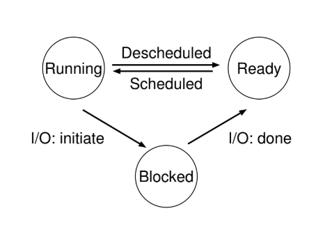

# Conceptos Importantes

---

* **Proceso** es un programa en ejecución. Lo constituye lo que llamamos **Machine state** o **Máquina de estado**, donde se encuentra la **Memoria**, la memoria que el proceso puede acceder llamada **address spaces** o **Espacio de direcciones**. Los **Registros**, algunos importantes como por ejemplo el PC (Program Counter) que nos dice que instrucción es la siguiente en ejecutar, del programa el **Stack Pointer**, se usa para manejar la pila de los parametros de funciones, variables locales, return address. También tienen la información I/O.

* Los proceso pueden estar en diferentes **Estados**:



**Running** es el estado con el control de la CPU.

**Ready** son los procesos en espera para usar la CPU.

**Blocked** puede ser cuando un proceso espera una interacción con algun I/O.

---

* `fork()` es una system call usada para crear un proceso nuevo. Este proceso nuevo es una copia casi exacta del proceso que lo llamó ("El padre"). El proceso nuevo ("El hijo"), no empieza en el main del padre, si no que empieza a partir de donde se llamo `fork()` en el padre. El padre recive de `fork()` el **PID** del hijo, a el hijo recive de `fork()` un cero. `fork()` imprime $2^{n}$ con `printf("a")` n cantidadedes de `fork()`.

* `wait()` es la función que utiliza un proceso padre para esperar a que su proceso hijo termine de ejecutarse, "entra en modo zombie". Una vez termina de ejecutarse y vuelve `wait()`, se termina de ejecutar el padre.

* `exec()` se usa para que un proceso hijo se diferencie, o ejecute un programa diferente al del padre. Simplemente toma el nombre de un ejecutable y algunos argumentos, carga su código de ese ejecutable y sobreescribe el código correspondiente al segmento del hijo. Este NO crea un proceso nuevo, solo lo transforma. Una llamada correcta de `exec()` nunca vuelve.

* `kill()` se usa para mandar signals a un proceso, incluyendo directivas para pausar, matar y otros imperativos utiles.

* `signal()` se usa en un proceso para "agarrar" varias signals.

* Todas las funciones mencionadas son system call.

---

* **Limited Direct Execution** o **Ejecución Directa Limitada**, la parte de "Direct Execution" se refiere a ejecutar sea cual sea el programa directamente en la CPU. La parte de "Limited" se refiere a NO dejar que cualquier proceso se apodere de la CPU indefinidamente o que realicen una instrucción ilegal.

* **User mode**, todo código que corra en este modo esta restringido en las instrucciones que puede realizar.

* **Kernel mode**, es donde corre el SO. Los programas que corren en este modo pueden realizar lo que quieran incluyendo operaciones privilegiadas.

* **System calls**, permiten al kernel exponer cuidadosamente partes claves de funcionalidad a programas en el modo usuario. Para ejecutar una syscall, el programa ejecuta una instrucción **"Trap"**, que salta al kernel mode. Al terminar de ejecutar la syscall, se vuelve al user mode con una **"return from trap"** instrucción. Al realizar el trap y return from trap se guardan y leen los registros PC, entre otros registros del proceso hasta el **Kernel Stack**.

* Hay dos fases en el Protocolo Ejecución Directa Limitada:

    1. **"Al Bootear"**, el kernel inicializa la **trap table** y la CPU recuerda la ubicación de los **trap handlerss** para su futuro uso.
    2. **"Al correr un proceso"**, el kernel realiza algunas cosas antes de realizar un return from trap para iniciar la ejecución de un proceso.

* `yield()` es una syscall que transfiere el control de la CPU al SO.

* **Non-Cooperative Approach** o **Enfoque no cooperativo**, es cuando el SO tiene formas de recuperar la CPU, ya sea con **timers interrupts** u otros tipos de interrupciones o cuando los procesos llaman a una syscall.

* Un **Timer Interrupts** es una interrupción programable para realizarce cada cierto tiempo, en general milisegundos una vez ocurrido el interrupt, el proceso se detiene, y un interrupt hendler pre-configurada en el SO se ejecuta.

* **Cooperative Approach** o **Enfoque cooperativo**, es cuando el SO no tiene forma de recuperar la CPU de un proceso, a menos que se realice un `yield()` u otras syscall o que termine el proceso.

---

* El **Scheduler** es el encargado de elegir si un proceso sigue corriendo o se cambia a otro proceso. De elegir cambiar de proceso, el SO ejecuta un **Context Switch**, basicamente el SO guarda los valores de registros del proceso en ejecución y lee los valores de registros del proceso a ejecutarse.

* Hay dos tipos de saves/restore de registros.

    1. Es cuando ocurre un timer interrupts, los user registers del proceso en ejecución son implicitamente guardados por el hardware, usando el kernel stack del proceso.

    2. Ocurre cuando el SO decide cambiar de proceso A al B, donde los kernel registers son explicitamente guardados por el software, pero en la memoria de la estructura del proceso.

* **Workload** se le dice al proceso corriendo actualmente en el sistema.

* **Turnaround Time** o **Tiempo de entrega**, es el tiempo en el que un proceso/trabajo se completa, menos el tiempo en el que el trabajo llega al sistema ($T_{entrega} = T_{finalizacion} - T_{llegada}). Es una metrica de performance.

* **FIFO**, el proceso que primero llega, es el primero que termina de ejecutarse.

* **SJF**, un caso extra del FIFO, donde de un conjunto de procesos que llegan al mismo tiempo, se ejecuta el que se ejecuta mas rapido hasya el que se ejecuta mas lento, osea el que tiene menos tiempo de ejecución primero.

* **NON-Preemtive** schedulers o planificador **no apropiativo**, corren un proceso hasta completarlo, para recien ahi considerar si ejecutar otro proceso.

* **Preemptive** scheduler o planificador **apropiativo**, frenan un proceso para ejecutar otro en particular, el scheduler puede realizar un context switch.

* Un SJF es un scheduler non-preemptive. Hacerlo preemptive un SJF es un **STCF**, el cual al ingresar procesos al sistema, analiza si son más cortos para dejar o cambiar el proceso que se esta ejecutando.

* **Response time** o **Tiempo de respuesta**, es el tiempo en el que un proceso se ejecuta por primera vez, menos el tiempo en el que llega al sistema. ($T_{respuesta} = T_{1ra-ejecución} - T_{llegada}).

* **Roun Robin** (RR), ejecuta un proceso por un time slice o quantum, al terminarse ese quantum se cambia a otro proceso. Repitiendo esos pasos hasta que se terminen todos. Con un quantum razonable, es un exelente scheduler de response time y malo de turnaround time.

* Tenemos dos tipos de scheduler

    1. (SJF, STCF) optimizan el turnaround time a coste del response time.

    2. (RR) optimiza el ronsponse time a coste del turnaround time.

* **Overlaping** o **Superposición**, es cuando se ejecuta un proceso A, mientras un proceso B que se venia ejecutando de antes, se bloquea por una operación I/O.

---

* **Multi-level Feedback Queue** (MLFQ), este scheduler intenta optimizar el turnaround time y minimizar el reponse time. Utilizando una Queue de prioridades. Al tener un proceso con la misma prioridad, se ejecuta en forma RR.

* **Allotment** o **Tiempo Asignado** es la cantidad de tiempo que un proceso puede usar en una prioridad, antes de que el scheduler se la reduzca.

* **Starvation** o **Inanición** o **morir de hambre**. Sucede cuando hay muchos proceso interactivos que en conjunto consumento todo el CPU time, opacando a los proceso de larga duración sin recivir CPU time. **Game the scheduler** es cuando se encuentra una forma de engañar al scheduler para aprovecharse.

* Concluimos con 5 reglas de la MLFQ:

    1. Si Prio(A) > Prio(B) => A se ejecuta y B no.

    2. Si Proo(A) = Prop(B) => A y B se ejecutan en RR.

    3. Al entrar un proceso al sistema, se posiciona en la prioridad mas alta.

    4. Si un proceso utiliza todo su allotment en un nivel de prioridad, se le reduce de prioridad.

    5. Al cabo de un tiempo S, todos los procesos del sistema se mueven a la prioridad mas alta.

* **Wall time**, es el tiempo de reloj que pasa.

* **user time**, es el tiempo en el modo usuario.

* **system time**. es el tiempo en el modo kernel.

---

* **Espacio de direcciones**, es el espacio del programa en ejecución. Contiene todo el estado de memoria del programa en ejecución:

    - El código del programa
    - El **Stack**, mantiene un seguimiento de donde se encuentra en la cadena de llamada de funciones, asi como tambén para asignar variables locales, pasar parametros y devolver valores.
    - El **Heap**, es usado para asignaciones dinamicas, manejo de memoria del usuario, como las que deberia recibir de una llamada `malloc()`.

---

* `malloc()`, consulta por espacio en el heap pasando el tamaño, y cualquier caso te devuelve un puntero, al nuevo espacio asignado, si falla devuelve `NULL`. El unico parametro que toma es del tipo `size_t` el cual solamente describe cuantos bytes necesitas.

* `free()`, libera memoria del heap. Toma como argumentos un puntero retonado por `malloc()`.

* `malloc()` y `free()` NO son syscalls pero si son librery calls, pero estan construidas por algunas system calls.

* `brk`, es usada para cambiar la locación de quiebre del programa: la ubicación del final del heap. Toma como argumento la dirección del nuevo final, e incrementa o decrementa el tamaño del heap.

* `mmap()`, crea una región de memoria **anonima** en tu programa. Esta memoria puede ser tratada como un heap y manejada igual.

* `calloc()` asigna memoria y las inicia en cero antes de retornarla.

* `realloc()` reserva una region de memoria nueva mas grande, copia el contenido de la region vieja, y retorna el puntero a la nueva region.

---

* **traducción de direcciones**, redirige referencia de memoria del programa a la ubicación real en memoria. Transofrma una dirección virtual en una dirección física es la tecnica a la que nos referimos

* **base-limite**, este par nos permite ubicar en el espacio de direcciones en cualquier lugar que querramos de la memoria física. El limite esta para ayudar  con la protección. El proceso verifica que la memoria referenciada este dentro de los limites para asegurarse que es legal

* Cuando cualquier referencia a memoria es generada por el proceso, es traducida por el procesador como: La Dirección Física va a ser igual a Dirección virtual más la base (Physical addres = virtual address + base). Cada referencia de memoria generada por el proceso es una **Dirección Virtual**, el hardware agrega el contenido del registro base a esa dirección y el resultado es una **Dirección Física**.

* Dado que la reubicación de la dirección sucede en tiempo de ejecución, y dado que podemos mover el espacio de direcciones incluso después de que el proceso comienza a ejecutarse, esta tecnica a veces es conocida como reubicación dinámica

* **Memomry management ubit** (MMU) o **Unidad de administración de memoria**, es donde viven los registros base y limte.

* El SO corre en Modo privilegiado o modo kernel, donde tiene acceso a la máquina entera.

* Las aplicaciones corren en modo usuario, donde estan limitados en que pueden hacer.

* **Instrucciones Privilegiadas**, intrucciones especiales para modificar los registros base y limite, permitiendole al SO modificarlo cuando se ejecutan diferente procesos. Solo en modo kernel pueden modificarse los registros.

---

* **Fragmentación externa**, el espacio libre es cortado en pequeñas piezas de diferentes tamaños, peticiones subsecuentes pueden fallar a causa de no tener espacio libre contiguo que pueda satisfacer la petición.

* **free list**, es una estructura que contiene referencias a todos los chunks libres del espacio de la región de memoria administrada.

* **Fragmentación interna**, es cuando un asignado recibe chunks de memoria mas grande de los que pidio.

* **División** Encontrara un chunk libre de memoria que pueda satisfacer la petición y lo dividira en dos. El primer chunk lo retornara al que hizo la petición; y el segundo permanecera en la free list.

* **Fusión**, fusiona el espacio libre cuando un chunk de memoria es liberado. Mira cuidadosamente que esta retornado y a los chunk libres cercanos; si el nuevo espacio libre esta al lado de un chunk libre, los ordena en un solo chunk mas grande.

* **Best fit**: Primero, buscamos a traves de la free list y encontramos chunks de memoria libre que sean igual o más grande que el tamaño pedido. Entonces, retornamos el más chico de ese grupo de candidatos.

* **Worst fist**: Encuentra el chunk mas grande y devuelve la cantidad solicitada; mantiene el resto del chunk en la free list. Intenta dejar grandes chunks libres en vez de muchos chunks chicos.

* **First fit**: Encuentra el primer bloque de memoria que sea suficientemente grande retorna la cantidad pedida al usuario.

* **Next fit**: Mantiene un puntero adicional a la ubicación dentro del lista donde se miró por última vez. La idea es repartir las búsquedas de espacio libre por toda la lista de forma mas uniforme, evitando así fragmentación.

---

* **Paginación**, Divide el espacio de direcciones de un proceso en unidades de tamaño fijo, llamadas **paginas**.

* La memoria física se ve como un array de slot de tamaño fijo llamado **page frame**, cada uno puede contener una sola pagina de memoria virtual.

* **Page table**, guarda traducciones de direcciones para cada pagina virtual del espacio de direcciones, permitiendo saber en que lugar de la memoria física esta cada pagina. Es una estructura de datos por proceso, si otro proceso se ejecuta, el SO debe tener una page table para el, dado que sus paginas mapean a diferentes lugares físicos.

* **Virtual Page Number** (VPN), es el número de pagina virtual en un esquema de memoria virtual. Se usa para identificar una página en el espacio de direcciones virtuales de un proceso antes de ser traducido a una dirección física.

* **Page Frame Number** (PFN) o **Page Physical Number** (PPN), es el identificador que asigna el SO a cada **frame** o bloque de memoria física

* **Page Table Entry** (PTE), es cada una de las entradas de la page table que utiliza el SO para gestionar la traducción de direcciones virtuales a direcciones físicas. Cada PTE contiene la información necesaria para mapear una pagina virtual a un frame de memoria física.

* **Page table lineal**, es una page table la cual es solo un array. El SO indexa el array por el VPN, y mira el PTE en el indeice para encontrar el PFN deseado.

* El contenido de cada PTE:

    - **Valid bit** es comun para indicar si la traducción particular es valida.

    - **Protection bits**, indica ya sea si la pagina puese ser leida, escrita o ejecutada.

    - **Present bit** indica si la pagina esta en la memoria física o en el disco.

    - **Dirty bit**, indica si una pagina ha sido modificada desde que llego a la memoria.

    - **Reference bit** (a.k.a. **Accessed bit**) es usada para rastrear si una pagina ha sido accedida, es util para determinar que pagina son populares, y por lo tanto deverian mantenerse en la memoria.

---

* **Translation-Lookaside Buffer** (TLB) es parte de la MMU, es simplemente una **cache** de hardware de traducciones populares de direcciones virtuales a físicas.

* **TLB hit**, es cuando la TLB tiene la traducción para un VPN.

* Si la CPU no encuentra la traducción en la TLB tenemos un **TLB miss**, por lo que el hardware tiene que acceder a la page table para encontrar la traducción, esta acción es costosa, por lo que es mas lento que un TLB hit. Finalmente, actualiza la TLB, el hardware reintenta la instrucción; esta vez, la traducción esta en el TLB, y la referencia a memoria se hace rapido.

* En un TLB tipico debe ser **Completamente Asociativo**. Esto significa que cualquier traducción dada puede estar en cualquier lugar de la TLB, y que el hardware basca en todo el TLB en paralelo para encontrar la traducción deseada.

* El TLB comunmente tiene:

    - **Valid bit** el cual dice si la entrada tiene una traduccion valida o no.

    - **Protection bit**, los cuales indican como puede ser accedida una page table.

* **Space identifier** (ASID) es como un PID, pero tiene menos bits. Diferencia cualquier traducción identica.

---

* **Page Directory**, es usada para que nos diga donde está una página de la page table o si toda la pagina de la page table contiene paginas no validas.

* **Page directory entry** (PDE) es una entrada en el page directory utilizado en esquemas de paginas de memoria.

* Una PDE tiene:

    - **Valid bit**. Si la PDE es válida, significa que al menos una de las páginas a las que apunta la page es válida, es decir, en al menos una PTE de la página apuntada por esa PDE, el valid bit esta seteado en uno. Si la PDE no es válido, del resto de los PDE no estan definidos.

* `PDEAddr = PageDirBase + (PDEIndex * sizeof(PDE))`

---

* **Theread** o **Hilo**: es como su fuera otro proceso separado, excepto por una diferencia, comparten el mismo espacio de direcciones y por lo tanto pueden acceder a los mismo datos. Tienen un PC que rastrea de donde esta obteniendo instrucciones el programa. Tienen sus propios set de registros privados que utilizada para calculos.

* El context switch entre hilos es muy similar al context switch entre procesos. Con los procesos, guardabamos el estado en un bloque de control de procesos (PCB); ahora, necesitamos uno o mas **Bloque de control de hilo** (TCBs) para guardar el estado de cada hilo de un proceso. La mayor diferencia es que el espacio de direcciones permanece igual (osea no es necesario cambiar la page table que estamos usando).

* En un proceso multi-hilo, cada hilo se ejecuta independietemente y puede llamar a varias rutinas. En vez de un solo stack en el espacio de direcciones, habra uno por hilo.

* Cualquier asignación en el stack de variables, parametros, valores de retorno, etc. será ubicado en lo que llamamos **Thread-Local Storage** (Almacenamiento del hilo local).

* ¿Porque usar hilos?

    1. **Paralelización**, es la tarea de transformar un programa de un solo hilo en un programa que hace trabajos en multiples CPUs.

    2. Evitar bloquear el progreso del programa dado la lentitud de I/O. Mientras un hilo espera, el planificador de la CPU puede cambiar a otro hilo, el cual este listo para ejecutarse y hacer algo útil. Los hilos permiten superposición de I/O con otras actividades en un solo programa.

* **Condición de carrera**: El resultado depende de los tiempos de ejecución del código.

* **Sección Critica**, es una piza de código que accede a una variable compartida y no debe ser ejecutado por más de un hilo.

* **Primirivas de sincronización**, con ayuda del hardware, en combinación con el SO, se puede construir código multi-hilo que acceda a secciones criticas de una forma sincronizada y controlada, por lo que seguramente produzca el resultado correcto.

---

* Para crear un hilo usamos `pthread_create()`, que tiene cuatro argumentos:

    - `*thread`, es un puntero a una estructura de tipo `pthread_t`; usamos esta estructura para interactuar con el hilo, y por eso necesitamos pasarsela a `pthread_create()` para inicialzarla.

    - `*attr`, es usado para especificar cualquier atributo que deba tener el hilo. (por ejemplo, setear el tamaño del stack o quizas información sobre la prioridad de planifiacación del hilo).

    - `*(*start_routine)(void*)`, pide que función deberia empezar a ejecutar el hilo. Esto lo llamamos **Puntero a una función**, y esto nos dice que se espera un nombre de una función (`start_routine`), al cual se le pasa un solo argumento de tipo `void *`, y cual retorna un valor de tipo `void *`.

    - `arg`, es exactamente el argumento para ser pasado donde el hilo comienza la ejecución.

* `pthread_join()` lo que hace es esperar a que un hilo termine. Esta rutina toma dos argumentos:

    - El primero es de tipo `pthread_t`, y es usado para especificar por cual hilo esperar. Esta variable es inicializada en la creación del hilo.

    - El segundo es un puntero al valor de retorno que deseas obtener (`void **value_prt`). Dado que una que una puede retornar cualquier cosa, esta definida para retornar un puntero a `void`; dado que `pthread_join()` cambia el valor del argumento pasado, necesitas pasar un puntero y no el valor.

* **Locks** es un mecanismo de sincronización utilizado para garantizar que solo un hilo acceda a una sección critica del código a la vez. Sirve para prevenir condiciones de carrea.

* Para provver exculsión mutua a una sección critica a traves de locks, usamos: `int pthread_mutex_lock(pthread_mutex_y *mutex)` y `int pthread_mutex_unlock(pthread_mutex_t *mutex)`.

* Para inicializar un lock usamos la forma dinámica, llamamos a `pthread_mutex_init()` (`int rc = pthread_mutex_init(&lock, NULL);`):

    - El primer argumento es la dirección del mismo lock.

    - El segundo es un conjunto de argumentos opcionales.

    - Tambien se tiene que hacer el correspondiente llamado a `pthread_mutex_destroy()`.

* `int pthread_mutex_trylock(pthread_mutex_t *mutex)` retorna un fallo si el lock ya lo tiene otro hilo.

* `int pthread_mutex_timedlock(pthread_mutex_t *mutex, struct timespec *abs_timeout)` retorna despues de un tiempo o despues de adquirir el lock, lo que suceda primero, con un tiempo de cero se convierte en el caso `trylock`.

* **Variables de condición**. Son útiles cuando algun tipo de señalización debe tomar lugar entre los hilos, si un hilo está esperando que otro haga algo antes de continuar. para usar una condición de variable, uno tiene que tener ademas un lock que este asociado con esa condición. Cuando llamamos a cualquiera de esas rutinas el lock debe estar obtenido.

* Se usan dos rutinas para que los hilos interactuen:

    - `int pthread_cond_wait(pthread_cond_t *cond, pthread_mutex_t *mutex)`, pone al hilo llamador a dormir, y por lo tanto espera que otro hilo le mande una señal, usualmente cuando algo en el programa es cambiado que el hilo ahora dormirdo debe considerar. Como segundo argumento toma un lock, la razón es que ademas de poner al hilo llamador a dormir, libera el lock cuando pone a dicho llamador a dormir

    - `int pthread_cond_signal(pthread_cond_t *cond)`, se utiliza para despertar a un hilo que está esperando en una condición de variable.

---

* Al llamar a la rutina `lock()` se intenta adquirir el lock; si ningun otro hilo lo tomo (osea, esta libre), el hilo adquirira el lock y entrara en la sección critica; a veces se dice que este hilo es el **dueño del lock**

* Una vez que el dueño del lock llama a `unlock()`, la cerradura ahora está disponible (libre) nuevamente.

* **Grano grueso**, este enfoque nos dice que usamos un lock grande que se usa cada vez que se accede a una sección critica. Usa un único lock grande que abarca toda la sección critica, bloqueadno el acceso concurrente completo mientras un hilo trabaja.

* **Grano fino**, este enfoque protege diferentes datos y estructuras de datos con diferentes locks, lo que permite que más hilos esten en diferentes secciones criticas a la vez. Divide las secciones criticas en partes mas pequeñas y protege cada una con un lock independiente, permitiendo mayor concurrencia al permitir que múltiples hilos trabajen simultaneamente en diferentes partes.

* **Test-and-set**

```c
int TestAndSet (int * old_ptr, int new) {
    int old = * old_ptr; 	// recupera el valor antiguo en old_ptr
    * old_ptr = new;
    // almacena ‘new’ en old_ptr
    return old;
    // devuelve el valor anterior
}
```

o **Intercambio atómico**, es una instrucción atomica, se utiliza para implementar mecanismos de exclusión mutua. Devuelve el antiguo valor al que apunta el `old_ptr`, y actualiza simultaneamente dicho valor a `new`. La razon por la que se llama "test-and-set" (evaluar y establecer) es que le permite "evaluar" el valor anterior (que es lo que se devuelve) mientras simultaneamente "establece" la ubicación de la memoria en un nuevo valor, es suficiente para construir un simple **lock con espera ocupada**. Su función es leer el valor de una variable (generalmente un puntero) y, al mismo tiempo, establecer a un nuevo valor en una única operación indivisible (no puede ser interrumpida por ningun otro proceso o hilo durante su ejecución, lo que garantiza que dos procesos no puedan modificar la variable simultaneamente).

* **Locks con espera ocupada**, es el tipo de lock mas simple de construir y simplemente gira, usando ciclos de CPU, hasta que el lock está disponible.

* **Planificador Apropiativo**, es un planificador que en vez en cuando, interrumpe un hilo a traves de un temporizador, para ejecutar otro diferente.

* **`Compare-and-swap(int *ptr, int expected, int new)`** 

```c
int CompareAndSwap(int *ptr, int expected, int new) {
    int original = *ptr;
    if (original == expected){
        *ptr = new;
    }
    return original;
}
```

o **compare-and-exchange**, compara e intercambia para probar si el valor en la dirección especificada por `ptr` es igual a `expected`; si es así, actualiza la ubicación de la memoria señalada por `ptr` con el nuevo valor. En caso contrario, no hacer nada. En cualquier caso, devolver el valor original en esa ubicación de memoria, permitiendo así que el código que llama compare-and-swap sepa si tuvo exito o no. Con esta instrucción podemos construir un lock de una manera bastante similar a la de test-and-set. Es mas poderosa que test-and-set. ¿`new`?

* **`load-linked(int *ptr)`** 

```c
int LoadLinked(int *ptr) {
    return *ptr;
}
```

funciona de manera similar a una instrucción de carga típica, y simplemente obtiene un valor de la memoria y lo coloca en un registro.

* **`store-conditional(int *ptr, int value)`** 

```c
int StoreConditional(int *ptr, int value) {
    if (no update to *ptr since LoadLinked to this address) {
        *ptr = value;
        return 1; // success!
    } else {
        return 0; // failed to update
    }
}
```

solo tiene exito (y actualiza el valor almacenado en la dirección desde la que se acaba de realizar el load-linked) si no se ha relizado ningun Almacenamiento intermedio en la dirección. En caso de exito devuelve 1 y actualiza el valor en `ptr` para `value`, el valor en `ptr` no es actualizado y retorna 0.

* `**Fetch-and-Add(int *ptr)`** 

```c
int FetchAndAdd(int *ptr) {
    int old = *ptr;
    *ptr = old + 1;
    return old;
}
```

incrementa atómicamente un valor mientras devuelve el valor anterior en una dirección particular.

* **lock con turno**, en lugar de un valor unico, esta solución combina un boleto y una variable de turno para construir un lock. Cuando un hilo desea adquirir un lock.

```c
typedef struct __lock_t {
    int ticket;
    int turn;
} lock_t;

void lock_init(lock_t *lock) {
    lock->ticket = 0;
    lock->turn = 0;
}

void lock(lock_t *lock) {
    int myturn = FetchAndAdd(&lock->ticket);
    while (lock->turn != myturn)
    ; // spin
}

void unlock(lock_t *lock) {
    lock->turn = lock->turn + 1;
}
```

* **`park()`**, pone un hilo a dormir y **`unpark()`** despierta un hilo en particular.

* **Herencia de prioridad**, es una tecnica que resuelve el problema de la inversión de prioridad, donde los locks con espera ocupada causan el problema, se puede evitar el uso de esto locks, un hilo de mayor prioridad que espera un hilo de menor prioridad puede aumentar temporalmente la prioridad del hilo inferioir, lo que le permite ejecutarse y superar la inversión.

* **`setpark()`**, al llamar esta rutina, un hilo puede indicar que está a punto de estacionar (llamar a `park()`). Si luego se interrumpe y otro subproceso llama a `unpark()` antes de que se llame a `park()`, el siguiente `park()` regresa inmediatamente en lugar de dormir.

* **`futex_wair(address, expected)`**, pone el hilo que hizo la llamada a dormir, asumiendo que el valor en `address` es igual a `expected`. Si no es igual, la llamada retorna inmediatamente.

* **`futex_wake(address)`**, despierta un hilo que esta esperando en la cola.

* **Lock de dos fases**, se da cuenta de que la espera ocupada puede ser útil, especialmente si el lock está a punto de liberarse. Entonces, en la primera fase, la cerradura itera por un tiempo, esperando que pueda adquirir el lock. Si el lock no se adquiere en la primera fase de espera ocupada, se ingresa a una segunda fase, donde se pone a dormir el hilo que hizo la llamada, y solo se despierta cuando el lock se libera más tarde.

---

* **Variable de condición** es una cola explícita en la que los hilos pueden colocarse cuando algún estado de ejecución (osea, alguna **condición**) no es como se desea (**esperando** en la condición); alguún otro hilo, al cambiar dicho estado, puede depertar a uno (o mas) de esos hilos que están esperando, permitiendoles continuar (mediante una **señal** en la condición).

* Para declarar una variable de condiciones, se escribe algo como `pthread_cond_t c`

* La variable de condiciones tiene dos operaciones asociadas: `wait()`, se ejecuta cuando un hilo desea ponerse en estado de espera (sleep) y `signal()` se ejecuta cuando un hilo ha cambiado algo en el programa y quiere despertar a un hilo durmiente esperando sobre esta condición (`pthread_cond_wait(pthread_cond_t *c, pthread_mutex_t *m)` y `pthread_cond_signal(pthread_cond_t *c)`).

* **Condición de cobertura**, es un problema que surge cuando una señal o evento antes de que un hilo se haya preparado para esperarlo. Esto resulta en que el hilo no detecte el evento porque ya ha pasado.

---

* **Semaforo**, es un objeto con un valor entero que podemos manipular con dos funciones: `sem_wait()` y `sem_post()`.

```c
int sem_wait(sem_t *s) {
    restar uno al valor del semáforo
    esperar si el valor del semáforo s es negativo
}

int sem_post(sem_t *s) {
    sumar uno al valor del semáforo
    si hay uno o más subprocesos esperando, despierta uno
}
```

* Para inicializar un semaforo `s` lo inicializamos con el valor 1 pasadon 1 como tercer argumento. El segundo argumento de sem_init() se pondrá a 0, esto indica que el semáforo se comparte entre hilos del mismo proceso

```c
#include <semaphore.h>
sem_t s;
sem_init(&s, 0, 1);
```

* En el momento de la inicializacion de un semaforo tenemos diferentes casos:

    - Con el lock, era 1, porque estás dispuesto a tener el lock bloqueado (cederlo) inmediatamente después de la inicialización. 
    
    - Con el caso de la ordenación, era 0, porque no hay nada que ceder al principio; sólo cuando el hilo hijo termina se crea el recurso, momento en el que el valor se incrementa a 1.

* `rwlock_acquire_writelock()`, para adquirir un lock de escritura, y `rwlock_release_writelock()`, para liberarlo. Utilizan el semáforo `writelock` para asegurar que sólo un escritor pueda adquirir el lock y así entrar en la sección crítica para actualizar la estructura de datos.

* Cuando se adquiere un lock de lectura, el lector primero adquiere el lock y luego incrementa la variable readers para rastrear cuántos lectores están actualmente dentro de la estructura de datos.

* **Thtottling**, es un enfoque para evitar que "demasiados" hilos hagan algo a la vez y saturen el sistema, simplemente decidiendo un umbral para "demasiados", y luego usar un semaforo para limitar el número de hilos que ejecutan simultaneamente el pedazo de código en cuestion.

* **Memoria intensiva**, imaginemos que creamos cientos de hilos para trabajar en algun problema en paralelo. Sin embargo, en cierta parte del código, cada hilo adquiere una gran cantidad de memoria para realizar parte del cálculo; Esta parte del código es la memoria intensiva.

* Si todos los hilos entran en la región de memoria intensiva al mismo tiempo, la suma de todas las solicitudes de asignacion de memoria superara la cantidad de memoria fisica de la maquina. Como resultado, la maquina empezara a hacer **Thrashing** (osea, a intercambiar paginas hacia y desde el disco), y todo el calculo se arrastra.

---