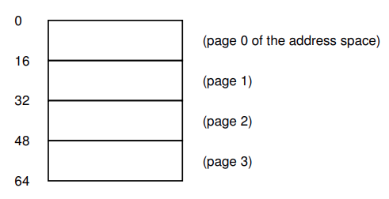
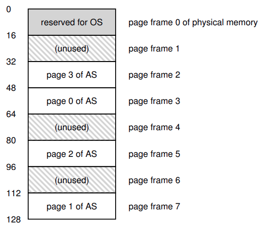
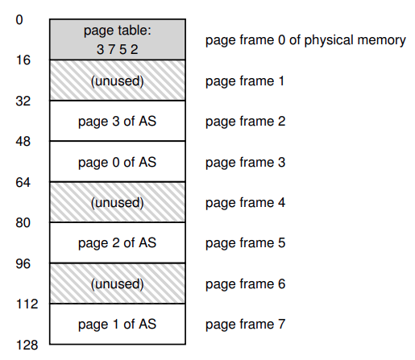
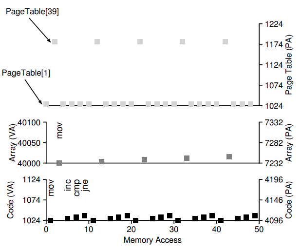

# Paginación: Introducción

A veces se dice que el SO toma uno de dos enfoques cuando resuelve casi cualquier problema de administración de espacio.

1) Es cortar cosas en piezas de ***tamaño variable***, como con la **segmentación** en la virtualización de memoria. Esta solución tiene problemas inherentes. En particular, cuando divide un espacio en chunks de diferentes tamaño, el mismo espacio se **Fragmenta**, y por lo tanto las asignaciones son mas dificiles.

2) Cortar el espacio en piezas de ***tamaño fijo***. En la VM, llamamos a esta idea **Paginación**. En vez de dividir el espacio de direcciones de un proceso en segmentos logicos de tamaño variable (Por ejemplo, heap, stack), lo dividimos en unidades de tamaño fijo, que las llamaremos **Paginas**. Vemos a la memoria física como un array de slot de tamaño fijo llamados **Page Frame**; cada uno de esos frames puede contener una sola pagina de VM.

---

## Un ejemplo simple y descripción general

Veamos un ejemplo simple para ayudar a enteder este enfoque:



Figure 18.1: **Un espacio de direcciones simple de 64 bytes**

Vemos un espacio de direcciones pequeño de tan solo 64 bytes de tamaño total, con cuatro paginas de 16 bytes. Los espacios de direcciones reales son mucho mas grande, obviamente, 32 bits, y por lo tanto 4 GB de espacio de direcciones, o incluso 64 bits; a menudo usaremos pequeños ejemplos para hacerlo mas faciles de digerir.



Figure 18.2: **Un espacio de direcciones de 64 bytes en una memoria física de 128 bytes**

La memoria física, como vemos en la figure, también contiene un número de slots de tamaño fijo, en este caso ocho pages frames (haciendo una memoria de 128 bytes, que también es muy chica). Como vemos en el diagrama, las paginas del espacio de direcciones virtual ha sido ubicado en diferentes lugares a lo largo de la memoria física; el diagrama también muestra el SO usando algo de memoria física para el mismo.

La paginación tiene ciertas ventaja sobre los enfoques previos. Probablemente la mejora mas importante sera la ***flexibilidad***: con un enfoque desarrollado completamente a la paginación, el sistema sera capaz de soportar la abstracción de un espacio de direcciones efectivamente, sin importar como un proceso use el espacio de direcciones; por ejemplo, no asumiremos en que dirección crece el heap o el stack y como son usados.

Otra ventaja es la ***simplicidad*** de la administración del espacio libre que ofrece la paginación. Por ejemplo, cuando el SO quiere ubicar nuestro espacio de direcciones de 64 bytes en nuestra memoria física de ocho paginas, es simple encontrar cuatro paginas libres; dado que el SO mantiene una **free list** de todas las paginas libres, el SO tiene ubicada la pagina virtual 0 del espacio de direcciones (AS) en el frame físico 3, la pagina virtual 1 del AS en el frame físico 7, la pagina 2 en el frame 5, y la pagina 3 en el frame 2. Las pages frames 1, 4 y 6 actualmente estan libres.

Para recordar donde esta ubicada cada pagina virtual del espacio de direcciones en la memoria física, el SO usualmente mentiene a una estructura de datos conocida como **Page table** por ***Proceso***. El rol principal de la page table es guardar **traducciones de direcciones** para cada pagina virtual del espacio de direcciones, por lo tanto, permitiendonos saber en que lugar de la memoria física esta cada pagina. Para nuestro ejemplo, la page table deberia tener las siguientes cuatro entradas: (Virtual page 0 -> Physical Frame 3), (Virtual page 1 -> Physical frame 7), (Virtual page 2 -> Phhysical frame 5) y (Virtual page 3 -> physical frame 2).

Importante recordar que esta page table es una estructura de datos por proceso. Si otro proceso se ejecuta en nuestro ejemplo, el SO deberia tener una page table para el, dado que sus paginas virtuales obviamente mapean a diferentes paginas físicas.

Ahora, sabemos lo suficiente para hacer un ejemplo de traducción de dirección. Imaginemos que el proceso con ese pequeño espacio de direcciones (64 bytes) esta haciendo un acceso a memoria.

```assembly
movl <virtual address>, %eax
```

Prestemos atención a la carga explicita de los datos de la dirección `<virtual address>` en el registro `eax` (ignoremos la busqueda de instrucciones que debe haber ocurrido antes).

Para **traducir** esta dirección virtual que genero el proceso, primero tenemos que dividirla en dos componentes: el **Número de paginas virtuales** (**VPN**), y el **offset** en la pagina. Para el ejemplo, dado que el espacio de direcciones virtuales es de 64 bytes, necesitamos 6 bits en total para nuestra dirección virtual ($2^{6} = 64$). Nuestra memoria virtual puede ser conceptualizada asi:

| Va5 | Va4 | Va3 | Va2 | Va1 | Va0 |
|:---:|:---:|:---:|:---:|:---:|:---:|

En este diagrama, Va5 es el bit de mayor orden de la dirección virtual, y Va0 es el bit de menor orden. Dado que sabemos el tamaño de la pagina (16 bytes), ademas podemos dividir la dirección virtual asi:

| Va5 | Va4 | Va3 | Va2 | Va1 | Va0 |
|:---:|:---:|:---:|:---:|:---:|:---:|
| VPN | VPN | offset | offset | offset | offset |

El tamaño de la pagina es de 16 bytes en un espacio de direcciones de 64 bytes; por lo que necesitamos ser capaces de seleccionar 4 paginas, y los primeros 2 bits de la dirección hacen justo eso. Tenemos un **VPN** de 2 bits. Los bits restantes nos dicen en que bytes de la pagina estamos interesados, 4 bits en este caso; a esto le llamamos **offset**.

Cuando un proceso genera una dirección virtual, el SO y el hardware deben combinarse para traducirla en una dirección física significativa. Por ejemplo, asumamos que la carga de arriba es a la dirección 21:

```assembly
movl 21, %eax
```

Pasando "21" a la forma binaria, obtenemos "010101", y por lo tanto podemos examinar esta dirección virtual y ver como se descompone en un número de pagina virtual (VPN) y offset:

| 0 | 1 | 0 | 1 | 0 | 1 |
|:---:|:---:|:---:|:---:|:---:|:---:|
| VPN | VPN | offset | offset | offset | offset |

La dirección virtual "21" esta en el quinto byte ("0101") de la pagina "01". Con nuestro número de pagina virtual, podemos indexar nuestra page table y encontrar en que frame físico recide la pagina virtual 1. En la page table anterior el **Número de frame físico** (**PFN**) o **Número de pagina física** (**PPN**) es 7 (111). Por lo que podemos traducir esta dirección virtual reemplazando el VPN con el PFN y entonces emitir la carga a la memoria física.


Figure 18.3: **El proceso de traducción de direcciones**

Notar que el offset se mantiene igual (osea, no se traduce), ya que el offset solo nos dice que el bit ***dentro*** de la pagina queremos. Nuestra dirección física 1110101 (117 en decimal), y es exactamente de donde queremos que nuestra carga busque datos.

---

## ¿Dónde se guarda las page tables?

Las pages tables suelen ser grandes, mucho mas grandes que las tablas de segmentos o los pares base-limite de los que ya hablamos. Ejemplo, imagina un espacio de direcciones de 32 bits, con 4 KB de paginas. Esta dirección virtual se divide en VPN de 20 bits y un offset de 12 bits (acordate que se necesitarian 10 bits para un tamaño de pagina de 1 KB, y con agregar dos mas para llegar a 4 KB).

Un VPN de 20 bits implica que hay $2^{20}$ traducciones que el SO podria tener que administrar para cada proceso (cerca de un millon); asumiendo que necesitamos 4 bytes por **entrada de la page table** (**PTE**) para mantener la traducción física y cualquier otra cosa util, necesitamos una inmensa memoria de 4 MB para cada page table. Ahora imagina que hay 100 proceso ejecutandose: eso significa que el SO deberia necesitar 400 MB de memoria solo para todas las traducciones de direcciones. Incluso en la era moderna, donde las máquinas tienen GB de memoria, parece loco usar un chunk tan grande solo para traducciones. Ni pensaremos que tan grande tendria que ser la tabla para un espacio de direcciones de 64 bits.

Dado que las page tables son tan grandes, no mantenemos ningun hardware especial en el chip en la MMU para guardar la page table de un proceso en ejecución. En cambio, guardamos la page table de cada proceso en algun lugar de la ***memoria***. Asumamos por ahora que las page tables viven en la memoria física que administra el SO, luego veremos que gran parte de la memoria del SO puede ser virtualizada, y por consecuente las pages tables pueden ser guardadas en la VM del SO (incluso intercambiadas al disco), por ahora ignoremoslo.



Figure 18.4: **Ejemplo: Page table en memoria física del kernel**

En la figure vemos una page table en la memoria del SO; ¿Ves el pequeño conjunto de traducciones?

---

## ¿Qué hay realmente en una page table?

La page table es solo una estructura de datos que es usada para mapear direcciones virtuales (o realmente, números de paginas virtuales) a direcciones físicas (números de frame físicos). Cualquier estructura de datos funcionaria. La forma mas simple es llamada **Page table Lineal**, la cual es solo un array. El SO ***indexa*** el array por el VPN, y mira la entrada de la page table (**PTE**) en el indice para encontrar el número de frame físico (**PFN**) deseado. Por ahora, asumimos esta simple estructura.

En cuanto el contenido de cada PTE, tenemos algunos bits diferentes que vale la pena entender en algun nivel. un **Valid bit** es comun para indicar si la traducción particular es valida; por ejemplo, cuando un programa comienza a ejecutarse, tendra code y heap en un extremo de su espacio de direcciones, y el stack en el otro. Todo espacio no usado en medio sera marcado como **Invalido**, y si el proceso intenta acceder a dicha memoria, generara una trap al SO el cual terminara el proceso. Por lo tanto, el valid bit es crucial para soportar un espacio de direcciones disperso; simplemente marcando todas las paginas sin usar en el espacio de direcciones invalido, removemos lo necesario para asignar frames físico para esas paginas y por lo tanto ahorrar mucha memoria.

También deberiamos tener **Protection bits**, que indiquen ya sea si de donde la pagina puese ser leida, escrita o ejecutada. Acceder a una pagina de una forma no pemitida por esos bits generara una trap al SO.

Un **present bit** indica si la pagina esta en la memoria física o en el disco. Un **dirty bit** también es comun, indica si una pagina ha sido modificada desde que llego a la memoria.

un **reference bit** (a.k.a. **Accessed bit**) es usada para rastrear si una pagina ha sido accedida, es util para determinar que pagina son populares, y por lo tanto deverian mantenerse en la memoria; saber esto es critico durante el **reemplazo de paginas**.


Figure 18.5: **Una page table entry (PTE) en x86**

Vemos en la figure un ejemplo de una page table entry (PTE) desde una arquitectura x86. Contiene un **present bit** (P); un bit de lectura/escritura (R/W) el cual determina si el proceso en modo usuario pueden acceder a la pagina; algunos bit (PWT, PCD, PAT y G) que determinan como trabaja el hardware caching en esta pagina, un **accessed bit** (A) y un **Dirty bit** (D); finalmente el numero de page frame (PFN).

---

## Paginación: Demasiada lenta

Con las pages tables en memoria, sabemos que pueden ser demasiado grandes. Resulta que también puden relentizar las cosas. Por ejemplo, tenemos una simple instrucción.

```assembly
movl 21, %eax
```

Solo examinemos la referencia explicita a la dirección 21 y no nos preocupemos de la instrucción fetch. Asumimos que el hardware hace las traducciones por nosotros. Para buscar el dato deseado, el sistema primero debe **traducir** la dirección virtual 21 en la correspondiente dirección física 117. Por lo tanto, antes de buscar los datos de la dirección 117, el sistema primero busca la page table entry apropiada de la pafe table del proceso, hace la traducción, y entonces carga los datos desde la memoria física.

Para hacerlo, el hardware debe saber donde esta la page table par el proceso en ejecución. Asumamos por ahora que un solo **page-table base register** contiene la dirección física del comienzo de la ubicación de la page table. Para encontrar la ubicación de la PTE deseada, el hardware ajecutara las siguientes funciones:

```assembly
VPN = (VirtualAddress & VPN_MASK) >> SHIFT
PTEAddr = PageTableBaseRegister + (VPN * sizeof(PTE))
```

En nuestro ejemplo, `VPN_MAS` deberia estar seteado en 0x30 el cual selecciona los bits VPN de la dirección virtual completa; `SHIFT` es seteado a 4 (el número de bits del offset), el número el cual movemos el VPN hacia abajo para formar el número de pagina virtual entero correcto. Por ejemplo, con la dirección virtual 21 (010101), y el enmascaramiento lo tranforma en 010000; el shift lo transformara en 01, o pagina virtual 1, como deseabamos. Cuando usamos este valor como un indice dentro del array de PTEs apuntado por la page table base register.

Una vez que conocemos esta dirección física, el hardware puede buscar el PTE desde la memoria, extraer el PFM, y concaternarlo con el offset de la dirección virtual para la dirección física deseada. Podes pensar que el PFN es shifteado a la izquierda por `SHIFT`, y entonces un OR bit a bit con el offset para formar la dirección final deseada:

```assembly
offset = VirtualAddress & OFFSET_MASK
PhysAddr = (PFN << SHIFT) | offset
```

Finalmente, el hardware puede buscar los datos deseados de la memoria y ponerlos en el registro `%eax`. El programa ahora realizo exitosamente la carga de un valor desde la memoria.

---

## Un rastro de memoria

Analicemos un ejemplo de acceso a la memoria para demostrar todos los accesos a la memoria resultantes que ocurren cuando usamos paginación. El fragmento de código en el que estamos interesados es el siguiente:

```c
int array[1000];
...
for (int i = 0; i < 1000; i++){
  array[i] = 0;
}
```

Compilamos y ejecutamos `array.c` con los siguientes comandos:

```shell
prompt> gcc -o array array.c -Wall -O
prompt> ./array
```

Para verdaderamente enteder que acceso de memoria hara este fragmento de código tenemos que saber un par de cosas. Primero, tenemos que **desensamblar** el binari resultante (usando objdump en linux o otool en mac) para ver que instrucción assembly son usandas para inicializar el array en el loop. Este es el resultado:

```assembly
movl $0x0,(%edi,%eax,4)
incl %eax
cmpl $0x03e8,%eax
jne 0x1024
```

La primera instrucción mueve el valor dero en la dirección de la memoria virtual de la ubicación del array; esta dirección es computado tomando el contenido de `%edi` y sumando `%eax` multiplicado por cuatro. `%edi` mantiene la dirección base del array, `%eax` mantiene el indice del array; lo multiplicamos por cuatro dado que el array es un array de enteros, cada posición es de 4 bytes.

La segunda instrucción incrementa el indice del array que esta en `%eax`, y la tercera instrucción compara el contenido de ese registro con el valor hexa 0x03e8, o decimal 1000. Si la comparación muestra que los valores todavia no son iguales, la cuarta instrucción salta de nuevo al inicio del bucle.

Para entender que acceso de memoria hacer esta secuencia de instrucciones, asumimos algo sobre la ubicación dentro de la memoria virtual del fragmento de código y el array, asi como el contenido y la ubicación de la page table.

Para este ejemplo, asumimos un espacio de direcciones de tamaño de 64 KB. También asumimos un tamaño de pagina de 1 KB.

Todo lo que necesitamos saber ahora es el contenido de la page table y la ubicación en la memoria física. Asumimos que tenemos una page table lineal y que esta ubicada en la dirección física 1 KB (1024).

Por lo que nos concierne solo necesitamos unas pocas paginas virtuales sobre las que preocuparnos para tener el mapeo de este ejemplo. Primero, esta la pagina virtual del código. Dado que el tamaño de pagina es de 1 KB, la dirección virtual 1024 reside en la segunda pagina del espacio de direcciones. Asumimos que esta pagina virtual mapea al frame físico 4 (VPN 1 -> 4).

Lo siguiente, es el mismo array. Su tamaño es de 4000 bytes (1000 enteros), y asumimos que reside en la dirección virtual desde 40000 hasta 44000. La paginas virtuales para este rango decimal son VPN = 39 ... VPN = 42. Por lo tanto, necesitamos mapear esas paginas. Asumimos este mapeo virtual-físico para el ejemplo: (VPN 39 -> PFN 47), (VPN 40 -> PFN 41), (VPN 41 -> PFN 9), (VPN 42 -> PFN 10).

Ahora estamos listos para rastrear las referencias de memoria del programa. Cuando se ejecuta. Cada instrucción fetch generara dos referencias a memoria: una a la page table para encontrar el frame físico en la que la instrucción reside, y otra para la misma instrucción para llevarla a la CPU para procesarla. Ademas; hay una referencia a memoria explicita en la instrucción `mov`; primero agrega otro acceso a la page table (para traducir el array de dirección virtual a la correcta dirección física) y luego otro acceso al mismo array.



Figure 18.7: **Una traza de memoria virtual (y física)**

Vemos en la figure el proceso entero para las primeras cinco vueltas del ciclo.

En la parte mas baja del grafico se muestran las referencia a memoria de la instrucción en el eje Y en negro (con las direcciones virtuales a la izquierda, y las direcciones físicas a la derecha); la parte del medio muestra los accesos al array en gris; finalmente, la parte mas alta muestra los accesos a memoria de la page table en gris claro. El eje X, para el rastro completo, muestra los accesos a memoria a lo largo de las primeras cinco iteraciones del loop; hay 10 accesos a memoria por cada iteración, los cuales incluyen cuatro intrucciones fetch, una actualización explicita de memoria, y cinco accesos a memoria de page table para traducir esas cuatro fetch y una actualización explicita.