# API de Memoria

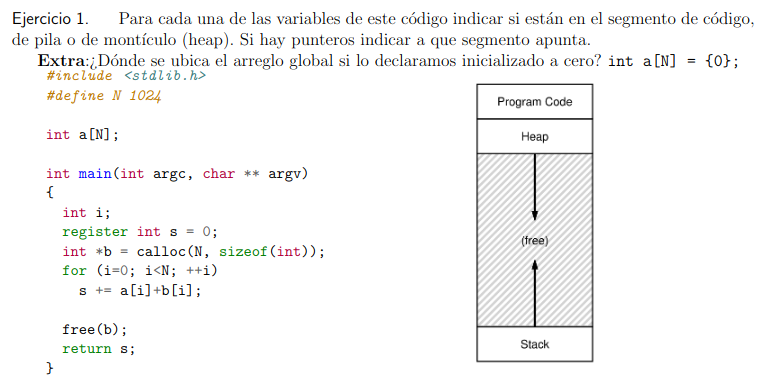

**N** -> Program code.

**a** -> Programa code (es una variable global).

**a[N]** -> Program code (variable global).

**argc** -> Stack.

**argv** -> Stack.

**b** -> Stack.

**i** -> Stack.

**ret s** -> Stack.

**argv*** -> Puntero a Heap.

**argv**** -> Puntero a Heap.

**b*** -> Puntero a Heap.

**s** -> Los registros no se encuentra en la memoria.

---

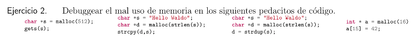

1. En el man page de `gets()` se dice que nunca se debe usar `gets()` ya que es imposible saber sin conocer los datos de antemano cuántos caracteres leerá, y porque `gets()` continuara almacenando caracteres más allá del final del buffer, es extramadamente peligroso usarlo. Se utiliza para romper la segurdad xd. Se debe usar `fgets()` en su lugar.

2. Está mal allocated la memoria de `*d` ya que, como esta pidiendo memoria para un `string`, le falta un byte más para almacenar la terminación del `string` '\0'.

3. `strdup()` reserva memoria, no es necesario ya que ya se reservo antes.

4. `sizeof(a) = 16 bytes`, sabes que un `sizeof(int) = 4 bytes` por lo que al intentar almacenar 42 enteros en el ultimo byte del arreglo, le faltan 3 bytes para poder guardarlo.

---

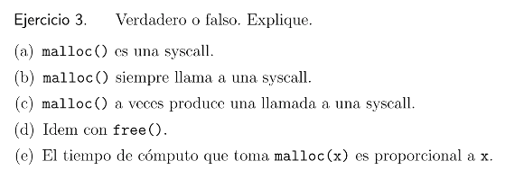

* **(a)** **Falso**. `malloc()` es una función del user space que usa system calls en su implementación.

* **(b)** **Falso**. Contraejemplo: Si realizamos un `malloc(a)`, hacerle free y hacer otro `malloc(a)` pidiendo la misma cantidad de bytes.

* **(c)** **Verdadero**. Al pedir memoria usa la syscall `brk()`/`sbrk()`.

* **(d)** **Verdadero**. `free()` al igual que `malloc()` usa las syscall `brk()`/`sbrk()`.

* **(e)** **Falso**. No siempre lo es, como el mismo contraejemplo que **(b)**.

---

## Traducción de direcciones

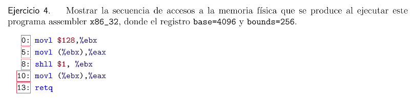

Registros base = 4096 y bounds (limite) = 256 ---> bounds = 4096 + 256 = 4352.

4096,

4096 + 5, 128

1096 + 8,

4096 + 10, 256

4096 + 13

---

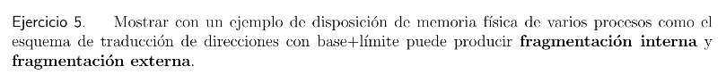

**Fracmentación Externa**: Si tenemmos una free list [P1 | FREE | P2 | FREE] donde el primer bloque de memoria libre es de 5 bytes y el segundo de 10 bytes, sumando un total de 15 bytes disponibles, si un proceso solicita 15 bytes no se le podra asignar ya que hay una fragmentación externa.

**Fracmentación Interna**: Si se le asigna 20 bytes a un proceso que solamente usa 15 bytes, los 5 bytes restantes son fragmentación interna.

---

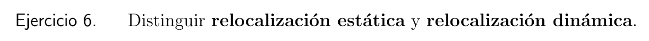

La **relocalización dinámica** usa los registros base/limite, para cada proceso se escribe y compila pensando que esta cargando en la dirección cero. Basicamente usa el hardware (registros) para obtener la dirección física.

La **relocalización estática** se usa el software para obtener la dirección física del proceso, perdiendo protección.

---

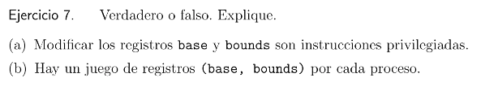

* **(a)** **Verdadero**. Ya que si no es cierto podrían modificar su espacio.

* **(b)** **Falso**. Hay un juego de registro (base/limite) por cada CPU.

---

## Manejo del Espacio Libre

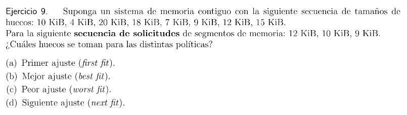

* **(a)**

**First fit** Encuentra el primer bloque de memoria que sea suficientemente grande retorna la cantidad pedida al usuario. Por lo que le daria el bloque de 20 KB -> 13 KB, el de 10 KB -> 10 KB y 18 KB ->9 KB.

* **(b)**

**Best fit** Primero, busca a traves de la free list y encuentra los chunks de memoria libre que sean igual o más grande que el tamaño pedido. Entonces, retorna el más chico de ese grupo de candidatos. Por lo que le daria el bloque de 12 KB -> 12 KB, 10 KB -> 10 KB y el de 9 KB -> 9 KB.

* **(c)**

**Worst fit** Es el opuesto a best fit; encuentra el chunk mas grande y devuelve la cantidad solicitada. Le da el de 20 KB -> 12 KB, 18 KB -> 10 KB y el de 15 KB -> 9 KB.

* **(d)**

**Next fit** Mantiene un puntero adicional a la ubicación dentro del lista donde se miró por última vez. La idea es repartir las búsquedas de espacio libre por toda la lista de forma mas uniforme, evitando así fragmentación. Le da el de 20 KB -> 12 KB, 18 KB -> 10 KB y el de 9 KB -> 9 KB.

---

## Paginación

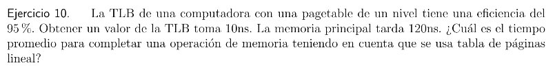

Tenemos 0,95 * (10 ns + 120 ns) = 123,5 ns es el tiempo promedio que le lleva completar una operación cuando hay un YLB Hit.

0,05 * (10 ns + 120 ns) = 12,5 ns es el tiempo promedio que le lleva completar una operación cuando hay un TLB misss.

Por lo tanto el tiempo promedio para completar una operación es de 123,5 ns + 12, 5 ns = 136 ns.

---

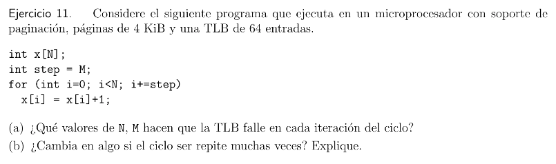

* **(a)**

Sucede un TLB miss cuando $N < M$ ya que solo se ejecuta un ciclo del loop, que es cuando `i = 0`, al ser la primera vez que se accede al arreglo. Como tenemos paginas de 4 KB y los `ìnt` ocupan 4 bytes, se pueden almacenar 1024 `int` por pagina. Por lo que otro caso seria cuando $M <= N$ pero M es multiplo de 1024. Ejemplo, `M = j * 1024` con `j` un natural. Por lo tanto en cada iteración se accederia a otra pagina, generando un TLB miss.

* **(b)**

Si. Al tener 64 entradas, se puede llegar a dar el caso si es que `N < 1024 * 64`, de que esten cargadas en el TLB todos los elementos del arreglo. Por lo tanto todos serian TLB miss.

---

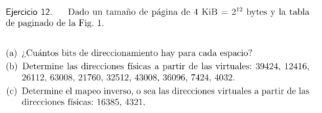

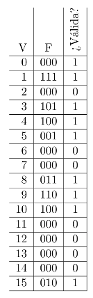

* **(a)**

Tenemos $2^{4}$ = 16 bits de virtual page number (VPN) y de $2^{12}$ (4096) bits del tamaño de pagina, hay $2^{4} * 2^{12} = 2^{16}$ (64 KB) bits de direccionamiento en cada espacio.

* **(b)** De virtual -> Física

    * **39424** = (1001 1010 0000 0000). Entonces VPN = (1001) = 9 que es valida y un offset = (1010 0000 0000) por lo que la PFN = **(0110 1010 0000 0000)**.

    * **12416** = (0011 0000 1000 0000). Entonces VPN = (0011) = 3 que es valida y un offset = (0000 1000 0000) por lo que la PFB = **(0101 0000 1000 0000)**.

    * **26112** = (0110 0110 0000 0000). Entonces VPN = (0110) = 0 que es valida y un offset = (0110 0000 0000) por lo que la PFB = **(0110 0110 0000 0000)**.

    * **63008** = (1111 0110 0010 0000). Entonces VPN = (1111) = 15 que es valida y un offset = (0110 0010 0000) por lo que la PFN = **(0010 0110 0010 0000)**.

    * **21760** = (0101 0101 0000 0000). Entonces VPN = (0101) = 5 que es valida y un offset = (0101 0000 0000) por lo que la PFN = **(0001 0101 0000 0000)**.

    * **32512** = (0111 1111 0000 0000). Entonces VPN = (0111) = 7 No es direccion Valida. Por lo que no tiene direccion fisica xd.

    * **43008** = (1010 1000 0000 0000). Entonces VPN = (1010) = 10 que es valida y un offset = (1000 0000 0000) por lo que la PFN = **(0100 1000 0000 0000)**.

    * **36096** = (1000 1101 0000 0000). Entonces VPN = (1000) = 8 que es valida y un offset = (1101 0000 0000) por lo que la PFN = **(0011 1101 0000 0000)**.

    * **7424** = (0001 1101 0000 0000). Entonces VPN = (0001) = 1 que es valida y un offset = (1101 0000 0000) por lo que la PFN = **(0111 1101 0000 0000)**.

    * **4032** = (0000 1111 1100 0000). Entonces VPN = (0000) = 0 que es valida y un offset = (1111 1100 0000) por lo que la PFN = **(0000 1111 1100 0000)**.

* **(c)** De física -> virtual

    * **16385** = (0100 0000 0000 0001). Entonces PFN = (0100) y offset = (0000 0000 0001) por lo que la VPN = 4 o 10 = (0100) o (1010). Entonces la direccion virtual es **(0100 0000 0000 0001)** o **(1010 0000 0000 0001)**.

    * **4321** = (0001 0000 1110 0001). Entonces PFN = (0001) y offset = (0000 1110 0001) por lo que la VPN = 5 = (0101). Entonces la direccion virtual es **(0101 0000 1110 0001)**

---

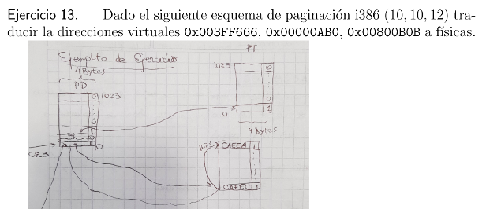

(10, 10 ,12) esto significa que tenemos 10 bits para el Page Directory, 10 bits para la Page talbe y 12 bits para el offset.

* **0x003FF666** = (0000 0000 0011 1111 1111 0110 0110 0110). Entonces PDI = (0000 0000 00) = 0x0, PTE = (11 1111 1111) = 0x3FF = 1023, offset = 0x666. **PhysicalAddress = 0xCAEEA666**.

* **0x00000AB0** = (0000 0000 0000 0000 0000 1010 1011 0000). Entonces PDI = 0x0, PTE = 0x0, offset = 0xAB0. **PhysicalAddress = 0xCAFECAB0**.

* **0x00800B0B** = (0000 0000 1000 0000 0000 1011 0000 1011). Entonces PDI = 0x2, PTE = 0x0, offset = 0xBOB. PhysicalAddress = 0x{No tiene nada definido xd}B0B **(0x00000B0B)**.

---

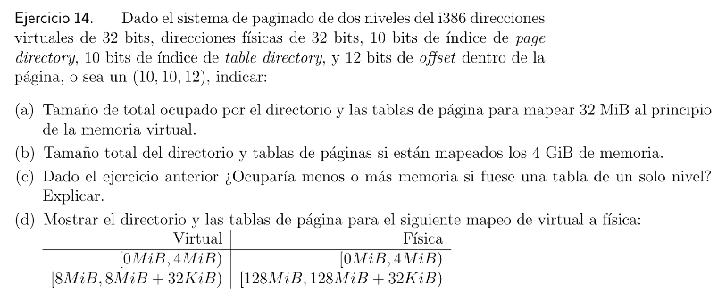

* **(a)** Tenemos un offset de $2^{12}$ = **4 KB**, que es el **tamaño de cada página**. Queremos mapear 32 MB = $2^{20} * 2^{5} = 2^{25}$. **Necesitamos** $\frac{2^{25}}{2^{12}} = 2^{13}$ = **8192 paginas**. **Por cada tabla** tenemos $2^{10}$ = **1024 paginas**. Entonces necesitamos $\frac{2^{13}}{2^{10}} = 2^{3} = 8$ **tablas**. Finalmente la PageDirectoryIndex + CantidadDeTablas * PageDirecoryEntry --> 4 KB + 8 * 4 KB = 36 KB es el tamaño total necesario para mapear 32 MB. Notar:
    - Las direcciones virtuales tienen 32 bits (10 bits para el page directory, 10 bits para la page table y 12 bits del offset [10, 10, 12]), los 12 bits del offset indican las posiciones dentro de la página, los 12 bits pueden representar números desde el 0 hasta 4095, cubriendo 4096 posiciones en total, por lo que para sacar el **tamaño de las paginas** hay que elevar a 2 el offset ($2^{12} = 4$ KB). 
    - Para sacar la **cantidad de paginas** requeridas hay que dividir la cantidad que queremos mapear ($2^{25} = 32$ MB) por el tamaño de cada pagina ($2^{12} = 4$ KB) ($\frac{2^{25}}{2^{12}} = 2^{13} = 8192$).
    - Para sacar la **cantidad de page table** requeridas hay que dividir la cantidad total de paginas ($2^{13}$) por la capacidad de cada page table (como nos dice el enunciado cada page table puede contener 10 bits, $2^{10}$ = 1024 entradas) ($\frac{2^{13}}{2^{10}} = 2^{3}$ = 8 page table).
    - Par sacar el tamaño total = Tamaño del directorio (10 bits, por lo que $1024 * 4 = 4$ KB) + Cantidad de page table (8) * tamaño de cada page table (4 KB) = 4 KB + 8 * 4 KB = 32 KB.
    - Por lo tanto 32 KB es el tamaño necesario para mapear 32 MB.

* **(b)** Queremos mapear 4 GB = $2^{30} * 2^{2} = 2^{32}$. Necesitamos $\frac{2^{32}}{2^{12}} = 2^{20}$ = 1048576 páginas. Entonces necesitamos $\frac{2^{20}{2^{10}}} = 2^{10}$ = 1024 tablas. Finalmente 4 KB + 1024 * 4 KB = 4100 KB es el tamaño necesario para mapear 4 GB.

* **(c)** De ser una tabla de un solo nivel, ocuparia 1024 * 4 KB = 4096 KB, por lo que ocuparia menos espacio je.

* **(d)** IDK

---

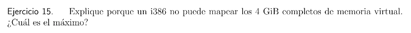

En i386 tenemos $2^{32}$ = 4 GB de direccionamiento virtual de max. Y como parte de esos 4 GB esta reservado para el SO, no se puede mapear exactamente todos los 4 GB completos de memoria virtual. El máximo espacio de direcciones accesible para un proceso es de 2 GB en una configuración estándar. El espacio del kernel ocupa la mitad superior del rango.

---

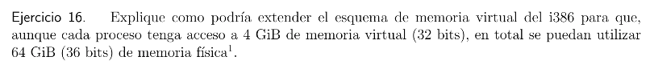

$2^{36}$ = 64 GB, usando un esquema (4, 10, 10, 12) que serian 4 bits que apuntan a 16 page directory, este tendria 1024 tablas, y que cada tabla tendria 1024 paginas de $2^{12}$ = 4 KB por el offset de 12 bits.

---

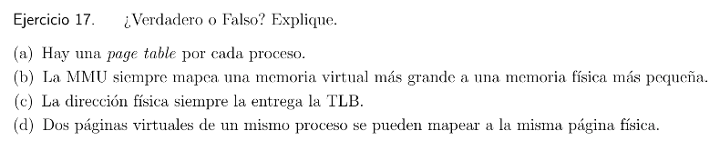
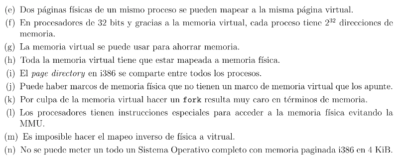

* **(a)** **Verdadero**. Cada proceso tiene su page table para su virtual address.

* **(b)** **Falso**. Se puede dar el caso donde la memoria virtual = memoria física, ya que VM >= PF.

* **(c)** **Falso**. De haber un TLB miss se busca en la page table, la entrega la MMU.

* **(d)** **Verdadero**. Se pueden mapear dos o mas direcciones físicas a una misma dirección virtual

* **(e)** **Faslo**. Se puede mapear pero generaria problemas al intentar obtener la dirección.

* **(f)** **Verdadero**. Por la memoria virtual se tiene $2^{32}$ que en realidad no son reales.

* **(g)** **Verdadero**. Esto gracias a mecanismos como la paginación.

* **(h)** **Falso**. La idea de usar memoria virtual es en parte evitar que este toda mapeada a la memoria física.

* **(i)** **Falso**. Cada proceso tiene su propio PD, PTE, etc. Cada proceso tiene su propia memoria virtual.

* **(j)** **Verdadero**. Puede no estar mapeada.

* **(k)** **Falso**. Por tecnicas como copy-on-wfrite no se copia toda la memoria.

* **(l)** **Verdadero**. Existen formas de acceder sin pasar por la MMU.

* **(m)** **Falso?Verdadero?**

* **(n)** **Verdadero**. De ser un SO extremadamente pequeño casi que se considere una libreria.

---

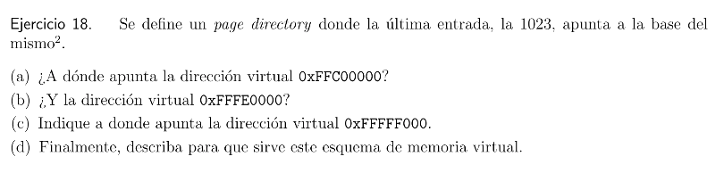

* **(a)** 0xFFC00000 = (1111 1111 1100 0000 0000 0000 0000 0000), por lo que PDI = 0x3FF = 1023, PTF = 0x0 y offset = 0x0. Entonces la dirección física es la base de la page table, la dirección 0x00000000.

* **(b)** 0xFFFE0000 = (1111 1111 1111 1110 0000 0000 0000 0000), Por lo que PDI = 0x3FF = 1023, PTE = 0x3E0 y el offset 0x0. Entonces la dirección física es la que apunta la dirección virtual 0x3E0 concatenada con 0x0 del offset.

* **(c)** 0xFFFFF000 = (1111 1111 1111 1111 1111 0000 0000 0000), por lo que PDI = 0x3FF, PTE = 0x3FF y offset = 0x0. Entonces la dirección física es  la ultima entrada del page directory.

* **(d)** Este esquema de memoria virtual donde la ultima entrada apunta a la base del page directory, sirve para tener una tabla recursiva.

---

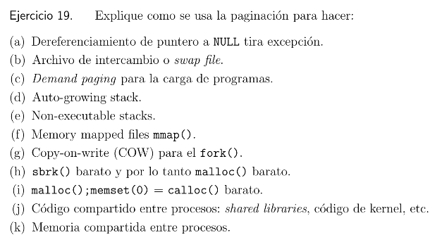

* **(a)** El puntero a NULL apunta a la dirección virtual 0 que no esta mapeada a memoria física, por lo que al intentar acceder se genera una excepción.

* **(b)** El SO mapea paginas no usadas en memoria física a un archivo de swap, esto libera memoria física.

* **(c)** Esto es cuando las paginas de un programa no se cargan en memoria física hasta que el programa intenet acceder a ellas.

* **(d)** El SO puede mapear paginas adicionales para el stack si una operación desborda el tamaño actual, lo que hace crecer el segmento.

* **(e)** Se prohibe la ejecucion de codigo desde el stack para evitar desbordamiento de buffer.

* **(f)** Permite mapear archivos directeamente al espacio de direcciones virtuales.

* **(g)** Los procesos padre e hijo comparten paginas, si uno intenta modificar una pagina se crea una copia privada de esa pagina especifica.

* **(h)** El SO reserva grandes bloques de memoria fisica solo cuando es necesario.

* **(i)** El SO optimiza calloc mapeando paginas inicializadas con ceros.

* **(j)** Librerias compartidas entre procesos pueden ser mapeadas en memoria fisica y accedidas desde multiples memorias virtuales de diferentes procesos.

* **(k)** Se pueden mapear paginas fisicas a diferentes direcciones virtuales de diferentes procesos para permitir comunicación.