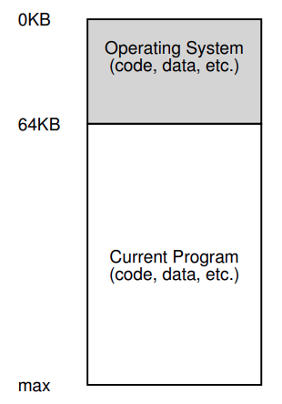
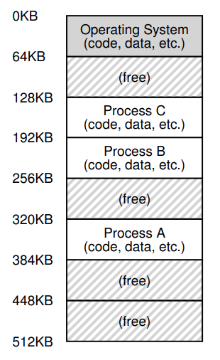
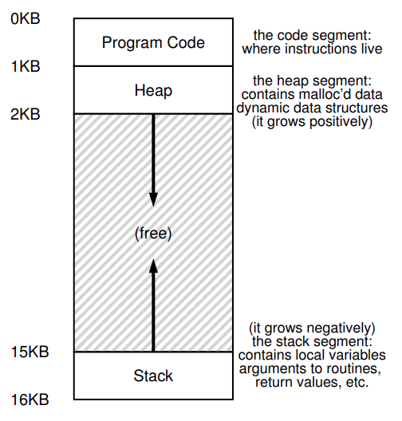

# La Abstracción: Espacios de Memoria

---

## Primeros sistemas

Desde la perspeciva de la memoria, las primeras máquinas no proporsionaban mucha abstracción a los usuarios. La memoria física de la máquina lucia asi:

Figure 13.1: **Sistema operativo: los primeros días**

Los SO eran un conjunto de rutinas (una libreria) que se ubicaba en la memoria (empezando en la dirección física 0 en este ejemplo), y podia haber programas (un proceso) en la memoria física (empezando por la dirección física 64k en este ejemplo) y usaba el resto de la memoria. Habia un par de ilusiones, y los usuarios no esperaban mucho del SO. Life was sure easy for OS developers in those days.

---

## Tiempo compartido y multiprogramación

Después de un tiempo, dado que las máquinas eran caras, la gente empezo a compartir máquinas de forma más eficaz. La era de la **Multiprogramación** nacio, en la cual muchos procesos estaban listos para ejecutarse en un momento dado, y el SO debia cambiar entre ellos, por ejemplo: cuando uno queria hacer una I/O. Hacer eso aumentaba la efectividad de la **utilización** de la CPU. Incrementar la **efectividad** era particularmente importante en esos dias donde cada máquina costaba miles de cientos o incluso millones de dolares.

Sin embargo, la gente comenzo a demandar más máquinas, y la era del **tiempo compartido** nacio. Mucha gente se dio cuenta de las limitación de la computación por lotes, los mismos programadores, quienes se cansaron de los largos e ineficientes ciclos para debuguear programas. La noción de **interactividad** fue importante, como muchos usuarios usarian la máquina al mismo tiempo, cada uno esperaba una respuesta oportuna de sus tareas.

Una forma de implementar el tiempo compartido seria ejecutar un proceso por un corto periodo de tiempo, dándole acceso a toda la memoria, luego detenerlo, guardar todo su estado en alguna especie de disco (incluido toda su memoria física), cargar el estado de algún que otro proceso, ejecutarlo por un tiempo y así implementar algún tipo de intercambio de la máquina.

Desafortunadamente este enfoque tiene un problema: es muy lento; a medida que crece la memoria. Mientras que guardar y recuperar estados de registros de nivel (PC, registros de proposito general, etc) es relativamente rápido, guardar el contenido completo de la memroia al disco es muy lento. Lo que hicieron fue dejar el proceso en la memoria mientras cambia entre ellos, permitiendole al SO implementar el tiempo compartido mas eficientemente.

Figure 13.2: **Tres procesos: Compartiendo la memoria**

En la figure hay 3 procesos (A, B y C) el cual cada uno de llos tiene una parte chica de 512KB de la memoria física reservada para ellos. Suponiendo que tenemos una sola CPU, el SO elige ejecutar uno de esos procesos (Supongamos que es el A), mientras que los otros (B y C) estan en la cola de procesos listos, esperando a que los ejecuten.

Como el tiempo compartido paso a ser mas popular, se pusieron nuevas exigencias al SO. En particular, permitir que varios programas residan simultáneamente en la memoria hace que la protección sea una cuestión importante; no desea que un proceso pueda leer, o peor aún, escribir la memoria de algún otro proceso.

---

## El espacio de direcciones

Sin embargo, debemos tener en cuenta a esos malditos usuarios y, hacerlo, requiere que el SO cree una abstracción de memoria física fácil de usar. A esta abstracción la llamamos **Espacio de Direcciones** y es el espacio del programa en ejecución. Vista de la memoria en el sistema. Comprender esta abstracción fundamental de la memoria del SO es clave para comprender como se virtualiza la memoria.

El espacio de direcciones de un proceso contiene todo el estado de memoria del programa en ejecución. Por ejemplo, el código de un programa (las instrucciones) tienen que vivir en algun lugar de la memoria, y por lo tanto ellos estan en el espacio de direcciones. El programa, mientras se esta ejecutando, es el **Stack** para mantener un seguimiento de donde se encuentra en la cadena de llamada de funciones, asi como también para asignar variables locales, pasar parametros y devolver valores hacia desde rutinas. Finalmente, el **Heap** es usado para asignaciones dinámicas, manejo de memoria del usuario, como las que deberia recibir de una llamada `malloc()` en C o `new` en un lenguaje orientado a objetos como C++ o Java. Hay mas cosas, como variables iniciadas estaticamente, pero por ahora asumamos solo estas tres componentes: Code, Stack y Heap.

En el Ejemplo, tenemos un espacio de direcciones chico (solo 16KB). El código del programa vive en la parte superior del espacio de direcciones (comenzando desde 0 y es empaquetado en el 1K del espacio de direcciones). El código es estatico (facil de ubicar en la memoria), entonces podemos ubicarlo en la parte superior del espacio de dirreciones y saber que no necesitaremos mas memoria mientras se ejecuta el programa.

Después, tenemos dos regiones de espacio de direcciones que podrian crecer (y encogerse) mientras el programa se ejecuta. Estas estan en el heap (arriba) y en el stack (abajo). Se ubican de esta forma porque cada cual debe ser capaz de agrandarse, y poniendolas en los extremos opuestos del espacio de memoria, podemos permitir el crecimiento: solo tiene que expandirse en direcciones opuestas. El heap empieza justo después del código (en el 1KB) y crece hacia abajo (digamos cuando un usuario hace una llamada a un procedimiento). Pero, esta forma de ubicar el heap y el stack es solo una convención.

