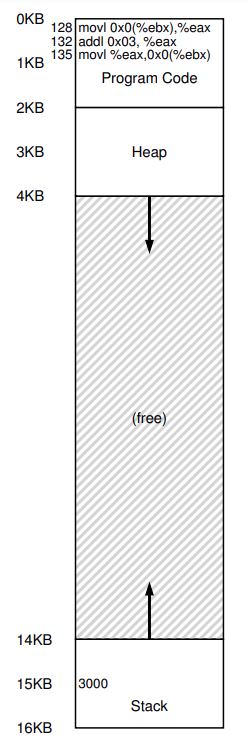

# Mecanismo: Traducción de direcciones

En el desarrollo de la **Virtualización de la CPU**, nos centramos en un mecanismo general conocido como **Ejecución Directa Limitada** (**LDE**). La idea es simple: para la mayor parte, dejar que el programa se ejecute directamente en el hardware; sin embargo, en ciertos puntos claves de tiempo (como cuando un proceso hace una system call, o cuando ocurre una interrupción), organizar que el SO se involucre y se asegure de que pasen cosas "correctas". El SO con un poco de ayuda del hardware, hace todo lo posible para salir del camino del programa en ejecución, para entregar una virtualización eficiente; son embargo, interponiendose en puntos criticos, el SO se asegura de mantener el **control sobre el hardware**. Eficiencia y control son de los objetivos principales de cualquier SO moderno.

En la **Virtualización de la memoria**, propusimos una estrategia similar, logrando eficiencia y control mientras proveiamos la virtualización deseada. La eficiencia dicta que hagamos uso del soporte del hardware, el cual al principio sera un poco rudimentario (solo un par de registros) pero que crecera hasta ser bastante complejo (TBLs, soporte de tablas de paginas, etc.). El control implica que el SO se asegure que ninguna aplicación puede entrar a cualquier parte de la memoria que no sea la de la misma aplicación; para proteger aplicaciones una de la otra, y al SO de las aplicaciones, necesitaremos ayuda del hardware. Necesitaremos un poco mas que solo VM, en terminos de *flexibilidad*; especificamente, nos gustaria que los programas sean capaces de usar su espacio de direcciones en la forma que ellos quieran, haciendo al sistema mas facil de programar. ¿Cómo virtualizar memoria de forma eficiente y flexible? ¿Cómo podemos mantener control sobre a que direcciones de memoria puede acceder una palicación, y asegurar que el acceso a memoria de la aplicación esta restringido apropiadamente? ¿Cómo hacemos todo esto eficientemente?.

La tecnica que vamos a usar, la cual puede considerar una adición a la LDE, es algo a lo cual nos referimos como **Traducción de Dirección Basada en el Hardware**, o simplemente **Traducción de Dirección**. El hardware transforma cada acceso a la memoria (fetch, load, store), cambiando la dirección **Virtual** provista por la instrucción a una dirección **Física** donde esta guardada la información deseada. En cada referencia a la memoria, un traductor de direcciones es ejecutado por el hardware para redirigir referencia de memoria de la aplicación a la ubicación reañ en memoria.

El hardware solo no puede virtualizar memoria, solo provee los mecanismos de bajo nivel para hacerlo de forma eficiente. El SO debe involucrarse en puntos clave para configurar el hardware para que solo realicen las tracucciones adecuadas; y debe administrar la memoria, haciendoles seguimientos de cuales estan usadas y cuales libres, y juiciosamente intervenir para mantener el control de como esta siendo usada la memoria.

El objetivo de este trabajo es, otra vez, crear una **ilusión**: que el programa tiene su propia memoria privada, donde su código y datos estan. Detras de esta realidad virtual yace la horrible verdad física: que realmente muchos programas estan compartiendo memoria al mismo tiempo, mientras que el/las CPU/s intercambian entre un programa en ejecución y otro. A traves de la virtualización, el SO (con ayuda del hardware) transforma la fea realidad de la máquina es una util, poderosa y facil de usar abstracción.

---

## Suposiciones

Primer ejemplo de virtualización de memoria sera muy simple, caso para reirse. Dale reite todo lo que quieras; muy pronto el SO el que se reira de ti (confirmo, estoy estudiando esto en enero con 40 grados y me quiero morir xd), cuando intentes entender las entradas y salidas de TLBs (Tablas de Paginas Multinivel), y otras maravillas tecnicas.

Por ahora asumamos que el espacio de direcciones del usuario debe ser ubicada *contigua* en la memoria física. También asumimos, por simplicidad, que el tamaño del espacio de direcciones no es muy grande; especificamente, que es mas chico que el tamaño de la memoria física. También asumimos que cada espacio de dirección tiene el mismo tamaño.

---

## Un ejemplo

Para entender mejor necesitamos implementar la traducción de direcciones, y porque necesitamos tal mecanismo, vemos un ejemplo. Imagina un proceso cuyo espacio de direcciones es el siguiente:



Figure 15.1: **Un proceso y su espacio de direcciones**

Lo que vemos es una secuencia de código que carga un valor desde la memoria, lo incrementa en 3, y lo guarda de nuevo en la memoria. Puedes imaginar que la representación de este código en C es algo como:

```c
void func(){
  int x = 3000;
  x = x + 3; //lide of code we are interesed in
}
```

El compilador traduce esta linea de código a assembly, lo cual se ve algo asi (en assembly x86). Usa `objdump` en linux o `otool` en Mac para desensamblarla:

```assembly
  movl 0x0 (%ebx), %eax  ;load 0+ebx into eax
  addl $0x03, %eax       ;add 3 to eax register
  movl %eax, 0x0 (%ebx)  ;store eax back to mem
```

Este fragmento de código es bastante directo: asume que la dirección de `x` ha sido puesta en el registro `ebx`, entonces carga el valor de esa dirección en el registro de proposito general `eax` usando la instrucción `movl`. La siguiente instrucción `add` 3 a `eax`, y la instrucción final guarda el valor de `eax` de nuevo en la memoria en la misma ubicación.

En la figure vemos cómo se colocan tanto el código como los datos en el espacio de direcciones del proceso; la secuencia de código de tres instrucciones esta ubicada en la dirección 128, y el valor de la variable `x` en la dirección 15KB. El valor inicial de `x` es 3000.

Cuando se ejecuta las instrucciones, desde la perspectiva del proceso, se ejecuta los siguientes accesos a memoria:

- **Fetch**: Se busca la instrucción en la dirección 128.
- **Execute**: Se ejecuta la instrucción (cargar de la dirección 15KB).
- **Fetch**: Se busca la instrucción en la dirección 132.
- **Execute**: Se ejecuta la instrucción (sin referencia a memoria).
- **Fetch**: Se busca la instrucción en la dirección 135.
- **Execute**: Se ejecuta la instrucción (guardar en la dirección 15KB).

Desde la perspectiva del programa, su **Espacio de direcciones** comienza en la dirección 0 y crece hasta un maximo de 16KB; todas las referencias de memoria que genera deben estar en ese rango. Pero, al virtualizar la memoria, el SO quiere ubicar el proceso en cualquier parte de la memoria física, no necesariamente en la dirección 0. Tenemos un problema: ¿Cómo podemos **reubicar** ese proceso en la memoria de forma que sea **transparente** para el proceso? ¿Cómo podemos proporsionar la ilusión de un espacio de direcciones virtual que empiece en 0, cuando en realidad el espacio de direcciones esta ubicado en algun otro lugar de la memoria física?.

Ejemplo de como se deberia ver la memoria física una vez que el espacio de direcciones de este proceso ha sido ubicado en la memoria:


Figure 15.2: **Memoria física con un solo proceso reubicado**

Podemos ver al SO usando el primer slot de la memoria física para el mismo, y que ha reubicado el proceso en el slot que empieza en la dirección 32KB de la memoria física. Los otros dos slots estan libres.

---

## Reubicación Dinámica (Hardware-based)

Para entender un poco mas sobre la traducción de direcciones basada en el hardware, primero discutimos su primera encarnación. Es una idea simple a la cual nos referimos como **base y limites**; aunque también se la conoce como **reubicación dinámica**; vamos a usar ambos terminos de forma indiscriminada.

Necesitaremos dos registros de hardware en cada CPU: uno es llamado registro **base**, y el tro **limite**. Este par base-limite nos permite ubicar en el espacio de direcciones en cualquier lugar que querramos de la memoria física, y asi asegurarnos que el proceso solo puede acceder a su espacio de direcciones.

En esta configuración, cada proceso es escrito y compilado como su hubiera sido cargado en la dirección cero. Pero, cuando un programa comienza a ejecutarse, el SO decide donde ubicarlo en la memoria física y configura el registro base con ese valor. En el ejemplo anterior, el SO decidio cargar el proceso en la dirección física 32KB y por lo tanto configura el registro base con ese valor.

Cosas interesantes comienzan a suceder cuando el proceso se ejecuta. Cuando cualquier referencia a memoria es generada por el proceso, es **traducida** por el procesador de la siguiente manera:

**Physical addres = virtual address + base** (Dirección física = dirección virtual + base)

Cada referencia de memoria generada por el proceso es una **Dirección Virtual**; el hardware de turno agrega el contenido del registro base a esa dirección y el resultado es una **Dirección Física** que puede ser emitida a la memoria del sistema.

Para entender más, analicemos que sucede cuando se ejecuta una sola instrucción. Veamos una instrucción de la secuencia anterior:

```assembly
movl 0x0 (%ebx), %eax
```

El Program Counter es seteado en 128; cuando el hardware necesita buscar una instrucción, primero agrega el valor al valor del registro base de 32KB (32768) para obtener la dirección física 32896; entonces el hardware busca la instrucción desde la memoria física. Depués, el procesador comienza a ejecutar la instrucción. En algun punto, emite una carga desde la VM 15KB, la cual el procesador la toma y de nuevo agrega al registro base (32KB), obteniendo la dirección física final de 47KB y por lo tanto el contenido deasea.

Transformar una dirección virtual en una dirección física es la tecnica a la que nos referimos con **traducción de direcciones**; el hardware toma una dirección virtual que el proceso cree que esta referenciado y la transforma en una dirección física la cual es donde realmente estan los datos. Dado que la reubicación de la dirección sucede en tiempo de ejecución, y dado que podemos mover el espacio de direcciones incluso después de que el proceso comienza a ejecutarse, esta tecnica a veces es conocida como **reubicación dinámica**

¿Qué le sucede a ese registro limite? ¿Este no es un enfoque de base y limite? El registro limite esta para ayudar con la protección. El proceso primero verificara que la memoria referenciada este dentro de los *limites* para asegurarse que es legal; en el ejemplo anterior, el registro limite siempre estara seteado en 16KB. Si un proceso genera una dirección virtual que es mas grande que el limite, o es negativo, la CPU lanzara una excepción, y el proceso sera detenido. El punto del limite es asegurarse que todas las direcciones generadas por el proceso sean legales y esten dentro de los limites de ese proceso.

Notar que los registros base y limite son estructuras del hardware que estan ubicadas en el chip (un par por cada CPU). A veces la gente llama a esta parte del procesador que ayuda con la traducciones de direcciones **Memory management ubit** (**MMU**) (**Unidad de administracción de memoria**); a medida que desarrollemos tecnicas de administración de memoria mas avanzadas, agregamos mas circuitos a las MMU.

Una pequeña cosa sobre los registros limites. Los cuales pueden ser definidos de una de dos formas.

- Una forma (como la de arriba), mantiene el *tamaño* del espacio de direcciones, el hardware verifica la VM primero, antes de agregarle la base.

- La segunda forma, mantiene la *dirección física* del final del espacio de direcciones, el hardware primero agrega la base y entonces se asegura que este dentro de los limites; por simplicidad, asumimos el primer metodo xd.

### Ejemplo de traducción

Para entender la traducción de direcciones via base-limite con mas detalle vemos un ejemplo. Imaginemos un proceso con un espacio de direcciones de tamaño de 4KB (re chico) ha sido cargado en la dirección física 16KB (base). Aca estan los resultados de algunas traducciones de direcciones:

| Virtual Address | Physical Address       |
|-----------------|------------------------|
| 0               | 16KB                  |
| 1KB             | 17KB                  |
| 3000            | 19384                 |
| 4400            | Fault (out of bounds) |

Es facil simplemente agregar la dirección base a la dirección virtual (la cual puede ser vista correctamente como un **offset** dentro del espacio de direcciones) para obtener la dirección física resultante. Solo si la dirección virtual es demasiado grande o negativa resultara en una falla de resultado, causando que se lance una excepción.

---

## Soporte del hardware: un Resumen

| Requisitos de Hardware                  | Notas                                                                 |
|-----------------------------------------|----------------------------------------------------------------------|
| Modo privilegiado                       | Necesario para evitar que los procesos en modo usuario ejecuten operaciones privilegiadas. |
| Registros base/límite                   | Necesita un par de registros por CPU para admitir la traducción de direcciones y la verificación de límites. |
| Capacidad para traducir direcciones virtuales y verificar si están dentro de los límites | Circuitería para realizar traducciones y verificaciones; en este caso, es bastante simple. |
| Instrucción(es) privilegiada(s) para actualizar base/límite | El SO debe poder establecer estos valores antes de permitir la ejecución de un programa de usuario. |
| Instrucción(es) privilegiada(s) para registrar manejadores de excepciones | El SO debe poder informar al hardware qué código ejecutar si ocurre una excepción. |
| Capacidad para generar excepciones      | Cuando los procesos intentan acceder a instrucciones privilegiadas o a memoria fuera de los límites. |

Figure 15.3: **Reubicación dinámica: Requisitos del hardware**

Primero necesitamos dos modos diferentes de CPU. El SO corre en **Modo privilegiado** o **modo kernel**, donde tiene acceso a la máquina entera; las aplicaciones corren en **modo usuario**, donde estan limitados en que pueden hacer. Un solo bit, obviamente guardado en algun tipo de **Palabra del estado del procesador**, indica en que modo esta actualmente la CPU, en ciertas ocaciones especiales la CPU cambia de modo.

El hardware también debe proporcionar los registros bases y limite, cada CPU tiene un par adicional de registros, parte de la unidad de administración de memoria **MMU** de la CPU. Cuando un programa de usuario se esta ejecutando, el hardware traducira cada dirección, agregando el valor base a la dirección virtual generada por el programa. El hardware también debe ser capaz cuando la dirección es valida, lo cual se logra usando el registro limite y algun circuito en la CPU.

El hardware debe proporcionar intrucciones especiales para modificar los registros base y limite, permitiendole al SO modificarlo cuando se ejecutan diferente procesos. Esas instrucciones son **Privilegiadas**: solo en modo kernel pueden modificarse los registros.

La CPU debe ser capaz de generar **execpciones** en situaciones donde un programa de usuario intente acceder a memeria ilegalmente; la CPU deberia detener la ejecución del programa de usuario y hacer arreglos para que se ejecute el manejador de excepciones "fuera-de-limites" del SO. El manejador del SO puede averiguar como reaccionar, en este caso terminando el proceso. Si un programa de usuario intenta cambiar los valores de los registros base y limite, la CPU deberia lanzar una excepción y ejecutar el manejador "intentó ejecutar una operación privilegiada mientras esta en modo usuario". La CPU también debe proporcionar un metodo para informar la ubicación de estos controladores, y por lo tanto son necesarias mas intrucciones privilegiada.

---

## Problemas del SO

Solo porque el hardware proporsiona nuevas caracteristicas para soportar reubicaciones dinamicas, el SO ahora tiene nuevos problemas que debe manejar; la combinación de soporte de hardware y administración del SO guia a la implementación de una simple VM. Hay varias coyunturas criticas donde el SO debe intervenir para implementar nuestra versión base-y-limite de VM.

1. El SO debe entrar en acción cuando un proceso es creado, encontrar espacio en la memoria para su espacio de direcciones. Dadas nuestras suposiciones

- **a)** Cada espacio de direcciones es mas chica que el tamaño de la memoria física

- **b)** Todos los espacios de direcciones son del mismo tamaño, es un poco facil para el SO; simplemente ve la memoria física como como una cadena de slots, y rastrea si alguno esta libre o en uso.

Cuando un proceso nuevo es creado, el SO tiene que buscar una estructura de datos (a menudo llamada **Free list**) para encontrar espacio para el nuevo espacio de direcciones y entonces marcarlo como usado. Como el espacio de direcciones es variable, la vida es mas complicada (la vida es una mierda).

Ejemplo:


El SO esta usando el primer slot de la memoria física para el mismo, y que tiene al proceso de ese ejemplo reubicado en el slot que empieza en la dirección de la memoria física 32KB. los otros dos slots estan libres; la free list deberia consistir de esas dos entradas.

2. El SO deberia hacer algun trabajo cuando un proceso termina, reclamando toda su memoria para usar en otro proceso o en el SO. En la terminación de un proceso el SO pone de vuelta esa memoria en la free list, y limpia cualquier estructura de dato asociada.

3. El SO debe hacer algunos pasos adicionales cuando ocurre un cambio de contexto. Hay solo un par de registros base y limite en cada procesador, después de todo, y sus valores difieren por cada programa en ejecución, ya que cada programa es cargado en una dirección de memoria física diferente. EL SO debe **guardar y retornar** el par base-y-limite cuando cambia entre procesos. Cuando el SO decide parar de ejecutar un proceso, debe guardar esos valores en memoria, en alguna estructura por proceso como la **Process structure** o el **Process control block** (**PCB**). Cuando el SO remota un proceso, o lo ejecuta por primera vez, debe establecer los valores de base y limite en la CPU a los valores correctos de ese proceso.

Notar que cuando un proceso esta parado, es posible para el SO mover un espacio de direcciones de una ubición a otro mas facilmente. Para mover el espacio de direcciones de un proceso, el SO primero desplanifica el proceso; el SO copia el espacio de direcciones de la ubicación actual a una nueva ubicación; el SO actualiza el registro base guardado al punto de la nueva ubicación. Cuando un proceso es retomado, su nuevo registro base es recuperado, y comienza a ejecutarse de nuevo, sin saber que sus instrucciones y datos estan en un lugar completamente diferente de la memoria.

4. El SO debe proporsionar un **manejador de excepciones**, o funciones para ser llamadas; el SO instala esos manejadores en tiempo de booteo. Por ejemplo, si un proceso intenta acceder a memoria fuera de sus limites, el SO lanzara una excepción; el SO debe estar preparado para entrar en acción cuando surga una excepción como esa. La reacción comun del SO sera hostil: Terminara con el proceso. El SO debe ser tremendamente de la máquina en la se esta ejecutando, no tomara amablemente a un proceso que intenta acceder a memoria o ejecutar una instrucción que no deberia.

| Sistema Operativo al Inicio (modo kernel) | Hardware                                     | (Sin Programa Aún)                     |
|-------------------------------------------|---------------------------------------------|-----------------------------------------|
| Inicializar tabla de interrupciones       | Recordar las direcciones de...              |                                         |
|                                           | - Manejador de llamadas al sistema          |                                         |
|                                           | - Manejador de temporizador                 |                                         |
|                                           | - Manejador de acceso ilegal a memoria      |                                         |
|                                           | - Manejador de instrucciones ilegales       |                                         |
| Iniciar temporizador de interrupciones    | Iniciar temporizador; interrumpir después de X ms |                                         |
| Inicializar tabla de procesos             |                                             |                                         |
| Inicializar lista libre                   |                                             |                                         |

Figure 15.5: **Ejecución Directa limitada (reubicación dinámica)  Tiempo de inicio**

| Sistema Operativo en Ejecución (modo kernel) | Hardware                                       | Programa (modo usuario)                   |
|----------------------------------------------|-----------------------------------------------|-------------------------------------------|
| Para iniciar el proceso A:                   |                                               |                                           |
| - Asignar entrada en la tabla de procesos    |                                               |                                           |
| - Asignar memoria para el proceso            |                                               |                                           |
| - Establecer registros base/límite           |                                               |                                           |
| - `return-from-trap` (a A)                   | Restaurar registros de A                     |                                           |
|                                              | Mover a modo usuario                         |                                           |
|                                              | Saltar al PC inicial de A                    |                                           |
|                                              |                                               | **El Proceso A se ejecuta**               |
|                                              |                                               | Obtener instrucción                       |
|                                              | Traducir dirección virtual                   | Ejecutar instrucción                      |
|                                              | Realizar lectura                              |                                           |
|                                              | Si es una operación explícita de carga/almacenamiento: |                                           |
|                                              | - Asegurar que la dirección es legal         |                                           |
|                                              | - Traducir dirección virtual                 |                                           |
|                                              | - Realizar carga/almacenamiento             |                                           |
|                                              |                                               | (A se ejecuta...)                         |
| **Interrupción del temporizador**            | Mover a modo kernel                          | Saltar al manejador                       |
| Manejar el temporizador:                     |                                               |                                           |
| - Decidir: detener A, ejecutar B             |                                               |                                           |
| - Llamar a la rutina `switch()`              |                                               |                                           |
| - Guardar registros (A)                      |                                               |                                           |
|   (incluyendo base/límite)                   |                                               |                                           |
| - Restaurar registros (B)                    |                                               |                                           |
|   (incluyendo base/límite)                   |                                               |                                           |
| - `return-from-trap` (a B)                   | Restaurar registros de B                     |                                           |
|                                              | Mover a modo usuario                         |                                           |
|                                              | Saltar al PC de B                            | **El Proceso B se ejecuta**               |
|                                              |                                               | Ejecutar instrucción incorrecta           |
| Manejar la trampa:                           |                                               |                                           |
| - Decidir terminar el proceso B              |                                               |                                           |
| - Liberar la memoria de B                    |                                               |                                           |
| - Eliminar la entrada de B en la tabla de procesos |                                               |                                           |

Figure 15.6: **Ejecución Directa limitada (reubicación dinámica)  Tiempo de ejecución**

La primera tabla muestra que hace el SO al iniciarse para preparar la máquina para su uso, y la segunda muestra que sucede cuando un proceso (A) empieza a ejecutarse; notar como su traducción de memoria es manejada por el hardware sin intervención del SO. En algun punto, una interrupción ocurre, y el SO cambia al proceso B, el cual ejecuta una mala carga; en este punto, el SO debe intervenir, terminando el proceso y limpiandolo liberando la memoria de B y removiendo su entrada de la tabla de procesos. Como podemos ver en los cuadros, todavia estamos siguiendo el enfoque de ejecución directa limitada. El SO solo configura el hardware apropiadamente y deja a los procesos ejecutarse directamente en la CPU; solo cuando el proceso se porta mal hace que el SO intervenga.