# Administración del espacio libre

Administrar espacio libre puede ser ciertamente facil. Es facil cuando el espacio que administras se divide en unidades de tamaño fijo y cuando un cliente pida por una de ella solo devuelve la primera entrada.

Cuando la administración del espacio libre se vuelve mas dificil es cuando el espacio libre que estas administrando consiste de unidades de dimensiones variables; esto surge con una libreria de asignación de memoria a nivel de usuario (como con `malloc()` y `free()`) y con un SO administrando memoria física cuando usan **Segmentación** para implementar VM. En cualquier caso, el problema que existe es conocido como **fragmentación externa**: el espacio libre es cortado en pequeñas piezas de diferentes tamaños y por lo tanto fragmentada xd; peticiones subsecuentes pueden fallar a causa de no tener espacio libre contiguo que pueda satisfacer la petición, incluso aunque la cantidad total de espacio linre exceda el tamaño de la petición.


Vemos en la figura un ejemplo del problema, el espacio total disponible es de 20 bytes; desafortunadamente, esta fragmentado en dos chunks de 10 bytes cada uno. Como resultado, una petición por 15 bytes fallara a pesar de que hay solo 20 bytes libres.

---

## Suposiciones

La mayor parte de la discución esta centrada en el historial de asignaciones hechas en la libereria de asignación de memoria a nivel de usuaio.

Asumimos una interfaz basica como la que proporsiona `malloc()` y `free()`. Especificamente `void * malloc(size_t size)` toma un solo parametro, `size`, el cual es el numero de butes pedidos por la aplicación; y retorna un puntero a la region de ese tamaño. La rutina complementaria `void free(void * ptr)` toma un puntero y libera el chunk correspondiente. Notar la implicación de la interfaz: el usuario, cuando libera el espacio, no informa a la libreria del tamaño; por lo que; la libreria debe ser capaz de descubrir que tan grande es el chunk de memoria cuando solo le entregan un puntero.

El espacio que esta libreria administran es conocido historicamente como **heap**, y la estructura de datos generica usada para administrar el espacio libre en el heap es algun tipo de **free list**. Esta estructura contiene referencias a todos los chunks libres del espacio de la región de memoria administrada. Obviamente, esta estructura de datos no necesita ser una lista **per se**, solo algun tipo de estructura de datos para rastrear el espacio libre.

Asumimos que nos vamos a centrar en la **fragmentación externa**. Como dijimos antes. Los asignadores por supuesto también tienen problemas de **fragmentación interna**; si un asignado recibe chunks de memoria mas grande de los que pidio, tal espacio es considerado **fragmentación interna** y es otro ejemplo de espacio desperdiciado. Pero, por motivos de simplicidad, solo vamos a ver la fragmentación externa.

Suponemos que una vez que la memoria es entrefada a un cliente no puede ser reubicada en otra ubicación de la memoria. Por ejemplo, si un programa llama a `malloc()` y le entrega un puntero a algun espacio en el heap, esa region de la memoria es esencialmente "propiedad" del programa (y no puede ser movida por la libreria) hasta que el programa la devuelva a traves de la correspondiente llamada a `free()`. Por lo que, no compactaremos el espacio libre si es posible, lo cual debera ser util para combatir la fragmentación. La compactación deberia ser usada en el SO para tratar con la fragmentación cuando implementa **segmentación**.

Finalmente, suponemos que el asginador administra una region contigua de bytes. Un asignador podria requerir que una region crezca; por ejemplo, una libreria de asignación de memoria a nivel de usuario podria llamar dentro del kernel para agrandar el heap. Pero, por simplicidad, suponemos que la region es de un solo tamaño en toda su vida.

---

## Mecanismo de bajo nivel

### División y fusión

Una free list contiene un conjunto de elementos que describen el espacio libre que todavia queda en el heap. Asumimos el siguiente heap de 30 bytes:


La free list para este heap deberia tener dos elementos. Una entrada describe el primer segmento de 10 bytes (bytes 0-9), y otra entrada describe el otro segmento libre (bytes 20-29)


Como dijimos, una petición por cualquier cosa mas grande de 10 bytes fallara y retornara `NULL`; no hay un unico chunk contiguo de memoria disponible de este tamaño. Una petución para exactamente 10 bytes se podria satisfacer facilmente por cualquiera de los dos chunk libres. Pero ¿Qué pasa si la petición es por algo mas chico de 10 bytes?

Supongamos que tenemos una petición de un solo bytes de memoria. El asignador hara una acción conocida como **División**: Encontrara un chunk libre de memoria que pueda satisfacer la petición y lo dividira en dos. El primer chunk lo retornara al que hizo la petición; y el segundo permanecera en la lista. Por lo que, en nuestro ejemplo, si se hace una petición de un byte, el asignador decide usar el segundo de los dos elementos de la lista para satisfacer la petición, la llamada a `malloc()` retornara 20 (la dirección de la region de 1 byte) y la lista quedara algo asi:


Podemos ver la lista de mantuvo intacta; el unico cambio es que la region libre ahora comienza en 21 en vez de 20, y el largo de esa region ahora es 9. La division es comunmente usada en los asignadores cuando una petición es menor que el tamaño de algun chunk libre en particular.

Un mecanismo adicional encontrado en muchos asignadores es conocido como **fusion** del espacio libre. Tomemos el ejemplo del principio (10 bytes libres, 10 bytes usados y otros 10 bytes libres).

Dado este (diminuto) heap, ¿Qué sucede cuando una aplicación llama a `free(10)` y retorna el espacio en el medio del heap? Si simplemente lo sumamos al espacio libre de nuevo a nuestra lista sin pensar mucho, terminamos con una lista asi:


El problema: a pesar de que el heap entero esta libre, parece estar dividido en tres chunks de 10 bytes cada uno. Si un usuario hace una petición de 20 bytes, no encontrara un chunk libre de esas caracteristicas y fallara.

Lo que hacen los asignadores para evitar este problema es fusionar el espacio libre cuando un chunk de memoria es liberado. La idea: cuando retorna un chunk liberado en memoria, mira cuidadosamente que esta retornado y a los chunk libres cercanos; si el nuevo espacio libre esta al lado de un (o dos en este caso) chunk libre, los ordena en un solo chunk mas grande. Con la fusión nuestra lista final queda:

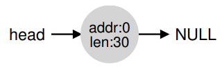

por supuesto, asi es como se ve el heap al inicio, antes de que se haga cualquier asignación. Con la fusión, un asignador puede tener la certeza que grandes extensiones libres estan disponibles para la aplicación.

### Rastreando el tamaño de las regiones asignadas+

Notar que la interfaz para `free(void *ptr)` no toma por parametro un tamaño; por lo que es asumido por el puntero dado, la libreria `malloc()` puede determinar rapidamente la dimensión de la región de memoria a liberar y puede incorporar de vuelta en la free list.

Para completar esta tarea, muchos asignadores guardan un poco de información extra en el encabezado del bloque el cual mantiene en la memoria, usualmente justo antes de devolver el chunk de memoria. Vemos un ejemplo de nuevo:

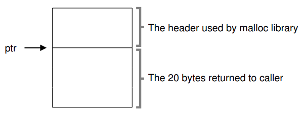

Figure 17.1: **Un encabezado de región más asignado**

Estamos examinando un bloque asignado de 20 bytes, apuntado por `ptr`; imagina que el usuario llamo a `malloc()` y guardo el resultado en `ptr`, osea `ptr = malloc(20)`; y también debe contener punteros adicionales para acelerar la desasignación, un número magico para proporsionar verificación de integridad adicional, y otra información. Asumimos un encabezado simple el cual contiene el tamaño de la región y un número magico, como este:

```c
typedef struct{
  int size;
  int magic;
} header_t;
```

El ejemplo anterior se deberia verse algo como:

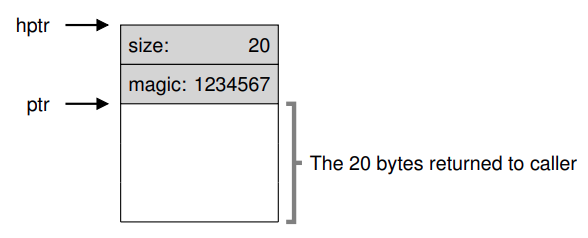

Figure 17.2: **Contenido específico del encabezado**

Cuando el usuario llama a `free(ptr)`, la libreria usa un puntero aritmetico simple para descubrir donde comienza el encabezado:

```c
void free(ptr){
  header_t *hptr = (header_t *) ptr-1;
  ...
  }
```

Después de obtener dicho puntero al encabezado, la libreria puede determinar facilmente si el número magico coincide con el valor esperado (`assert(htpr->magic) == 1234567`) y calcular el tamaño total de la región recien liberada por medio de la matematica (osea, sumando el tamaño del encabezado al tamaño de la región). Notar el pequeño pero critico detalle de la ultima oración: El tamaño de la región libre = tamaño del encabezado + el tamaño del espacio asignado al usuario. Cuando un usuario pide `N` bytes de memoria, la libreria no busca un chunk libre de tamaño `N` si no busca un chunk libre de tamaño `N` mas el tamaño del encabezado.

### Incrustando una free list

Hasta el momento hemos tratado a nuestra free list simple como una entidad conceptual; es solo una lista que describe los chunk libres de la memoria en el heap. Pero ¿Cómo construimos dicha lista dentro del mismo espacio libre?

En una lista mas tipica, cuando asignamos un nuevo nodo, solo llamamos a `malloc()` cuando necesitamos espacio para el nodo. Desafortunadamente, en una libreria de asignación de memoria, no puedes hacer eso!!! En cambio, necesitas construir la lista *dentro* del mismo espacio libre.

Asumamos que tenemos un chunk de memoria de 4096 bytes para administrar (osea, el heap es de 4KB). Para administrar esta free list, primero tenemos que inicializar dicha lista; inicialmente, la lista deberia hacer una entrada, de tamaño 4096 (menos el tamaño del encabezado). Aca esta la descripción de un nodo de la lista:

```c
typedef struct __node_t {
  int size;
  struct ___note_t * next;
} node_t;
```

Ahora vemos algo del código que inicializa el heap y pone el primer elemento de la free list dentro de este espacio. Estamos asumiendo que el heap es construido dentro de algun espacio libre adquirido via una llamada a la system call `mmap()`; esta no es la unica forma para construir dicho heap pero nos sirve en este ejemplo. Aqui esta el código:

```c
// mmap() returns a pointer to a chunk of free space
node_t *head = mmap(NULL, 4096, PORT_READ|PORT_WRITE,
                    MAP_ANON|MAP_PRIVATE, -1, 0);
head->size = 4096 - sizeof(t);
head->next = NULL;
```

Después de ejecutar este código, el estado de la lista es que tiene una sola entrada, de tamaño 4088. Si, es un heap pequeño, pero es un buen ejemplo para nostros. El puntero `head` contiene el inicio de la dirección de este rango; vamos a asumir que es 16KB. Visualmente, el heap se veria asi:

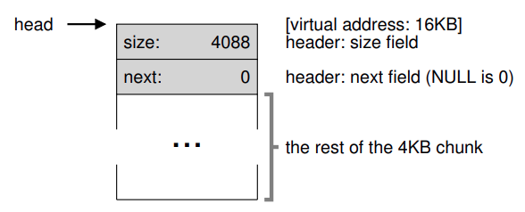

Figure 17.3: **Un heap con un chunk libre**

Ahora imaginemos que un chunk de memoria es pedido, digamos de tamaño de 100 bytes. Para cumplor con esta petición, la libreria primero encontrara un chunk del largo suficiente para acomodar la petición; dado que hay un solo chunk libre (de tamaño 4088), elegira este chunk. El chunk sera **dividido** en dos: un chunk suficientemente grande para servir a la petición (mas el encabezado), y el resto como chunk libre. Asumamos un encabezado de 8 bytes, el espacio en el heap ahora se veria asi:

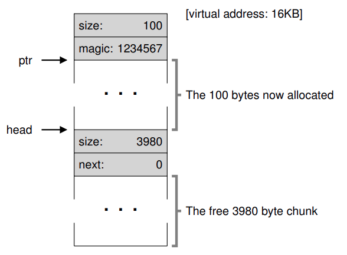

Figure 17.4: **Un heap: después de una asignación**

Por la petición de 100 bytes, la libreria asignara 108 bytes del existente chunk libre, retornara un puntero a él, escondera la información del encabezado inmediatamente antes de la asignación de espacio para el futuro uso de `free()`, y reducira el unico nodo libre en la lista a 3980 bytes (4088 - 108).

Ahora vemos el heap cuando tiene asignada tres regiones, cada una de 100 bytes (108 incluyendo el encabezado):

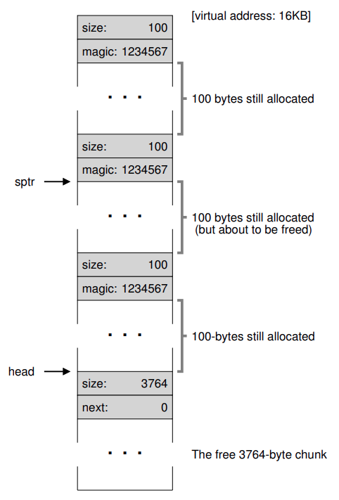

Figure 17.5: **Espacio libre con tres chunks asignados**

Como podemos ver, los primeros 324 bytes del heap ahora estan asignados, y se pueden ver tres encabezados en ese espacio. La free list sigue siendo poco interesante: un solo nodo (siendo apuntado por `head`), pero ahora solo tiene 3764 bytes de tamaño después de la tres divisiones. Pero ¿Qué sucede si el programa devuelve algo de memoria usando `free()`?

En el ejemplo, la aplicación devuelve medio chunk de memoria asignada, llamando a `free(16500)` (se llega al valor 16500 sumando el inicio de la región de memoria, 16384, a los 108 del chunk anterior y los 8 bytes del encabezado de ese chunk). Este valor esta apuntado por `sptr` en el diagrama anterior.

La libreria inmediatamente se da cuenta del tamaño de la región libre, y entonces agrega el chunk libre de nuevo en la free list. Asumiendo que insertamos en el head de la free list, el espacio ahora lucira:

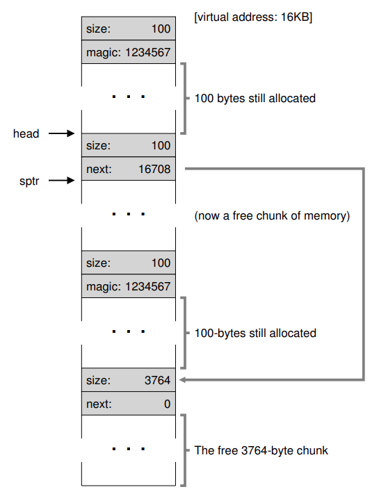

Figure 17.6: **Espacio libre con dos chunks asignados**

Ahora tenemos una lista que empieza con un chunk libre pequeño (100 bytes apuntados por el `head` de la lista) y un chunk libre grande (3764 bytes). Nuestra lista finalmente tiene mas de un elemento. El espacio libre es fragmentado xd, una desafortunada pero comun ocurrencia.

Ultimo ejemplo: Asumamos ahora que los ultimos dos chunk que estan en uso son liberados. Sin fusión, termina con fragmentación:

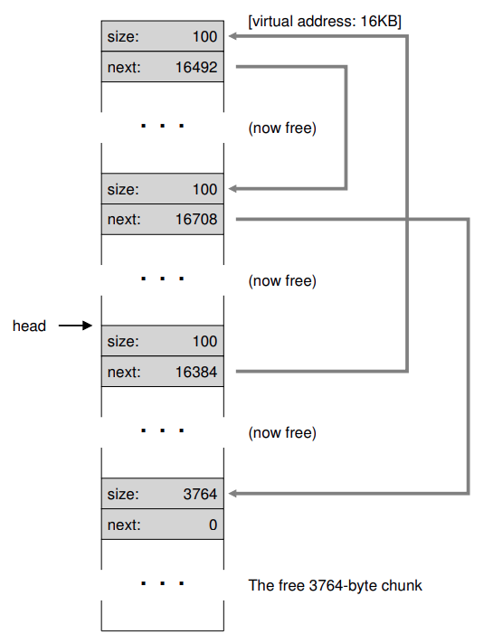

Figure 17.7: **Una free list no funcionada**

Como vemos, tenemos un gran desorden ¿Porque? simple, olvidamos **Fusionar** la lista. A pesar de que toda la memoria esta libre, esta cortado en piezas, por lo que aparenta ser una memoria fraccionada y no una sola. La solución: Vamos a traves de la lista y **Ordenamos** los chunks vecinos; cuando terminemos, el heap estara completo otra vez.

### Agrandando el heap

Deberiamos un ultimo mecanismo. ¿Qué deberiamos hacer si el heap se queda sin espacio? El enfoque mas simple es fallar. En algunos casos es la unica opción, y por lo tanto retornar `NULL` es un enfoque horonable.

Los asignadores mas tradicionales inician con un heap chico y piden mas memoria al SO cuando lo necesitan. Esto significa que hacen algun tipo de system call (por ejemplo, `sbrk`) para agrandar el heap, y entonces asignar los nuevos chunk ahí. Para satisfacer la petición `sbrk`, el SO encuentra paginas físicas libres en el espacio de direcciones del proceso que hizo la petición, y entonces retorna el valor del final del nuevo heap; en este punto, un heap mas grande esta disponible, y la petición puede ser atendida satisfactoriamente.

---

## Estrategias básicas

Vemos algunas estrategias básicas para administrar espacio libre. Estos enfoques estan basados en políticas simples.

El asignador ideal es rapido y minimiza la fragmentación. Desafortunadamente, dado que la cadena de asignación y liberacipon puede ser arbitraria, cualquier estrategia particular puede ser un poco mala dado una mala sucesión de entradas.

- ### Best Fit

Primero, buscamos a traves de la free list y encontramos chunks de memoria libre que sean igual o más grande que el tamaño pedido. Entonces, retornamos el más chico de ese grupo de candidatos; este chunk es llamado el **chunk best fit**. Un recorrido a traves de la lista es suficiente para encontrar el bloque adecuado para retornar.

La intuición detras de este enfoque: retornamos un bloque que este proximo a lo que el usuario pide, best fit intenta reducir el espacio desperdiciado. Pero, las implementación ingenuas para un alto costo de desempeño cuando hacen una busqueda exhaustiva para encontrar el bloque libre correcto.

- ### Worst Fist

Es el opuesto a best fit; encuentra el chunk mas grande y devuelve la cantidad solicitada; mantiene el resto del chunk en la free list. Intenta dejar grandes chunks libres en vez de muchos chunks chicos. Otra vez, sin embargo, una busqueda completa del espacio libre es requerida, y por lo tanto este enfoque puede ser costoso. Peor aun, muchos estudios muestran que este enfoque se desempeña peor, dejando exceso de fragmentación y aun teniendo muchos costos.

- ### First Fit

Encuenctra el primer bloque de memoria que sea suficientemente grande retorna la cantidad pedida al usuario. El resto del espacio libre lo mantiene en la free list para futuras peticiones.

Tiene la ventaja de la velocidad pero a veces contamina el inicio de la free list con objetos pequeños. Como el asignador administra el orden de la free list puede ser un problema. Un enfoque es usar **Orden basado en las direcciones**; manteniendo la lista ordenada por las direcciones del espacio libre, fusionar pasa a ser mas facil, y se tiende a reducir la fragmentación.

- ### Next Fit

Mantiene un puntero adicional a la ubicación dentro del lista donde se miró por última vez. La idea es repartir las búsquedas de espacio libre por toda la lista de forma mpas uniforme, evitando así fragmentación. El desempeño de este enfoque es muy similar a first fit, una vez mas se evita la busqueda exhaustiva.

### Ejemplos

Ejemplos de las estrategias antes mencionadas. Visualiza una free list con tres elementos, de tamaño 10, 30 y 20 (ignoramos los encabezados y otros detalles, solo concentremonos como funcionan las estrategias):

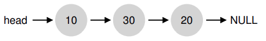

Asumamos una petición de asignación de tamaño 15. Un enfoque **Best-Fit** buscaria en la lista enteroa y encontraria que 20 es el best fit, ya que es el menor espacio libre que puede servir para la petición

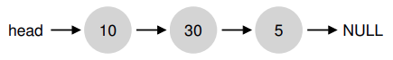

Queda un chunk libre pequeño. Un enfoque **Worst-Fit** es similar pero encambio busca el chunk mas grande, en este ejemplo 30.

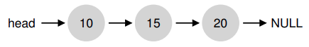

**First-Fit** en este ejemplo, hace lo mismo que worst-fit, encontrar el primer bloque que también pueda satisfacer la petición. La diferencia es el costo de la busqueda.

---

## Otros enfoques

- ### Listas segregadas (separadas)

