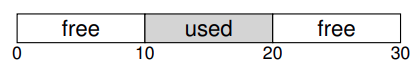
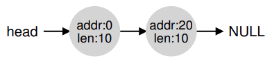
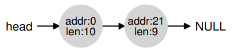
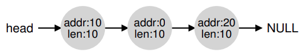

# Administración del espacio libre

Administrar espacio libre puede ser ciertamente facil. Es facil cuando el espacio que administras se divide en unidades de tamaño fijo y cuando un cliente pida por una de ella solo devuelve la primera entrada.

Cuando la administración del espacio libre se vuelve mas dificil es cuando el espacio libre que estas administrando consiste de unidades de dimensiones variables; esto surge con una libreria de asignación de memoria a nivel de usuario (como con `malloc()` y `free()`) y con un SO administrando memoria física cuando usan **Segmentación** para implementar VM. En cualquier caso, el problema que existe es conocido como **fragmentación externa**: el espacio libre es cortado en pequeñas piezas de diferentes tamaños y por lo tanto fragmentada xd; peticiones subsecuentes pueden fallar a causa de no tener espacio libre contiguo que pueda satisfacer la petición, incluso aunque la cantidad total de espacio linre exceda el tamaño de la petición.

Vemos en la figura un ejemplo del problema, el espacio total disponible es de 20 bytes; desafortunadamente, esta fragmentado en dos chunks de 10 bytes cada uno. Como resultado, una petición por 15 bytes fallara a pesar de que hay solo 20 bytes libres.

---

## Suposiciones

La mayor parte de la discución esta centrada en el historial de asignaciones hechas en la libereria de asignación de memoria a nivel de usuaio.

Asumimos una interfaz basica como la que proporsiona `malloc()` y `free()`. Especificamente `void * malloc(size_t size)` toma un solo parametro, `size`, el cual es el numero de butes pedidos por la aplicación; y retorna un puntero a la region de ese tamaño. La rutina complementaria `void free(void * ptr)` toma un puntero y libera el chunk correspondiente. Notar la implicación de la interfaz: el usuario, cuando libera el espacio, no informa a la libreria del tamaño; por lo que; la libreria debe ser capaz de descubrir que tan grande es el chunk de memoria cuando solo le entregan un puntero.

El espacio que esta libreria administran es conocido historicamente como **heap**, y la estructura de datos generica usada para administrar el espacio libre en el heap es algun tipo de **free list**. Esta estructura contiene referencias a todos los chunks libres del espacio de la región de memoria administrada. Obviamente, esta estructura de datos no necesita ser una lista **per se**, solo algun tipo de estructura de datos para rastrear el espacio libre.

Asumimos que nos vamos a centrar en la **fragmentación externa**. Como dijimos antes. Los asignadores por supuesto también tienen problemas de **fragmentación interna**; si un asignado recibe chunks de memoria mas grande de los que pidio, tal espacio es considerado **fragmentación interna** y es otro ejemplo de espacio desperdiciado. Pero, por motivos de simplicidad, solo vamos a ver la fragmentación externa.

Suponemos que una vez que la memoria es entrefada a un cliente no puede ser reubicada en otra ubicación de la memoria. Por ejemplo, si un programa llama a `malloc()` y le entrega un puntero a algun espacio en el heap, esa region de la memoria es esencialmente "propiedad" del programa (y no puede ser movida por la libreria) hasta que el programa la devuelva a traves de la correspondiente llamada a `free()`. Por lo que, no compactaremos el espacio libre si es posible, lo cual debera ser util para combatir la fragmentación. La compactación deberia ser usada en el SO para tratar con la fragmentación cuando implementa **segmentación**.

Finalmente, suponemos que el asginador administra una region contigua de bytes. Un asignador podria requerir que una region crezca; por ejemplo, una libreria de asignación de memoria a nivel de usuario podria llamar dentro del kernel para agrandar el heap. Pero, por simplicidad, suponemos que la region es de un solo tamaño en toda su vida.

---

## Mecanismo de bajo nivel

### División y fusión

Una free list contiene un conjunto de elementos que describen el espacio libre que todavia queda en el heap. Asumimos el siguiente heap de 30 bytes:

La free list para este heap deberia tener dos elementos. Una entrada describe el primer segmento de 10 bytes (bytes 0-9), y otra entrada describe el otro segmento libre (bytes 20-29)

Como dijimos, una petición por cualquier cosa mas grande de 10 bytes fallara y retornara `NULL`; no hay un unico chunk contiguo de memoria disponible de este tamaño. Una petución para exactamente 10 bytes se podria satisfacer facilmente por cualquiera de los dos chunk libres. Pero ¿Qué pasa si la petición es por algo mas chico de 10 bytes?

Supongamos que tenemos una petición de un solo bytes de memoria. El asignador hara una acción conocida como **División**: Encontrara un chunk libre de memoria que pueda satisfacer la petición y lo dividira en dos. El primer chunk lo retornara al que hizo la petición; y el segundo permanecera en la lista. Por lo que, en nuestro ejemplo, si se hace una petición de un byte, el asignador decide usar el segundo de los dos elementos de la lista para satisfacer la petición, la llamada a `malloc()` retornara 20 (la dirección de la region de 1 byte) y la lista quedara algo asi:

Podemos ver la lista de mantuvo intacta; el unico cambio es que la region libre ahora comienza en 21 en vez de 20, y el largo de esa region ahora es 9. La division es comunmente usada en los asignadores cuando una petición es menor que el tamaño de algun chunk libre en particular.

Un mecanismo adicional encontrado en muchos asignadores es conocido como **fusion** del espacio libre. Tomemos el ejemplo del principio (10 bytes libres, 10 bytes usados y otros 10 bytes libres).

Dado este (diminuto) heap, ¿Qué sucede cuando una aplicación llama a `free(10)` y retorna el espacio en el medio del heap? Si simplemente lo sumamos al espacio libre de nuevo a nuestra lista sin pensar mucho, terminamos con una lista asi:

