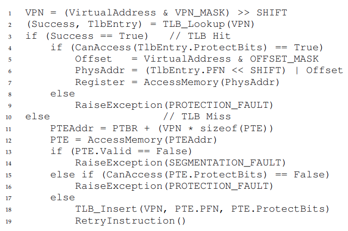
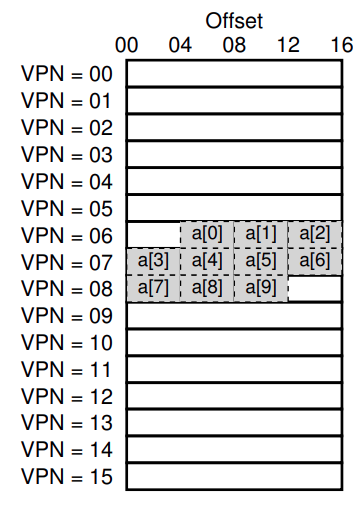
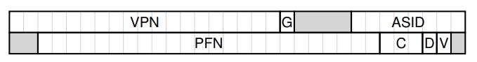

# Paginación: Traducción más rápida (TLBs)

Usar  paginación como mecanismo central para soportar memoria virtual puede traer grandes gastos de desempeño. Al Cortar el espacio de direcciones en pedazos mas chicos, unidades de tamaño fijo (osea, paginas xd), la paginación requiere una gran cantidad de mapeo de información. Dado que el mapeo de información generalmente es cargado en la memoria física, la paginación logicamente requiere una busqueda de memoria adicional para cada dirección virtual generada por el programa. Ir a la memoria para traducir información antes de cada instrucción fetch o carga/guardado explicito es prohibivamente lento. Por lo que nuestro problema es: ¿ Cómo podemos acelerar la traducción de direcciones, y evitar la mayor parte de referencia a mamoria extra que padece la paginación? ¿Qué ayuda del hardware necesitamos? ¿Qué participación del SO se necesita?

Cuando queremos hacer las cosas mas rapido, el SO usualmente necesita algo de ayuda. Y a menudo viene del viejo amigo del SO: el hardware. Para acelerar la traducción de direcciones, vamos a agregar lo que historicamente se llama **Buffer de búsqueda de traducción** (**Translatio-Lookaside Buffer** -> **TLB**). Un TLB es parte de la **unidad de administración de memoria** (**memory-Management unit** -> **MMU**), y es simplemente una **cache** de hardware de traducciones populares de direcciones virtuales a físicas; por lo que un mejor nombre seria **address-traslation cache**. Sobre cada referencia de memoria virtual, el hardware primero verifica el TLB para ver si la traducción deseada esta ahí; si lo esta, la traducción se hace rapidamente sin tener que consultar la page table. Dado este tremendo impacto en el desempeño, los TLBs en un sentido real hacen la memoria virtual posible.

---

## TLB Algoritmo Basico



Figure 19.1: **Algoritmo de flujo de control TLB**

Vemos en la figura un bosquejo aproximado de como el hardware debe manejar la traducción de una dirección virtual, asumiendo una simple **table page lineal** y un **hardware-managed TLB**.

El algoritmo que el hardware sigue funciona asi: Primero, extrae el numero de pagina virtual (VPN) de la dirección virtual, y verifica si la TLB tiene la traducción para ese VPN. Si la tiene, tenemos un **TLB Hit**, que significa que el TLB tiene la traducción. Ahora podemos extraer el número del page frame (PFN) de la entrada TLB entry, concatenarla en el offset de la dirección virtual original, y formar la dirección física deseada (PA), y acceder a la memoria, asumiendo que la protección verifica que no falle.

Si la CPU no encuentra la traducción en la TLB (**TLB Miss**). tenemos mas trabajo oara hacer. En este ejemplo, el hardware accede a la page table para encontrar la traducción, asumiendo que la referencia de memoria virtual generada por el proceso es valida y accesible, actualiza el TLB con la traducción.  Este conjunto de acciones son costosas, principalmente por culpa de las referencias extra a memoria necesitadas para acceder a la page table. Finalmente, una vez que el TLB esta actualizado, el hardware reintenta la instrucción; esta vez, la traducción esta en el TLB, y la referencia a memoria se hace rapido.

El TLB, como todos los caches, es construida con la premisa que el caso común, las traducciones estan ahí. Si lo estan (un hit), se agrega costos bajos, ya que el TLB est cerca del nucleo del procesodaor y esta diseñado para ser rápido. Cuando ocurre un miss, se incurre en un alto costo de paginación la page table debe ser accedida para encontrar la traducción, y resulta una referencia extra de memoria. Si esto sucede a menudo, el programa probablemente se ejecutara notablemente mas lento; los accesos a memoria, en la relación con la mayoria de las instrucción de CPU, son un poco costosos, un TLB miss no deja mas accesos a memoria. Por lo tanto, esperamos evitar los TLB miss tanto como podamos.

---

## Ejemplo: Accediendo a un array

Para dejar claro el funcionamiento de un TLB, vemos el seguimiento de una dirección virtual simple y veamos como un TLB puede mejorar su desempeño. En este ejemplo, vamos a asumir que tenemos un array de 10 enteros de 4 bytes en la memoria, comenzando en la dirección virtual 100. Asumamos también que tenemos un espacio de direcciones chico de 8 bit, con paginas de 16 bytes; por lo tanto una dirección virtual tiene un VPN de 4 bits ($2^{4} = 16$ (pages)) y un offset de 4 bits (hay 16 bytes en cada una de estas paginas).



Figure 19.2: **Ejemplo: un array en un pequeño espacio de direcciones**

En la figure vemos el array dispuesto en las 16 paginas de 16 bytes del sistema.

La primera entrada del array (`a[0]`) inicia en (VPN = 06, offset = 04); solo tres enteros de 4 bytes entran en esa pagina. El array continua en el siguiente (VPN = 07), donde estan las siguiente cuatro entradas (`a[3]` ... `a[6]`). Finalmente, las ultimas tres entradas de las diez del array (`a[7]` ... `a[9]`) estan localizadas en la siguiente pagina del espacio de direcciones (VPN = 08).

Consideremos un loop simple que acceda a cada elemento del array, algo como:

```c
int sum = 0;
for (i = 0; i < 10; i++) {
  sum += a[i];
}
```

Por simplicidad, pretenderemos que los unicos accesos a la memoria que genera el loop son el array (ignorando las variables `i` y `sum`, como tambien las mismas instrucciones). Cuando se accede al primer elemento del array (`a[0]`), la CPU vera una carga a la dirección virtual 100. El hardware extrae el VPN de la dirección (VPN = 06), y lo usa para verificar el TLB para una traducción valida. Asumiendo que es la primera vez que el programa accede al array, el resultado sera un TLB miss.

El siguiente acceso es a `a[1]`, y hay buenas noticias: un TLB hit. Dado que el segundo elemento del array esta empaquetado al lado del primero, vive en la misma pagina y dado que ya accedimos a la primera pagina cuando accedimos al primer elemento del array, la traducción ya esta cargada dentro del TLB. Y esa es la razon de nuestro exito. Acceder a `a[2]` encuentra otro exito, dado que vive en la misma pagina que `a[0]` y `a[1]`.

Desafortunadamente, cuando el programa accede a `a[3]`, nos encontramos con otro TLB miss. Pero, una vez mas, las siguiente entradas (`a[4]` ... `a[6]`) seran un TLB hit, dado que todas residen en la misma pagina en la memoria.

Finalmente, acceder a `a[7]` causa un ultimo TLB miss. El hardware una vez mas consulta la page table para averiguar la ubicación de esta pagina virtual en la memoria física, y actualiza el TLB acoordemente. Los ultimos dos accesos (`a[8]` y `a[9]`) reciven los beneficios de esta actualización del TLB; cuando el hardware mira en el TLB para sus traducciones, hay dos hits mas.

Resumimos la actividad de un TLB durante nuestros 10 accesos a memoria del array: **miss**, hit, hit, **miss**, hit, hit, hit, **miss**, hit, hit. Por lo tanto, nuestro TLB **hit rate**, el cual es el numero de hits dividido el numero total de accesos, es 70%. A pesar de que no es muy alto, de hecho deseamos que sea 100%, no es cero, lo cual puede ser una sorpresa. A pesar de que es la primera vez que se ejecuta el programa, el TLB mejora el desempeño debido a la **spatial locality**. Los elementos del array son empaquetados en páginas (osea, estan cerca uno de otros en espacio), y por lo tanto solo el primer acceso a un elemento de un página da un TLB miss.

Notar el rol que juega el tamaño de página de este ejemplo. Si el tamaño de pagina fuera el doble de grande (32 bytes, no 16), el acceso al array sufriria incluso menos misses. Un tamaño más típico es encontrado solo un miss por página de acceso.

Un último punto sobre el desempeño de TLB: si el programa, justo después de que complete el loop, accede al array nuevamente, veremos un mejor resultado, suponiendo que tenemos un TLB suficientemente grande para tener en cache las traducciones necesarias: hit, hit, hit, hit, hit, hit, hit, hit, hit, hit. En este caso, el TLB hit rate será mayor dado la **temporal locality**, osea la rápida re-referencia de los items de memoria en el tiempo. Como cualquier cache, TLBs se basan en localidad espacial y temporal para el exito, lo cual son propiedades del programa. Si el prorama de interes exhibe tale localidades (y muchos programas lo hacen), el TLB hit rate sera alto.

---

## ¿Quíen maneja los TLB miss?

Tenemos dos respuestas posbles: El hardware o el software (SO). Antes, el hardware tenia un set de instrucciones complejas, y las personas que construian el hardware no confiaban en esas austutas personas del SO. Por lo que el hardware manejaba los TLB miss completamente. Para hacerlo, el hardware tenia que saber exactamente donde estan las pages tables en la memoria, en caso de una falla, el hardware recorreria la page table y extraería la traducción deseada, actualizaría el TLB con la traducción, y reintentaria la instrucción.

Las arquitecturas más modernas tienen lo que se concoe como **software-managed TLB**. En un TLB miss, el hardware simplemente lanza una excepción, lo que pausa el acutal stream de instrucciones, cambia a kernel mode, y salta a un **trap handler**. Este trap handler es código del SO que esta escrito con el proposito de manejar los TLB misses. Cuando se ejecute, buscara la traducción en la page table, y usara una instrucción privilegiada para actualizar el TLB, y volvera del trap; en este punto, el hardware reintentará la instrucción.

Detalles importantes.

1. la instrucción return-from-trap necesita ser un poco diferente que el return-from-trap que vimos antes cuando servia a una syscall. En el ultimo caso el return-from-trap reanuda la ejecución despues de el trap en el SO, como un return de una llamada a un procedimiento que vuelve en la instruccion que esta exactamente después de la llamada a dicho procedimiento. En el caso anterior, cuando volvemos de un TLB-miss-handling trap, el hardware debe reanudar la ejecución en la instruccion que causo el trap; se reintenta ejecutar, y esta vez resulta un TLB hit. Dependiendo de como fue causada una excepción de trap, el hardware debe guardar un PC diferente cuando trapea en el SO, para reanudar apropidamente la ejecución.

2. Cuando se ejecuta el código de manejo de TLB miss, el SO necesita ser extracuidadoso de no causar una cadena infinita de TLB miss, puedes tener el manejador de TLB miss en la memoria física (que está sin mapear y no esta sujeta a traducciones de memoria), o reservar algunas entradas en el TLB para una traduccion permanente, y usar algunos slots de traduccion permanente para manejar el mismo codigo; en estas traducciones "cableadas" siempre hay un TLB hit.

La princial ventaja del enfoque ***software-managed*** es la ***flexibilidad***: el SO puede usar cualquier estructura de datos para implementar la page table, sin necesitar cambios en el hardware. Otra ventaja es la ***simplicidad***, como vimos en el flujo de control de TLB. El hardware no hace mucho en un miss: solo lanza una excepción y deja al OS manmejar el TLB miss.

---

## Contenido del TLB: ¿Qué hay dentro?

Un TLB tipico debe tener 32, 64 o 128 entradas y debe ser lo que se llama **Completamente asociativo**. Esto significa que cualquier traducción dada puede estar en cualquier lugar del TLB, y que el hardware buscara en todo el TLB en paralelo para encontrar la traduccion deseada. Una entrada de TLB luce así:

| VPN | PFN | other bits |
|:---:|:---:|:---:|

Notar que VPN y PFN estan presentes en cada entrada, como una traducción puede terminar en cualquiera de esas ubicaciones (en terminos de hardware, el TLB es conocido como una cache **completamente asociativa**). El hardware busca la entradas en paralelo para ver si alguna coincide.

Son mas interesantes los "otros bits". Por ejemplo, el TLB comunmente tiene un **valid bit**, el cual dice si la entrada tiene una traduccion valida o no. También son comunes los bits de **protección**, los cuales indican como puede ser accedida una page table. Por ejemplo, las paginas con código deben ser marcadas como ***read and execute***, las **heap pages** deben ser marcadas como ***read adn write***. Tambien hay otros campos, incluyendo un identificador de espacio de direcciones, un dirty bit, etc.

---

## Problema con TLB: Cambio de contexto

El TLB contiene traducciones virtuales a fisica que son válidas solo para el proceso actual; esas traducciones no son significativas para otros procesos. Como resultado, cuando cambiamos de un proceso a otro, el hardware, o el SO (o ambos) deben ser cudiadosos que el proceso que se esta por ejecutar no use accidentalmente traducciónes de algún proceso previo.

Ejemplo. Cuando un proceso (P1) se esta ejecutando, se asume que el TLB esta guardado en cache las traducciones que son validad para P1, es decir, vienen de la page table de P1. Asumamos para este ejemplo, que la décima página virtual de P1 es mapeada al frame físico 100.

Asumamos que existe otro proceso (P2), y que el SO decide hacer un cambio de contexto y ejecutarlo. Asumamos aquí que la décima pagina virtual de P2 es mapeada al frame físico 170. Si las entradas de ambos procesos estan en la TLB, el contenido de la TLB sería:

| VPN | PFN | valid | prot |
|:---:|:---:|:---:|:---:|
| 10 | 100 | 1 | rwx |
| -- | -- | 0 | -- |
| 10 | 170 | 1 | rwx |
| -- | -- | 0 | --- |

VPN 10 se traduce a PFN 100 (P1) o PFN 170 (P2), pero el hardware no puede distinguir que entrada es significatia para que proceso. Por lo tanto, necesitamos trabajar más para el correcto soporte de TLB a la virtualización a través de multiples procesos. Cuando se se produce un cambio de contexto entre procesos, las traducciones en el TLB para el último proceso no son significativas para el proceso a punto de ejecutarse. ¿Qué deberia hacer el hardware o el SO para solucionar este problema?

Un enfoque es simplmente **limpiar** el TLB en un cambio de contexto. En un sistema basado en software, esto puede ser realizado con una expolícita y privilegiada instruccion de hardware; con un manejo de TLB por hardware, la limpieza puede ser recreada cuando el registro base de la page table es cambiado (el SO debe cambiar el PTBR en un cambio de contexto). En cualquier caso, la limpieza es setear todos los bits validos a 0, escencialmente limpiando el contenido del TLB.

Limpiando el TLB en cada cambio de contexto, tenemos una solucioón que funciona, ya que un proceso nunca encontrara una traducción erronea en el TLB. Pero tiene un costo: cada vez que un proceso se ejecuta, debe incurrir en TLB misses si toca sus datos y paginas de código. Si el SO cambia entre procesos frecuentemente, el costo será alto.

Para reducir este costo, algunos sistemas agregan soporte de hardware para permitir compartir el TLB a través de los cambios de contexto. En particular, algunas sistemas de hardware proveen un campo address **space identifier** (**ASID**) (**identificador de espacio de direcciones**) en el TLB. Puedes pensar en el ASID como un **process identifier** (**PID**) **idenfificador de proceso**, pero usualmente tiene menos bits (8 bits para el ASID versus 32 bits para un PID).

Tomamos el TLB del ejemplo anterior y le agregamos ASIDs, es claro que los procesos pueden compartir TLB facilmente: solo se necesita el campo ASID para diferenciar cualquier traduccion idénticas. Aquí hay una representacion de un TLB con el campo ASID agregado:

| VPN | PFN | valid | prot | ASID |
|:---:|:---:|:---:|:---:|:---:|
| 10 | 100 | 1 | rwx | 1 |
| -- | -- | 0 | -- | -- |
| 10 | 170 | 1 | rwx | 2 |
| -- | -- | 0 | -- | -- |

Con los identificadores de espacios de direcciones podemos mantener las traducciones de diferentes procesos al mismo tiempo sin una confusión. Obviamente, el hardware también necesita saber que proceso se está ejecutando actualmente para relizar la traducción, y por lo tanto el SO debe, en un cambio de contexto, setear algunos registros privilegiados para el ASID del proceso actual.

Hay otro caso donde dos entradas del TLB con muy similares. En este ejemplo, hay dos entradas para dos procesos diferentes con dos diferentes VPNs que apuntan a la misma página física:

| VPN | PFN | valid | prot | ASID |
|:---:|:---:|:---:|:---:|:---:|
| 10 | 101 | 1 | rwx | 1 |
| -- | -- | 0 | -- | -- |
| 50 | 101 | 1 | rwx | 2 |
| -- | -- | 0 | -- | -- |

Esta situacion puede surgir, por ejemplo, cuando dos procesos comparten una página. El proceso 1 esta compartiendo la página física 101 con el proceso 2; P1 mapea esta pagina en la 10th página de su espacio de direcciones, y P2 mapea la 50th página de su espacio de direccioens. Comparie páginas de código es útil para reducir el número de páginas físicas en uso, y por lo tanto reduciendo el gasto de memoria.

---

## Problema: Política de reemplazo

Problema que debemos considerar es el **reemplazo de cache**. Específicamente, cuando insertamos una nueva entrada en la TLB, tenemos que **reemplazar** una entrada vieja.

Un enfoque común de desechar la entrada menos usada recientemente **least-recently-used** **LRU**. LRU intenta tomar ventaja en la localidad en la cadena de referencias a memoria, asumiendo esto es probable que una entrada que no ha sido usada recientemente sea buena candidata para desechar. Otro enfoque típico es usar una politica **aleatoria**, la cual desecha una entrada de la TLB aleatoriamente. Esta política es util dado su simplicidad y capacidad para evitar los casos extremos; por ejemplo, una política "razonable" como LRU se comporta de manera irrazonable cuando el programa recorre `n+1` páginas con un TLB de tamaño `n`; en este caso, LRU falla en cada acceso, mientras que de forma aleatoria lo hace mucho mejor.

---

## Una entrada de TLB real

veamos brevemente una TLB real. Este ejemplo es de MIPS, un sistema moderno que una TLBs manejadas por software.



Figure 19.4: **Una entrada MIPS TLB**

EL MIPS R4000 soporta un espacio de direcciones de 32 bits con páginas de 4 KB. Por lo tanto, contamos con un VPN de 20 bits y 12 bits de offset en nuestra dirección virtual típica. Sin embargo, como se puede ver solo hay 19 bits para la VPN; resulta que, las direcciones de usuario vienen de la mitad del espacio de direcciones (el resto esta reservado para el kernel) y por eso solo se necesitan 19 bits. La VPN se traduce hasta un physical frame de 24 bits (PFN) y , por lo tanto, puede admitir sistemas con memoria física de hasta 64 GB ($2^{24}$ paginas de 4 KB).

Hay otros bits interesantes en la MIPSTLB. Veamos el ***global bit*** (***G***), es usadado para páginas que son compartidas globalmente entre procesos. Por lo tanto, si el bit global está seteado, el ASID es ignorado. También vemos el ASID de 8 bits, el cual es usado por el OS para distinguir entre espacios de direccioens. vemos 3 bits de ***Coherence*** (***C***), los cuales determinan como una página es cacheada por el hardware; un ***dirty bit*** el cual indica si la página ha sido escrita; un ***valid bit*** el cual le dice al hardware si en esa entrada hay una traducción valida.. Tambien hay un campo ***page mask***, el cual soporta multiples tamaños de página. Finalmente algunos de los 64 bits estan sin usar.

Un registro cableado puede ser seteado por el OS para decirle al hardware cuántos slots de la TLB reservar para el SO; el SO usa esos mapeos reservados para código y datos a los que quiere acceder en tiempos críticos, donde un TLB miss podría ser un problema.

Dado que el MIPS TLB es manejado por software, en necesaria que haya instrucciones para actualizar la TLB. El MIPS provee 4 instrucciones: **TLBP**, la cual explora la TLB para ver si existe una traduccion; **TLBR**, lee el conteniado de una entrada de TLB en los registros; **TLBWI**, reemplaza una entra específica; y **TLBWR**, la cual reemplaza una entrada TLB aleatoria. El SO usa estas instrucciones para manejar el contenido de la TLB. Obviamente es crítico que esas instrucciones sean privilegiadas.