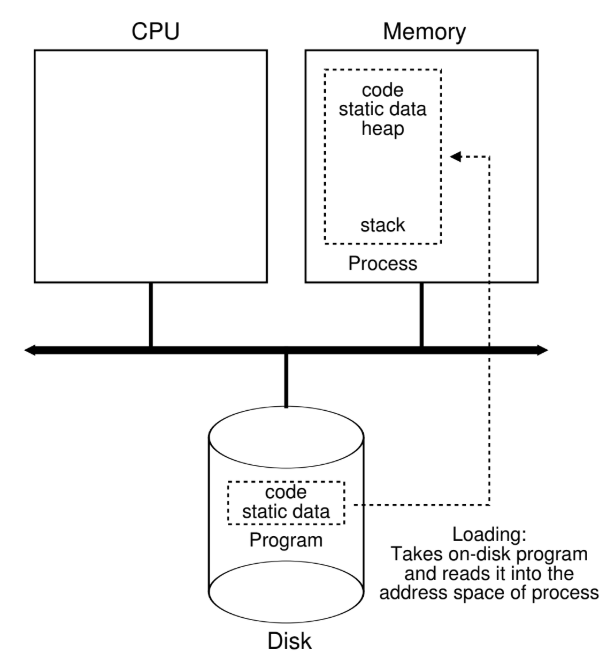
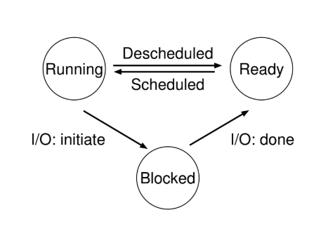

# La abstracción: El proceso

La definición de un **proceso** (informalmente) es simple: es un **programa en ejecución**. El programa en sí mismo es una cosa sin vida: sólo está allí en el disco, un montón de instrucciones (y quizás algunos datos estáticos) , esperando entrar en acción. Es el **sistema operativo** el que toma estos bytes y los pone en marcha, transformando el programa en algo útil.

A veces queremos ejecutar más de un programa a la vez. Un sistema típico puede parecer que ejecuta decenas o incluso cientos de procesos al mismo tiempo. Esto hace que el sistema sea fácil de usar, ya que uno nunca tiene que preocuparse de si una CPU está disponible; simplemente ejecutamos programas.

El SO crea esta ilusión **Virtualizando** la CPU. Esto lo logra ejecutando un proceso, luego deteniéndolo y ejecutando otro, y así sucesivamente, el SO puede crear la ilusión de que existen muchas CPUs virtuales cuando en realidad hay sólo una CPU física (o unas pocas). Esta técnica básica, conocida como **tiempo compartido** de la CPU, permite a los usuarios ejecutar tantos procesos concurrentes como deseen; el costo potencial es el rendimiento, ya que cada proceso se ejecutará más y más lentamente si la(s) CPU(s) debe(n) ser compartida(s).

La contrapartida del tiempo compartido es el **Espacio compartido**, donde un recurso se divide (en el espacio) entre aquellos que deseen utilizarlo.

Para implementra la virtualizacion de la CPU, y para implementarla bien, el SO necesitará tanto maquinaria de bajo nivel como inteligencia de alto nivel. La maquinaria de bajo nivel la llamamos **Mecanismos**; son métodos o protocolos de bajo nivel que implementan una parte de la funcionalidad necesaria. Por ejemplo: **Cambio de contexto**, que le da al SO la capacidad de dejar de ejecutar un programa y empezar a ejecutar otro en una CPU determinada.

Encima de estos mecanismos reside parte de la inteligencia del SO, en forma de **Politicas**. Son algoritmos para tomar algún tipo de decisión dentro del SO. Por ejemplo: dado un número de programas posibles para ejecutar en una CPU, ¿Qué programa debería ejecutar el SO? Una **Política de Planificación** en el SO tomará esta decisión.

---

## La Abstracción: Un Proceso

La abstracción que proporciona el SO de un programa en ejecución es algo que llamaremos **Proceso**. Un proceso es simplemente un programa en ejecución; podemos resumir un proceso haciendo un inventario de las diferentes piezas del sistema a las que accede o afecta durante el curso de su ejecución.

Para entender lo que constituye un proceso, tenemos que entender su **Estado**: lo que un programa puede leer o actualizar cuando se está ejecutando.

Un componente obvio del estado que comprende un proceso es su *memoria*. Las instrucciones se encuentran en la memoria; los datos que el programa en ejecución lee y escribe también se encuentran en la memoria. La memoria a la que el proceso puede direccionar (llamada su **Espacio de Direcciones**) es parte del proceso.

también forman parte del estado del proceso los *registros*; muchas instrucciones leen o actualizan explícitamente los registros y es evidente que son importantes para la ejecución del proceso.

Hay algunos registros particularmente especiales que no forman parte de este estado. Por ejemplo: el **Contador de programa** (PC) (a veces llamado **puntero de instrucción** o **IP**) nos dice qué instrucción del programa se ejecutará a continuación.

Los programas también suelen acceder a dispositivos de almacenamiento persistente. Esta *información de E/S* (entrada, salida (I/O)) puede incluir una lista de archivos que el proceso tiene abiertos en ese momento.

---

## La API de los procesos

Lo que debe incluirse en cualquier interfaz de un sistema operativo. Estas APIs, están disponibles en cualquier sistema operativo.

- **Crear**: Método para crear nuevos procesos.

- **Destruir**: Método para destruir un proceso / forzar la detención de un proceso.

- **Esperar**: Método para esperar un proceso.

- **Controles varios**: Por ejemplo: Método para suspender un proceso por un tiempo y, detener su ejecución y después continuar ejecutándolo.

- **Estado**: Método para obtener información de estado de un proceso.

---

## Creación de Procesos: Un poco mas detallado

Lo primero que debe hacer el SO para ejecutar un programa es **Cargar** su código y cualquier dato estático en la memoria, en el espacio de direcciones del proceso. Los programas residen inicialmente en el **Disco** en algún tipo de **Formato ejecutable**; el proceso de cargar un programa y los datos estáticos en la memoria requiere que el SO lea esos bytes del disco y los coloque en algún lugar de la memoria (como se muestra a continuación).

Figure 4.1: **Cargando: De un programa a proceso**

Antes los sistemas operativos, el proceso de carga se realizava de forma **anticipada**, todo de una vez antes de ejecutar el programa; los SO modernos realizan el proceso de forma **perezosa**, cargando partes del código o de los datos sólo cuando se necesitan durante la ejecución del programa.

Una vez que el cídigo y los datos estáticos se cargan en la memoria, hay algunas otras cosas que el SO necesita hacer antes de ejecutar el proceso. Se debe asignar algo de memoria para el **Stack de ejecución del programa** (o simplemente stack). Los programas de C utilizan el stack para las variables locales, los parámetros de las funciones y las direcciones de retorno; el SO asgina esta memoria y se la da al proceso. El SO también inicializará el stack con argumentos; llenará los parámetros de la función `main()`, osea, `argc` y la matriz `argv`.

El SO también puede asignar algo de memoria para el **heap** del programa. En C, el heap se utiliza para los datos que se pidieron explícitamente y fueron asignados dinámicamente; los programas solicitan dicho espacio llamando a `malloc()` y lo liberan explícitamente llamando a `free()`.

El SO también realizará algunas otras tareas de inicialización, especialmente las relacionadas con la I/O. 

Al cargar el código y los datos estáticos en la memoria, al crear e inicializar una pila y al realizar otros trabajos relacionadas con la configuración de I/O, el SO (finalmente) ha preparado todo para la ejecución del programa en el punto de entrada, osea el `main()`. Al saltar a la rutina `main()`, el SO transfiere el control de la CPU al proceso recién creado y el programa comienza su ejecución.

---

## Estado de los procesos

Un proceso puede estar en uno de tres estados:

- **Corriendo**: Está ejecutándose en un procesador. Se está ejecutando instrucciones.

- **Listo**: Ya está preparado para ejecutarse pero el sistema operativo ha optado por no ejecutarlo en este momento.

- **Bloqueado**: Ha realizado algún tipo de operación que hace que no esté listo para ejecutarse hasta que ocurra algún otro evento.

Figure 4.2: **Process: State Transitions**

Un proceso puede moverse entre los estados listo y en ejecución a discreción del SO. Pasar de listo a en ejecución significa que el proceso ha sido **Planificado**; ser movido de en ejecución a listo significa que el proceso ha sido **Desplanificado**. Una vez que un proceso se ha bloqueado, el SO lo mantendrá así hasta que ocurra algún evento; el proceso vuelve al estado listo.

---

## Estructura de Datos

El SO es un programa, tiene algunas estructura de datos clave que guardan varias piezas de información relevantes. Para guardar el estado de cada proceso, el SO probablemente tendrá algún tipo de **Lista de procesos** para todos los procesos que están listos y alguna información adicional para saber qué se está ejecutando. El SO también debe guardar los procesos bloqueados; cuando se completa un evento de I/O, el SO debe asegurarse de activar el procesos correcto y prepararlo para que se ejecute nuevamente.