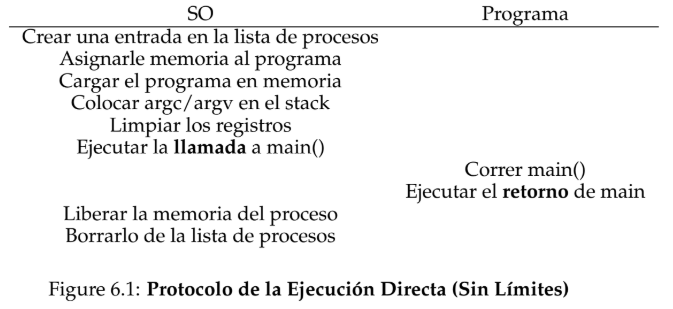
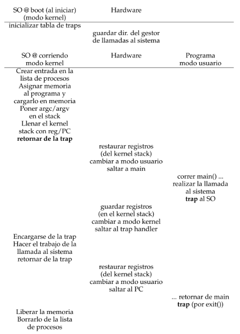
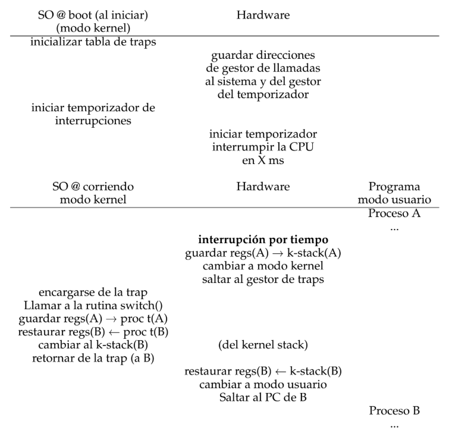
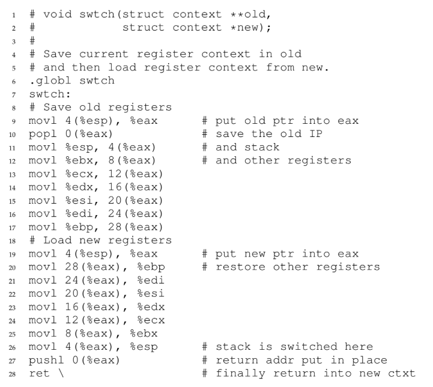

# Mecanismo: Ejecución Directa Limitada

Para virtualizar la CPU, el SO necesita compartir la CPU física entre muchas tareas que pareciera que corren al mismo tiempo, La idea básica es: Correr un proceso por un ratito, luego correr otro y así sucesivamente. La virtualización se logro, gracias al **Tiempo Compartido** de CPU.

Hay algunos desafíos al momento de generar dicha maquinaria de virtualización. El primero es el *desempeño*: ¿Cómo podemos implementar la virtualización sin agregar una sobrecarga excesiva al sistema? El segundo es el *control*: ¿Cómo podemos correr un proceso eficientemente y al mismo tiempo mantener el control de la CPU? El control es particularmente importante para el SO, porque está a cargo de los recursos; sin control, un proceso simplemente podría correr por siempre y apoderarse de la máquina, o acceder a información que no debería esta autorizado a acceder.

---

## Una técnica básica: Ejecución Directa Limitada

Para hacer que un programa corra tan rápido como uno esperaría los desarrolladores de SOs inventaron una técnica, que llamamos **ejecución directa limitada**. La parte de la idea "ejecución directa": solo hay que correr el programa directamente en la CPU. Cuando el SO desee comenzar a ejecutar un programa, solo crea una entrada para él en la lista de procesos, le asigna un poco de memoria, carga el código del programa en memoria (desde el disco), ubica su punto de entrada (la rutina `main()` o algo similar), salta a ella y comienza a correr el código del usuario. En la siguiente figura se muetra el protocolo básico de la ejecución directa (sin ningun limites)

Figure 6.1: **Protocolo de la ejecución directa (sin limites)**

Este enfoque genera un par de problemas al intentar virtualizar la CPU. El primero: si solo corremos un programa, ¿Cómo puede el SO asegurar que dicho programa no hace nada que no queramos que haga, y que todavía corra eficientemente? El segundo: cuando estamos corriendo un proceso, ¿Cómo lo detiene el SO y cambia a otro proceso, así implementando el **Tiempo Compartido** que se requiere virtualizar la CPU?

---

## Problema #1: Operaciones Restringidas

La ejecución directa tiene la ventaja de ser rápida; el programa corre nativamente en el hardware de la CPU y por lo tanto ejecuta tan rápido como se esperaría. Pero correr en la CPU genera un problema: ¿Qué pasa si el proceso desea realizar algún tipo de operación restringida, como hacer un pedido de I/O a un disco, u obtener acceso a más recursos del sistema como CPU o memoria?

Un enfoque sería simplemente dejar que cualquier proceso haga lo que quiera en términos de I/O y otras operaciones relacionadas. Pero, hacerlo evitaría la construcción de muchos tipos de sistemas que son deseables.

El enfoque que adoptamos es introducir un nuevo modo de procesador, conocido como **Modo Usuario**; el código que corre en modo usuario está restringido en lo que puede hacer. Por ejemplo, Cuando se corre en modo usuario, un proceso no puede emitir solicitudes de I/O; hacerlo llevaría a que el procesador genere una excepción; y el  SO mataría el proceso.

En contraste al modo usuario está el **Modo Kernel**, en el que el SO (o kernel) corre. El código que corre puede hacer lo que quiera, incluyendo operaciones privilegiadas tales como emitir solicitudes de I/O y ejecutar todo tipo de instrucciones restringidas.

**¿Qué debe hacer un proceso de usuario cuando quiere realizar una operación privilegiada, como leer el disco?** Prácticamente todo el hardware les proporciona a los programas de usuario la capacidad de que realicen una **Llamada al sistema**. Permiten que el kernel exponga cuidadosamente ciertas piezas clave de funcionalidad a los programas de usuario, como acceder al sistema de archivos, crear y destruir procesos, comunicarse con otros procesos y asignando más memoria, etc.

Para ejecutar una llamada al sistema, un programa debe ejecutar una instrucción **Trap** especial. Esta instrucción simultáneamente salta al kernel y eleva el nivel de privilegios; una vez en el kernel, el sistema ahora puede realizar cualquier operación privilegiada que sea necesaria (si está permitida). Cuando finaliza, el SO llama a una instrucción especial de **Retorno de la Trap** que devuelve al programa de usuario que realiza la llamada y reduce el nivel de privilegios al de modo usuario.

**¿Cómo sabe la trap qué código ejecutar dentro del SO?** El proceso que realiza la llamda no puede especificar una dirección a la que saltar; hacerlo permitiría a los programas saltar a cualquier parte del kernel, lo que claramente es muy mala idea. Por lo que el kernel debe controlar cuidadosamente que código se ejecuta en una instrucción trap.

El kernel lo hace configurando una **Tabla de traps** en el momento de booteo. Cuando la maquina arranca, lo hace en modo privilegiado (kernel) y es libre de configurar el hardware de la maquina según sea necesario. Una de las primeras cosas que hace el SO es decirle al hardware que código debe ejecutar cuando ocurren ciertos eventos excepcionales.

Para especificar la llamada al sistema exacta, en general se asigna un **número de llamada al sistema** a cada llamada al sistema. El código de usuario es responsable de colocar el número de llamada al sistema deseado en un registro o una ubicación específica en el stack; el SO, como se encarga de la llamada al sistema dentro del controlador de traps, examina este número, asegura que es válido y, si lo es, ejecuta el código correspondiente. Este nivel de indireccion sirve como una forma de protección.

Poder ejecutar la instrucción para decirle al hardware dónde están las tablas de traps es una operación **Privilegiada**.

Figure 6.2: **Protocolo de la Ejecución Directa Limitada**.

Suponemos que cada proceso tiene un stack de kernel (o kernel stack) donde los registros se guardan y se restauran (po el hardware) cuando se entra o se sale del kernel.

Hay dos fases en el protocolo de ejecución directa limitada (**LDE**).

1) **(En el momento de booteo)** El kernel inicializa la tabla de traps y la CPU recuerda su ubicación pra su uso futuro. El kernel lo hace mediante una instrucción privilegiada.

2) **(Cuando se ejecuta un proceso)** Antes de usar una instrucción de retorno de la trap para iniciar la ejecución del proceso, el kernel configura algunas cosas; luego cambia la CPU a modo usuario y comienza a ejecutar el proceso. Cuando el proceso desea emitir una llamada al sistema, vuelve a entrar en el SO, que se encarga y una vez más devuelve el control al proceso a través de un retorno de la trap. El proceso luego completa su trabajo y retorna de `main()`; En este punto, el SO se limpia y se termino.

---

## Problema #2: Cambio de procesos

Si un proceso se está ejecutando en la CPU, significa que el SO ***no*** está corriendo. Si el SO no se está ejecutando, ¿Cómo puede hacer algo? no puede xd.

#### Un enfoque cooperativo: Esperar las llamadas al sistema

**Enfoque cooperativo**: El SO confía en que los procesos del sistema se comporten de manera razonable. Se supone que los procesos que se ejecutan durante demasiado tiempo ceden periódicamente la CPU para que el SO pueda decidir ejecutar alguna otra tarea.

**¿Cómo un procesos amigable cede la CPU en este mundo utópico?** La mayoría de los procesos, transfieren el control de la CPU al SO con bastante frecuencia haciendo **Llamadas al sistema**. Los sistemas como este a menudo incluyen una llamada al sistema explícita **Yield**, que no hace nada más que transferir el control al SO para que pueda ejecutar otros procesos.

Las aplicaciones también transfieren el control al SO cuando hacen algo ilegal. Cuando esto sucede generará una **Trap** al SO. El cual volverá a tener el control de la CPU.

#### Un enfoque no cooperativo: El SO toma el control

Resulta que el SO no puede hacer mucho cuando un proceso se niega a realizar llamadas al sistema (o errores) y así, devolver el control al SO.

**¿Cómo puede el SO obtener el control de la CPU incluso si los procesos no son cooperativos?¿Qué puede hacer el SO para garantizar que un proceso fraudulento no se apodere de la máquina?** La respues es simple: Una **Interrupción por tiempo**. Se puede programar un dispositivo temporizador para generar una Interrupción cada tantos milisegundos; cuando se genera la Interrupción, el proceso que se está ejecutando actualmente se detiene y se ejecuta un **Gestor de Interrupciones** preconfigurado en el SO.

El SO debe informar al hardware sobre qué código ejecutar cuando se produce la Interrupción por tiempo; en el momento del boot, el SO hace exactamente eso. Durante la secuencia de arranque, el SO debe iniciar el temporizador (es una operación privilegiada). Una vez que el temporizador ha comenzado, el SO puede estar seguro de que el control finalmente será devuelto, el SO es libre de ejecutar programas de usuario. El temporizador también se puede apagar (es una operación privilegiada).

El hardware tiene cierta responsabilidad cuando ocurre una Interrupción, en particular para guardar suficiente información del estado del programa que se esta ejecutando cuando ocurrió la Interrupción, de modo que una Interrupción posterior de retorno de la trap reanudara el programa en ejecución correctamente.

#### Guardar y Restaurar el contexto

Ahora ya que el SO ha recuperado el control, ya sea de forma cooperativa a través de una llamada al sistema o de forma más forzada a través de una Interrupción por tiempo, se debe tomar una decisión: si continuar ejecutando el proceso que se está ejecutando actualmente o cambiar a uno diferente. Esta decisión la toma una parte del SO conocida como **Planificador**.

Si es que se toma la decisión de cambiar, el SO ejecuta un fragmento de código de bajo nivel al que llamamos **Cambio de Contexto**. Un cambio de contexto es conceptualmente simple: todo lo que el SO tiene que hacer es guardar algunos valores de registros para el procesoso que se está ejecutando actualmente (en su stack de kernel) y restaurar algunos para el proceso que pronto se ejecutará (desde su stack de kernel). Asi es como el SO se asegura de que cuando finalmente se ejectute la instrucción de retorno de la trap, en lugar de regresar al proceso que se estaba ejecutando, el sistema reanude la ejecución de otro proceso.

Para guardar el contexto del proceso que se está ejecutando actualmente, el SO ejecutrá un código *assembly* de bajo nivel para guardar los registros de propósito general, el PC (*program counter*) y el puntero del stack de kernel del proceso que se está ejecutando actualmente; y luego restaurará dichos registros, PC, y cambiará al stack de kernel del proceso que se está por ejecutar. Al cambiar de stack, el kernel ingresa a la llamada al código de cambio de contexto de un proceso (el que fue interrumpido) y regresa en el contexto de otro (el que pronto se ejecutará). Cuando el SO finalmente ejecuta una instrucción de retorno de la trap, el proceso que antes se estaba por ejecutar se convierte en el proceso que se está ejecutando actualmente. Así es como se completa el cambio de contexto.

Figure 6.3: **Protocolo de la Ejecución Directa Limitada (Interrupción por tiempo)**

Hay dos tipos de guardado y restauración de registros que ocurren durante este protocolo.

1) Es cuando **ocurre la Interrupción por tiempo**; en este caso, los registros de usuario del proceso en ejecución son guardados implícitamente por el hardware, utilizando el stack de kernel de ese proceso.

2) Es cuando **el SO decide cambiar de A a B**; en este caso, los registros del kernel son guardados explícitamente por el software (osea el SO), pero esta vez en la memoria en la estructura del proceso. Esto hace que el sistema corra como si recién hubiera trapeado al kernel desde B, y no desde A.

Figure 6.4: **El código de cambio de contexto de xv6**

---

## ¿Te preocupa la concurrencia?

**¿Qué pasa cuando, durante una llamada al sistema, ocurre una Interrupción del temporizador?¿Qué pasa cuando manejas una Interrupción y ocurre otra?¿No se vuelve difícil de manejar en el kernel?** La respuesta es sí, el SO debe preocuparse por lo que sucede si, durante la Interrupción o el manejo de traps, se produce otra Interrupción.

Algunos conceptos básicos de cómo el SO maneja estas situaciones complicadas. Una cosa simple que puede hacer un SO es deshabilitar las Interrupciones durante el manejo de Interrupciones; al hacerlo, se asegura que cuando se procesa una Interrupción, no llegará otra a la CPU. El SO debe tener cuidado al hacerlo; deshabilitar las Interrupciones durante demasiado tiempo podría provocar la pérdida de Interrupciones.

Los SO también han desarrollado una serie de esquemas de **Bloqueo** para proteger el acceso simultáneo a las estructuras de datos internas. Esto permite que se realicen múltiples actividades dentro del kernel al mismo tiempo, lo que es útili en multiprocesadores.