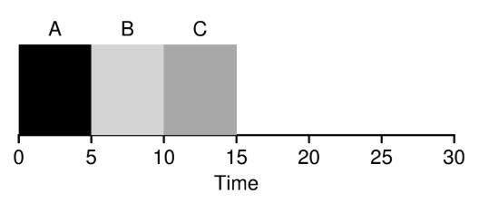
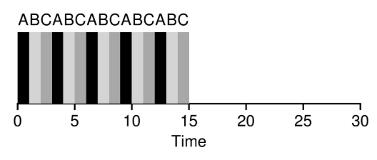
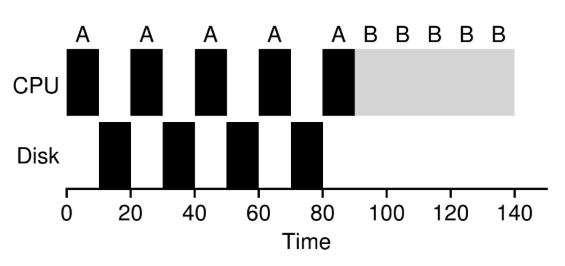
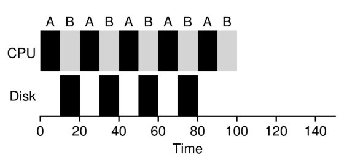

# Planificación: Introducción

## Suposiciones Sobre la Carga de Trabajo

Primero plantearemos algunas suposiciones simplificadoras sobre los procesos que se ejecutan en el sistema, a veces denominados colectivamente como la **Carga de Trabajo**. La carga de trabajo es una parte fundamental de la creación de politicas.

Las suposiciones de la carga de trabajo que plantearemos son poco realistas, a medida que avancemos las iremos olvidando.

Haremos las siguientes suposiciones sobre los procesos, a veces llamados **Trabajos**:

1) Cada trabajo se ejecuta durante la misma cantidad de tiempo.

2) Todos los trabajos llegan al mismo tiempo.

3) Una vez iniciado, cada trabajo se ejecuta hasta su finalización.

4) Todos los trabajos usan solo la CPU (o sea, no realizan I/O).

5) Se conode el tiempo de ejecución de cada trabajo.

---

## Métricas de Planificación

Ademas de las suposiciones sobre la carga de trabajo, también nos hace falta algo que nos permita comparar diferentes poíticas de planifiación: una **Métrica de Planificación**. Una métrica es algo que usamos para medir algo.

Por ahora vamos a tener simplemtente una única métrica: el **Tiempo de Entrega**. El tiempo de entrega de un trabajo se define como el momento en que se completa el trabajo menos el momento en que el trabajo llegó al sistema.

$$T_{entrega} = T_{finalización} - T_{llegada}$$

Como asumimos que todos los trabajos llegan al mismo tiempo, entonces por el momento diremos que $T_{llegada} = 0$ y por lo tanto $T_{entrega} = T_{finalización}$.

El tiempo de entrega es una métrica de **rendimiento**. Otra métrica de interés puede ser la **Justicia**, medida por el **Índice de justicia de Jain**. El rendimiento y la justicia suelen estar en desacuerdo en la planificación; un planificador puede optimizar rendimientos, pero a costa de evitar que se ejecuten algunos trabajos, reduciendo así la justicia.

---

## Primero En Entrar, Primero En Salir (FIFO: First In, First Out)

FIFO tiene varias propiedades positivas: es claramente simple y fácil de implementar (dadas nuestras suposiciones funciona bien).

Ejemplo: Llegan tres trabajos al sistema, A, B y C, aproximadamente al mismo tiempo ($T_{llegada} = 0$). Como FIFO tiene que poner algún trabajo primero, supongamos que A llegó justo antes que B, que a su vez llegó un momento antes que C. Cada trabajo se ejecuta durante 10 segundos. ¿Cuál será el **Tiempo medio de entrega** de estos trabajos?.

Figure 7.1: **Ejemplo Simple de FIFO**

Se puede ver que A terminó en 10, B en 20 y C en 30. El tiempo medio de entrega para los tres trabajos es $\frac{10+20+30}{3} = 20$.

Ahora olvidemos una de las suposiciones. Olvidemos el supuesto 1 (cada trabajo se ejecuta durante la misma cantidad de tiempo), por lo que dejamos de suponer que todos los trabajos se ejecutan durante la misma cantidad de tiempo.

Hagamos un ejemplo para mostrar cómo los trabajos de diferentes longitudes pueden generar problemas en la planifiación FIFO. Supongamos de nuevo tres trabajos (A, B y C), pero esta vez A se ejecuta durante 100 segundos mientras que B y C se ejecutan durante 10 cada uno.

Figure 7.2: **Por Qué FIFO No Es Tan Genial**

El trabajo A corre primero durante 100 segundos completos antes de que B o C tengan la oportunidad de ejecutarse. El tiempo medio de entrega del sistema es alto: 110 segundos ($\frac{100+110+120}{3} = 110$).

Este problema se conoce como el **efecto de convoy**, en el que una serie de consumidores potenciales de algún recurso, relativamente cortos, se ponen en cola detrás de un consumidor de gran peso.

---

## Trabajo Más Corto Primero (SJF)

Hay un enfoque muy simple que resuelve este problema; Esta nueva disciplina de planificación se conoce como la del **Trabajo Más Corto Primero** (**SJF**, Shortest Job First), primero ejecuta el trabajo más corto, luego el siguiente, y así sucesivamente.

Tomamos el ejemplo anterior, pero con SJF como nuestra política de planificación.

Figure 7.3: **Ejemplo Simple de SJF**

El diagrama debería aclarar por qué SJF tiene un rendimiento mucho mejor con respecto al tiempo medio de entrega. simplemente ejecutando B y C antes de que A, SJF reduce el tiempo medio de entrega de 110 a 50 ($\frac{10+20+120}{3} = 50$).

Dada nuestra suposición de que todos los trabajos llegan al mismo tiempo, podríamos demostrar que SJF es un algoritmo de planificación **Óptimo**.

Con SJF llegamos a un buen enfoque para la planificación, pero nuestra suposiciones siguen siendo poco realistas. Olvidemos otra más. En particular el supuesto 2 (Todos los trabajos llegan al mismo tiempo) y ahora asumimos que los trabajos pueden llegar en cualquier momento.

Ilustramos el problema con un ejemplo. Supongamos que A llega en $t = 0$ y necesita ejecutarse durante 100 segundos, mientras que B y C llegan en $t = 10$ y cada uno necesita ejecutarse durante 10 segundos. Con SJF, obtenemos la siguiente planificación:

Figure 7.4: **SJF Con Llegadas Tardías de B y C**

Aunque B y C llegaron poco después de A, todavía se ven obligados a esperar hasta que A se haya completado y sufren del mismo problema de convoy. El tiempo medio de entrega para estos tres trabajos es de 103,33 segundos $\frac{100+(100-10)+(120-10)}{3}$.

---

## Trabajo de Menor Tiempo Restante Primero (STCF)

Para abordar este aspecto, debemos olvidar el supuesto 3 (Una vez iniciado, cada trabajo se ejecuta hasta su finalización). también necesitamos algo de maquinaria dentro del propio planificador. Hay algo más que el planificador puede hacer cuando llegan B y C: puede **Detener** el trabajo A y decidir ejecutar otro trabajo en su lugar, quizás continuando A más tarde. SJF es un planificador **No Apropiativo** y sufre los problemas ya mencionados.

Hay un planificador que hace exactamente eso: agrega apropiación a SJF, conocido como el planificador del **Trabajo de Menor Tiempo Restante Primero** (**STCF**, Shortest Timeto-Completion First). Cada vez que un nuevo trabajo ingresa al sistema, el planificador STCF determina a cuál de los trabajos restantes (incluyendo el nuevo trabajo) le queda el menor tiempo hasta finalizar, y lo elige para ser ejecutado. En nuestro ejemplo, STCF habría detenido a A y ejecutado a B y a C hasta su finalización; y recién cuando hayan terminado, habría elegido ejecutar lo que quede de A.

Figure 7.5: **Ejemplo Simple de STCF**

El resultado es un tiempo medio de entrega mucho mejor: 50 segundos ($\frac{(120-0)+(20-10)+(30-10)}{3}$). Dadas nuestras nuevas suposiciones, STCF es demostrable Óptimo.

---

## Una Nueva Métrica: El Tiempo de Respuesta

STCF sería una excelente política de planificación si supieramos la duración de cada trabajo, y si los trabajos usaran solamente la CPU, y además nuestra única métrica fuera el tiempo de entrega. 

Definimos el tiempo de respuesta como el tiempo desde que el trabajo llega a un sistema hasta la primera vez que es elegido para ser ejecutado.

$$T_{respuesta} = T_{1ra-ejecución} - T_{llegada}$$

Si tuvieramos el programa de la figura 7.5 (con A llegando en el tiempo 0, y B y C en el tiempo 10), el tiempo de respuesta de cada trabajo sería: 0 para el trabajo A, 0 para B y 10 para C (media: 3,33).

STCF y las disciplinas relacionads no son particularmente buenas con el tiempo de respuesta. Si tres trabajos llegan al mismo tiempo, por ejemplo, el tercer trabajo tiene que esperar a que los dos trabajos anteriores se ejecuten en su totalidad antes de ser elegidos por primera vez. Si bine es excelente para el tiempo de entrega, este acercamiento es bastante malo para el tiempo de respuesta y para la interactividad.

---

## Round Robin

¿Cómo podemos construir un planificador que sea sencible al tiempo de respuesta? Para resolver este problema, prensetamos un nuevo algoritmo de planificación, denominado como planificación **Round Robin** (**RR**). La idea básica es simple: en lugar de ejecutar trabajos hasta su finalización, RR ejecuta cada trabajo durante un **segmento de tiempo** (**Quantum de planificación**) y luego cambia al siguiente trabajo en la cola de ejecución. RR se denomina a veces como **División de tiempo**. Notar que la duración de un segmento de tiempo debe ser un múltiplo del período de interrupción del temporizador; si el temporizador se interrumpe cada 10 ms, el segmento de tiempo podría ser de 10, 20 o cualquier múltiplo de 10ms.

Ejemplo: Supongamos que tres trabajos, A, B y C llegan al mismo tiempo al sistema y que cada trabajo desea ejecutarse durante 5 segundos. SJF ejecuta cada trabajo hasta su finalización antes de ejecutar otro.

Figure 7.6: **SJF de Nuevo (malo para el tiempo de respuesta)**

Por lo contrario, RR con un segmento de tiempo de 1 segundo recorrería los trabajos rapidamente

Figure 7.7: **Round Robin (bueno para el tiempo de respuesta)**

El tiempo promedio de respuesta de RR es de $\frac{0+1+2}{3} = 1$; para el SJF, el tiempo medio de respuesta es de $\frac{0+5+10}{3} = 5$.

La duración del segmento de tiempo es fundamental en RR. Cuanto más corto sea, mejor será el rendimiento de RR según la métrica del tiempo de respuesta. Si el segmento de tiempo es demasiado corto puede resultar problemático: el costo de cambio de contexto dominaría el rendimiento general.

El costo del cambio de contexto no surge únicamente de las acciones del SO de guardar y restaurar registros. Cuando los programas se ejecutan, acumulan una gran cantidad de estado en cachés de CPT, TLB, predictores de salto y otro hardware en chip. Cambiar a otro trabajo hace que este estado se vacíe y se introduzca un nuevo estado relevante para el trabajo que se esté ejecutando en el momento.

RR, con un segmento de tiempo razonable es un planificador excelente si el tiempo de respuesta es nuestra única métrica. ¿Qué pasa con el tiempo de entrega? Veamos con nuestro ejemplo anterior. A, B y C, cada uno con tiempo de ejecución de 5 segundos, llegan al mismo tiempo, y el planificador es de tipo RR con un (largo) segmento de tiempo de 1 segundo. Vemos en la Figure 7.7 que A termina en 13, B en 14 y C en 15, para una media de 14 (horrible xd).

RR es una de las peores políticas si nuestra métrica es el tiempo de entrega. Lo que hace RR es estirar cada trabajo tanto como pueda, ejecutando cada trabajo por muy poco tiempo antes de pasar al siguiente.

Cualquier política que sea **Justa** (como RR), que divida uniformemente la CPU entre los procesos activos en una escala de tiempo pequeña, tendrá un desempeño deficiente en métrica como el tiempo de entrega.

---

## Incorporando I/O

Primero olvidemos el supuesto 4 [Todos los trabajos usan solo la CPU (o sea, no realizan I/O)]: Todos lo programas realizan I/O.

Claramente el planificador tiene que tomar una decisión cuando algún trabajo inicia una solicitud de I/O, pues el trabajo que se está ejecutando deja de usar la CPU durante la I/O, y se queda **Bloqueado** esperando su finalización. Si la I/O se envía a una unidad de disco dura, es posible que el proceso se bloquee durante unos milisegundos o más, dependiendo de la carga de I/O de la unidad en ese momento. Quizás sea mejor que el planificador aproveche este tiempo para ejecutar otro trabajo en la CPU.

El planificador también debe tomar una decisión cuando se termina la I/O, moviendo esto ocurre, se genera una interrupción y se ejecuta el SO, moviendo el proceso que emitió la I/O del estado bloqueado al estado listo. Podría incluso decidir seguir ejecutando el mismo trabajo en ese momento.

Supongamos que tenemos dos trabajos, A y B, que necesitan cada uno 50 ms de tiempo de CPU.

Hay una diferencia obvia: A se ejecuta durante 10ms y luego emite una solicitud de I/O (supongamos que las I/O tardan 10 ms cada una), mientras que B simplemente usa la CPU durante 50 ms y no realiza ninguna I/O. El planificador ejecuta primero A, y después a B.

Un enfoque común es tratar ccada subtrabajo de 10 ms de A como un trabajo independiente. Cuando el sistema se inicia, su elección está entre ejecutar un A de 10 ms o un B de 50 ms. Con STCF, la elección es clara: elegir el mas corto. Después, cuando el primer subtrabajo de A se haya completado, solo queda B y comienza su ejecución. Luego se envía un nuevo subtrabajo de A, que se adelante a B y se ejecuta durante 10 ms. De esta manera se permite la **Superposición**, con la CPU siendo utilizada por un proceso mientras espera que se complete la I/O de otro proceso.

---

## No Más Oráculo

Llegamos a la última suposición: que el planificador conoce la duración de cada trabajo. Esta es la peor suposición. En un SO de propósito general, el SO generalmente sabe muy poco sobre la duración de cada trabajo.