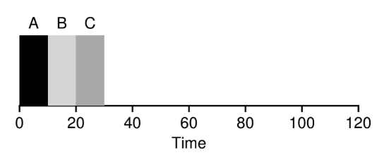
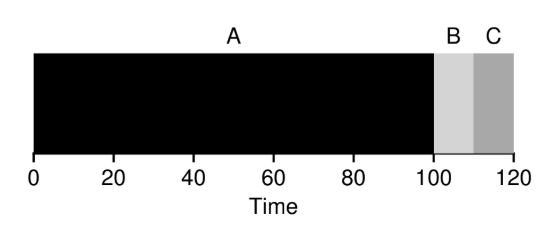
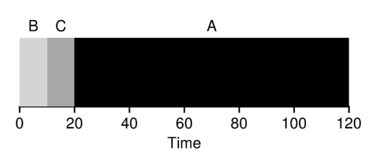
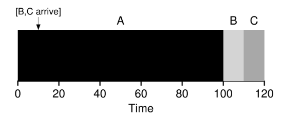
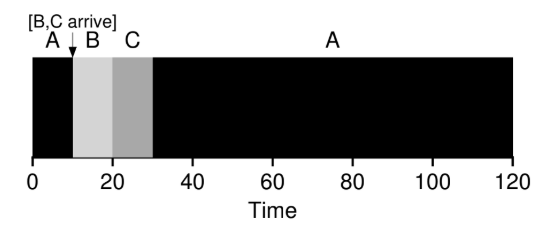

# Planificación: Introducción

## Suposiciones Sobre la Carga de Trabajo

Primero plantearemos algunas suposiciones simplificadoras sobre los procesos que se ejecutan en el sistema, a veces denominados colectivamente como la **Carga de Trabajo**. La carga de trabajo es una parte fundamental de la creación de politicas.

Las suposiciones de la carga de trabajo que plantearemos son poco realistas, a medida que avancemos las iremos olvidando.

Haremos las siguientes suposiciones sobre los procesos, a veces llamados **Trabajos**:

1) Cada trabajo se ejecuta durante la misma cantidad de tiempo.

2) Todos los trabajos llegan al mismo tiempo.

3) Una vez iniciado, cada trabajo se ejecuta hasta su finalización.

4) Todos los trabajos usan solo la CPU (o sea, no realizan I/O).

5) Se conode el tiempo de ejecución de cada trabajo.

---

## Métricas de Planificación

Ademas de las suposiciones sobre la carga de trabajo, también nos hace falta algo que nos permita comparar diferentes poíticas de planifiación: una **Métrica de Planificación**. Una métrica es algo que usamos para medir algo.

Por ahora vamos a tener simplemtente una única métrica: el **Tiempo de Entrega**. El tiempo de entrega de un trabajo se define como el momento en que se completa el trabajo menos el momento en que el trabajo llegó al sistema.

$$T_{entrega} = T_{finalización} - T_{llegada}$$

Como asumimos que todos los trabajos llegan al mismo tiempo, entonces por el momento diremos que $T_{llegada} = 0$ y por lo tanto $T_{entrega} = T_{finalización}$.

El tiempo de entrega es una métrica de **rendimiento**. Otra métrica de interés puede ser la **Justicia**, medida por el **Índice de justicia de Jain**. El rendimiento y la justicia suelen estar en desacuerdo en la planificación; un planificador puede optimizar rendimientos, pero a costa de evitar que se ejecuten algunos trabajos, reduciendo así la justicia.

---

## Primero En Entrar, Primero En Salir (FIFO: First In, First Out)

FIFO tiene varias propiedades positivas: es claramente simple y fácil de implementar (dadas nuestras suposiciones funciona bien).

Ejemplo: Llegan tres trabajos al sistema, A, B y C, aproximadamente al mismo tiempo ($T_{llegada} = 0$). Como FIFO tiene que poner algún trabajo primero, supongamos que A llegó justo antes que B, que a su vez llegó un momento antes que C. Cada trabajo se ejecuta durante 10 segundos. ¿Cuál será el **Tiempo medio de entrega** de estos trabajos?.

Figure 7.1: **Ejemplo Simple de FIFO**

Se puede ver que A terminó en 10, B en 20 y C en 30. El tiempo medio de entrega para los tres trabajos es $\frac{10+20+30}{3} = 20$.

Ahora olvidemos una de las suposiciones. Olvidemos el supuesto 1 (cada trabajo se ejecuta durante la misma cantidad de tiempo), por lo que dejamos de suponer que todos los trabajos se ejecutan durante la misma cantidad de tiempo.

Hagamos un ejemplo para mostrar cómo los trabajos de diferentes longitudes pueden generar problemas en la planifiación FIFO. Supongamos de nuevo tres trabajos (A, B y C), pero esta vez A se ejecuta durante 100 segundos mientras que B y C se ejecutan durante 10 cada uno.

Figure 7.2: **Por Qué FIFO No Es Tan Genial**

El trabajo A corre primero durante 100 segundos completos antes de que B o C tengan la oportunidad de ejecutarse. El tiempo medio de entrega del sistema es alto: 110 segundos ($\frac{100+110+120}{3} = 110$).

Este problema se conoce como el **efecto de convoy**, en el que una serie de consumidores potenciales de algún recurso, relativamente cortos, se ponen en cola detrás de un consumidor de gran peso.

---

## Trabajo Más Corto Primero (SJF)

Hay un enfoque muy simple que resuelve este problema; Esta nueva disciplina de planificación se conoce como la del **Trabajo Más Corto Primero** (**SJF**, Shortest Job First), primero ejecuta el trabajo más corto, luego el siguiente, y así sucesivamente.

Tomamos el ejemplo anterior, pero con SJF como nuestra política de planificación.

Figure 7.3: **Ejemplo Simple de SJF**

El diagrama debería aclarar por qué SJF tiene un rendimiento mucho mejor con respecto al tiempo medio de entrega. simplemente ejecutando B y C antes de que A, SJF reduce el tiempo medio de entrega de 110 a 50 ($\frac{10+20+120}{3} = 50$).

Dada nuestra suposición de que todos los trabajos llegan al mismo tiempo, podríamos demostrar que SJF es un algoritmo de planificación **Óptimo**.

Con SJF llegamos a un buen enfoque para la planificación, pero nuestra suposiciones siguen siendo poco realistas. Olvidemos otra más. En particular el supuesto 2 (Todos los trabajos llegan al mismo tiempo) y ahora asumimos que los trabajos pueden llegar en cualquier momento.

Ilustramos el problema con un ejemplo. Supongamos que A llega en $t = 0$ y necesita ejecutarse durante 100 segundos, mientras que B y C llegan en $t = 10$ y cada uno necesita ejecutarse durante 10 segundos. Con SJF, obtenemos la siguiente planificación:

Figure 7.4: **SJF Con Llegadas Tardías de B y C**

Aunque B y C llegaron poco después de A, todavía se ven obligados a esperar hasta que A se haya completado y sufren del mismo problema de convoy. El tiempo medio de entrega para estos tres trabajos es de 103,33 segundos $\frac{100+(100-10)+(120-10)}{3}$.

---

## Trabajo de Menor Tiempo Restante Primero (STCF)

Para abordar este aspecto, debemos olvidar el supuesto 3 (Una vez iniciado, cada trabajo se ejecuta hasta su finalización). también necesitamos algo de maquinaria dentro del propio planificador. Hay algo más que el planificador puede hacer cuando llegan B y C: puede **Detener** el trabajo A y decidir ejecutar otro trabajo en su lugar, quizás continuando A más tarde. SJF es un planificador **No Apropiativo** y sufre los problemas ya mencionados.

Hay un planificador que hace exactamente eso: agrega apropiación a SJF, conocido como el planificador del **Trabajo de Menor Tiempo Restante Primero** (**STCF**, Shortest Timeto-Completion First). Cada vez que un nuevo trabajo ingresa al sistema, el planificador STCF determina a cuál de los trabajos restantes (incluyendo el nuevo trabajo) le queda el menor tiempo hasta finalizar, y lo elige para ser ejecutado. En nuestro ejemplo, STCF habría detenido a A y ejecutado a B y a C hasta su finalización; y recién cuando hayan terminado, habría elegido ejecutar lo que quede de A.

Figure 7.5: **Ejemplo Simple de STCF**

El resultado es un tiempo medio de entrega mucho mejor: 50 segundos ($\frac{(120-0)+(20-10)+(30-10)}{3}$). Dadas nuestras nuevas suposiciones, STCF es demostrable Óptimo.

---

## Una Nueva Métrica: El Tiempo de Respuesta

