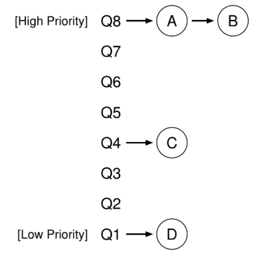
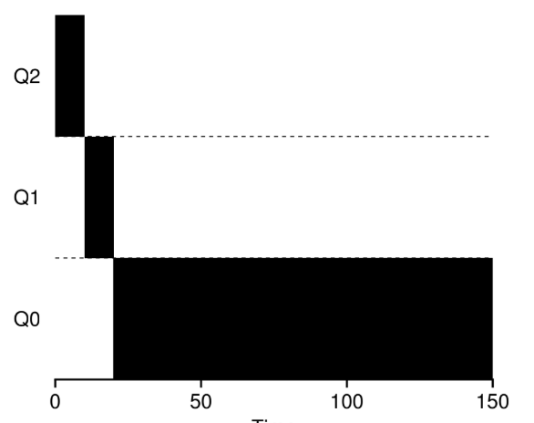
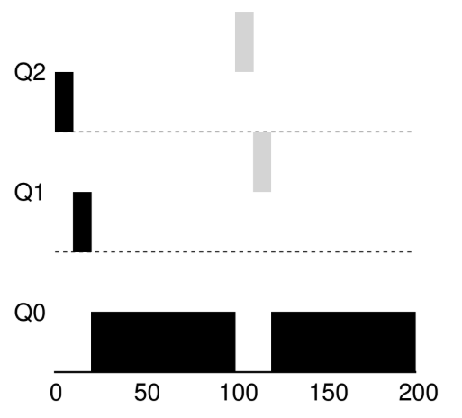
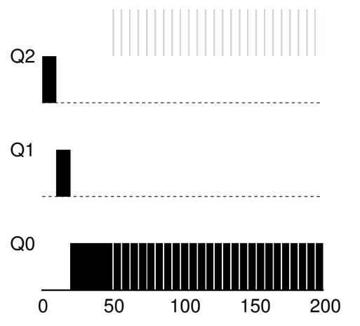

# Planificación: La Cola Multinivel Retroalimentada

**Cola Multinivel Retroalimentada** (**MLFQ**, Multi-Level Feedback Queue).

El problema fundamental que la MLFQ intenta abordar tiene dos partes.

1. Busca optimizar el tiempo de entrega, se realiza ejecutando los trabajos más cortos primero; el SO generalmente no sabe por cuánto tiempo se ejecutará un trabajo, que es exactamente el conocimiento que requieren los algoritmos SJF (o STCF).

2. MLFQ quiere haceer que el sistema se sienta receptivo a los usuarios interactivos (osea los usuarios que se sientan y miran la pantalla, esperando a que finalice un proceso), y así minimizar el tiempo de respuesta; algoritmos como RR reducen el tiempo de respuesta, pero son terribles para el tiempo de entrega.

---

## MLFQ: Reglas básicas

La MLFQ tiene varias **colas** distintas, a cada una de las cuales se le asigna un **nivel de prioridad** diferente. En un momento dado, cada trabajo que está listo para ejecutarse se encuentra en una sola cola. MLFQ usa las prioridades para decidir qué trabajo debe ejecutarse en un momento determinado: se elige para ser ejecutado un trabajo con una mayor prioridad (osea un trabajo en una cola más alta).

Puede haber más de un trabajo en una cola determinada y tener la misma prioridad. En este caso, simplemente usaremos planifiación RR entre estos trabajos.

Llegamos a las dos primeras reglas básicas para MLFQ:

* **Regla 1**: Si Prioridad(A) > Prioridad(B), se ejecuta A (B no).

* **Regla 2**: Si Prioridad(A) = Prioridad(B), se ejecuta A y B en RR.

La clave para la planificación MLFQ radica en cómo el planificador establece las prioridades. En lugar de dar una prioridad fija a cada trabajo, MLFQ varía la prioridad de un trabajo en función de su *comportamiento observado*. Si un trabajo trabajo usa la CPU de manera intensiva durante largo período de tiempo, MLFQ reducirá su prioridad. MLFQ intentará aprender sobre los procesos a medida de que se ejecutan y utilizará el historial del trabajo para predecir su comportamiento *futuro*.

Figure 8.1: **Ejemplo de MLFQ**

Dos trabajos (A y B) están en el nivel de prioridad más alto, mientras que el trabajo C está en el medio y el trabajo D tiene la prioridad más baja. Hasta lo que sabemos de MLFQ, el planificador simplemente alternaría segmentos de tiempos entre A y B porque son los trabajos de mayor prioridad en el sistema; C y D ni siquiera llegarían a funcionar.

---

## Primer Intento: Cómo Cambiar la Prioridad

Debemos decidir cómo MLFQ va a cambiar el nivel de prioridad de un trabajo (y en qué cola se encuentra) durante su vida útil. Debemos tener en cuentra nuestra carga de trabajo: una cambinación de trabajos interactivos que son de ejecución corta (y con que frecuencia pueden ceder la CPU) y algunos trabajos "CPU-bound" de ejecución más larga que necesitan de la CPU por mucho tiempo, pero donde el tiempo de respuesta no es importante.

* **Regla 3**: Cuando un trabajo ingresa al sistema, se coloca en la prioridad más alta (la cola de más arriba).

* **Regla 4a**: Si un consume un segmento de tiempo completo mientras se ejecuta, su prioridad se reduce (osea se mueve una cola más abajo).

* **Regla 4b**: Si un trabajo cede la CPU antes de que finalice el segmento de tiempo, permanece en el *mismo* nivel de prioridad.

##### Ejemplo 1: Un solo trabajo de larga duración

Primero, veremos qué sucede cuando ha habido un trabajo de larga duración en el sistema.

Figure 8.2: **Trabajo de larga duración a lo largo del tiempo**

El trabajo ingresa con la prioridad más alta (Q2). Después de un solo segmento de tiempo de 10 ms, el planificador recude la prioridad del trabajo en uno, el trabajo está en Q1. Después de ejecutarse en Q1 durante un segmento de tiempo, el trabajo finalmente se rebaja a la prioridad más baja del sistema (Q0), donde permanece.

##### Ejemplo 2: Y entonces vino un trabajo corto

Hay dos trabajos: A, que es un trabajo intensivo de CPU de ejecución prolongada, y B, que es un trabajo interactivo de ejecución corta. Supongamos que A viene funcionando durante un tiempo y entonces llega B.

Figure 8.3: **Y entonces vino un trabajo interactivo**

A (mostrado en negro) está corriendo en la cola de menor prioridad (al igual que cualquier trabajo intesivo de CPU de larga ejecución); B (mostrado en gris) llega en el momento $T = 100$ y se inserta en la cola más alta; como su tiempo de ejecución es corto (solo 20 ms), B termina antes de llegar a la cola inferior, en dos segmentos de tiempo; A reanuda su ejecución (con una prioridad baja).

Debido a que no sabe si un trabajo será un trabajo corto o un trabajo de larga duración, primero asume que podría ser u trabajo corto, dando así al trabajo una prioridad alta. Si en realidad es un trabajo corto, se ejecutará rápidamente y se completará; si no es un trabajo corto, se desplazará lentamente por las colas y pŕonto demostrará ser un proceso de larga duración más del tipo por lotes. De esta manera, MLFQ se aproxima a SJF.

##### Ejemplo 3: ¿Qué pasa con la I/O?

Según lo establecido por la regla 4b, si un proceso abandona el procesador antes de usar su segmento de tiempo, lo mantenemos en el mismo nivel de prioridad. La intención de esta regla: si un trabajo interactivo, por ejemplo, está haciendo una gran cantidad de I/O, abandonará la CPU antes de que se complete su segmento de tiempo; en tal caso, no queremos penalizar el trabajo y simplemente lo mantenemos en el mismo nivel.

Figure 8.4: **Una carga de trabajo mixta con uso intesivo de I/O y de CPU**

Un trabajo interactivo B (mostrado en gris) que necesita la CPU solo durante 1 ms entes de realizar una I/O que compite por la CPU con un trabajo por lotes de larga duración A (mostrado en negro). El enfoque de MLFQ mantiene a B en la prioridad más alta pues B sigue liberando la CPU; si B es un trabajo interactivo, MLFQ logram aún más su objetivo de ejecutar trabajos interactivos rápidamente.

##### Problemas con nuestra MLFQ actual

