# Virtualización de la CPU

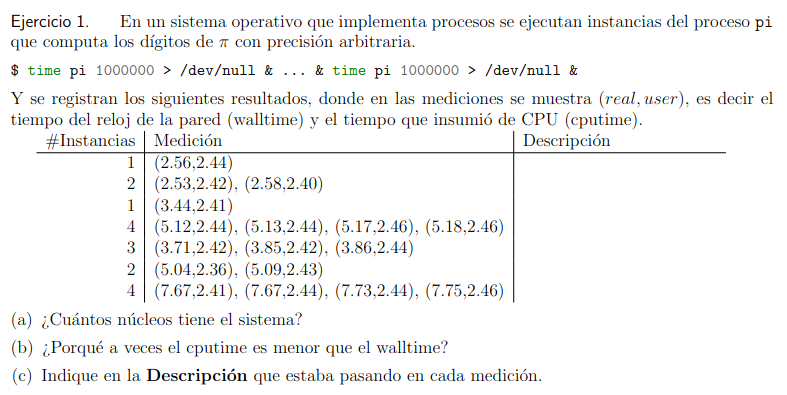

**Línea 1**: Es un proceso que está corriendo en una sola CPU. Fijate que Walltime > CPUTime porque hay pérdida de tiempo en cambios de contexto y de cómputo dentro del kernel.

**Línea 2**: Son dos procesos corriendo cada uno en su core o CPU y esto muestra que al menos hay dos cores (núcleos). Notar que lanzar 2 procesos tarda lo mismo que uno solo, luego, hay DOS unidades de cómputo.

**Línea 3**: Es un Proceso que está corriendo en una sola CPU. Walltime > CPUTime probablemente por procesos previamente activos, los cuales hacen que el walltime sea mayor que en la línea 1, pero no así el CPUTime.

**Línea 4**: En un mismo CPU se corren 4 procesos (simultáneamente) que tardan lo mismo (2 cores). Esto refuerza la hipótesis de la línea 2, que tenemos dos núcleos.

**Línea 5**: Se corren 3 procesos. Se distribuye la carga de los 3 procesos entre los 2 núcleos para que ningún núcleo quede inactivo (*fairness*). Se busca que todos los procesos terminen a la vez.

**Línea 6**: Se puede asumir que en cada core corre un proceso pi que compite con otros procesos que alargan el walltime.

**Línea 7**: Asumimos que empiezan a trabajar un proceso en cada núcleo, todos ellos compiten con otros procesos y tarda más en terminar lo cual genera que (por ejemplo) el último tarde 7.75. Procesos previos agregan carga de procesado y por lo tanto aumentan el walltime.

Por lo tanto, el sistema tiene 2 núcleos.

---

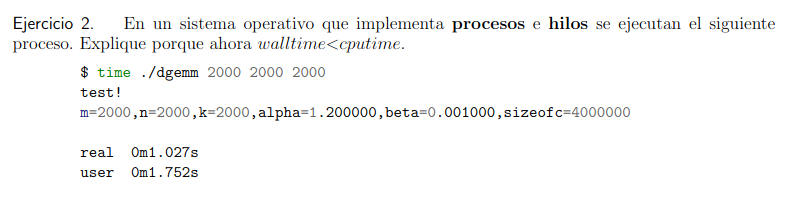

El cputime > walltime ya que tenemos muchos hilos dentro del proceso, cada hilo ejecuta en un núcleo distinto. Por lo que el SO acumula todos los tiempos de CPU y los suma.

Recordar que el walltime es el tiempo total transcurrido desde que se inicia hasta que termina el proceso, incluyendo la espera por otros procesos en la CPU, y el cputime es el tiempo total que los núcleos de la CPU han pasado ejecutando instrucciones del programa.

---

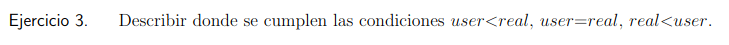

* **user < real**: Por la demora de la trap y del inverso al trap (volver al usuario) añadida al tiempo de usuario porque el SO antes de la ejecución del programa hace de resource manager, ya en las syscalls gastas algo.

* **user = real**: En procesos de un solo hilo sin system calls (con ínfima cantidad de syscalls).

* **real < user**: Por proceso multihilos, cada hilo ejecuta en un core distinto por lo tanto se suman todos para dar con el tiempo usuario.

---

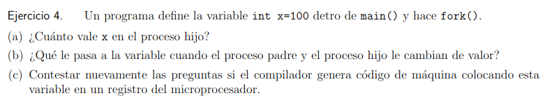

**(a)** Como en `fork` se hace una copia del programa original, incluyendo el estado, entonces el valor de `x` en el hijo sera 100.

**(b)** Una vez llamado `fork` sus estados se vuelven "independientes" por lo que no depende de si el que la cambia es padre o hijo.

**(c)** Sigue todo igual ya que tanto como el padre como el hijo se respaldan los registros al hacer trap y return from trap.

---

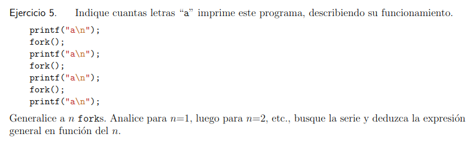

1. Inicio:
    * Hay un proceso (Digamosle P0).
    * Este proceso ejecuta `printf("a\n")`, lo que imprime un `a`.

2. Despues del primer `fork()`:
    * `fork()` crea un nuevo proceso. Ahora hay 2 procesos en total: P0 y P1.
    * Ambos procesos (P0 y P1) ejecutan `printf("a\n")`, lo que imprime `a` 2 veces (una vez en cada proceso).

3. De momento tenemos:
    * `a` se ha impreso 1 (Inicio) + 2 (Despues del primer `fork()`) = 3 veces.

4. Despues del segundo `fork()`:
    * Cada uno de los dos procesos (P0 y P1) crea un nuevo proceso. Ahora hay cuatro procesos en total: P0, P1, P2 y P3.
    * Cada uno de los cuatro procesos ejecuta `printf("a\n")`, lo que imprime `a` 4 veces (una vez por cada proceso).

5. De momento:
    * `a` se ha impreso 3 (previo) + 4 (despues del segundo `fork()`) = 7 veces.

6. Despues del tercer `fork()`:
    * Cada uno de los cuatro procesos (P0, P1, P2 y P3) crea un nuevo proceso. Ahora hay ocho procesos en total: P0, P1, P2, P3, P4, P5, P6 y P7.
    * Cada uno de los ochos procesos ejecuta `printf("a\n")`, lo que imprime `a` 8 veces (una vez por cada proceso de vuelta xd).

7. De momento:
    * `a` se ha impreso 7 (previo) + 8 (despues del tercer `fork()`) = 15 veces.

---

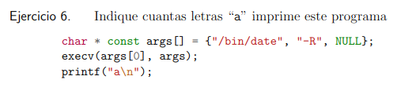

Ninguna, ya que el `execv()` de funcionar correctamente, (toda syscall tiene posibilidad de fallar) no returnea a esta función, evitando que la linea del `printf` se ejecute.

No debería imprimir ninguna `a` (si es que no falla el comando), ya que el comando `execv(args[0], args)` reemplaza el programa del proceso actual por el del programa que ejecuta como argumento en `args[0]`. Si falla, imprime 1 `a`.

---

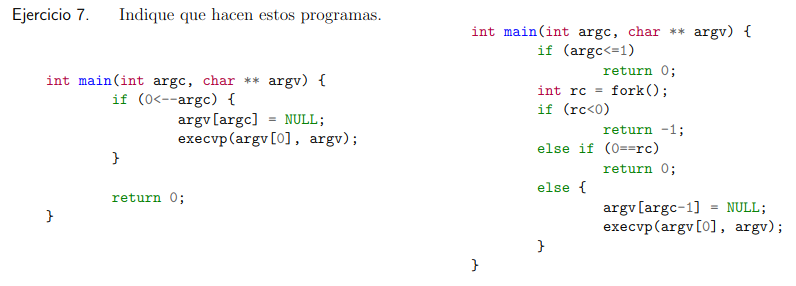

1. En el primer programa vemos que toma dos argumentos: Un `int argc` y un arreglo de punteros que apuntan a cadenas `argv`. Primero aparece una guarda que verifica si el entero `argc` es mayor que cero luego de ser decrementado en 1 (osea, verifica que haya argumentos xd). En caso de ser negativo el programa no hace nada. En caso de ser positivo, la posición indicada por `argc` se establece en NULL (Para asegurar que la lista de argumenos termine correctamente) y se llama a `execvp()` con `argv[0]` como primer parametro y `argv` como segundo parametro lo que reemplaza el proceso actual con el comando especificado. Si `execvp` tiene exito, el programa original nunca sigue ejecutandose, si falla el programa termina. Basicamente el programa toma el tamaño de un arreglo y el arreglo en si, el cual contiene punteros a cadenas que indican el nombre del programa y luego sus argumentos, esto se deduce al ver la llamada `execvp()` quien como argumentos pide el nombre del programa para buscarlo en los directorios y ademas un arreglo que contenga nombre, sus argumentos y un puntero a NULL en su última posición.

2. El segundo programa vemos una guarda que verifica que `argc <= 1` (si no ha suficientes argumentos termina el programa). Llama a `fork()` para crear un proceso hijo, si el `fork()` falla (`rc < 0`) retorna `-1`. Si `fork()` tiene exito entonces en el proceso hijo (cuando `rc == 0`) simplemente retorna 0 y termina. En el proceso padre (`rc > 0`) ejecuta `execvp()` con el camando y sus argumentos. Hace exatamente lo mismo que el primer programa, pero este crea un proceso hijo que no hace nada y un proceso padre que ejecuta el comando xd.

---

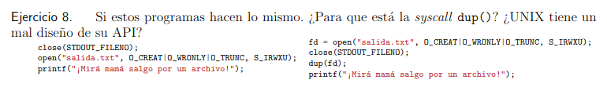

1. Primero cierra la salida estandar (`SRDOUT_FILENO`) con `close()`, luego abre el archivo `salida.txt` (con `open()`) en el filedescriptor 1, porque es el que más arriba esá libre. Por ultimo `printf()` imprime "¡Mirá mamá salgo por un archivo!" en el file descriptor 1 (siempre segun la man page).

2. Primero abre el archivo `salida.txt` con `open()`, luego cierra la salida estandar (`STDOUT_FILENO`) con `close()`, duplica el file descriptor fd (el que abrio el archivo `salida.txt`) en el primer file descriptor libre con `dup()` y por ultimo `printf()` imprime en `salida.txt` "¡Mirá mamá salgo por un archivo!".

---

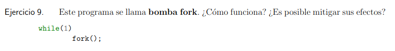

Se ejecuta un bucle infinito y en cada iteración llama a `fork()`, `fork()` crea un proceso idéntico al proceso padre. Tanto el proceso padre como el nuevo proceso continúan ejecutando el bucle, creando aún más procesos en cada iteración, lo que provoca un cremiento exponencial del número de procesos hasta que el sistema agota su capacidad de crear nuevos procesos, lo que puede llevar a la congelación o intestabilidad del sistema.

---

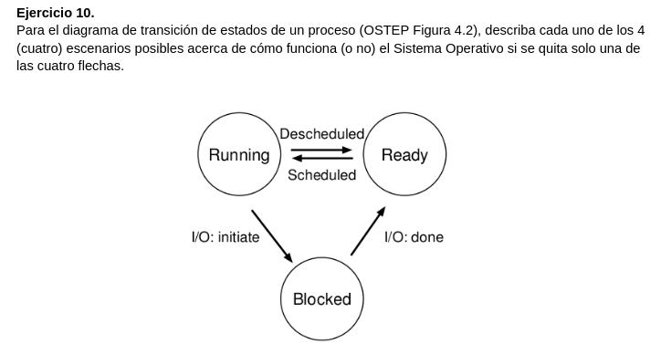

* **Running a Blocked**: Sin bloqueo por I/O, los procesos podrían esperar eventos I/O, lo que causaría ciclos de CPU desperdiciados.

* **Blocked a Ready**: Sin retorno a Ready despues de I/O, los procesos bloqueados nunca podrían reanudar su ejecución, quedando atascados.

* **Running a Ready**: Sin capacidad de interrumpir o pausar temporalmente un proceso o hilo, los procesos nunca serían interrumpidos, monopolizando la CPU.

* **Ready a Running**: Sin planificación de procesos, los procesos nunca ejecutarían, y el sistema se paralizaría.

---

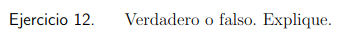

* **(a)** Es posible que $user + sys = real$.

**Verdadero**, ya que si, por ejemplo, tenes 10k de procesos con 1 nucleo, entre que se reparten la CPU y avanza el proceso; el tiempo real sigue avanzando mientras que $user + sys$ avanza muy poco.

* **(b)** dos procesos no pueden usar la misma dirección de memoria virtual.

**Falso**. Ambos pueden usar la misma dirección de memoria virtual, pero que es mapeada a distintas ubicaciones en la memoria física (los proceso no se dan cuenta).

* **(c)** Para guardar el estado del proceso es necesario salvar el valor de todos los registros del microprocesador.

**Verdadero**, (y mas) también multiplexo en espacio la ram, stack/heap.

* **(d)** Un proceso puede ejecutar cualquier instrucción de la ISA.

**Falso**. Instrucciones privilegiadas (del kernel) no puede ser ejecutadas desde el user spaces (modo usuario).

* **(e)** Puede haber traps por timer sin que esto implique cambiar de contexto.

**Verdadero**. En general hay millones de interrupts por timer pero se puede mantener el proceso (cuando hay uno por ejemplo).

* **(f)** `fork()` devuelve 0 para el hijo, porque ningun proceso tiene PID 0.

**Verdadero**. Que devuelva 0 no implica que el proceso hijo tenga PID 0 xd.

* **(g)** Las syscall `fork()` y `execv()` están separadas para poder redireccionar los descriptores de archivo.

**Verdadero**. Para eso se separaron xd.

* **(h)** Si un proceso padre llama a `exit()` el proceso hijo termina su ejecución de manera inmediata.

**Falso**. El proceso hijo queda colgando de init. Aparte una vez que hiciste `fork()` tanto el proceso padre como hijo son dos procesos diferentes.

* **(i)** Es posible pasar información de padre a hijo a traves de `argv`, pero el hijo no puede comunicar información al padre ya que son espacios de memoria independientes.

**Falso** Hay comunicación padre -> hijo -> padre, como: padre -> hijo se hace con `argv` y `argc`, y hijo -> padre se hace con el `return` y `waitpid()`.

* **(j)** Nunca se ejecuta el código que está después de `execv()`

**Falso**. Contraejemplo: Cuando hay un error en el `execv()`, si se ejecuta el código que está después.

* **(k)** Un proceso hijo que termina, no se puede liberar de la tabla de procesos hasta que el padre no haya leido el exit status via `wait()`.

**Verdadero**, estos son los procesos Zombie, donde el padre se queda esperando el estado de salida de su hijo.

---

## Políticas

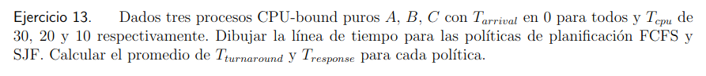

FIFO = First in First Out

|  0  |  5  | 10  | 15  | 20  | 25  | 30  | 35  | 40  | 45  | 50  | 55  | 60  | 65  | 70  | 75  | 80  | 85  | 90  | 95  |
|----|----|----|----|----|----|----|----|----|----|----|----|----|----|----|----|----|----|----|----|
| C  | C  | C  | B  | B  | B  | A  | A  | A  | A  | A  | A  | A  | A  | —  | —  | —  | —  | —  | —  |

SJF (Shortest Job First)

|  0  |  5  | 10  | 15  | 20  | 25  | 30  | 35  | 40  | 45  | 50  | 55  | 60  | 65  | 70  | 75  | 80  | 85  | 90  | 95  |
|----|----|----|----|----|----|----|----|----|----|----|----|----|----|----|----|----|----|----|----|
| C  | C  | C  | B  | B  | B  | A  | A  | A  | A  | A  | A  | A  | A  |    |    |    |    |    |    |
